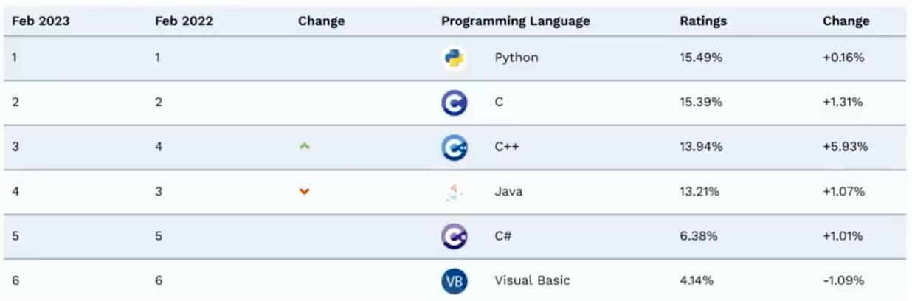
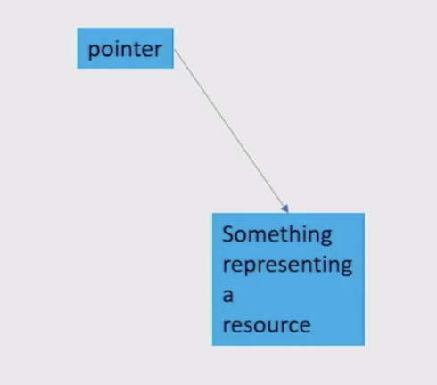
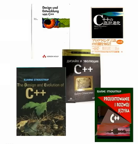
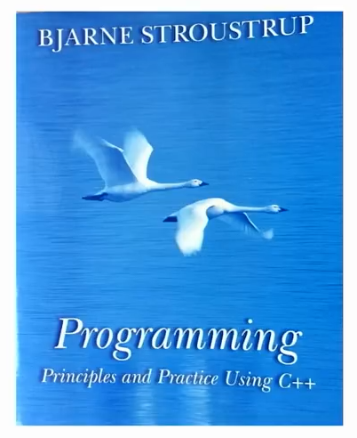
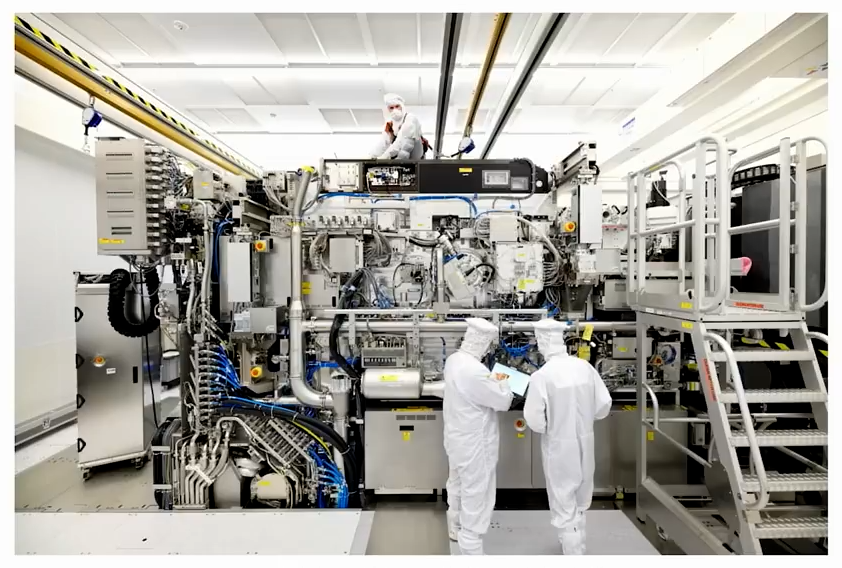

## 概要

* 安全性的挑战
* C++进化
* C++ core guidelines
* 安全总结


## 关注安全的理由（非恐慌而引起）

- **主要软件社区**，包括私人部门，学院和美国政府，已经开始启动驱动软件开发文化向转而利用内存安全语言。
- …
- NSA建议机构考虑形成转移策略—只要有可能，就要从不提供或无内生的内存保护机制的语言如C/C++，转向到提供内存安全的语言。内存安全语言诸如C#，Go，Java，Ruby和Swift。
    - NSA: https://www.open-std.org/itc1/sc22/wg21/docs/papers/2023/p2739r0.pdf

## 对比（不是自满的理由）

- 2023年2月头条：C++仍然不可阻挡
- 上月（9月），C++获得TIOBE 2022年度编程语言。2023年到目前为止，C++仍然在延续自己的成功。当前年度增长率为5.93%，远远赶在其他语言之前，比其最流行者增长率仅仅为1%。
  
- 只是Tiobe车测量了什么数据？
- 这暗示了我们所做的东西和数十亿人相关—不论影响好坏

## 必须定位“安全”问题

- 针对很多使用场合和用户，存在真实、严重的问题
    - 来自多种语言中（incl.C++)的糟糕代码和其它诱因，导致的缺陷和安全冲突（违背）
    - 从C++到其它语言的资源分化
    - 不鼓励人学习C++

- 在很多领域大量的提升是可能的
- C++存在大量的镜像问题（“C/C”）
> 没有所谓的C/C++语言
> 写现代风格的C++
    - 并且正在变得更加糟糕
- 政府和大企业可以施压开发者

- 现在忽略安全问题将会伤害大部分C++社区，并且降低我们正在做的提升C++的很多其它工作的重要性。
    - 因此我们会独占性地聚焦在安全上
- 提供受保证的安全将会固化为C++最好的传统。
> 一个机遇


## 完全的类型和资源安全

- 一直是C++的理想目标
    - 从最开始（1979）就是目标
    - 但是“小心对待being careful”没有做到最好

- 要求审慎明智的编程技术
    - 通过库的方式支持
    - 通过语言规则和静态分析强制支持
    - 达到这个目标的基础模型可以在下面两个材料中找到：

- 不限制表达的内容
    - 相较于传统的C和C++编程技术
- 不增加运行时开销
    - 除了必要的范围检测

## 类型和资源安全

- 每个对象通过其所定义的类型被访问（类型安全性）
- 每个对象被正确构建和销毁（资源安全性）
- 每个指针要么执行有效对象要么是nullptr（内存安全性）
- 每个借助指针实现的引用实际不通过nullptr（常常在运行时检查）
- 每个通过下标指针进行的访问都在下标范围内（常常在运行时检查）

- 还有
    - 暗示要进行范围检查和危险指针清除的地方（“内存安全性”）
    - C++所要求的地方
    - 从最开始大多数程序员已经尝试去确保的地方
- 这些规则更易于推断，而不是发现。

> 强制规则应根据情形进行关联，不要隔离地判断独立性规则。

## 方案上的约束

- C++必须服务广泛多变的用户/领域
    - 一个尺度不能满足所有情况
    - C++同时也是系统级编程语言-我们不能“外溢”危险操作到某种其它语言上。
- 我们不能打破（不兼容）数十银行已经存在的代码
    - 即使我们想 - 但大部分用户会坚持兼容性（可能还是默认开启的兼容性）
    - 但是我们可以改变C++的使用方式
- 我们不能只是“升级”成百上千万的开发者
    - 同时要提供材料，课程，视频，书籍，文章
- 如果你想要闪亮的新语言，请直接尝试其它语言
    - 但这不会是C++或者WG21的工作

> 稳定性是C++的特征


- 但是我们必须要改进C++


## 挑战

- 描述一种类型安全的C++使用场景
    - 和静态类型系统不冲突
    - 不存在资源泄漏

- 让开发者信服以使用安全（或更安全）的风格
    - 除去这些不合适的地方
        - 系统和硬件资源的直接使用
        - 对终极效率的需求
        - 不能证明安全的代码实现（例如，某些链接结构）

- 让安全场景在各种场合都可生效
    - 不只是“学院”例子

- 注意：有很多伟大的C++“客观存在”
    - 对于“伟大”的定义包含“过去数十年的信赖”

## 安全不只是类型安全

- 逻辑错误：
- 资源泄漏：
- 并发错误：
- 内存崩坏：
- 类型错误：
- 溢出或未预期转换：
- 计时错误：
- 不可预测寻址：
- 终止性错误：

## 安全不只是内存安全

- 物理闯入（突破）
- 间谍活动（内部攻击）
- 定向网络钓鱼
- Door ratting
- 服务拒绝攻击
- SQL注入
- 损毁的输入/数据

- 经验：总是优先供给最弱环节

## 语言本身是不安全的 — 但是如何使用可以做到安全

- 所有“安全的”通用目的语言都有“免责条款（escape clauses）”
    - 用于访问系统和硬件资源
        - 比如，操作系统
    - 改进关键抽象的效率
        - 比如链式数据结构
    - “受信任的”代码部分要和不安全的代码部分一起工作
        - 各种库
        - 根据les stringent规则编写的代码
        - 用其它语言写成的代码

- “免责条款”经常是C++
    - 搜一，C++需要能够完成不安全的内容
    - 高效地完成事情
    - 同时在必要的地方保持安全
        - 有保证的安全
        - 最好默认支持

> 这不是忽略安全问题的借口
> 有安全需要的地方我们必须改进


## C++的进化 — 只说安全相关的

- 真的是从数十年前就开始了
    - 1979

- C++被设计为可进化的语言
    - 仰赖用户反馈是一种优良的工程化方式

- 从第一天开始静态类型安全就是一种（安全）理念
    -  目前仍然是
    -  然而在现实世界约束下是一种难以坚持的理念
    -  通常来讲，“完美”是一种难以达到的理念

> 只是在一两件事情上做到世界最好是不够的


## 参数类型检查 — 1980

- 1979年的C语言 也即 “经典C语言”

```c
double sqrt();
double x = sqrt(2) /* 程序崩溃 */
```

- C with classes（C++前身，当前的C和C++也是如此)

```cpp
double sqrt(double);
double x = sqrt(2);
```

> 强静态类型检查过去和现在都是C++的理念


## 参数类型检查增强 — 1983

- 某种程度有争议
    - “不得不查看声明为了方便指出调用的含义”
- 很明显和C不兼容
    - 不喜欢C++某些地方的人，反对C++的一个主要观点
    - 但是当时升级是容易的：“一天可以迁移转换10，000行C代码”
- 其中的关键
    - 类型检查
    - 重载
    - 增加用户定义类型
    - 一致的链接行为（consistent linking） 

> 有几样东西如此重要，以至于我们必须引入和C的不兼容性
> 我们总是在付出昂贵的代价：开发者和教师们可能非常保守

- 类型安全的链接行为
    - 确保在分开编译时好得多的一致性
    - 这种方式不完美，但现在我们可以使用C++20的模块功能

## 关键理念：“在代码中表达概念”

- 代码思路的直接表达
    - 聚焦在类上
- 让代码声明性更强
- 让编译器有更多信息可用
- 早期例子
    - Vector
    - String
    - File Handle
    - Concurrent task
    - Message queue
    - Coroutine
    - Hash table
    - Graphical shape
    - Complex number
    - Infinite integer
    
    > 其中一些目前仍然没有标准化
    
## 不变性

- 常量
    - `const int x = 7 `
    - `const string s = “Immutable” `
- 接口
    - ` const strcpy(char*,const char*); //现在：不要使用strcpy();不够安全(潜在范围错误)`
    
- 历史原因的误传
    - 我最初的设计是`只读`和`只写`  


## RAII

- 下面内容来自于我的1979年实验室书籍：

  - “new 功能”针对成员函数生成运行时环境
  - “delete 功能”反转上面行为

- 之后（1983）

  - “new 功能” -> 构造器
  - “delete 功能” -> 析构器
  - 因为构造器和析构器不只是替代new和delete操作符

- 再稍微之后的规范化（1980年代）

  - 对于一个对象，构造器最终确定为了类的不变要素

  - 析构器释放类所拥有的所有资源

    > 内存不是仅有的关键资源，还包括：
    >
    > - File Handles
    > - Locks
    > - Sockets
    > - Shaders
    > - ...

- 还有（1988）

  - “资源获取即初始化（Resource Acquisition Initialization）”
    - 对于这个名字有点抱歉


## 资源和错误

- 资源是我们使用时必须获得且使用后必须释放的东西

  - 例如：文件，内存，锁，数据库事物，通讯频道，GUI连接，线程
  - 显式释放易于出错
  - 资源耗尽可能演变为系统不响应
  - 我不会把一个依赖显式释放的系统成为安全的

  ```cpp
  void f(const char* p) // 不安全, naive use
  {
    FILE* f= fopen(p,"*"); // 获得
    // 使用 f
    fclose(f); // 释放
  }
  ```

  


## 面向对象编程OOP（1981-1984）

- 封装

- 良好定义的接口

  - 类
  - 抽象基类

  > 出现的问题：在借口中有太多指针

- 重载
  - 内建和用户定义类型
  - 操作符重载（最初用于资源管理）
  - 参考：更简化和安全的参数传递


## 随后（1988-2011）

- 模版
  - 实现的编译时（编译阶段）选择
  - C++20最终实现了concepts - 精确定义的接口
- 异常
  - 有保证的错误处理 - 或终止
  - 用于资源管理（RAII）的正确交互
- 容器
  - 不需要干预内置数组（和指针）
  - 启用范围检测
- 算法
  - C++98 : sort(begin(v),end(v))
  - C++20 : sort(v)
- "智能指针"（各种资源管理指针）
  - unique_ptr , shared_pter

## Range-for 和 span （2011，2017）

- 启用高效的范围检测

```cpp
void f(int* p, int n) // 假如p==nullptr? 假如n不是指向的元素数目?
{
  for (int i =0; i<n; ++n) //假如有人“混淆”了控制变量?
  	cout «< p[i]<<"": 
}

void g(span<int> s)
{
  for (const auto& X : s) //没有循环变量，没有出错机会
		cout << x<< '';
}
```


## RAII（资源获取即初始化）

```cpp
// 使用对象表示资源
class File_handle { //隶属于某个支持库
		FILE* p;
public:
		File_handle(const char* pp, const char* r)
				{p = fopen(pp,r); if (p==0) throw File_error(pp,r); }
		File_handle(const string& s, const char* r)
				{p= fopen(s.c_str(),r); if (p==0) throw File_error(s,r); }
		~File_handle() { fclose(p); } // 析构器函数
		// copy操作
		// 各种访问函数
}

void f(string s)
{
		File handle fh {s, "r"]: // 当前用法: ifstream fh{s}
		// 使用 fh
}
```

## D&E（1994）-- 选择语言技术的规则

- 静态类型系统的非隐式冲突

- 对用户定义类型提供和内建类型一样的良好支持

- 可以说出您的意图

  - 增强声明样式和抽象

- 语法相关（经常是反常方式）

  - 通常，应该避免多义性

- 不给更低级的语言提供空间（除了汇编）

- 预处理器使用应该被消除
  
- 缺失内容（没有清晰的表达引起问题却仍然存在的内容）

  - 让简单任务简单化
  - 让错误处理正规化

  

## 以良好方式使用C++会带来好处

- 使用
  - RAII
  - const
  - 容器
  - 资源管理指针
  - 算法
  - Range-for
  - span
  - ...
- 避免
  - 使用原生指针
  - 下标化操作原生指针
  - 不检查的指针反引用
  - 使用未初始化的变量
  - ...



> 出版于2002
>
> 17章之前没有使用指针和数组
>
> 即便之后的内容，也带有警示信息

## 如果你要获得"安全C++"

- **不要写"C/C++"**
  - 不存在这种语言
  - 但是有这种用法
  - 大部分文档记录的安全问题和安全冲突以这种代码写成
- 把你的代码风格向已经证明安全的方式改进
  - 封装"混乱的低级"代码

## "对安全的小心谨慎"没有推广起来

- 我们必须

  - 规范安全用法的法则
    - 针对不同的安全用法
  - 提供规则所坚持内容的验证方法
    

- 明确知道规则（guidelines）

  - 首先：C++ Core Guidelines 项目

- 在需要的地方强制指导规则

  - 规则集（profiles）
    - 强制多种知道规则
    - 满足多种需求

  > 是否使用了更安全的特性？
  >
  > 是否一致？
  >
  > 如果否，为什么？

  

  ## 当前情势

  -  当前我所描述内容的部分已经被尝试
    - 很多已经“大范围使用”（例如，基于范围检测的string,vector和span)
    - 但是无处把所有的整合进一个单一系统或者系统性地强制使用
  - 很多是被C++ core guidelines的工作所影响
    - 但是这不只是关于指导
    - 我们需要强制的规则
  - 目标是受保护的类型和资源安全C++
    - 还有更多，比如，安全的算法
    - 逐步采纳的路径
    - 今天可以获得的主要改进，比如：一致性和范围检测
      
  - 不只是关于安全
    - 类型系统的更佳的用法可以提升生产率
    - 同时也总是可以提升性能
      

  ## C++ Core Guidelines

  

## 通用策略

- 依赖静态分析以消除潜在的错误
  - 静态分析不可能适用于任意的代码
  - 全局静态分析非常昂贵
- 依赖规则去简化使用的语言
  - 至此本地静态分析是可能的
- 提供库以使得依赖规则实用化
  - 乐于使用
  - 高效运行

## 高级规则 - “哲学”

- 提供概念性框架
  - 主要针对人
- 很多还不能完全或者一致性地检测
  - P.1: 在代码中直接表达思路（Express ideas directly in code）
  - P.2: 以ISO标准C++写代码（Write in ISO Standard C++）
  - P.3: 表达意图（Express intent）
  - P.4: **理想状况，程序应该是静态类型安全的（Ideally, a program should be statically type safe）**
  - P.5: 优先编译时检查而不是运行时检查（Prefer compile-time checking to run-time checking）
  - P.6: **编译时不能检查的内容应该在运行时可检查（What cannot be checked at compile time should be checkable at run time）**
  - P.7: 早期捕获运行时错误（Catch run-time errors early）
  - P.8: **不要泄漏任何资源（Don't leak any resource）**
  - P.9: 不要浪费时间或空间（Don't waste time or space）
  - P.10: **优先于不可变数据而不是可变数据（Prefer immutable data to mutable data）**
  - P.11: 封装混乱的结构，而不是在代码中传播（Encapsulate messy constructs, rather than spreading through the code）
  - P.12: 使用合适的支持工具（Use supporting tools as appropriate）
  - P.13: 使用合适的支持库（Use support libraries as appropriate）
