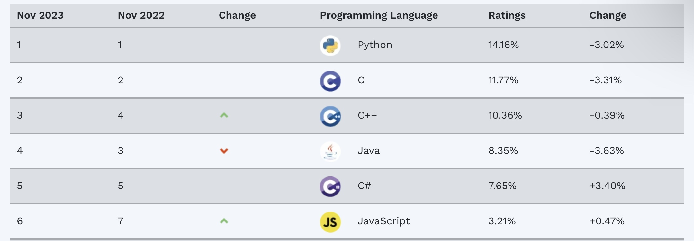

## 概要

* 安全性的挑战
* C++进化
* C++ core guidelines
* 安全总结


## 关注安全的理由（非恐慌而引起）

- **主要软件社区**，包括私人部门，学院和美国政府，已经开始启动驱动软件开发文化向转而利用内存安全语言。
- …
- NSA建议机构考虑形成转移策略—只要有可能，就要从不提供或无内生的内存保护机制的语言如C/C++，转向到提供内存安全的语言。内存安全语言诸如C#，Go，Java，Ruby和Swift。
    - NSA: https://www.open-std.org/itc1/sc22/wg21/docs/papers/2023/p2739r0.pdf

## 对比（不是自满的理由）

- 2023年2月头条：C++仍然不可阻挡
- 上月（9月），C++获得TIOBE 2022年度编程语言。2023年到目前为止，C++仍然在延续自己的成功。当前年度增长率为5.93%，远远赶在其他语言之前，比其最流行者增长率仅仅为1%。
  
- 只是Tiobe车测量了什么数据？
- 这暗示了我们所做的东西和数十亿人相关—不论影响好坏

## 必须定位“安全”问题

- 针对很多使用场合和用户，存在真实、严重的问题
    - 来自多种语言中（incl.C++)的糟糕代码和其它诱因，导致的缺陷和安全冲突（违背）
    - 从C++到其它语言的资源分化
    - 不鼓励人学习C++

- 在很多领域大量的提升是可能的
- C++存在大量的镜像问题（“C/C”）
> 没有所谓的C/C++语言
> 写现代风格的C++
    - 并且正在变得更加糟糕
- 政府和大企业可以施压开发者

- 现在忽略安全问题将会伤害大部分C++社区，并且降低我们正在做的提升C++的很多其它工作的重要性。
    - 因此我们会独占性地聚焦在安全上
- 提供受保证的安全将会固化为C++最好的传统。
> 一个机遇


## 完全的类型和资源安全

- 一直是C++的理想目标
    - 从最开始（1979）就是目标
    - 但是“小心对待being careful”没有做到最好

- 要求审慎明智的编程技术
    - 通过库的方式支持
    - 通过语言规则和静态分析强制支持
    - 达到这个目标的基础模型可以在下面两个材料中找到：

- 不限制表达的内容
    - 相较于传统的C和C++编程技术
- 不增加运行时开销
    - 除了必要的范围检测

## 类型和资源安全

- 每个对象通过其所定义的类型被访问（类型安全性）
- 每个对象被正确构建和销毁（资源安全性）
- 每个指针要么执行有效对象要么是nullptr（内存安全性）
- 每个借助指针实现的引用实际不通过nullptr（常常在运行时检查）
- 每个通过下标指针进行的访问都在下标范围内（常常在运行时检查）

- 还有
    - 暗示要进行范围检查和危险指针清除的地方（“内存安全性”）
    - C++所要求的地方
    - 从最开始大多数程序员已经尝试去确保的地方
- 这些规则更易于推断，而不是发现。

> 强制规则应根据情形进行关联，不要隔离地判断独立性规则。

## 方案上的约束

- C++必须服务广泛多变的用户/领域
    - 一个尺度不能满足所有情况
    - C++同时也是系统级编程语言-我们不能“外溢”危险操作到某种其它语言上。
- 我们不能打破（不兼容）数十银行已经存在的代码
    - 即使我们想 - 但大部分用户会坚持兼容性（可能还是默认开启的兼容性）
    - 但是我们可以改变C++的使用方式
- 我们不能只是“升级”成百上千万的开发者
    - 同时要提供材料，课程，视频，书籍，文章
- 如果你想要闪亮的新语言，请直接尝试其它语言
    - 但这不会是C++或者WG21的工作

> 稳定性是C++的特征


- 但是我们必须要改进C++


## 挑战

- 描述一种类型安全的C++使用场景
    - 和静态类型系统不冲突
    - 不存在资源泄漏

- 让开发者信服以使用安全（或更安全）的风格
    - 除去这些不合适的地方
        - 系统和硬件资源的直接使用
        - 对终极效率的需求
        - 不能证明安全的代码实现（例如，某些链接结构）

- 让安全场景在各种场合都可生效
    - 不只是“学院”例子

- 注意：有很多伟大的C++“客观存在”
    - 对于“伟大”的定义包含“过去数十年的信赖”

## 安全不只是类型安全

- 逻辑错误：
- 资源泄漏：
- 并发错误：
- 内存崩坏：
- 类型错误：
- 溢出或未预期转换：
- 计时错误：
- 不可预测寻址：
- 终止性错误：

## 安全不只是内存安全

- 物理闯入（突破）
- 间谍活动（内部攻击）
- 定向网络钓鱼
- Door ratting
- 服务拒绝攻击
- SQL注入
- 损毁的输入/数据

- 经验：总是优先供给最弱环节

## 语言本身是不安全的 — 但是如何使用可以做到安全

- 所有“安全的”通用目的语言都有“免责条款（escape clauses）”
    - 用于访问系统和硬件资源
        - 比如，操作系统
    - 改进关键抽象的效率
        - 比如链式数据结构
    - “受信任的”代码部分要和不安全的代码部分一起工作
        - 各种库
        - 根据les stringent规则编写的代码
        - 用其它语言写成的代码

- “免责条款”经常是C++
    - 搜一，C++需要能够完成不安全的内容
    - 高效地完成事情
    - 同时在必要的地方保持安全
        - 有保证的安全
        - 最好默认支持

> 这不是忽略安全问题的借口
> 有安全需要的地方我们必须改进


## C++的进化 — 只说安全相关的

- 真的是从数十年前就开始了
    - 1979

- C++被设计为可进化的语言
    - 仰赖用户反馈是一种优良的工程化方式

- 从第一天开始静态类型安全就是一种（安全）理念
    -  目前仍然是
    -  然而在现实世界约束下是一种难以坚持的理念
    -  通常来讲，“完美”是一种难以达到的理念

> 只是在一两件事情上做到世界最好是不够的


## 参数类型检查 — 1980

- 1979年的C语言 也即 “经典C语言”

```c
double sqrt();
double x = sqrt(2) /* 程序崩溃 */
```

- C with classes（C++前身，当前的C和C++也是如此)

```cpp
double sqrt(double);
double x = sqrt(2);
```

> 强静态类型检查过去和现在都是C++的理念


## 参数类型检查增强 — 1983

- 某种程度有争议
    - “不得不查看声明以便于指出调用的含义”
