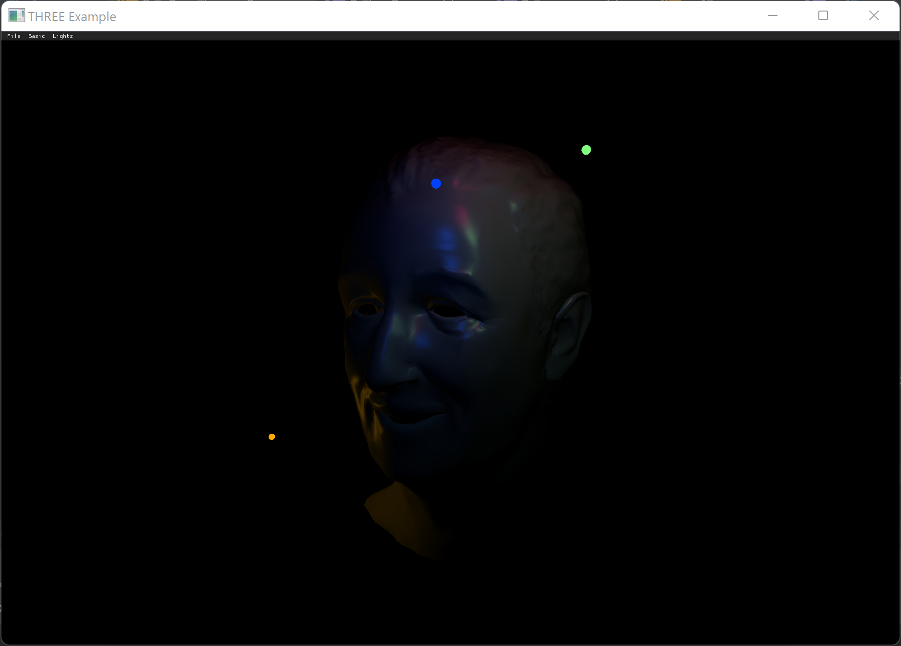

# three.cpp实现动态多点光源效果

[three.cpp](https://github.com/nintymiles/CGLearning)以three.js的实现为基础，用C++移植了其渲染引擎。

现以webgl_lights_pointlights样例为基础，参照实现了动态多点光源效果。效果如下（请暂时忽略模型解析问题😅😅😅），



下面分两部分来描述实现过程：


## 1. 模型的着色过程

整个过程涉及的几何模型包括WaltHead以及4个点光源实体。我们主要关注多个点光源在WaltHead模型的渲染着色过程，用于WaltHead的着色器，主要使用了Lambert规则和Blinn Phong方法来实现着色计算。

每次绘制时，我们都要以uniform方式传入多个点光源的位置。在three.cpp中，主要发生在WaltHead模型绘制时着色程序的设置过程。由于点光源的位置可能变化，所以每次绘制钱，都需要刷新一下点光源位置，因而需要更新unifrom数据。

```cpp
if (materialProperties.needsLights)
    //需要刷新时，更新光源位置uniforms
    markUniformsLightsNeedsUpdate(*m_uniforms, refreshLights);
}
...
//更新uniform关联函数
void GLRenderer::markUniformsLightsNeedsUpdate(UniformValues& uniforms, bool value){
    uniforms.needsUpdate("ambientLightColor",value);
    uniforms.needsUpdate("directionalLights", value);
    uniforms.needsUpdate("directionalLightShadows", value);
    uniforms.needsUpdate("pointLights", value);
    ...
}

//点光源最终会将下面的参数更新到shader中去
void applyValue(GLUniform::sptr uniform, int index = 0) override{
    if (index < 0) index = 0;
    const auto& entry = value[index];

    if (uniform->id == "position")
        uniform->setValue(entry->position);
    if (uniform->id == "color")
        uniform->setValue(entry->color);
    if (uniform->id == "distance")
        uniform->setValue(entry->distance);
    if (uniform->id == "decay")
        uniform->setValue(entry->decay);
}


```

fragment着色器中的光源计算处理，着色器程序应该尽量减少分支执行逻辑，three.cpp会将点光源数组遍历程序展开，然后依次对每个点光源计算在每个顶点处的衰减因子，然后再根据lambert法则和Blinn Phong方法分别计算出diffuse和specular色彩值，最后再叠加应用到当前顶点的色彩之上。具体过程参考如下着色器程序：

```c
	struct PointLight {
		vec3 position;
		vec3 color;
		float distance;
		float decay;
	};

	//uniform结构数组，用以接收点光源参数
	uniform PointLight pointLights[ 4 ];

	//点光源色彩计算函数，计算出点光源在当前顶点衰减后的色彩
	// directLight is an out parameter as having it as a return value caused compiler errors on some devices
	void getPointDirectLightIrradiance( const in PointLight pointLight, const in GeometricContext geometry, out IncidentLight directLight ) {

		vec3 lVector = pointLight.position - geometry.position;
		directLight.direction = normalize( lVector );

		float lightDistance = length( lVector );

		directLight.color = pointLight.color;
		directLight.color *= punctualLightIntensityToIrradianceFactor( lightDistance, pointLight.distance, pointLight.decay );
		directLight.visible = ( directLight.color != vec3( 0.0 ) );

	}

//点光源衰减因子计算函数
float punctualLightIntensityToIrradianceFactor( const in float lightDistance, const in float cutoffDistance, const in float decayExponent ) {

#if defined ( PHYSICALLY_CORRECT_LIGHTS )
	float distanceFalloff = 1.0 / max( pow( lightDistance, decayExponent ), 0.01 );

	if( cutoffDistance > 0.0 ) {
		distanceFalloff *= pow2( saturate( 1.0 - pow4( lightDistance / cutoffDistance ) ) );
	}

	return distanceFalloff;
#else
	if( cutoffDistance > 0.0 && decayExponent > 0.0 ) {
		return pow( saturate( -lightDistance / cutoffDistance + 1.0 ), decayExponent );
	}

	return 1.0;
 #endif

}

void main() {

	vec4 diffuseColor = vec4( diffuse, opacity );
	ReflectedLight reflectedLight = ReflectedLight( vec3( 0.0 ), vec3( 0.0 ), vec3( 0.0 ), vec3( 0.0 ) );
	...

	vec3 normal = normalize( vNormal );

	...

  BlinnPhongMaterial material;
  material.diffuseColor = diffuseColor.rgb;
  material.specularColor = specular;

  ...
  GeometricContext geometry;

  geometry.position = - vViewPosition;
  geometry.normal = normal;
  geometry.viewDir = ( isOrthographic ) ? vec3( 0, 0, 1 ) : normalize( vViewPosition );


  IncidentLight directLight;

  //避免循环分支语句，点光源的应用循环语句实际被被展开如下：
  #if ( 4 > 0 ) && defined( RE_Direct )

    	PointLight pointLight;

      pointLight = pointLights[ 0 ];

      getPointDirectLightIrradiance( pointLight, geometry, directLight );

  		//计算出的衰减后的点光源色彩被叠加各种计算
      #if defined( USE_SHADOWMAP ) && ( 0 < 0 )
      pointLightShadow = pointLightShadows[ 0 ];
      directLight.color *= all( bvec2( directLight.visible, receiveShadow ) ) ? getPointShadow( pointShadowMap[ 0 ], pointLightShadow.shadowMapSize, pointLightShadow.shadowBias, pointLightShadow.shadowRadius, vPointShadowCoord[ 0 ], pointLightShadow.shadowCameraNear, pointLightShadow.shadowCameraFar ) : 1.0;
      #endif
			//在此函数中主要应用Lambert和Blinn Phong计算
      RE_Direct( directLight, geometry, material, reflectedLight );
      //下面注释部分为RE_Direct函数局部
      //float dotNL = saturate( dot( geometry.normal, directLight.direction ) );
      //vec3 irradiance = dotNL * directLight.color;
      //#ifndef PHYSICALLY_CORRECT_LIGHTS
      //  irradiance *= PI; // punctual light
      //#endif
      //reflectedLight.directDiffuse += irradiance * BRDF_Diffuse_Lambert( material.diffuseColor );
      //reflectedLight.directSpecular += irradiance * BRDF_Specular_BlinnPhong( directLight, geometry, material.specularColor, material.specularShininess ) * material.specularStrength;


      pointLight = pointLights[ 1 ];

      getPointDirectLightIrradiance( pointLight, geometry, directLight );

      ... //省略部分同上

      RE_Direct( directLight, geometry, material, reflectedLight );
  
  ...
  //计算结果被叠加应用到顶点的最终色彩矢量之上
  vec3 outgoingLight = reflectedLight.directDiffuse + reflectedLight.indirectDiffuse + reflectedLight.directSpecular + reflectedLight.indirectSpecular + totalEmissiveRadiance;
  ...
    
  gl_FragColor = vec4( outgoingLight, diffuseColor.a );
  
  ...
}

```

## 2. 点光源的移动控制

点光源的移动主要是通过获取系统时间，然后在系统时间（以unix纪元表示的long值）上经过简单变化后，应用三角函数实现。WaltHead模型的旋转主要是通过两次绘制之间的时间差来实现。

```cpp
void GLLightsPointLights::render(){
  	//注：如果在mac系统上无法实现vsync模式，则显然帧数会很快，比如在m1 pro上会在1000fps以上，则delta仍需缩小，可以再除以1000
    float delta = timer.getDelta(); //此处delta获取的是两次绘制之间的秒数
    float time = threecpp::getSystemTimeInMillis()/1000.0; //以秒为单位的系统时间

    if(objGroup)
        objGroup->rotation.setY(delta*0.5);

    light1->position.x = math::sin( time * 0.7 ) * 30;
    light1->position.y = math::cos( time * 0.5 ) * 40;
    light1->position.z = math::cos( time * 0.3 ) * 30;

    light2->position.x = math::cos( time * 0.3 ) * 30;
    light2->position.y = math::sin( time * 0.5 ) * 40;
    light2->position.z = math::sin( time * 0.7 ) * 30;

    light3->position.x = math::sin( time * 0.7 ) * 30;
    light3->position.y = math::cos( time * 0.3 ) * 40;
    light3->position.z = math::sin( time * 0.5 ) * 30;

    light4->position.x = math::sin( time * 0.3 ) * 30;
    light4->position.y = math::cos( time * 0.7 ) * 40;
    light4->position.z = math::sin( time * 0.5 ) * 30;

    ApplicationBase::render();
}
```

