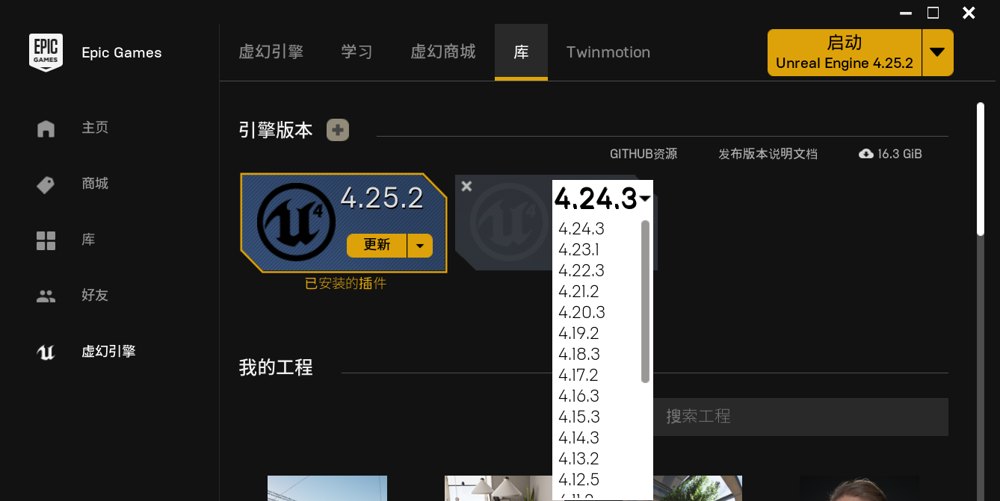
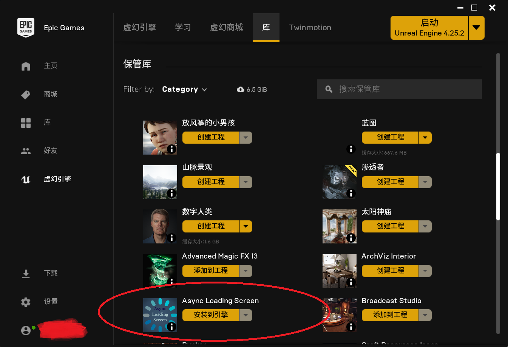
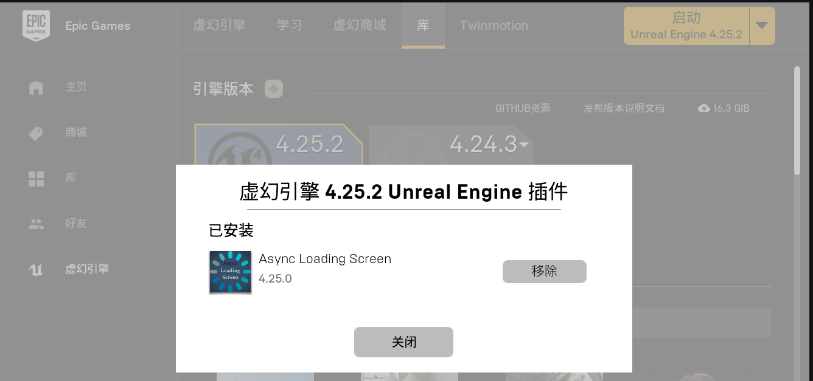
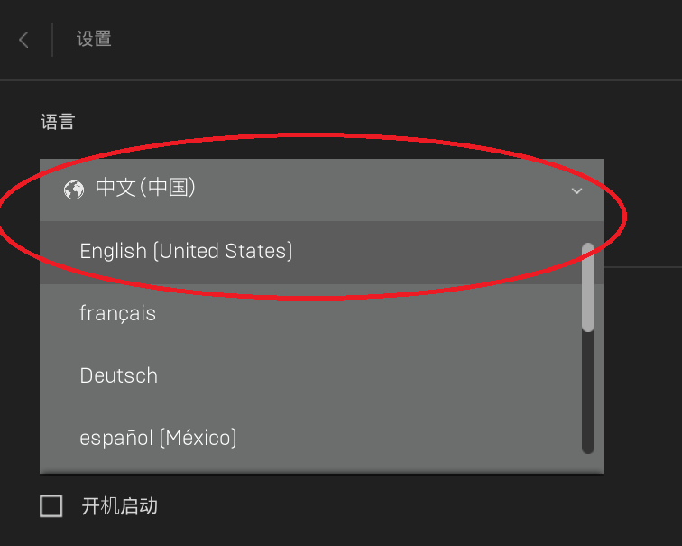
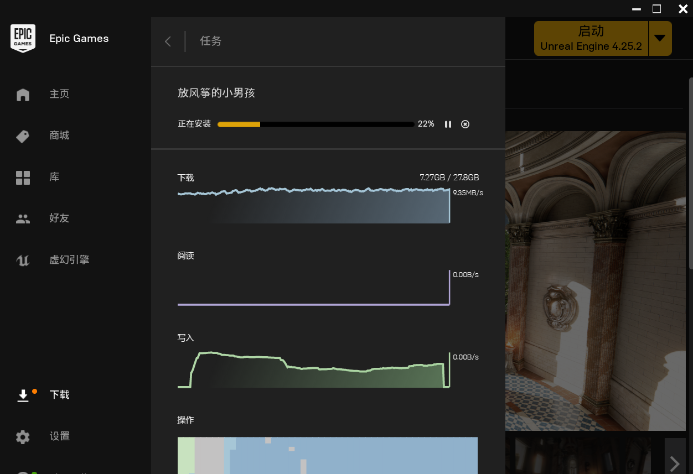
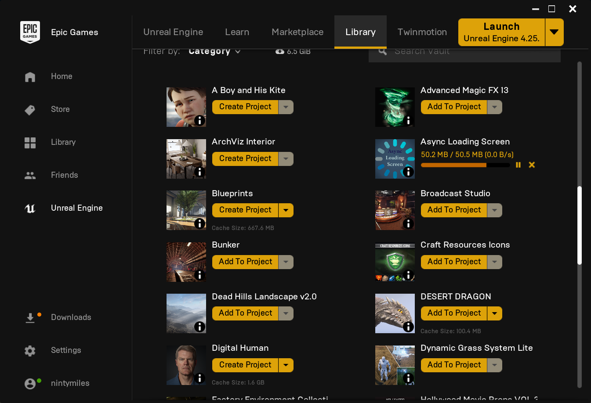
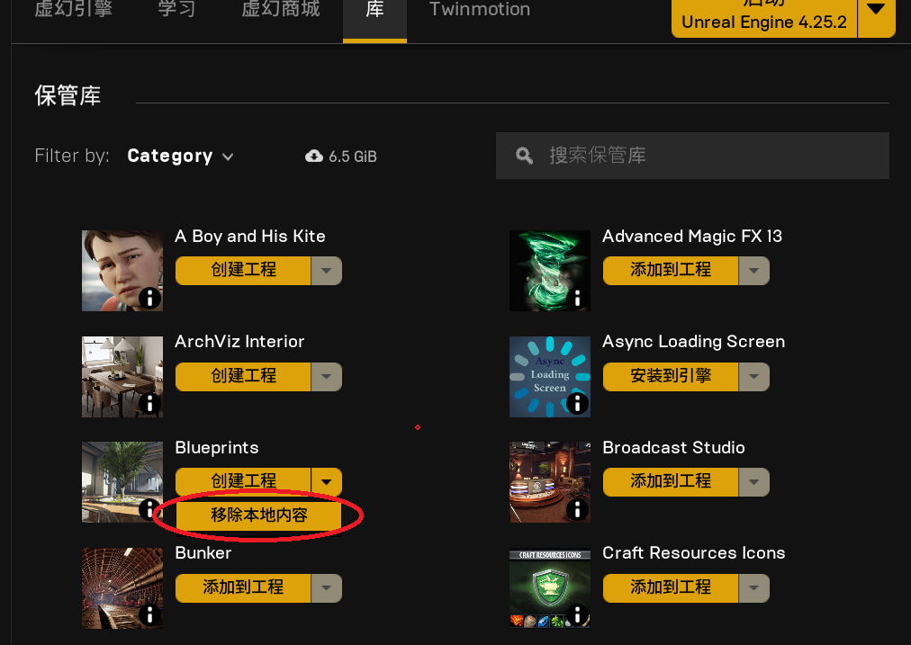
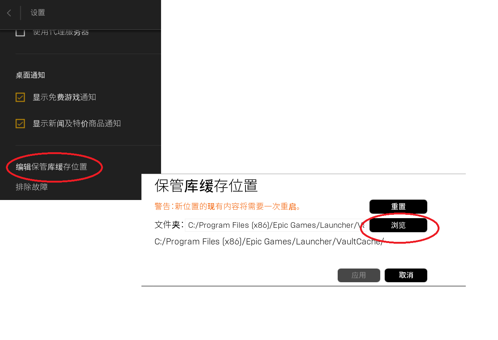

# 虚幻引擎Epic Games Launcher的基本用法
本文介绍虚幻引擎Epic Games Launcher加载器的基本用法。

作为虚幻引擎的门户，Epic Games Laucher为虚幻引擎(unreal engine)及其周边插件、素材、游戏以及内容样例和学习资源提供了管理工具。并且Epic Games Launcher还可以用来管理虚幻引擎项目，支持相关内容的高速续传下载等等，功能十分强大。

## 1. 虚幻引擎的安装和删除
注册登录Epic Games Launcher之后，可以从左侧“虚幻引擎”菜单，然后到顶部“库”标签点击来到引擎管理页。从这里可以下载到虚幻引擎发行的最新版本，当然还可以下载到之前发行的各个主历史版本的最后版本。选定版本之后，可以点击右上角的“启动”按钮启动对应版本的虚幻引擎环境。
当然，也可以在此处，删除对应虚幻引擎版本，只要点击引擎版本左上角的叉号即可。

_选择引擎版本并下载_

_选择历史引擎版本下载_

## 2. 虚幻引擎插件的管理
在虚幻引擎环境中，只能启用和禁用插件，无法直接对插件进行安装和删除。插件的安装要通过Epic Games Launcher中的虚幻商城首先购买，然后到引擎管理页进行安装使用。

*将引擎管理页滚动到保管库部分，从中找到已经购买的插件进行安装*

虚幻引擎中，插件和具体的项目关联紧密。如果安装新插件，每个项目打开时都会询问是否启用插件。同理，如果某个项目使用了某个插件，而插件在当前版本不存在，虚幻引擎会提示是否禁用当前插件。所以，不经常使用的插件应该删除掉，这样可以提高项目的启动效率。但是在虚幻引擎中，是找不到插件删除选项的。插件的删除也需要到Epic Games Launcher中进行管理。通常为找到对应版本的引擎，然后点击下方“已经安装的插件”链接，打开已安装插件弹出页面，然后进行管理。如下图：

*删除选定的插件*

## 3. Epic提供的内容样例(content examples)
Epic提供了很多制作精良的样例。比如放风筝的小男孩，渗透者，太阳神庙等。这些都可以在Epic Games Lanuncher的虚幻引擎->学习主页中获取。虽然这些样例的体积都很大，比如放风筝的小男孩，需要将近30G。但是Epic Games Lanuncher提供了极佳的下载体验（高速下载+支持续传）。下载完成后，可以到上面的引擎主页中展开部署这些样例并使用虚幻引擎打开。

在下载并使用Epic制作的虚幻引擎样例之前，首先将Epic Games Launcher的语言设置为英语，因为中文环境可能会在打包时碰到问题（Windows上出现C1083的编译错误）。

*Epic Games Launcher的语言设置*

*Epic Games Launcher中下载Epic提供的样例时支持下载管理*

*下载的样例和插件、素材等内容都可以在此处管理*

## 4. 下载内容的缓存管理
实际上Epic Games Launcher对于下载的内容提供了完善的管理功能。比如虚幻商城中下载的素材、插件和内容样例等内容，其本地缓存都可以在引擎库管理主页中的“保管库”部分进行对应清除。如果要节省本机的空间，在部署之后，就可以临时删除这些本地缓存。

当然，如果你非要手动删除，你可以在Epic Games Launcher的设置中找到“编辑保管库缓存位置”项，然后跳转到缓存的实际目录进行删除。

*移除已经下载样例、插件和素材等的本地缓存*

*Epic Games Launcher本地缓存目录管理*
