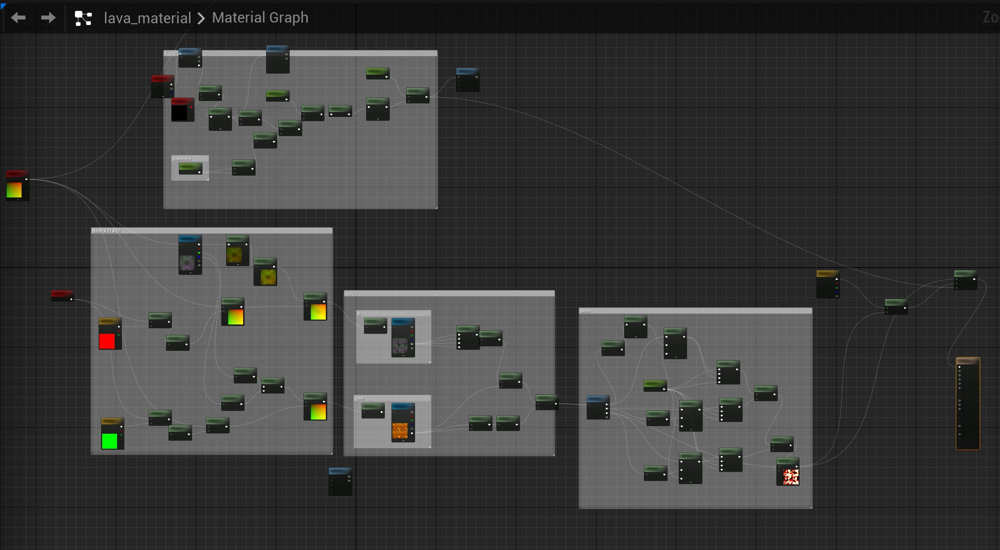
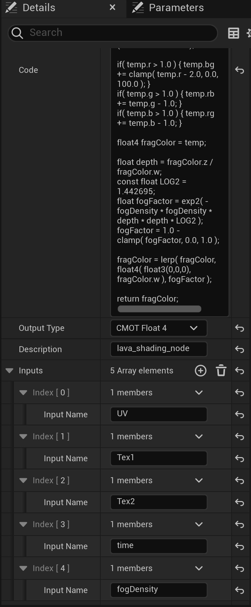
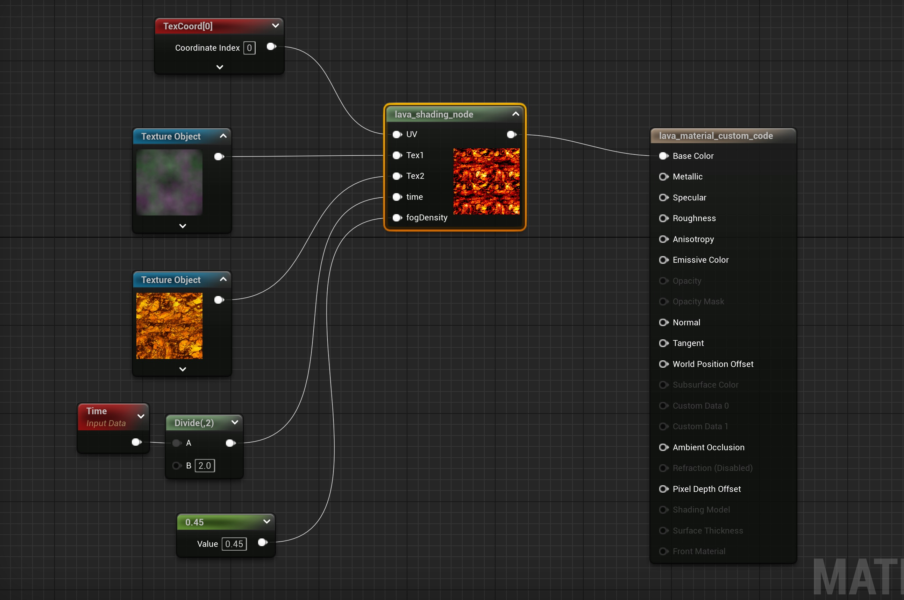
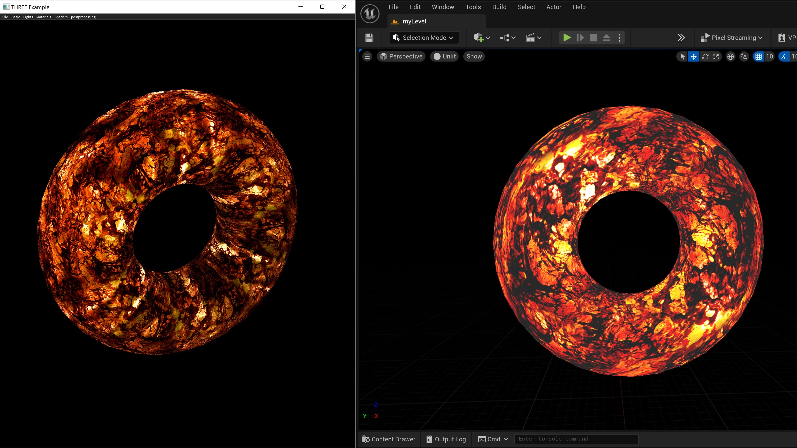

# 在UE中以着色器代码生成材质
在[three.cpp](https://github.com/nintymiles/CGLearning)中以opengl实现了火山熔岩效果，程序主体为下面的GLSL着色器代码。

```glsl
uniform float time;

uniform float fogDensity;
uniform vec3 fogColor;

uniform sampler2D texture1;
uniform sampler2D texture2;

varying vec2 vUv;

void main( void ) {

    //vec2 position = - 1.0 + 2.0 * vUv;

    vec4 noise = texture2D( texture1, vUv );
    vec2 T1 = vUv + vec2( 1.5, - 1.5 ) * time * 0.02;
    vec2 T2 = vUv + vec2( - 0.5, 2.0 ) * time * 0.01;

    T1.x += noise.x * 2.0;
    T1.y += noise.y * 2.0;
    T2.x -= noise.y * 0.2;
    T2.y += noise.z * 0.2;

    float p = texture2D( texture1, T1 * 2.0 ).a;

    vec4 color = texture2D( texture2, T2 * 2.0 );
    vec4 temp = color * ( vec4( p, p, p, p ) * 2.0 ) + ( color * color - 0.1 );

    if( temp.r > 1.0 ) { temp.bg += clamp( temp.r - 2.0, 0.0, 100.0 ); }
    if( temp.g > 1.0 ) { temp.rb += temp.g - 1.0; }
    if( temp.b > 1.0 ) { temp.rg += temp.b - 1.0; }

    gl_FragColor = temp;

    float depth = gl_FragCoord.z / gl_FragCoord.w;
    const float LOG2 = 1.442695;
    float fogFactor = exp2( - fogDensity * fogDensity * depth * depth * LOG2 );
    fogFactor = 1.0 - clamp( fogFactor, 0.0, 1.0 );

    gl_FragColor = mix( gl_FragColor, vec4( fogColor, gl_FragColor.w ), fogFactor );

}
```
在UE中如果以蓝图方式实现一个类似的材质material，步骤很多（如下图），对色彩分量的计算需要很多节点才能实现。


上面的着色器代码看起来则比较简洁，因此尝试使用UE材质中的定制节点（custom node）用半代码方式在UE中实现类似效果。

下面简单介绍一下实现步骤：

### 1、首先定义custom node属性

在材质编辑器中加入custom node节点，定义材质名称（description属性），和几个输入参数，如下图:


### 2、转换GLSL代码为HLSL代码

UE的custom node只接受HLSL代码，因此需要转换上述opengl的GLSL代码。

HLSL和GLSL都是基于c/cpp风格，基础类型和函数都有对等实现。GLSL中的uniform参数，我们借助UE的材质节点来代替。
纹理参数在UE中可以使用Texture Object节点，而不是Texture Sample节点，后者已经执行采样函数获得了对应色彩值，而
程序需要自己采样。

当在UE中使用HLSL定制节点采样，在材质中定义的TextureObject输入参数，UE会根据TextureObject名称, 自动生成一个采样器对象，命名如下:

`<TextureObject 名称>Sampler`

例如，如果TextureObject命名为“Tex1”，可用的采样器将会被命名为“Tex1Sampler”，HLSL中采样纹理的代码如下：

`Texture2DSample(Tex1, Tex1Sampler, coords);`

注意HLSL代码中所使用的输入参数都在上一步中已经定义。

整个转换后的代码如下：

```cpp
float4 noise = Texture2DSample( Tex1,Tex1Sampler, UV );
float2 T1 = UV + float2( 1.5, - 1.5 ) * time * 0.02;
float2 T2 = UV + float2( - 0.5, 2.0 ) * time * 0.01;

T1.x += noise.x * 2.0;
T1.y += noise.y * 2.0;
T2.x -= noise.y * 0.2;
T2.y += noise.z * 0.2;

float p = Texture2DSample( Tex1, Tex1Sampler, T1 * 2.0 ).a;

float4 color = Texture2DSample( Tex2,Tex2Sampler, T2 * 2.0 );
float4 temp = color *  float4( p, p, p, p ) * 2.0  + ( color * color - 0.1 );

if( temp.r > 1.0 ) { temp.bg += clamp( temp.r - 2.0, 0.0, 100.0 ); }
if( temp.g > 1.0 ) { temp.rb += temp.g - 1.0; }
if( temp.b > 1.0 ) { temp.rg += temp.b - 1.0; }

float4 fragColor = temp;

float depth = fragColor.z / fragColor.w;
const float LOG2 = 1.442695;
float fogFactor = exp2( - fogDensity * fogDensity * depth * depth * LOG2 );
fogFactor = 1.0 - clamp( fogFactor, 0.0, 1.0 );

fragColor = lerp( fragColor, float4( float3(0,0,0), fragColor.w ), fogFactor );

return fragColor;
```
将上面的HLSL代码复制到custom node的code字段中。如上面截图所示。

### 3、在材质编辑器中加入所需参数节点，完成材质的设置
在材质编辑其中加入两个纹理对象和时间及密度参数，并设置好主节点色彩即可。如下图：


在关卡编辑其中，拖入一个shape_torus形状（在startercontent中），应用上面定义的材质。UE默认为PBR渲染，在UE编辑器中，注意去光照，可以看到材质本身的效果。下图为UE效果和opengl程序效果的比较：


