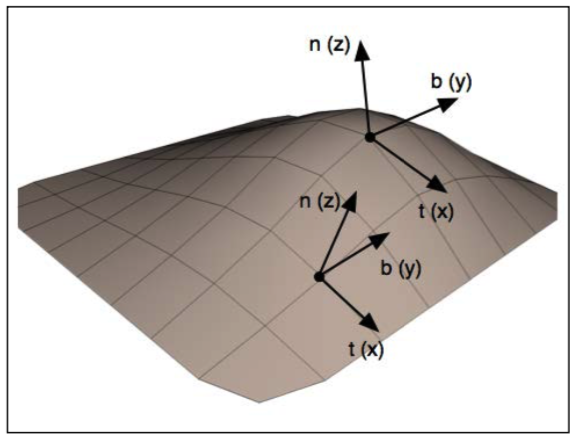

# 凹凸映射（bump mapping）中法线映射（normal map）纹理数据的解读和使用
凹凸映射中的法线映射纹理数据通常解读为切面空间（tangent space）中的矢量。切面空间也被称为物体本地坐标系（object local coordinate system）。切面空间坐标系的原点被定位在表面点上，坐标系的z轴（0，0，1）对齐这个点的表面法线，因而坐标系的x轴和y轴位于表面的切面之上。下面图示了位于表面上两个不同位置的切面空间帧（tangent frame，帧即坐标系）。

这种坐标系的优点在于法线映射纹理中的法线矢量（normal vector）可以被看作真正法线的扰动版本（针对变换目的的调整版本）。同时独立于物体本身的坐标系。这就免去了我们要变换法线、扰动法线、再标准化等需求。因而，我们可以直接借助法线映射中的值不需要任何改动。

如果我们要借助法线映射纹理数据评估反射模型，那么应该在切面空间中进行。因而，我们需要在着色器（shader）中变换反射模型中使用的矢量为关联于切面空间的版本，以便在进行顶点解析（vertex resolution）或者像素解析（pixel resolution）时评估反射模型。

要定义从眼睛坐标系（eye coordinate system）到切面空间坐标系的变换，需要3个（在眼睛坐标中定义的）标准化的、互相正交的矢量，以定义切面空间帧（tangent space frame），z轴将是当前表面点的法线（n），x轴被确定为一个切线矢量（tangent vector）(t)，y轴被称为副法线（binormal）矢量(b)。那么，要将眼部空间坐标表达的点P变换为切面空间坐标，所需要的变换矩阵为：
$$ \large{ T' =\begin{bmatrix}
  t_x & t_y & t_z \\ b_x & b_y & b_z \\ n_x & n_y & n_z
\end{bmatrix} }$$

> 注意：如果你习惯于从帧变换角度理解变换过程，那么你可能将切面矩阵T理解为关联眼睛帧$\vec{\mathbf{e}}^t$和切面帧$\vec{\mathbf{t}}^t$的关联矩阵，也就是
> $$\vec{\mathbf{t}}^t = \vec{\mathbf{e}}^tT = \vec{\mathbf{e}}^t
  \begin{bmatrix}
  t_x & b_x & n_x \\ t_y & b_y & n_y \\ t_z & b_z & n_z
\end{bmatrix}
  $$
> 如此，要将眼部坐标转换为切面空间坐标，则需要经历如下变换表达
> $$\tilde{P} =  \vec{\mathbf{e}}^t\mathbf{c} = \vec{\mathbf{t}}^tT^{-1}\mathbf{c} 
	= \vec{\mathbf{t}}^t \begin{bmatrix}
  t_x & t_y & t_z \\ b_x & b_y & b_z \\ n_x & n_y & n_z
\end{bmatrix} \mathbf{c} 
  $$
> 至此，我们要获得点P的切面空间坐标表达就是使用点P的眼睛坐标右乘最上面所列出的矩阵$T'$。
>
> 当然我们也完全可以将纹理中的法线矢量直接转换为关联于眼睛坐标系的表达后使用，直接用矩阵T右乘法线坐标完成。那么这种情形中查看矢量（viewing vector）和光线矢量（light vector）等不必再转换为切面空间表达，直接使用眼睛坐标表达即可。

在OpenGL中，如果要在着色器中对点和矢量的坐标应用切面空间变换，我们在程序中提供的顶点数据至少要包含上面3种矢量中的两种，以便于我们可以和顶点位置一起定义物体的本地坐标系。一般情况下会提供法线矢量（n）和切线矢量（t)。那么副法线（binormal）矢量（b）就可以作为法线和切线矢量的向量积（cross product）计算出来。

