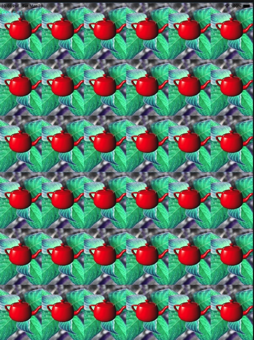

# 简单阵列相机效果
ArrayCamera，阵列相机，其本质应该是shift camera原理（成像平面投射偏离）的应用。WebGL中的ArrayCamera设计意图是为VR场景高效渲染提供支持，但是目前实际上只是提供了多子视口（sub view port）的渲染支持。

## webgl_array_camera例子
webgl_array_camera例子只是实现了类似九宫格效果的多视口（viewport）画面渲染。其实现方式是通过在unit square [0..1]区间按照比例定义每个子视口的参数，同时还有子视口对应的投射矩阵参数。在渲染时，对每个子视口参数根据实际的窗口尺寸进行对应的glViewport调用，然后根据对应的投射矩阵渲染场景到对应的视口。

## 在OpenGL ES上的C++渲染实现
webgl的arraycamera渲染例子实现起来比较简单。首先定义相机接口，包含子视口参数，投射矩阵参数。其次在渲染前实现对相机列表中每个视口和投射矩阵的应用。

[iOS版本实现源码](https://github.com/nintymiles/LearnThreeJSRenderingExamples)可以从github上获取
### 1. 定义PerspectiveCamera接口

```cpp

//sub view port参数，使用比例设置
struct SubViewPort
{
    float x;
    float y;
    float width;
    float height;
    
    SubViewPort(float x,float y,float width,float height):x(x),y(y),width(width),height(height){};
};

class PerspectiveCamera{
public:
    Matrix4 projMat;
    float aspect;
    float fov;
    float near;
    float far;
    SubViewPort subview;
    
public:
    PerspectiveCamera(float aspect=1.0,float fov=50.0,float near=-0.1,float far=-10000.0):aspect(aspect),fov(fov),near(near),far(far),subview(SubViewPort(0.,0.,0.,0.)){

        updatePorjectonMatrix();
    };
    ~PerspectiveCamera(){};
    
    void updatePorjectonMatrix(){
        //make a right handed projection matrix
        projMat = Matrix4::makeProjection(fov,aspect,near, far);
    }
   
};
```

### 2. 设置子视口参数和对应的投射矩阵
每个子视口和对应的投射矩阵实现为一个PerspectiveCamera实例，所有的PerspectiveCamera实例存储在一个容器中。

```cpp
    //6*6阵列相机
	 vector<PerspectiveCamera> arrayCamera;
    
    int amount = 6;
    float size = (float)1/amount;
    
    for ( int y = 0; y < amount; y ++ ) {
        for ( int x = 0; x < amount; x ++ ) {
            PerspectiveCamera subcamera;
            subcamera.subview = SubViewPort((float)x/amount,(float)y/amount,size,size);
            arrayCamera.push_back(subcamera);
        }      
    }
    
    ...
    //设置每个投射矩阵参数
    float aspect = g_windowWidth / static_cast <double> (g_windowHeight);
    for(auto &camera : arrayCamera){
        //注意：camera必须为reference，否则参数无法存储到arrayCamera的实例中
        camera.aspect = aspect;
        camera.far = g_frustFar;
        camera.near = g_frustNear;
        camera.fov = g_frustFovY;
        //生成投射矩阵
        camera.updatePorjectonMatrix();
    }
```

### 3. 渲染时应用多个子视口
在渲染时，每个子视口被设置到window的一个特定区域，每个视口都可以实现独立的场景渲染。

```cpp
for(auto &camera:arrayCamera){
        //由于每个子视口以比例方式设置，应用时要根据窗口尺寸进行适当的缩放。
        SubViewPort svPort = camera.subview;
        int x = svPort.x * g_windowWidth;
        int y = svPort.y * g_windowHeight;
        int width = svPort.width * g_windowWidth;
        int height = svPort.height * g_windowHeight;
        glViewport(x, y, width, height);
        
        //背景渲染
        planeModel->setPerspectiveCamera(make_shared<PerspectiveCamera>(camera));
        planeModel->Render();
        //teapot渲染
        teapotModel->setPerspectiveCamera(make_shared<PerspectiveCamera>(camera));
        teapotModel->Render();
    }
```

### 4. 渲染效果



