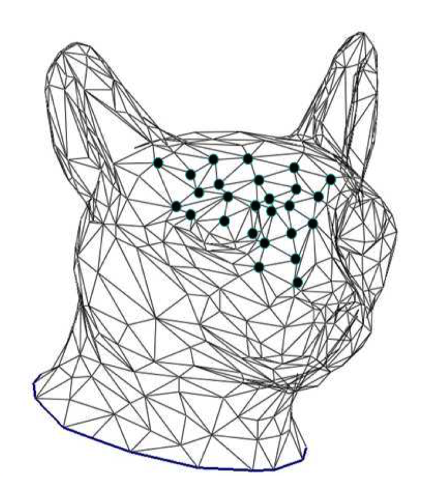
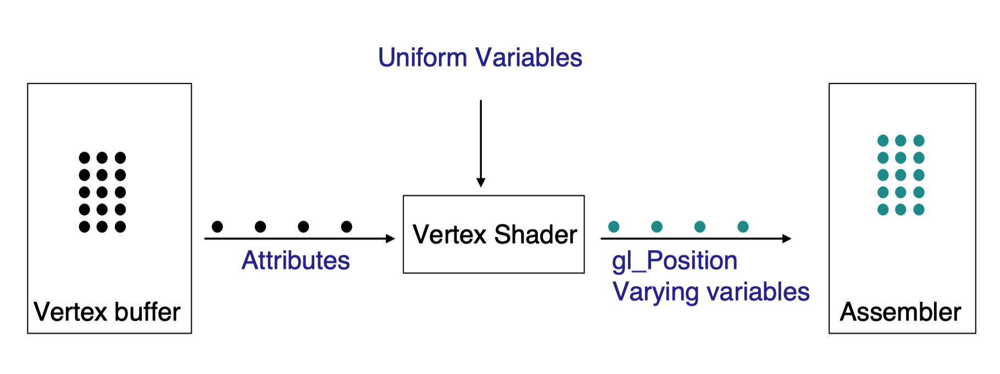
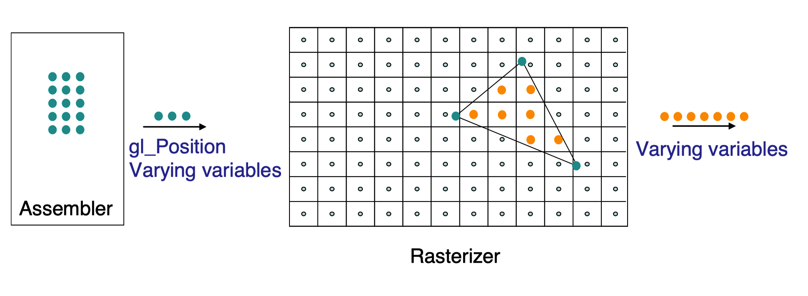
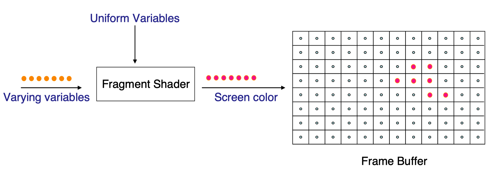
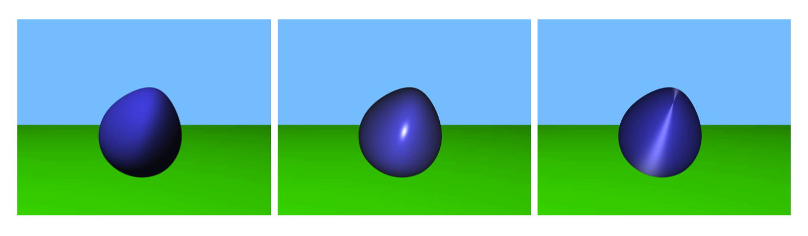
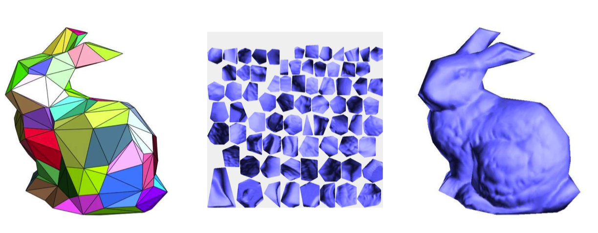

# Note
这是对**MIT Foundation of 3D Computer Graphics**第1章的翻译，本章讲解了计算机图形的发展简史，同时简明扼要地介绍了OpenGL图形渲染管线的过程。本书内容仍在不断的学习中，因此本文内容会不断的改进。若有任何建议，请不吝赐教<ninetymiles@icloud.com> 

> 注：文章中相关内容归原作者所有，翻译内容仅供学习参考。
> 另：Github项目[CGLearning](https://github.com/nintymiles/CGLearning)中拥有相关翻译的完整资料、内容整理、课程项目实现。

# 介绍
计算机图形是一个神奇的技术成功故事。基础思路，表达，算法和硬件方式在19世纪60年代和70年代被锻造出来，并且在随后的20年内发展成熟。到90年代中期，计算机图形技术已经相当成熟，但是他们的影响力在某种程度上被限制在“高端”应用，诸如超级计算机上的科学可视化，以及昂贵的飞行模拟器。现在很难相信，但是很多本科毕业的计算机专业学生甚至对于3D计算机图形是什么都没有概念！

之前的10年见证了计算机图形技术的大规模商业化。每一台现代PC都可以产生高质量的计算机生成的图像，大部分是以视频游戏和虚拟生活环境的形式存在。整个动画工业已经从高端（比如，皮克斯电影）转换到了儿童的日常电视节目中。对于真人实拍的电影，特效领域已经被完全革新；今天的观看者在他们看到最令人吃惊的计算机生成的特效时不会大惊小怪，这完全是期望看到的。

## 1.1 OpenGL
OpenGL开始时作为一种API，用于实现3D计算机图形的一种非常专有的操作序列。当底层的硬件变得越来越便宜，越来越多的弹性被放入硬件中并且通过OpenGL API被暴漏给了用户。随着时间的推移，完全控制图形计算的某一部分就变得可行。用户通过写小的专有目的程序，称为着色器（shader），这些程序被传递给API并且被其编译。在OpenGL中，这些着色器以类C的专有目的语言（称作GLSL）来书写记录。就像我们下面将描述的，两个主要的可编程部分分别为一个顶点着色器（vertex shader）和一个碎片着色器（fragment shader）所控制。这些特定的部分之所以被实现为可编程的方式，因为它们本身不仅在给予用户弹性方面有巨大效用，而且也因为这种计算可以借助单指令多数据（SIMD）并行方式被实现。以单个几何顶点方式被存储的数据可以独立于其它顶点被处理。同样的，确定一个屏幕像素色彩的计算可以完全独立于其它像素被计算。

在当前的OpenGL程序中，实际的3D图形很大程度（但不是全部）由你所写的着色器完成，不再是OpenGL API本身的真正组成部分。在这种意义上，OpenGL更多的是关于组织你的数据和着色器而更少关于3D计算机图形。在这部分的余下内容里，我们会给出由OpenGL完成的主要处理步骤的概要。但是我们也会给出多种关于着色器通常是怎么被用于这些步骤中实现来3D计算机图形的高级描述。

在OpenGL中我们表达我们的几何体为三角形的集合。一方面，三角形足够简单可以被OpenGL非常高效地处理，而另一方面，借助很多三角形的集合，我们可以近似出复杂形状的表面（参考图示$\text{Figure 1.1}$）。如果我们的计算机图形程序使用了一种更抽象的几何表达，在OpenGL可以绘制这个几何体之前，它一定要首先被转换为三角形集合。

**Figure 1.1:** 猫的头部使用三角形集合描述。其中一些顶点使用黑色的圆点高亮显示。来自于参考书目[64]，©️Eurographics c and Blackwell Publishing Ltd。

简要概述，OpenGL的计算决定了每一个三角形中每个顶点的屏幕位置，指出了哪些屏幕（圆）点，被称作像素，位于每个三角形之内，同时执行某种计算决定那个像素想要的色彩。我们现在更详细一点地参观一下这些步骤。

每个三角形由三个顶点组成。我们为每个顶点关联了一些数值数据。每个这样的数据条目被称为一个属性（attribute）。最少情形下，我们需要指定出顶点的位置（2D几何体使用2个数字，3D几何体使用3个数字）。我们可以使用其它属性为顶点关联其它种类的数据，我们可以使用这些数据确定它们（三角形顶点）的最终外观。例如，我们可以为每个顶点关联一个色彩（使用3个数字表达红色、绿色和蓝色的数量）。其它属性可以用于表示相关的材料属性，比如说，描述这个顶点的表面是多么闪亮。

把顶点数据从CPU传输到图形硬件（GPU）是一种昂贵的处理，所以通常尽可能不频繁地使用。存在专有的API调用传输顶点数据到OpenGL，然后这些数据被存储到一个顶点缓存中。

一旦顶点数据被给到OpenGL，在任何随后的时间点我们可以发出一个绘制调用（draw call）到OpenGL。这要求OpenGL依次访问合适部分的顶点缓存并且绘制每个顶点3元组为一个三角形。

一旦OpenGL绘制调用被发出，每个顶点（也就是说，所有它的属性）被你的顶点着色器独立地处理（参考图示$\text{Figure 1.2}$）。在这些属性数据之外，着色器对称为uniform变量的内容也有访问权限。这些你的程序所设置的变量，但是你只能在多个OpenGL绘制调用之间设置它们，而不是每顶点时。

**Figure 1.2:** 顶点以顶点缓存（vertex buffer）方式存储。当一个绘制调用被发出，每个顶点都会通过顶点着色器。关于顶点着色器的输入，每个顶点（黑色表示）都有关联的属性。关于输出，每个顶点（青色表示）都有一个gl_Position值和对应的变异变量。

顶点着色器是你自己的程序，并且你可以将任何你想要的内容放入其中。顶点着色器最典型的用法是确定屏幕上顶点的最终位置。例如，顶点可以让自己的抽象3D位置被存为属性。同时，uniform变量可以被用于描述虚拟相机，其映射抽象3D地址到实际的2D屏幕。我们会在第2章到第6章以及第10章涵盖这种计算的细节。

一旦顶点着色器计算出了屏幕上顶点的最终位置，它把这个值赋给保留的被称作`gl_Position`的输出变量。这个变量的x和y坐标被解读为绘制窗口内的位置。这个窗口的左下角拥有坐标$(-1,-1)$，右上角拥有坐标$(1,1)$。这个正方形之外的坐标表达绘制区域之外的地址。

顶点着色器也可以输出其它变量，这些变量会被用于碎片着色器来决定三角形所覆盖的每个像素的最终色彩。这些输出被称为变异变量（varying variables），因为就如我们马上会解释的，当我们查看一个三角形内的不同像素时，它们的值会变化。

一旦被处理，这些顶点和它们的变异变量一起被三角形组装器收集，同时以三元组的形式聚集在一起。

OpenGL接下来的工作是在屏幕上绘制每个三角形（参考图示$\text{Figure 1.3}$）。这个步骤被称作光栅化（rasterization）。对于每个三角形，它使用3个顶点位置把三角形放置在屏幕上。它随后计算屏幕上哪个像素位于三角形之内。针对每个这样的像素，光栅化器对每个变异变量计算出一个被插值的值。这意味着针对每个变异变量的这种值通过混合关联于三角形顶点的3个值被设置。使用的混合比率和像素到3个顶点中的每一个的距离有关系。我们会在第13章中讲述进行混合的准确方式。因为光栅化是这样一种专有的和高度优化的操作，这个步骤没有被实现为可编程方式。

**Figure 1.3:** gl_Positon中的数据被用于将一个三角形的三个地址放置在一个虚拟屏幕上。光栅化器（rasterizer）指出哪些像素（橙色）位于三角形之内同时从顶点到这些像素插值出变异变量。

最后，对于每个像素，这种被插值的数据会经历一个碎片着色器（参考图示$\text{Figure 1.4}$）。碎片着色器是你以GLSL所写的另一个程序并且亲手将其传递给OpenGL。碎片着色器的职责是基于作为变异变量和uniform变量被传递给它的信息来决定被绘制的色彩。碎片着色器所计算的最终色彩被放置到被称为帧缓存（framebuffer）的GPU内存中。帧缓存中的数据随后被发送到显示设备，在这里它被绘制在屏幕之上。

**Figure 1.4:** 每个像素都经历了碎片着色器，其计算了像素（粉色）的最终色彩。像素随后被放置在帧缓存中用于显示。

在3D图像中，我们通过计算几个方程式来决定一个像素的色彩，这些方程式模拟了光线从某种材料表面反射的方式。这种计算可以使用存储在变异变量中的数据，这些数据表达了在那个像素处表面的材料和几何属性。它也可以使用以uniform变量方式存储的数据，这些数据表达了场景中光源的位置和色彩。通过改变在碎片着色器中的程序，我们可以模拟光线从不同类型的表面反弹的情形，这可以针对某种固定的几何体生成多种外观，就如在图示$\text{Figure 1.5}$所展示的。我们在第14章中会更详细地讨论这种处理。

**Figure 1.5:** 通过改变我们的碎片着色器，我们可以模拟光从不同种类的材料反射。

作为这种色彩计算的部分，我们也能指示着色器从一个辅助存储图像中获取色彩数据。这样一个图像被称作纹理，并且被一个uniform变量所指向。同时，被称为纹理坐标的变异变量告诉碎片着色器从纹理的什么地方选择合适的像素。借助称作纹理映射的这种处理，你可以模拟“粘贴”纹理图像的某个局部到每个三角形上。针对由少量三角形所定义的简单几何物体，这种处理可以被用于给出高度的视觉复杂性。关于这种例子请参考图示$\text{Figure 1.6}$。随后在第15章中这会被讨论。

**Figure 1.6:** 纹理映射。左侧：简单的用少量三角形描述的几何物体。中间：称作纹理的辅助图形。右侧：纹理的局部被粘贴到每个三角形上，这给出了一种更复杂的外观。来自于[65]，©️ACM。

当色彩被绘制到帧缓存时，存在一种称作合并（merging）的处理，这种处理决定了刚从碎片着色器输出的“新”色彩如何与帧缓存中可能已经存在“旧”色彩混合在一起。当z-缓存化（z-buffering）被启用，一个检测被应用来查看刚被碎片着色器处理的几何点，相比于帧缓存中用于设置已经存在色彩的点，更靠近还是更远离观察者。z-缓存化在生成3D场景的图像时非常有用。我们会在第11章讨论z-缓存化操作。另外，OpenGL也可以被指示使用多种比率将新旧色彩混合在一起。这可以用于建模透明物体。这种处理被称作alpha混合，并且会在后面的小节16.4中讨论。因为这种合并步骤涉及对共享内存（帧缓存）的读写，所以这种步骤没有被实现为可编程的，而是被多种API调用所控制。

附录A中我们参观了一个实现了简单OpenGL程序的实际代码片段，这个程序使用纹理映射执行某种简单的2D绘制。那里的目标不是学习3D图形，而是理解API和OpenGL中使用的处理步骤本身。在到达第6章之前，你将需要在某个时间详细浏览这个附录。

