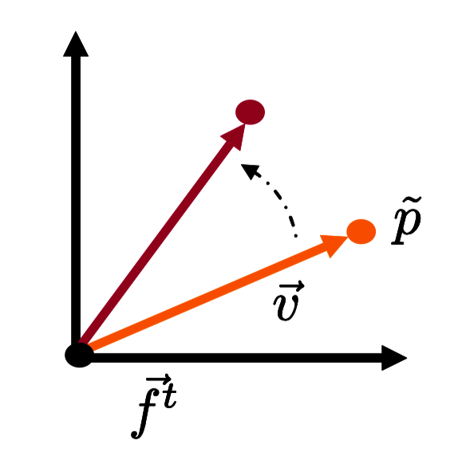
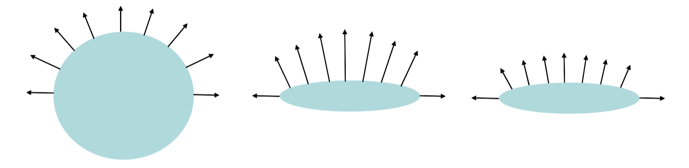

# Note
这是对**MIT Foundation of 3D Computer Graphics**第3章的翻译，本章讲解了仿射变换的基本概念，变换矩阵的由来以及分解、通用法线变换的推导等内容。本书内容仍在不断的学习中，因此本文内容会不断的改进。若有任何建议，请不吝赐教<nintymiles@icloud.com> 

> 注：文章中相关内容归原作者所有，翻译内容仅供学习参考。
> 另：Github项目[CGLearning](https://github.com/nintymiles/CGLearning)中拥有相关翻译的完整资料、内容整理、课程项目实现。

# 仿射（并行）（Affine）

## 3.1 点和帧（Points and Frames）
将点和矢量看作是两种不同的概念是有用的。点表示在几何世界中的某种固定位置，而矢量表示世界中两个点之间的运动。我们会使用两种不同的标记区分点和矢量。矢量$\vec{v}$会有一个箭头在顶部，而点$\tilde{p}$会有波浪线在顶部。

如果我们认为矢量表达两点之间的运动，那么矢量操作（加法和标量乘法）就有明确的意义。如果我们把两个矢量加起来，我们在表达两个运动的串接（concatenation）。如果我们用一个标量乘以矢量，我们就在通过某个因子增强或减弱运动。零矢量（zero vector）为一个特别矢量，其代表没有运动。

这些操作对于点不会真正产生任何意义。把两个点加起来应该表示什么含义，比如说，哈佛广场加上剑桥肯德尔广场（这里是两个地点名称）是什么？一个点被一个标量相乘又指得什么？什么是北极点的7倍？是否存在一个零点（zero point）和其它点的行为不一样？

存在一种在两个点之间确实有意义的操作：减法。当我们从另一个点减去一个点，我们应该会得到从第二个点到第一个点路径之间的运动，
$$
\tilde{p} - \tilde{q} = \vec{v}
$$

反过来说，如果我们从一个点开始，然后移动一个矢量（位移），我们应该会到达另一个点。
$$
\tilde{q} + \vec{v} = \tilde{p}
$$

对一个点应用线性变换同样有意义。例如我们可以想象一个点围绕某个固定原点的旋转。而且平移点也是有意义的（但是这个概念对于矢量没有任何意义）。要表达平移，我们需要开发仿射变换（或并行变换 affine transformation）的概念。要完成这个任务，我们借助$4 \times 4$矩阵。这些矩阵不仅对于处理本章的仿射（并行）变换很方便，而且对于描述（随后在第十章会看到的）相机投射变换也是很有帮助。

### 3.1.1 帧（Frames）
在仿射空间（affine space）中，我们描述任何点$\tilde{p}$首先从某个原点$\tilde{o}$开始，然后给其加上一个矢量的线性组合。这些矢量使用坐标$c_i$和一个矢量基（basis of vectors）来表示。

$$
\tilde{p} = \tilde{o} + \sum_i c_i\vec{b}_i = 
\begin{bmatrix} \vec{b}_1 & \vec{b}_2 & \vec{b}_3 & \tilde{o} \end{bmatrix}
\begin{bmatrix} c_1 \\ c_2 \\ c_3 \\ 1 \end{bmatrix} = 
\vec{\mathbf{f}}^t\mathbf{c}
$$
此处$1\tilde{o}$被定义为$\tilde{o}$。

而下面这行表达
$$\begin{bmatrix} \vec{b}_1 & \vec{b}_2 & \vec{b}_3 & \tilde{o} \end{bmatrix} = \vec{\mathbf{f}}^t$$
被称为一个仿射帧（affine space）；它就像一个基（basis），但是由3个矢量和一个点组成。

为了借助一个帧指定一个点，我们使用拥有4个条目（entries）的4部件坐标矢量（coordinate 4-vector），其中最后一个条目总为1。要借助一个帧表达一个矢量，我们使用一个让0作为第4坐标的坐标矢量（也就是说，它只是基矢量之和）。当我们建模针孔相机的行为时，要表达几何形状（还有$4 \times 4$矩阵），4部件坐标矢量的使用都会很便利。

## 3.2 仿射变换和$4\times4$矩阵（Affine transformations and Four by Four Matrices）
相似于线性变换的情形，我们想要通过在一个4部件坐标矢量和一个帧之间放置一个合适的矩阵的形式，来定义出仿射变换的概念。

让我们将仿射矩阵定义为一个如下形式的$4 \times 4$矩阵
$$
\begin{bmatrix} a & b & c & d \\ e & f & g & h \\ i & j & k & l \\ 0 & 0 & 0 & 1 \end{bmatrix} 
$$

然后我们对一个点$\tilde{p} = \vec{\mathbf{f}}^t\mathbf{c}$应用仿射变换如下
$$ \begin{array}{rl}
& \begin{bmatrix} \vec{b}_1 & \vec{b}_2 & \vec{b}_3 & \tilde{o} \end{bmatrix}
\begin{bmatrix} c_1 \\ c_2 \\ c_3 \\ 1 \end{bmatrix} \\
\Rightarrow & \begin{bmatrix} \vec{b}_1 & \vec{b}_2 & \vec{b}_3 & \tilde{o} \end{bmatrix}
\begin{bmatrix} a & b & c & d \\ e & f & g & h \\ i & j & k & l \\ 0 & 0 & 0 & 1 \end{bmatrix} 
\begin{bmatrix} c_1 \\ c_2 \\ c_3 \\ 1 \end{bmatrix}
\end{array}$$

或者简写为
$$ \vec{\mathbf{f}}^t\mathbf{c} \Rightarrow \vec{\mathbf{f}}^tA\mathbf{c}$$

我们可以验证上面表达的第二行描述了一个有效的点，因为乘法
$$
\begin{bmatrix} x' \\ y' \\ z' \\ 1 \end{bmatrix} =
\begin{bmatrix} a & b & c & d \\ e & f & g & h \\ i & j & k & l \\ 0 & 0 & 0 & 1\end{bmatrix} 
\begin{bmatrix} c_1 \\ c_2 \\ c_3 \\ 1 \end{bmatrix}
$$
给出了我们一个带有1作为第4条目的4部件坐标矢量。另一方面，我们也能够看到乘法
$$ 
\begin{bmatrix} \vec{b}_1' & \vec{b}_2' & \vec{b}_3' & \tilde{o} \end{bmatrix} =
\begin{bmatrix} \vec{b}_1 & \vec{b}_2 & \vec{b}_3 & \tilde{o} \end{bmatrix}
\begin{bmatrix} a & b & c & d \\ e & f & g & h \\ i & j & k & l \\ 0 & 0 & 0 & 1 \end{bmatrix}
$$
此处$0\tilde{o}$被定义为$\vec{0}$，给出了一个由3个矢量和一个原点组成的有效帧。

同时也要注意到，如果矩阵的最后一行不是$[0,0,0,1]$这种形式，变换就通常给出一个无效的结果。

类似于线性变换的情形，我们可以针对一个帧应用仿射变换（affine transformation）为
$$ 
\begin{bmatrix} \vec{b}_1 & \vec{b}_2 & \vec{b}_3 & \tilde{o} \end{bmatrix}
\Rightarrow 
\begin{bmatrix} \vec{b}_1 & \vec{b}_2 & \vec{b}_3 & \tilde{o} \end{bmatrix}\begin{bmatrix} a & b & c & d \\ e & f & g & h \\ i & j & k & l \\ 0 & 0 & 0 & 1 \end{bmatrix}
$$

或者简写为
$$ \vec{\mathbf{f}}^t \Rightarrow \vec{\mathbf{f}}^tA$$

## 3.3 对点应用线性变换（Applying Linear Transformations to Points）
假如我们有一个表达线性变换的$3\times3$矩阵。我们可以将其嵌入$4\times4$矩阵的左上方角落，并且借助这个更大的矩阵对一个点（或者帧）应用变换。
$$ \begin{array}{rl}
& \begin{bmatrix} \vec{b}_1 & \vec{b}_2 & \vec{b}_3 & \tilde{o} \end{bmatrix}
\begin{bmatrix} c_1 \\ c_2 \\ c_3 \\ 1 \end{bmatrix} \\
\Rightarrow & \begin{bmatrix} \vec{b}_1 & \vec{b}_2 & \vec{b}_3 & \tilde{o} \end{bmatrix}
\begin{bmatrix} a & b & c & 0 \\ e & f & g & 0 \\ i & j & k & 0 \\ 0 & 0 & 0 & 1 \end{bmatrix} 
\begin{bmatrix} c_1 \\ c_2 \\ c_3 \\ 1 \end{bmatrix}
\end{array}$$

这个变换在$c_i$上拥有相同效果，就如之前其所参与的线性变换。如果我们把点$\tilde{p}$当作从原点$\tilde{o}$偏移矢量$\vec{v}$，我们就明白这个变换和应用线性变换到偏移矢量上具有相同效果。因而，以例子来说，如果$3\times3$矩阵为旋转矩阵，这个变换将围绕原点旋转这个点（参考图示$\text{Figure 3.1}$）。正如下面我们将在第4章中看到的，当对一个点应用一个线性变换，帧的原点位置扮演了一个重要的角色。

我们借助下列缩写用于描述一个$4\times4$矩阵，其只是应用了一个线性变换。
$$
L= \begin{bmatrix}l & 0 \\ 0 & 1\end{bmatrix}
$$
此处$L$是一个$4\times4$矩阵，$l$是一个$3\times3$矩阵，右上角的0代表$3\times1$由0组成的矩阵，右下角的1是一个标量(scalar)。

**Figure 3.1:** 对一个点应用线性变换。可以通过应用线性变换到始于原点的偏移矢量上来完成。

## 3.4 平移（Translations）
可以对点应用平移变换是很有用的。这种变换不是线性的（参考课后练习6)。仿射变换的主要新威力就是在线性变换之上表达平移的能力。实际上，如果我们应用变换
$$ \begin{array}{rl}
& \begin{bmatrix} \vec{b}_1 & \vec{b}_2 & \vec{b}_3 & \tilde{o} \end{bmatrix}
\begin{bmatrix} c_1 \\ c_2 \\ c_3 \\ 1 \end{bmatrix} \\
\Rightarrow & \begin{bmatrix} \vec{b}_1 & \vec{b}_2 & \vec{b}_3 & \tilde{o} \end{bmatrix}
\begin{bmatrix} 1 & 0 & 0 & t_x \\ 0 & 1 & 0 & t_y \\ 0 & 0 & 1 & t_z \\ 0 & 0 & 0 & 1 \end{bmatrix} 
\begin{bmatrix} c_1 \\ c_2 \\ c_3 \\ 1 \end{bmatrix}
\end{array}$$

我们看到变换在坐标上的效果为
$$
\begin{array}{rcl}
c_1 & \Rightarrow & c_1 + t_x \\
c_2 & \Rightarrow  & c_2 + t_y \\
c_3 & \Rightarrow & c_3 + t_z 
\end{array}
$$
针对平移，我们使用简写
$$
T= \begin{bmatrix} i & t \\ 0 & 1 \end{bmatrix}
$$

此处$T$为 一个$4\times4$矩阵，$i$为一个$3\times3$同一矩阵（identity matrix），右上角的$t$为一个表达平移的$3\times3$矩阵，左下角的0表示一个由0组成的$1\times3$矩阵，右下角的1为一个变量。

注意如果$\mathbf{c}$在第4坐标中为0，如此就表达了一个矢量而不是一个点，从而不会被平移所影响。

## 3.5 汇总（Putting Them Together）
任何仿射矩阵（affine matrix）都可以被分解为线性部分和平移部分。
$$
\begin{bmatrix} a & b & c & d \\ e & f & g & h \\ i & j & k & l \\ 0 & 0 & 0 & 1 \end{bmatrix} =
\begin{bmatrix} a & b & c & 0 \\ e & f & g & 0 \\ i & j & k & 0 \\ 0 & 0 & 0 & 1 \end{bmatrix} 
\begin{bmatrix} 1 & 0 & 0 & d \\ 0 & 1 & 0 & h \\ 0 & 0 & 1 & l \\ 0 & 0 & 0 & 1 \end{bmatrix} 
$$

或者简写为
$$
\begin{bmatrix} l & t \\ 0 & 1 \end{bmatrix}  =  \begin{bmatrix} i & t \\ 0 & 1 \end{bmatrix} \begin{bmatrix} l & 0 \\ 0 & 1 \end{bmatrix}  \tag{3.1}  
$$
$$
A  =  TL \qquad\quad \tag{3.2}
$$  
 
注意因为矩阵乘法不是可互换顺序的，乘法$TL$中的顺序很关键。一个仿射矩阵（affine matrix）也可以借助一个不同的平移矩阵$T'$被分解为$A=LT'$（线性部分是不会发生变化的），但是我们不会使用这种形式。

如果$L$，$A$的线性部分，是一个旋转，我们把这种形式记作
$$A=TR \tag{3.3} \qquad\quad$$

在这种情形中，我们称$A$矩阵为刚体矩阵(rigid body matrix)，它所对应的变化，刚体变换（rigid body transform），简称$RBT$。刚体变换保留了矢量之间的点积（dot product），基的手（螺旋）性（handedness），还有点之间的距离。

## 3.6 法线（Normals）
在计算机图形学中，我们经常借助表面法线确定一个表面点如何被着色。所以当表面点经历由矩阵$A$表示的仿射变换时，我们需要懂得表面法线是如何变换的。

你可能猜测我们只要用矩阵$A$乘以法线的坐标就可以了。例如，如果我们旋转几何形状，法线会以完全相同的方式旋转。但是事实上使用矩阵$A$不总是正确的。例如在图示$\text{Figure 3.2}$中，我们顺着$y$轴挤压一个球体。在这种情形中，实际的法线变换会顺着$y$轴拉伸而不是挤压。在这里我们要推导出可以应用在所有情形中的正确变换。

**Figure 3.2:** 左侧：蓝色的形状拥有以黑色表示的法线。中间：现在在$y$轴方向上被缩小同时（未标准化的）法线在$y$轴方向被拉伸。右侧：法线被重新标准化从而给出被挤压形状的正确的单位法线。

让我们定义位于点上平滑表面的法线为一个矢量，这个矢量正交于那个点表面的切线平面。切线平面是矢量平面，这个矢量平面通过临近的（距离无限小地）表面点之间的减法来定义，所以，针对法线$\vec{n}$和两个非常接近的点$\tilde{p}_1$和$\tilde{p}_2$，我们有如下表达。
$$
\vec{n}.(\tilde{p}_1 - \tilde{p}_2) = 0
$$

在某种固定的正交标准化坐标系中，这可以被表达为
$$
\begin{bmatrix} nx & ny & nz & * \end{bmatrix}
\left( 
\begin{bmatrix} x1 \\ y1 \\ z1 \\ 1 \end{bmatrix} - 
\begin{bmatrix} x0 \\ y0 \\ z0 \\ 1 \end{bmatrix}
\right) = 0 \tag{3.4}
$$
在这个公式中我们在前面的插槽中使用$'*'$是因为它被0乘，从而和结果不相关。

假设存在一个由仿射矩阵$A$表示的仿射变换，我们把这个变换应用到所有的点上。什么矢量会和任意的切线矢量保持正交状态？让我们重写方程式(3.4)为
$$
（\begin{bmatrix} nx & ny & nz & * \end{bmatrix}A^{-1})(A
\left( 
\begin{bmatrix} x1 \\ y1 \\ z1 \\ 1 \end{bmatrix} - 
\begin{bmatrix} x0 \\ y0 \\ z0 \\ 1 \end{bmatrix}
\right)) = 0 
$$

如果我们定义$[x',y',z',1]^t=A[x,y,z,1]^t$为被变换点的坐标，同时让$[nx',ny',nz',*]=[nx,ny,nz,*]A^{-1}$，那么我们就得到如下表达
$$
（\begin{bmatrix} nx' & ny' & nz' & * \end{bmatrix})(
\left( 
\begin{bmatrix} x1' \\ y1' \\ z1' \\ 1 \end{bmatrix} - 
\begin{bmatrix} x0' \\ y0' \\ z0' \\ 1 \end{bmatrix}
\right)) = 0 
$$

并且我们看到$[nx',ny',nz']^t$是被变换的几何体法线的坐标（要依靠伸缩变换来获得标准态）。

注意因为我们不关注$'*'$值，因而我们不需要关注$A^{-1}$的第四列。同时，因为A是一个仿射矩阵（affine matrix），所以$A^{-1}$也是，进而剩下三列的第四行全部是0，从而可以安全地被忽略。因而，参考简写方式
$$
A= \begin{bmatrix} l & t \\ 0 & 1 \end{bmatrix} 
$$

我们可以得到这种关系
$$
\begin{bmatrix} nx' & ny' & nz'  \end{bmatrix} = \begin{bmatrix} nx & ny & nz  \end{bmatrix}l^{-1}
$$

此时调换整个表达式，我们就获得最终表达式
$$
\begin{bmatrix} nx' \\ ny' \\ nz' \end{bmatrix} = 
l^{-t}\begin{bmatrix} nx \\ ny \\ nz \end{bmatrix}
$$
此处$l^{-t}$是$3\times3$矩阵的反转加调换（等价于调换加反转）。注意如果$l$为一个旋转矩阵，且这个矩阵是正交标准化的，那么它的反转加调换事实上仍然是$l$。在这种情形中法线的坐标表现的就像点的坐标一样。然而对于其它线性变换，法线的表现就不相同了。（参考图示$\text{Figure 3.2}$。）同时也要注意到A的平移部分对法线没有影响。

