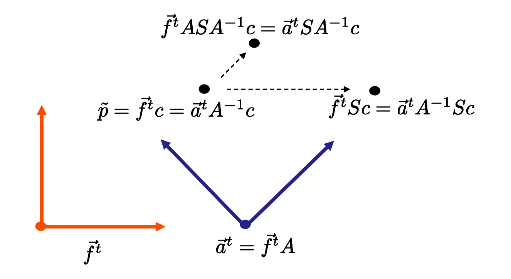
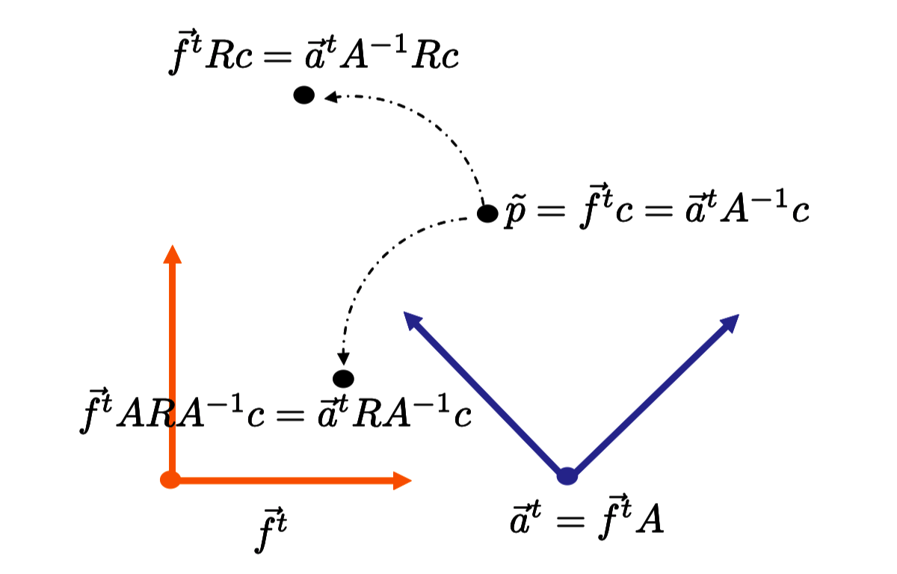

# Note
这是对**Foundation of 3D Computer Graphics**第5章的翻译，本章讲解了点和矢量变换中相对于坐标系的关联性，包含辅助帧变换、左侧规则（left of rule）和多重变换的解读等内容。本书内容仍在不断的学习中，因此本文内容会不断的改进。若有任何建议，请不吝赐教ninetymiles@icloud.com 

> 注：文章中相关内容归原作者所有，翻译内容仅供学习参考。

# 关联（Respect）

## 4.1 帧的重要性（The Frame Is Important）
在计算机图形学中我们同时跟踪多种不同的帧（frames）。例如，我们针对场景中每个物体都会拥有一个不同的帧。我们如何使用和组织这些帧的详细说明在第5章中会被讲述。因为存在这许多帧，当运用矩阵定义变换时，我们需要尤其小心。

假如我们指定一个点和一个变换矩阵（transformation matrix），这并不能完全明确出实际的变换。我们还要确定出我们正在使用什么帧（frame）。这里有一个展示这种情况的简单例子。假设我们开始于点$\tilde{p}$以及一个矩阵
$$ \large{ S =  \begin{bmatrix}
2 & 0 & 0 & 0 \\ 0 & 1 & 0 & 0 \\ 0 & 0 & 1 & 0 \\  0 & 0 & 0 & 1
\end{bmatrix} }$$
现在我们要指定帧$\vec{\mathbf{f}}^t$。借助这个帧，点可以借助某种恰当的坐标矢量（coordinate vector）表示为$\tilde{p}=\vec{\mathbf{f}}^t\mathbf{c}$。如果我们使用这个矩阵去变换这个点，就如在第3章中所讲述的，我们获得$\vec{\mathbf{f}}^t\mathbf{c} \Rightarrow \vec{\mathbf{f}}^tS\mathbf{c}$。在这种情形中，矩阵的效用是从原点（origin）通过一个为2的伸缩因子（scale factor）变换点，沿着$\vec{\mathbf{f}}^t$第一个轴（x轴）的方向。

假设我们挑选另外某个帧$\vec{\mathbf{a}}^t$，同时假设这个帧关联于原来的帧，通过矩阵方程式$\vec{\mathbf{a}}^t = \vec{\mathbf{f}}^tA$。我们可以在新帧中表达最初的点，借助一个新的坐标系$\tilde{p}=\vec{\mathbf{f}}^t\mathbf{c} = \vec{\mathbf{a}}^t\mathbf{d}$，此处$\mathbf{d}=A^{-1}\mathbf{c}$。

现在，如果我们关联于$\vec{\mathbf{a}}^t$使用矩阵S去执行在点上的变换，我们获得$\vec{\mathbf{a}}^t\mathbf{d} \Rightarrow \vec{\mathbf{a}}^tS\mathbf{d}$。在这种情形中，我们伸缩了相同的点$\tilde{p}$，但是这次我们已经从$\vec{\mathbf{a}}^t$的原点（origin）且在其第一个轴（x轴）的方向上伸缩（移动）了这个点。这是一个不一样的变换（参考图示$\text{Figure 4.1}$）。图示$\text{Figure4.2}$展示了在帧上旋转变换的相同依赖性，借助于一个固定的旋转矩阵R。

**Figure 4.1:** 伸缩矩阵（scaling matrix）S被用来关联于两个不同的帧（frame）以伸缩点$\tilde{p}$。这导致了两种不同的答案。

**Figure 4.2:** 旋转矩阵（rotation matrix）R被用来关联于两个不同的帧（frame）以旋转点$\tilde{p}$。这也导致两种不同的答案。

这里需要注意的重要事项是，表达式中点被关联于直接出现在变换矩阵左侧的帧（frame）被这个矩阵变换（本例中为非均匀缩放）。因此我们称呼这个为左侧规则（left of rule）。我们读表达式$$\tilde{p}=\vec{\mathbf{f}}^t\mathbf{c} \Rightarrow \vec{\mathbf{f}}^tS\mathbf{c}$$
为”（点）$\tilde{p}$关联于$\vec{\mathbf{f}}^t$被（矩阵）$S$变换“。

我们读表达式
$$ \tilde{p}=\vec{\mathbf{a}}^tA^{-1}\mathbf{c} \Rightarrow \vec{\mathbf{a}}^tSA^{-1}\mathbf{c} $$
为“（点）$\tilde{p}$关联于$\vec{\mathbf{a}}^t$被（矩阵）$S$变换”。

我们可以应用相同的推理到帧（frame）本身的变换上。我们读表达式
$$ \vec{\mathbf{f}}^t \Rightarrow \vec{\mathbf{f}}^tS $$
为“$\vec{\mathbf{f}}^t$关联于$\vec{\mathbf{f}}^t$被（矩阵）$S$变换”。

我们读表达式
$$\vec{\mathbf{f}}^t \Rightarrow \vec{\mathbf{a}}^tSA^{-1}$$
为“$\vec{\mathbf{f}}^t$关联于$\vec{\mathbf{a}}^t$被（矩阵）$S$变换”。

### 4.1.1 借助辅助帧（auxiliary frame）变换
很多时候当我们希望以某种用矩阵M表达的特殊方式变换一个帧$\vec{\mathbf{f}}^t$，变换关联于某种辅助帧$\vec{\mathbf{a}}^t$。例如，我们可能正在借助某种帧（frame）建模行星地球，现在我们希望地球同时围绕太阳所在的帧（frame）旋转。

这很容实现，只要我们知道关联$\vec{\mathbf{f}}^t$和$\vec{\mathbf{a}}^t$的矩阵。例如，我们已知这种关系
$$\vec{\mathbf{a}}^t = \vec{\mathbf{f}}^tA$$

那么被变换的帧（frame）可以被表达为
$$
\quad \vec{\mathbf{f}}^t  \qquad\qquad\qquad \quad (4.1)\\ 
= \vec{\mathbf{a}}^tA^{-1} \qquad\qquad\quad (4.2) \\
\Rightarrow \vec{\mathbf{a}}^tMA^{-1} \qquad\qquad (4.3) \\
= \vec{\mathbf{f}}^tAMA^{-1} \qquad\qquad (4.4)
$$

第一行中，我们借助帧（frame）$\vec{\mathbf{a}}^t$重写$\vec{\mathbf{f}}^t$。第二行中我们用“左侧规则（left of rule）“变换帧系统（frame system）；我们借助矩阵M关联于帧$\vec{\mathbf{a}}^t$进行变换。最后一行中，我们只是重写了表达式从而移除辅助帧（auxiliary frame）。

## 4.2 多重变换（Multiple Transformations）
我们可以使用这种“左侧”规则解读多重变换序列。再次，回想一下，通常，矩阵乘法不可交换。在下列的2D例子中，让R为一个旋转矩阵，T为一个平移矩阵，这里平移矩阵具有在第一个轴上平移矢量的效用，而旋转矩阵拥有围绕帧的原点旋转$\theta$度的效果。（参考图示$\text{Figure 4.3}$）。

我们现在会对下列的变换解读
$$\vec{\mathbf{f}}^t \Rightarrow \vec{\mathbf{f}}^tTR$$

我们通过将变换切分为两个步骤来解读
$$\vec{\mathbf{f}}^t \Rightarrow \vec{\mathbf{f}}^tT = \vec{\mathbf{f}}'^t$$

这个步骤被解读为：$\vec{\mathbf{f}}^t$关联于$\vec{\mathbf{f}}^t$被矩阵T变换，同时我们称呼结果帧为$\vec{\mathbf{f}}'^t$。

在第二步中，

$$\vec{\mathbf{f}}^tT \Rightarrow \vec{\mathbf{f}}^tTR $$

or equivalently
或者等价地，

$$\vec{\mathbf{f}}'^t \Rightarrow \vec{\mathbf{f}}'^tR $$

这个步骤被解读为：$\vec{\mathbf{f}}'^t$关联于$\vec{\mathbf{f}}'^t$被矩阵R变换。

我们也可以用另一种方式解读被合成的变换（composed transformations）。这通常通过以其它次序应用旋转和平移变换来完成。第一步中

$$\vec{\mathbf{f}}^t \Rightarrow \vec{\mathbf{f}}^tR = \vec{\mathbf{f}}^{_ot}$$

$\vec{\mathbf{f}}^t$关联于$\vec{\mathbf{f}}^t$被矩阵R变换，同时我们称呼结果帧为$\vec{\mathbf{f}}^{_ot}$。第二步中

$$\vec{\mathbf{f}}^tR \Rightarrow \vec{\mathbf{f}}^tTR $$

$\vec{\mathbf{f}}^{_ot}$关联于$\vec{\mathbf{f}}^t$被矩阵T变换。

这些只是两个最后完全相同的合成变换的不同解释。1）先关联于$\vec{\mathbf{f}}^t$平移然后关联于中间帧（intermediate frame）旋转。2）先关联于$\vec{\mathbf{f}}^t$旋转再关联于最初帧$\vec{\mathbf{f}}^t$平移。

这些类型的解释经常被总结如下：如果我们阅读变换从左侧到右侧，那么每个变换关联于新生成的“本地”帧（frame）被完成。如果我们阅读变换从右侧到左侧，那么每个变换关联于最初的“全局”帧（frame）被完成。

