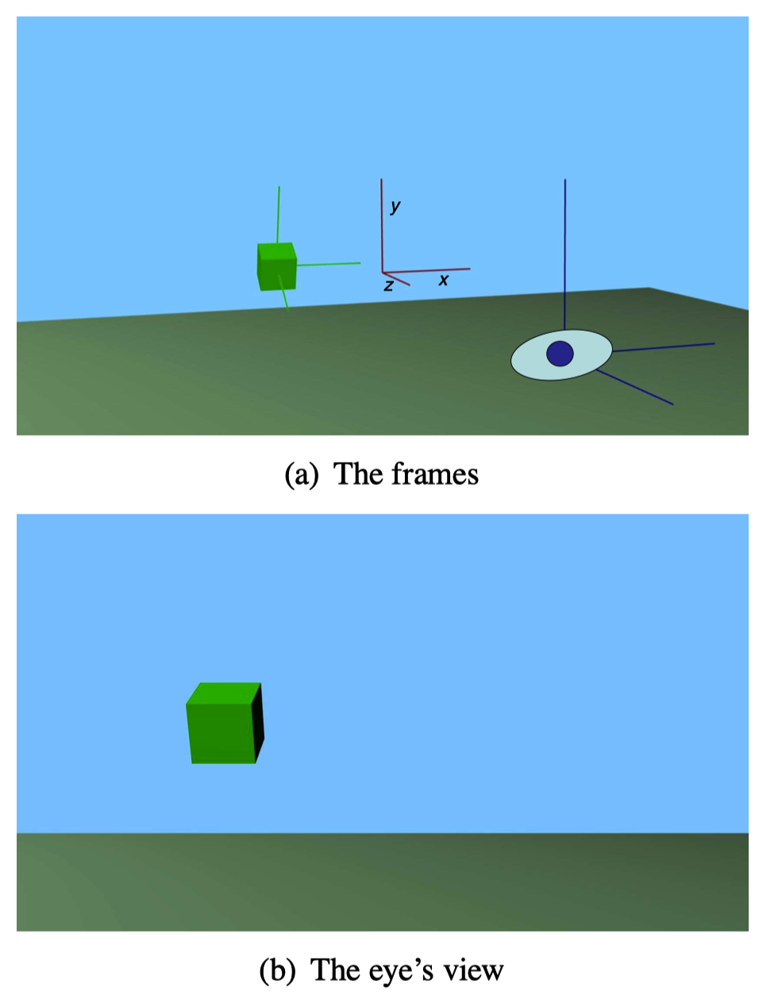
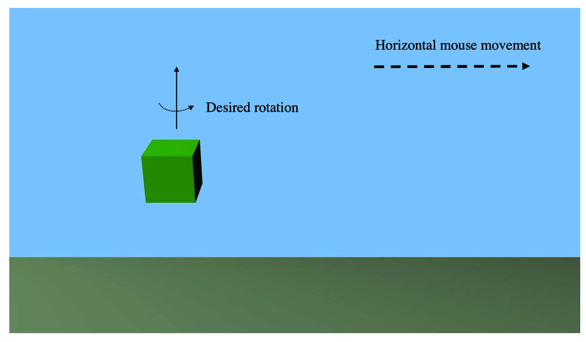
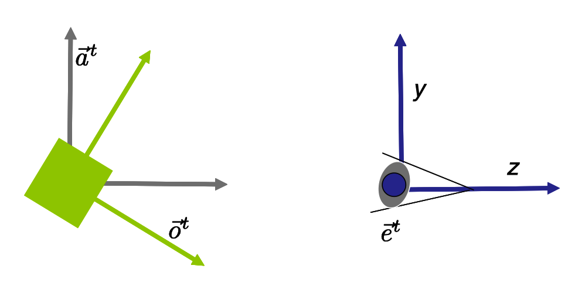
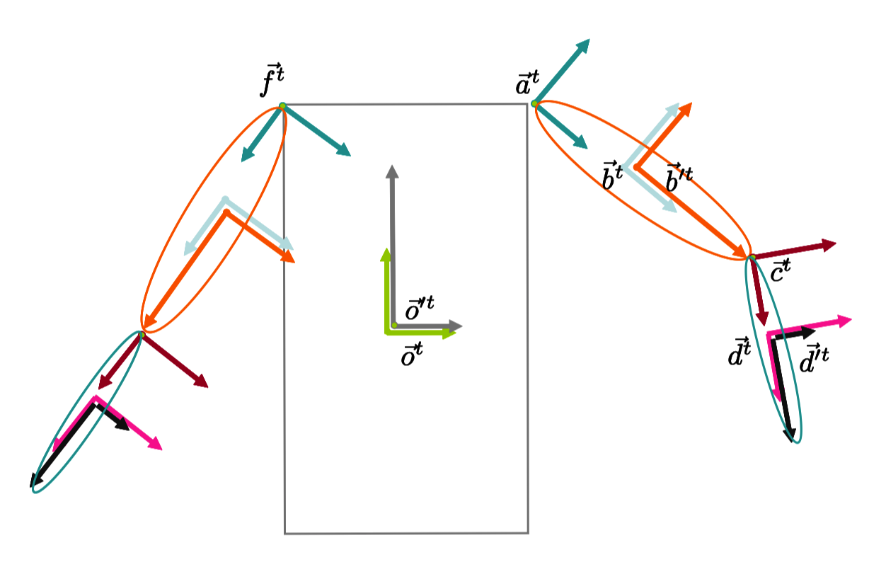
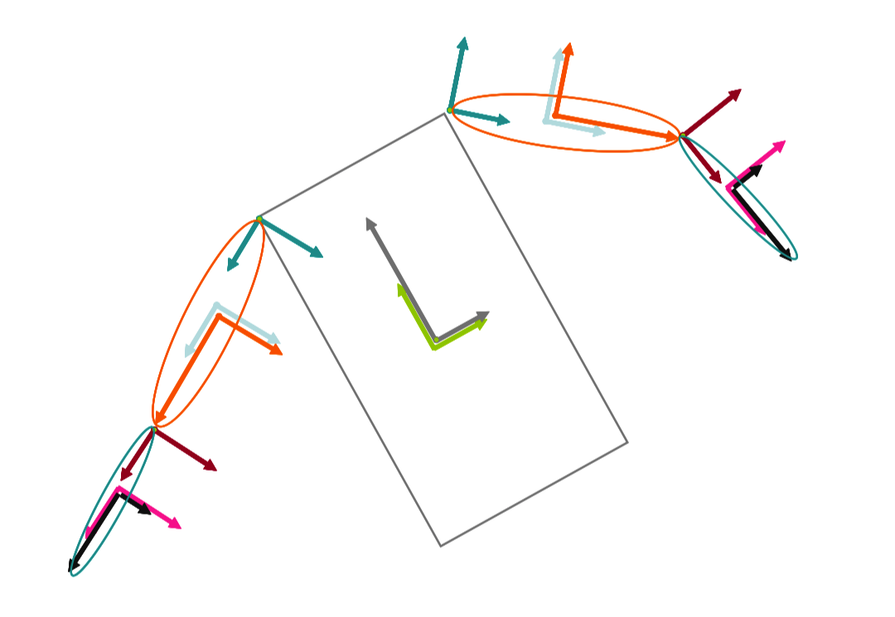
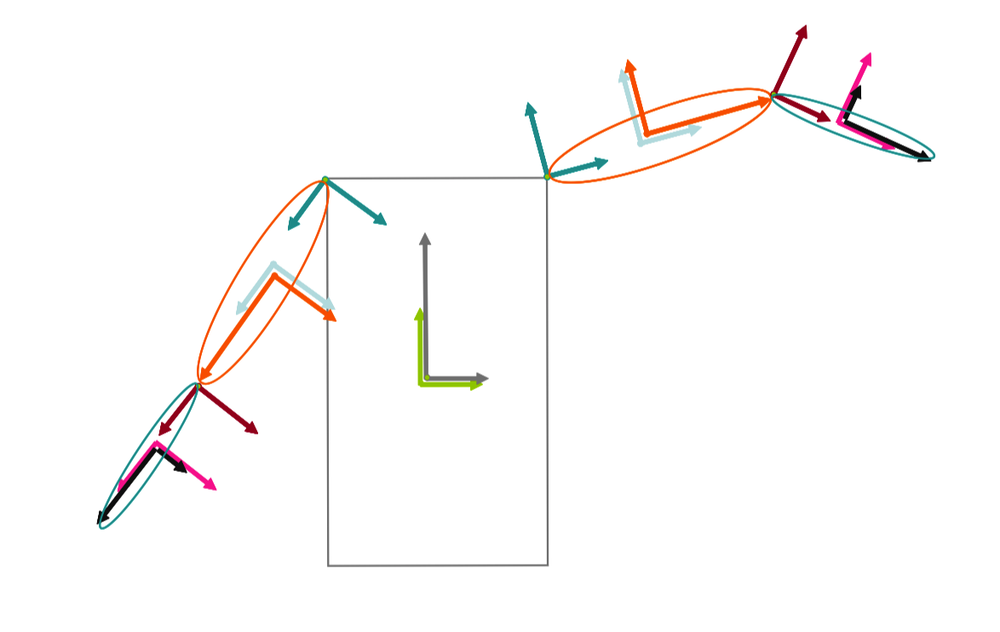
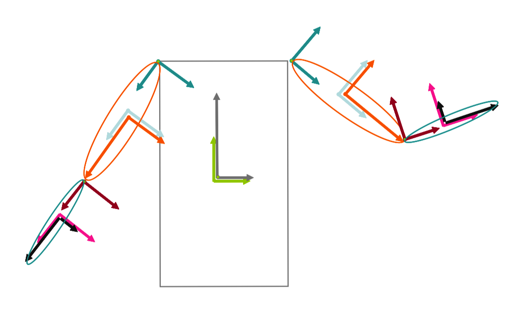

# Note
这是对**Foundation of 3D Computer Graphics**第5章的翻译，本章讲解了图形中坐标系的应用，涵盖了使用变换矩阵操纵物体和变化视角的基本技术。本书内容仍在不断的学习中，因此本文内容会不断的改进。若有任何建议，请不吝赐教<ninetymiles@icloud.com>。 

> 注：文章中相关内容归原作者所有，翻译内容仅供学习参考。
> 另：Github项目[CGLearning](https://github.com/nintymiles/CGLearning)中拥有相关翻译的完整资料、内容整理、课程项目实现。

# 图形中帧（坐标系）的应用（Frames in Graphics）
目前为止，已经讲解了点和矩阵变换的基础，我们将能够在计算机图形中描述它们通常如何被使用。随后我们会讨论多种建模运用（modeling manipulation）和成像操作（imaging operation）。

## 5.1 世界、物体和眼睛帧（World, Object and Eye Frames）
当描述一个场景的几何形状时，我们会开始于一个被称为世界帧（world frame）的右手性的正交标准帧（right handed orthonormal frame), $\vec{w}^t$。世界帧（world frame）绝对不会被我们改动。然后其它帧能被关联于这个世界帧（world frame）所描述。如果我们借助关联于世界帧（world frame）的坐标表达某个点的地址，那么这些坐标将被称作世界坐标（world coordinates）。

假设我们希望建模一个正在场景中运动的汽车。我们会想借助“特别”的顶点坐标来建模物体的几何形状，这样的顶点不需要我们时刻意识到场景中物体坐标的全局替换。同样地，我们会想在场景中来回移动汽车而不用改变这些坐标。这种行为可以借助物体帧（object frame）完成。

针对场景中的每个物体，我们为其关联一个右手性的正交标准物体帧（right handed orthonormal object frame） $\vec{o}^t$。现在我们可以借助关联于物体坐标系（object‘s coordinate system）的坐标表示物体各个部分的地址。这些坐标被称为物体坐标（object coordinates）并且会被存储在计算机程序中。要移动整个物体，我们只要更新$\vec{o}^t$即可，不需要更改物体上对应点的任何物体坐标（object coordinates）。

物体坐标系（object‘s coordinate system）和世界帧（world frame）之间的关系通过并行的（affine）$4 \times 4$矩阵O表达。也即是

$$\Large{ \vec{o}^t = \vec{w}^tO }$$

在我们的计算机程序中，我们会存储矩阵O，借助上面的公式，这个矩阵可被理解为将世界帧（world frame）关联到object‘s coordinate system（物体坐标系）。要移动$\vec{o}^t$帧，我们改变矩阵O。

在真实世界中，当我们想要生成一张3D环境的2D图像，我们会在场景中某处放置一台相机。图片中每个对象的位置基于到相机的3D关系被确定，也就是说，其坐标关联于一个恰当的坐标系（basis）。在计算机图形中我们借助一个右手性的正交标准帧(right handed orthonormal frame）$\vec{e}^t$，被称为眼睛帧（eye frame）。我们将眼睛解读为正看向这个帧的负z轴同时拍摄相片（参考图示$\text{Figure 5.1}$）。眼睛帧（eye frame）通过某种（坚固形体-rigid body）$4 \times 4$矩阵E和世界帧（world frame）关联：

$$\Large{ \vec{\mathbf{e}}^t = \vec{\mathbf{w}}^tE }$$

在计算机程序中，我们会明确地存储矩阵E。

给定一个点

$$\Large{ \tilde{p} = \vec{O}^t\mathbf{c} = \vec{w}^tO\mathbf{c} =  \vec{w}^tE^{-1}O\mathbf{c} }$$

我们将$\mathbf{c}$称为物体坐标（object coordinates），将$O\mathbf{c}$称为世界坐标（world coordinates），将$E^{-1}O\mathbf{c}$称为眼睛坐标（eye coordinates）。我们借用下标“$_o$”用于物体坐标（object coordinates），“$_w$”下标用于世界坐标（world coordinates），“$_e$”下标用于眼睛坐标（eye coordinates）。如此我们可以表达下面关系

$$ \Large{ \begin{bmatrix} x_e \\ y_e \\ z_e \\ 1 \end{bmatrix}
= E^{-1}O
\begin{bmatrix} x_o \\ y_o \\ z_o \\ 1 \end{bmatrix} } $$

最终，就是这些眼睛坐标（eye coordinates）指定了其中每个顶点（vertex）在被渲染图像中所出现的位置。因此，正如在第6章中所描述的，我们的渲染处理将需要计算每个顶点的眼睛坐标（eye coordinates）。


**Figure 5.1:** 世界帧（world frame）用红色表示，物体帧（objects frame）用绿色表示，而眼睛帧（eye frame）用蓝色表示。眼睛正看向眼睛帧的朝向物体方向的负z轴。

## 5.2 任意移动相关事物（Moving Things Around）
在一个交互式的3D程序中，我们经常想要借助某种坚固形体变换（rigid body transformation）在空中来回移动物体和眼睛（视野方位）。现在我们讨论这种方式如何被实现。

### 5.2.1 移动一个物体（Moving an Object）
我们通过恰当更新其帧（frame）的方式移动一个物体，这可以通过更新其矩阵O的方式被表示。

让我们讲，我们希望关联于某种帧（frame）$\vec{\mathbf{a}}^t = \vec{\mathbf{w}}^tA$对一个物体帧（object frame）$\vec{\mathbf{o}}^t$应用变换M，就如在方程（4.1）中所示，我们有如下推导

$$ \Large{
\quad\;\; \vec{\mathbf{o}}^t \qquad\qquad\qquad\qquad\;\;\;\;\; (5.1) \\
= \vec{\mathbf{w}}^tO \qquad\qquad\qquad\qquad(5.2) \\
= \vec{\mathbf{a}}^tA^{-1}O \qquad\qquad\qquad (5.3) \\
\Rightarrow \vec{\mathbf{a}}^tMA^{-1}O \qquad\qquad (5.4) \\
= \vec{\mathbf{w}}^tAMA^{-1}O \qquad\quad (5.5) 
}$$

所以在代码中我们将变换实现为$O \leftarrow AMA^{-1}O$。

什么是$\vec{a}^t$的自然选择？最明显的选择会是关联于$\vec{\mathbf{o}}^t$自身应用变换到$\vec{\mathbf{o}}^t$上。不幸的是，这意味着被使用的轴会是相对于物体本身的那些轴。“向右”会在物体的右侧方向，这不会在被观察的图像中对应任何实际的方向。我们可能尝试通过关联于$\vec{\mathbf{e}}^t $变换$\vec{\mathbf{o}}^t$。这会修复轴相关问题但是却生成了另一个问题。当我们旋转物体，它会围绕眼睛帧（eye frame）的原点做环绕运动。但是我们通常发现围绕物体自己的中心旋转才更自然，这个中心我们认为是$\vec{\mathbf{o}}^t$的原点。参考图示$\text{Figure 5.2}$。

要修复这两种问题，我们可以生成一个新的帧（frame），其拥有物体（object）帧的原点，还有眼睛（eye）帧的轴。要获得这个帧，让我们将我们已有的矩阵分解如下
$$\Large{
O = (O)_T(O)_R \\
E = (E)_T(E)_R
}$$

这里$(A)_T$代表矩阵A的平移因子，$(A)_R$代表矩阵A的旋转因子，就如在方程（3.3）中一样。我们随后可以看到想要的辅助帧（auxiliary frame）应该为如下形式
$$\Large{
 \vec{\mathbf{a}}^t = \vec{\mathbf{w}}^t(O)_T(E)_R   \qquad (5.6)
}$$

这个帧（frame）通过始于世界坐标系（world coordinate system），然后平移其到物体帧（object‘s frame）的原点（从左到右读，也就是说，依次经历局部变换的解读），再然后围绕这个点旋转从而达到与眼睛帧（eye）的轴方向对齐。（参考图示$\text{Figure 5.3}$）。

因此，对于这种物体运动（object motion），方程式（5.1）中矩阵A应该为$A=(O)_T(E)_R$。

有一种完成相同效果的替代计算。举个例子，假设，我们希望借助一个旋转轴$\vec{k}$围绕其自身的中心旋转一个物体，这个旋转轴具有关联于$\vec{\mathbf{e}}^t$的坐标$\mathbf{k}$。（在上面计算中我们其实用$\mathbf{k}$获得了一个矩阵M，然后和一个合适的矩阵A一起，我们更新物体矩阵$O \leftarrow AMA^{-1}O$。）我们可以首先计算$\mathbf{k'}$，$\mathbf{k}$的关联于$\vec{\mathbf{o}}^t$的坐标。然后将$\mathbf{k'}$代入方程式（2.5）中，我们可以得到一个矩阵M'，这个矩阵直接表达了关联于$\vec{\mathbf{o}}^t$的我们所要求的旋转。在这种情形中，我们可以更新物体矩阵（object's matrix）为：$$\Large{ O \leftarrow OM' }$$



**Figure 5.2:** 当我们移动鼠标到右侧，我们想让物体围绕其中心和沿着眼睛的y-轴方向旋转。


**Figure 5.3:** 辅助帧（auxiliary frame）$\vec{\mathbf{a}}^t$ 拥有$\vec{\mathbf{o}}^t$的原点（origin）和$\vec{\mathbf{e}}^t$的轴方向（axes）。 x轴指向页面中，已经被抑制（没有绘制）。

### 5.2.2 移动眼睛（视角）（Moving the Eye）
另一种我们希望进行的操作是移动眼睛到不同的视角。这会涉及改动$\vec{\mathbf{e}}^t$,在程序中具体通过更新矩阵E来达到目的。再一次，我们可以挑选一个合适的坐标系，关联于这个坐标系我们执行$\vec{\mathbf{e}}^t$的更新，就如之前我们在物体上所做的操作。

一种选择是使用和上面相同的辅助坐标系。在这种情形中，眼睛会围着物体的中心环绕运动。

另一种有效的选择是关联于眼睛自身的帧（frame）变换$\vec{\mathbf{e}}^t$。这会建模自我运动（ego-motion），就如转动你的头部。这通常被用于控制第一人称（first-person）运动。在这种情形中矩阵E会被更新为$E \leftarrow EM$

### 5.2.3 Lookat（盯着看）
> 本节有一些错误，已经根据本书的errata改正。

有时，特别是针对静态图像(static images)时，直接描绘出眼睛帧$\vec{\mathbf{e}}^t = \vec{\mathbf{w}}^tE$会很便利，通过指定眼睛的位置$\tilde{p}$,和一个眼睛正死盯着的点$\tilde{q}$，还有一个“上方矢量(up vector)"$\vec{u}$用于描述眼睛上方的方向。这些点和矢量通过变量p,q和u被给出，它们的坐标关联于$\vec{\mathbf{w}}^t$。假定这种输入，进行下面的计算

$$\large{
z = normalize(p-q) \\
x = normalize(u \times z) \\
y = normalize(z \times x)
}$$

$$\large{ normalize(c) = \frac{c}{\sqrt{c_1^2+c_2^2+c_3^2}} }$$

然后矩阵E可以被定义为：
$$\large{ \begin{bmatrix}
x_1 & y_1 & z_1 & p_1 \\
x_2 & y_2 & z_2 & p_2 \\
x_3 & y_3 & z_3 & p_3 \\
0 & 0 & 0 & 1
\end{bmatrix} }$$

> 注：此处的眼睛矩阵E并不是通常在CG中的View矩阵，View矩阵一般为$E^{-1}$。

## 5.3 伸缩变换（Scales）
目前为止，我们已经将我们的世界认为是由运动的物体组成，每个物体都有一个由其自身的坚固形体矩阵所表达的正交标准帧（orthonormal frame） $\vec{\mathbf{o}}^t = \vec{\mathbf{w}}^tO$。我们限制关注点到正交标准帧以便平移和旋转矩阵可以像我们预期它们的行为那样工作。

当然，要建模物体，我们当然想同时应用伸缩。例如，我们想要建模一个椭球体为一个被挤压的球体。一种处理方式是让这个物体同时拥有一个伸缩矩阵（scaled matrix）$O'$。然后被伸缩的物体帧（非正交标准化的）被确定为$\vec{\mathbf{o}}'^t = \vec{\mathbf{o}}^tO'$。这种方式中我们仍然像上面一样通过更新矩阵O移动物体。要绘制这个物体，我们使用矩阵$E^{-1}OO'$将“伸缩的物体坐标”变换为眼睛坐标。

## 5.4 层级体系（Hierarchy）
经常将一个物体（object）当作由某些固定的或者可活动的多个子-物体（sub-objects）组装而成，这种观点其实很有用。每个子-物体可以拥有自己的正交标准帧（orthonormal frame），比如说$\vec{\mathbf{a}}^t$。（同时还有伸缩帧-scaled frame）。然后我们可以用其自己的坐标系存储这个子-物体的顶点（vertex）。给定这个层次体系，我们想拥有这种能力，即可以轻松以整体建模物体的运动，同时也可以独立建模子-物体的运动。

例如，当建模带有移动肢体的机器人时，我们可以借助一个物体帧（object）和伸缩物体帧（scaled object frame）表达躯干，一个子-物体帧（sub-object frame）表达一个可以转动的肩膀，还有一个子-子-物体帧（sub-sub-object frame）表达上臂（其和肩膀一起运动）。（参考图示$\text{Figure 5.4}$）。


**Figure 5.4:** 在本例中，绿色的帧（frame）为物体帧（object frame） $\vec{\mathbf{o}}^t = \vec{\mathbf{w}}^tO$，灰色的帧$t'$为伸缩物体帧（scaled object frame）$\vec{\mathbf{o}}'^t = \vec{\mathbf{o}}^tO'$。一个单位立方体（unit cube）的坐标在$\vec{\mathbf{o}}'^t$中被绘制从而形成一个矩型（长方形）的躯干。矩阵O可以被改变用于移动整个机器人。青色的帧$\vec{\mathbf{a}}^t = \vec{\mathbf{o}}^tA$为右肩帧（right shoulder frame）。矩阵A中的旋转因子可以被改变用于旋转整个右臂。浅蓝色帧$\vec{\mathbf{b}}^t = \vec{\mathbf{a}}^tB$为右上臂帧（right upper arm frame）。红色帧$\vec{\mathbf{b}}'^t = \vec{\mathbf{b}}^tB'$为伸缩（scaled）右上臂帧。一个单位球体的坐标在$\vec{\mathbf{b}}'^t$中绘制形成了椭球体形状的右上臂。$\vec{\mathbf{c}}^t = \vec{\mathbf{b}}^tC$为右肘帧（right elbow frame）。矩阵C中的旋转因子可以被改变用于旋转右下臂（right lower-arm）。$\vec{\mathbf{d}}^t = \vec{\mathbf{c}}^tD$和$\vec{\mathbf{d}}'^t = \vec{\mathbf{d}}^tD'$分别为正交标准和伸缩的右下臂帧用于绘制下臂。帧$\vec{\mathbf{f}}^t = \vec{\mathbf{o}}^tF$为左肩帧（left shoulder frame）。

当我们通过更新矩阵O移动整个物体，我们想让所有的物体（组件）更加一致（参考图示$\text{Figure 5.5}$）。要获得这种行为，我们借助一个将其和物体帧（object’s frame）联系在一起的坚固形体矩阵表达了子物体帧（sub-object‘s frame）。因此，我们存储了一个坚固形体矩阵（rigid body matrix）A，我们将其解读为定义了这种关系：$\vec{\mathbf{a}}^t = \vec{\mathbf{o}}^tA$，同时还有一个伸缩矩阵$A'$，其定义了伸缩的子物体帧（sub-object frame）为$\vec{\mathbf{a}}’^t = \vec{\mathbf{a}}^tA'$。要重新定位在这个物体内的子-物体（sub-object），所有我们需要做的就是更新矩阵A。要绘制子-物体（sub-object），我们使用矩阵$E^{-1}OAA'$，其变换“伸缩的子-物体坐标”为眼睛坐标（eye coordinates）。很清晰地，这种思路可以被递归嵌套，同时我们可以表达一个子-子-物体（sub-sub-object）为$\vec{\mathbf{b}}^t = \vec{\mathbf{a}}^tB$，以及一个伸缩的子-子-物体为$\vec{\mathbf{b}}'^t = \vec{\mathbf{b}}^tB'$。

在我们的机器人例子中，我们使用了$\vec{\mathbf{a}}^t$为右肩的帧（frame），$\vec{\mathbf{b}}^t$为右上臂的帧，还有$\vec{\mathbf{c}}^t=\vec{\mathbf{b}}^t\mathbf{c}$为右肘帧。$\vec{\mathbf{d}}^t=\vec{\mathbf{c}}^tD$和$\vec{\mathbf{d}}^t=\vec{\mathbf{d}}^tD'$分别是右下臂的正交标准帧和伸缩帧。

要移动整个机器人，我们更新其O矩阵（参考图示$\text{Figure 5.5}$）。要在肩膀处弯曲右臂，我们更新其A矩阵（参考图示$\text{Figure 5.6}$）。要在肘部弯曲右臂，我们更新其C矩阵（参考图示$\text{Fiugre 5.7}$）。


**Figure 5.5:** 要移动整个机器人，我们更新O矩阵。


**Figure 5.6:** 要在肩部弯曲胳膊，我们更新A矩阵。


**Figure 5.7:** 要弯曲肘部，我们更新C矩阵。


经常，一个矩阵栈数据结构（matrix statck data structure）可以被用来跟踪表达当前被绘制子-物体（sub-object）的矩阵。在这种矩阵栈结构中，`push(M)`操作生成一个新的“最顶部”矩阵，它只是之前最顶部矩阵的一份拷贝（copy），随后其被用参数矩阵M右乘这个新顶部矩阵。`pop`操作移除栈的最顶层（topmost layer）。当在层次体系中“下降”到一个子-物体（sub-object），push操作被执行。当我们从
当前层次返回父级层次，矩阵被从栈中弹出。

例如，在伪码（pseudo-code）中，我们将上面的机器人绘制为。

```cpp
...

matrixStack.initialize(inv(E));

matrixStack.push(O);
matrixStack.push(O’); 
draw(matrixStack.top(), cube); \\躯干（body） 
matrixStack.pop(); \\O’

matrixStack.push(A);
matrixStack.push(B); 
matrixStack.push(B’); 
draw(matrixStack.top(),sphere); \\上臂（upper arm） 
matrixStack.pop(); \\B’

matrixStack.push(C); 
matrixStack.push(C’); 
draw(matrixStack.top(),sphere); \\下臂（lower arm） 
matrixStack.pop(); \\C’ 
matrixStack.pop(); \\C

matrixStack.pop(); \\B
matrixStack.pop(); \\A

\\当前顶部矩阵为inv(E)*O（current top matrix is inv(E) * O）

\\现在我们可以绘制另一个手臂 
matrixStack.push(F); 
...

```

这种层次体系关系（hierarchical relations）可以被硬编码到你的程序中，就如在上面的伪码中，或者被表示为某种被称为场景图（scene graph）的链接树（linked tree）数据结构。

