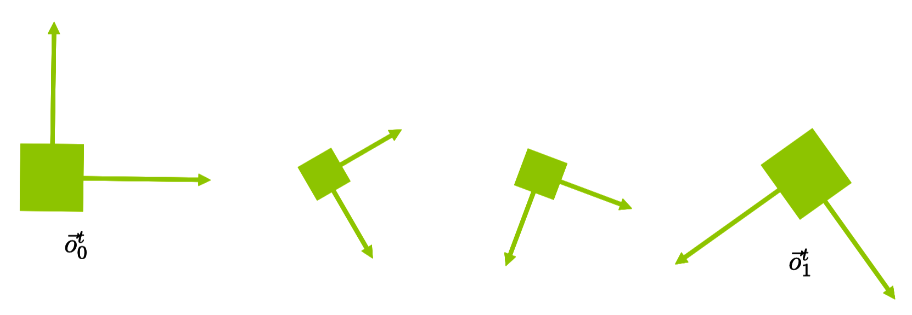
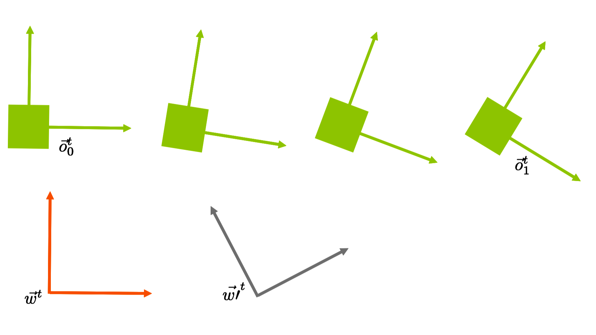
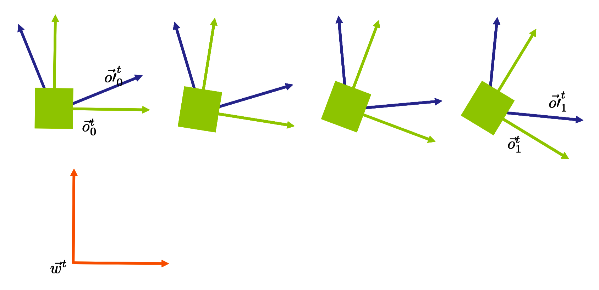
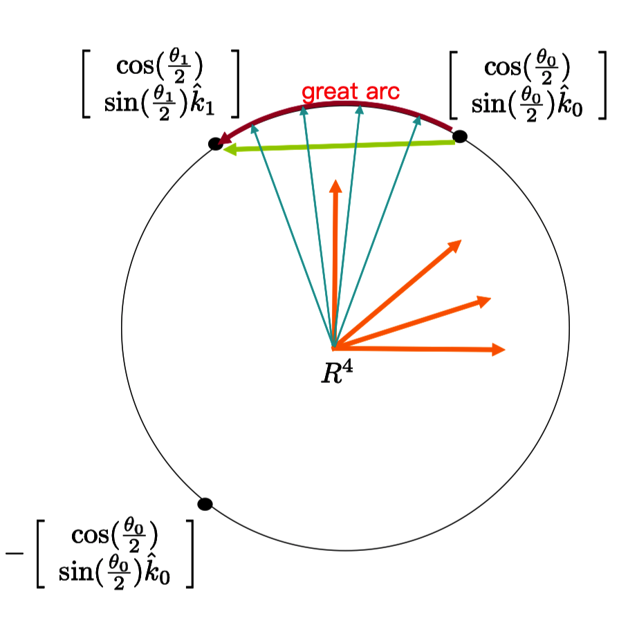
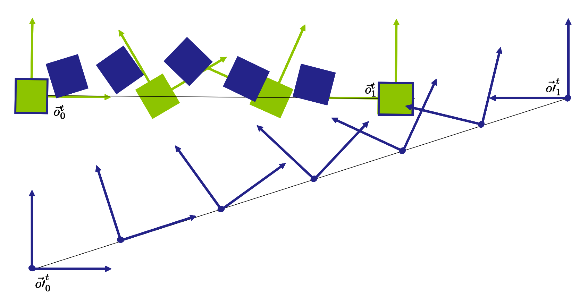

# Note
这是对**MIT Foundation of 3D Computer Graphics**第7章的翻译，本章讲解了方位插值、四元数表达(quaternion representation)、slerp（球体线性插值）/lerp操作等基础知识，重点是如何使用四元数替换旋转矩阵。本书内容仍在不断的学习中，因此本文内容会不断的改进。若有任何建议，请不吝赐教<ninetymiles@icloud.com>。 

> 注：文章中相关内容归原作者所有，翻译内容仅供学习参考。
> 另：Github项目[CGLearning](https://github.com/nintymiles/CGLearning)中拥有相关翻译的完整资料、内容整理、课程项目实现。

# 四元数（Quaternions）(偏技术性一点)
本章中，我们会探讨将旋转的四元数表达作为对旋转矩阵的代替
$$
R = \begin{bmatrix} r & 0 \\ 0 & 1\end{bmatrix}
$$
针对四元数，我们的主要用处是协助我们以自然的方式在方位间插值。对于驱动从空中飞过的物体十分有用。如果你不打算针对实际应用插值出旋转，那么这种表达不是必须的。

## 7.1 插值（Interpolation）
让我们假设我们拥有一个想要的物体帧（object frame），在时刻“time=0”：$\vec{\mathbf{o}}_0^t=\vec{\mathbf{w}}^tR_0$，同时还有一个想要的物体帧，在时刻“time=1”：$\vec{\mathbf{o}}_1^t=\vec{\mathbf{w}}^tR_1$，此处$R_0$和$R_1$都是$4 \times 4$的旋转矩阵。假设针对$\alpha \in [0..1]$，我们希望找到一系列帧$\vec{\mathbf{o}}_{\alpha}^t$，其自然地从$\vec{\mathbf{o}}_{0}^t$旋转到$\vec{\mathbf{o}}_{1}^t$。

一种思路是定义$R_{\alpha}=(1-\alpha)R_0 + (\alpha)R_1$，然后设置$\vec{\mathbf{o}}_{\alpha}^t=\vec{\mathbf{w}}^tR_{\alpha}$。问题是，根据矩阵线性插值，每个矢量只是沿着一条直线移动。参考图示$\text{Figure 7.1}$。这种情形中，中间的$R_{\alpha}$值甚至都不是旋转矩阵；这很明显是不可接受的。更进一步，（特别在3D空间中），非常不容易以某种方式找出一种真正的旋转矩阵近似这种被插值的矩阵，从而去除这种挤压。


**Figure 7.1:** $R_i$矩阵的线性插值移动矢量沿着直线运动而且没有建模旋转。

另一种思路，不值得过于深入探究，是以某种方式将$R_0$和$R_1$都分解为3个所谓的欧拉角（Euler angles，参考小节2.5）。这3个标量值每个都可以借助$\alpha$被线性插值。被插值的欧拉角随后被用于生成中间的旋转。可以证实当插值欧拉角时，被插值的旋转序列不管从物理方式还是几何方式都不是特别自然。例如，对于基的变化不是不变性（invariant）的（后面会定义）。

我们真正想做的是首先生成一个过渡矩阵$R_1R_0$。这种矩阵，可以为任何旋转矩阵，能够当作围绕某个轴$[k_x,k_y,k_z]^t$旋转某个角度$\theta$，就如方程式(2.5)所示。让我们想象我们已经拥有一种操作$(R_1R_0)^{\alpha}$，而这种操作给出我们一个围绕$[k_x,k_y,k_z]^t$进行$\alpha.\theta$角度的旋转。那么定义下面的操作就变得自然


$$
R_{\alpha} := (R_1R_0^{-1})^{\alpha}R_0 \tag{7.1}
$$

同时设置

$$\vec{\mathbf{o}}_{\alpha}^t = \vec{\mathbf{w}}^tR_{\alpha}$$

如此，我们会得到一系列帧，当我们增加$\alpha$值，这些帧就会围绕一个单轴旋转的程度越来越大，直到其到达想要的静止姿态。很清晰地，在开始处我们有$\vec{\mathbf{w}}^t(R_1R_0^{-1})^{0}R_0 = \vec{\mathbf{w}}^t R_0 =\vec{\mathbf{o}}_0^t$，而在结尾处我们有$\vec{\mathbf{w}}^t(R_1R_0^{-1})^{1}R_0 = \vec{\mathbf{w}}^t R_1 =\vec{\mathbf{o}}_1^t$。

这其中困难的部分为分解一个过渡矩阵，比如$R_1R_0$，为轴/角度形式。四元数表达背后的思路就是时时刻刻跟踪轴和角度以致于不再需要这种分解。在另一方面，借助四元数表达，我们还可以执行所有必要的可以用旋转矩阵来完成的操作（manipulation）。


### 7.1.1 循环（Cycles）
此处我们需要澄清一个细节。事实上，矩阵$R_1R_0^{-1}$可以被当作某一个$\theta+n2\pi$角度的旋转，$n$为任意整数。当观察这种旋转充当施加在一个矢量上的线性变换的效果时，这些额外的$2\pi$因子是不相关的。但是当定义一个幂操作符，这个操作符给了我们“一系列围绕一个单一轴旋转程度越来越大的帧，直到其到达要求的终止姿态”，我们就需要确定怎样选择一个所给定矩阵$R_1R_0^{-1}$的$n$值。对于插值，自然的选择为选择$n$使得$|\theta+n2\pi|$是最小的。实际上这意味着，对于$n$的选择，我们让$\theta + n2\pi \in [-\pi..\pi]$。另外，这种选择是没有歧义的（除了在$\theta = \pi + n2\pi $的情形，这种情形中我们会需要在$-\pi$和$\pi$之间任意选择一种）。确实，这种$n$值的选择在后面的小节7.4中会被提出。

### 7.1.2 不变性（Invariance）
相关于方程式（7.1）的围绕单轴，常量角速率方式的运动，存在很多自然的事物。举一个例子，一个飞过空中的物体在没有外力施加于其上时会让其质心沿着直线运动，同时其方位围绕着一个固定轴旋转。另外，这种方位插值满足左侧和右侧不变性，这一点我们现在就来解释。

假设我们有一个可替换的世界帧$\vec{\mathbf{w}}'^t$使得$\vec{\mathbf{w}}^t=\vec{\mathbf{w}}'^tR_l$，其中$R_l$为某种固定的“左侧”旋转矩阵。借助这种帧，我们可以再表达我们最初的插值问题为在$\vec{\mathbf{o}}_0^t=\vec{\mathbf{w}}'^tR_lR_0$和$\vec{\mathbf{o}}_1^t=\vec{\mathbf{w}}'^tR_lR_1$之间进行插值的一种行为。如果这种再表达不改变插值结果，我们说插值满足“左侧”不变性：如果最初的插值给了我们$\vec{\mathbf{o}}^t_{\alpha}=\vec{\mathbf{w}}^tR_{\alpha}$，对于某种$R_{\alpha}$，那么再表达的插值给出了我们$\vec{\mathbf{w}}'^tR_lR_{\alpha}$，这就导致了完全相同的$\vec{\mathbf{o}}_{\alpha}^t$。（参考图示$\text{Figure 7.2}$。）换句话说，只要一个插值方案仅仅依赖帧$\vec{\mathbf{o}}^t_0$和$\vec{\mathbf{o}}^t_1$的几何特征，而不是世界帧（world frame）和最终的$R_0$和$R_1$的选择，就可以说它是左侧不变的。左侧不变性是一种想要的非常自然的属性；存在非常少的情形，其中对于插值依赖世界帧的选择会有意义。


**Figure 7.2:** 当我们将$\vec{\mathbf{w}}^t$替换为$\vec{\mathbf{w}}'^t$，插值结果不变，这种插值就满足左侧不变性。（这里我们只是处理旋转的情形，这里我们添加的平移效果只是为了视觉上的清晰。）

我们可以看到使用方程(7.1)的插值满足左侧不变性如后面所述。“过渡”仿射变换映射一个帧$\vec{\mathbf{o}}^t_0$为$\vec{\mathbf{o}}^t_1$，总是唯一的。在我们的情形中，因为我们的帧都是右手性的，正交标准性的，并且共享原点，这种变换一定是一种旋转。同时，我们刚刚定义的旋转的幂操作符（也就是说，保持轴不变但伸缩角度）是一种内生的几何操作，能够不参考任何坐标被描述。因而这种插值方案不依赖于世界帧的选择，那么是左侧不变的。

右侧不变性，在另一方面，意味着一个物体的插值确实改变了，即便是我们改变了被使用的物体帧。实际上，假如我们固定一个“右侧”旋转矩阵$R_r$，同时使用其定义新的物体帧，在时刻“time=0”和“time=1”分别为：$\vec{\mathbf{o}}'^t_0=\vec{\mathbf{o}}^t_0R_r$和$\vec{\mathbf{o}}'^t_1=\vec{\mathbf{o}}^t_1R_r$。因为我们不想让物体的姿态本身产生改变，我们用$\mathbf{c}'=R^{-1}_r\mathbf{c}$恰当地重新赋值其所有顶点的物体-坐标（object-coordinates）。我们说我们的插值满足右侧不变性，只要这种物体基（object basis）的改变不影响旋转物体本身的插值。换句话说，如果最初的插值给出了我们$\vec{\mathbf{o}}_{\alpha}^t=\vec{\mathbf{w}}^tR_{\alpha}$，对于某个$R_{\alpha}$，那么新的插值给了我们$\vec{\mathbf{w}}^tR_{\alpha}R_r$。因而物体的插值（借助新物体坐标$\mathbf{c}'$）是不变的。（参考图示$\text{Figure 7.3}$）。右侧不变性是一种合理的自然属性。但是我们下面会看到，当我们同时和旋转一起包含平移时，我们可能想要插值依赖物体帧原点的旋转。


**Figure 7.3:** 这里我们改变为新的物体帧（蓝色），但是借助新的物体坐标在时刻time=0和time=1绘制相同的正方形。如果插值满足右侧不变性，我们会得到正方形的相同动画。

我们能够直接看出使用方程（7.1）的插值满足右侧不变性如下
$$
((R_1R_r)(R_r^{-1}R_0^{-1}))^{\alpha}R_0R_r = (R_1R_0^{-1})^{\alpha}R_0R_r=R^{\alpha}R_r
$$

## 7.2 表达（The Representation）
一个四元数（quaternion）只是实数的四元组，我们会很快在其上定义合适的操作。

我们把一个四元数写作
$$ \large{
\begin{bmatrix} w \\ \hat{c} \end{bmatrix}
}$$
此处$w$是一个标量而$\hat{c}$是一个3部件坐标矢量（coordinate 3-vector）。我们已经把“帽子”标记添加到$\hat{c}$以和一个四部件坐标矢量进行区分。

要表达围绕一个单位长度（unit length）轴$\vec{k}$进行$\theta$角度的旋转，我们使用如下四元数
$$ \large{
\begin{bmatrix} cos(\frac{\theta}{2}) \\ sin(\frac{\theta}{2})\hat{k} \end{bmatrix}
}$$

除以2的除法看起来有一点儿让人吃惊，但是正是它让四元数操作可以正确工作，后面会讲述。**注意围绕$-\vec{k}$轴$-\theta$角度的旋转为我们给出了相同的四元数。**一个围绕$\vec{k}$轴$\theta+4\pi$角度的旋转同样也给出了相同的四元数。目前为止很好。奇怪的是，一个围绕$\vec{k}$轴$\theta+2\pi$角度的旋转给出了负的四元数，而其实际上是完全相同的四元数

$$ \large{
\begin{bmatrix} -cos(\frac{\theta}{2}) \\ -sin(\frac{\theta}{2})\hat{k} \end{bmatrix}
}$$
在我们随后定义幂操作符时，这种怪异将会让事情更复杂一点。

四元数
$$ \large{
\begin{bmatrix} 1 \\ \hat{0} \end{bmatrix},\begin{bmatrix} -1 \\ \hat{0} \end{bmatrix}
}$$
表达了同一旋转矩阵（identity rotation matrix）。

四元数
$$ \large{
\begin{bmatrix} 0 \\ \hat{k} \end{bmatrix},\begin{bmatrix} 0 \\ -\hat{k} \end{bmatrix}
}$$
表达了围绕轴$\vec{k}$的180度的旋转。

任何这种形式的四元数
$$ \large{
\begin{bmatrix} cos(\frac{\theta}{2}) \\ sin(\frac{\theta}{2})\hat{k} \end{bmatrix}
}$$
都拥有值为1（四个条目的平方和的平方根）的态(norm)。反过来说，任何这样的单位态的四元数（**和其负值一起**）都可以被解读为一个唯一的旋转矩阵。

## 7.3 各种操作（Operations）
一个四元数（不必然是单位态(unit norm)）乘以一个标量的乘法被定义如下
$$ \large{
\alpha \begin{bmatrix} w \\ \hat{c} \end{bmatrix} = \begin{bmatrix} \alpha w \\ \alpha \hat{c} \end{bmatrix}
}$$

两个四元数（不必然是单位态）间的乘法借助下列有着奇怪外观的操作被定义 
$$ \large{
 \begin{bmatrix} w_1 \\ \hat{c}_1 \end{bmatrix} \begin{bmatrix} w_2 \\ \hat{c}_2 \end{bmatrix} = \begin{bmatrix} w_1 w_2 - \hat{c}_1.\hat{c}_2\\ w_1\hat{c}_2 + w_2\hat{c}_1 + \hat{c}_1 \times \hat{c}_2 \end{bmatrix} \tag{7.2}
}$$
此处$.$和$\times$为3维坐标矢量上的点积和向量积。这种外观奇怪的乘法拥有下列有用的属性：如果$[w_i,\hat{c}_i]^t$代表旋转矩阵$R_i$，那么乘积$[w_1,\hat{c}_1]^t[w_2,\hat{c}_2]^t$就代表旋转矩阵$R_1R_2$。这个表达可以通过一系列不是特别直观的计算被验证。

一个单位态四元数的乘法反转（倒数）为
$$ \large{
\begin{bmatrix} cos(\frac{\theta}{2}) \\ sin(\frac{\theta}{2})\hat{k} \end{bmatrix}^{-1} = \begin{bmatrix} cos(\frac{\theta}{2}) \\ -sin(\frac{\theta}{2})\hat{k} \end{bmatrix}
}$$
这个四元数只是围绕相同轴旋转了$-\theta$角度。（倒数也可以针对非单位态四元数定义，但是我们这里不需要）。

更重要的是，我们能够借助四元数操作针对一个坐标实例应用旋转变换。假设我们拥有4部件坐标矢量$\mathbf{c} = [\hat{c},1]^t$，同时我们使用一个$4\times4$旋转矩阵$R$左乘这个坐标矢量来获得
$$\mathbf{c}' = R \mathbf{c}$$
这里最终的4部件坐标矢量为这种形式$\mathbf{c}' = [\hat{c}',1]^t$。要使用四元数完成这个操作，我们让$R$借助单位态四元数被表达 
$$ \large{
\begin{bmatrix} cos(\frac{\theta}{2}) \\ sin(\frac{\theta}{2})\hat{k} \end{bmatrix}
}$$

让我们拿3部件坐标矢量$\hat{c}$并且使用它生成一个非单位态四元数
$$ \large{
\begin{bmatrix} 0 \\ \hat{c} \end{bmatrix}
}$$
接着我们执行下面的三重四元数乘法：
$$ \large{
\begin{bmatrix} cos(\frac{\theta}{2}) \\ sin(\frac{\theta}{2})\hat{k} \end{bmatrix} 
\begin{bmatrix} 0 \\ \hat{c} \end{bmatrix}
\begin{bmatrix} cos(\frac{\theta}{2}) \\ sin(\frac{\theta}{2})\hat{k} \end{bmatrix}^{-1} \tag{7.3}
}$$
这个公式可以通过一系列不是特别直观的计算验证出这种三重四元数的乘积事实上为下面形式的四元数
$$ \large{
\begin{bmatrix} 0 \\ \hat{c}' \end{bmatrix}
}$$
此处$\hat{c}'$为要求结果的3部件坐标矢量表达。

因此，四元数一方面明确地封装了旋转轴和角度，而另一方面又具备允许我们像旋转矩阵一样操纵他们的各种操作。

## 7.4 幂（Power）
给出一个表达一个旋转的单位态四元数，我们能够将其提升为幂$\alpha$操作如后所述。我们首先通过标准化四元数的后3个条目提取出单位轴$\vec{k}$。接着，我们使用$atan2$函数提取出$\theta$。这样就给出了我们一个唯一的值$\theta/2 \in [-\pi..\pi]$，从而确定了一个唯一的角度$\theta \in [-2\pi..2\pi]$。那么我们定义如下
$$ \large{
\begin{bmatrix} cos(\frac{\theta}{2}) \\ sin(\frac{\theta}{2})\hat{k} \end{bmatrix}^{\alpha} = \begin{bmatrix} cos(\frac{\alpha\theta}{2}) \\ sin(\frac{\alpha\theta}{2})\hat{k} \end{bmatrix}
}$$
当$\alpha$从0变换到1，我们获得一系列角度在0和$\theta$之间变化的旋转。

如果$\cos(\frac{\theta}{2}) > 0$，我们得到$\theta/2 \in [-\pi/2..\pi/2]$，从而$\theta \in [-\pi..\pi]$。在这种情形中，当我们使用$\alpha \in [0..1]$在两个方位间插值，我们会在方位间的“短路径”上插值$\theta$。反过来说，如果$\cos(\frac{\theta}{2}) < 0$，那么$\theta \in [\pi..2\pi]$，我们会在“长路径”上（大于180度）插值。通常来讲，在两个方位间插值短路径更加自然，所有当给出第一个坐标为负值的四元数时，我们在应用幂操作时总是负化四元数。

### 7.4.1 球体线性插值和简单线性插值（Slerp and Lerp）
把所有这些汇总，如果存在两个帧通过旋转矩阵$R_0$和$R_1$分别都关联于世界帧,而我们想在这两个帧之间插值，并且假如这两个矩阵对应于两个四元数
$$ \large{
\begin{bmatrix} cos(\frac{\theta_0}{2}) \\ sin(\frac{\theta_0}{2})\hat{k}_0 \end{bmatrix} , \begin{bmatrix} cos(\frac{\theta_1}{2}) \\ sin(\frac{\theta_1}{2})\hat{k}_1 \end{bmatrix}
}$$
那么我们只需要计算四元数：
$$ \large{
\left(\begin{bmatrix} cos(\frac{\theta_1}{2}) \\ sin(\frac{\theta_1}{2})\hat{k}_1 \end{bmatrix} \begin{bmatrix} cos(\frac{\theta_0}{2}) \\ sin(\frac{\theta_0}{2})\hat{k}_0 \end{bmatrix}^{-1}  \right)^{\alpha}
\begin{bmatrix} cos(\frac{\theta_0}{2}) \\ sin(\frac{\theta_0}{2})\hat{k}_0 \end{bmatrix} \tag{7.4}
}$$
这种插值操作经常被称作球体线性插值或者由于后面的原因直接称为"slerping"。单位态四元数只是平方和为1的实数的4元组，从几何角度，因此我们可以把这些四元数作为$R^4$空间中单位球体上的点。这可以被展示为（参看下面），如果你以两个单位态四元数开始并且借助方程式（7.4）插值，那么实际上在$R^4$空间中最终的路径确切对应于单位球体上连接这两个点的大弧（great arc）。甚而，插值以弧长和$\alpha$角度成比例的方式沿着这个路径前进。

在任何维度$n$，三角学参数可以用于证明，在任何两个单位矢量$\vec{v}_0$和$\vec{v}_1$之间的球体线性插值，可以被计算为
$$ \large{
\frac{sin((1-\alpha)\Omega)}{sin\Omega}\vec{v}_0 + \frac{sin(\alpha\Omega)}{sin\Omega}\vec{v}_1 \tag{7.5}
}$$
此处$\Omega$为$R_n$空间中矢量间的角度。从而，应用这个公式到$R_4$空间中的单位四元数，我们看到可以用等价的插值体替换方程式（7.4）。
$$ \large{
\frac{sin((1-\alpha)\Omega)}{sin\Omega}\begin{bmatrix} cos(\frac{\theta_0}{2}) \\ sin(\frac{\theta_0}{2})\hat{k}_0 \end{bmatrix}  + \frac{sin(\alpha\Omega)}{sin\Omega} \begin{bmatrix} cos(\frac{\theta_1}{2}) \\ sin(\frac{\theta_1}{2})\hat{k}_1 \end{bmatrix} \tag{7.6}
}$$
此处$\Omega$为$R_n$空间中初始和最终四元数之间的角度。下面我们会勾勒出需要证实方程式（7.4）和（7.6）等价性需要的步骤。注意对于方程式（7.4），为了选择小于180度的“最短路径”，只要两个四元数的4维点积为负，我们就必须负化两个四元数中其中（任意）一个。

从这种观点，我们明白使用$R_4$中简单线性插值，我们能够近似方程式（7.4），还有方程式（7.6）。也就是说，我们可以仅仅计算
$$ \large{
(1-\alpha)\begin{bmatrix} cos(\frac{\theta_0}{2}) \\ sin(\frac{\theta_0}{2})\hat{k}_0 \end{bmatrix}  + (\alpha)\begin{bmatrix} cos(\frac{\theta_1}{2}) \\ sin(\frac{\theta_1}{2})\hat{k}_1 \end{bmatrix} 
}$$
因为这种插值不再是一个单位态四元数，我们必须随后标准化计算的结果，但是这很容易做到。重要的是，这种插值处理，它被称为lerping，并且勾勒出了更复杂的slerp所经历的（通过一个单一的固定轴旋转）完全相同的四元数路径，虽然这种旋转角度不再随着$\alpha$角度均匀地行进。（参考图示$\text{Figure 7.4}$）。


**Figure 7.4:** 我们的旋转插值行为可以被解读为采用了一种常量速度的路径，这种路径沿着连接$R^4$中单位球体上两个四元数之间的大弧。这能够被单位球体内采用了常量速度线性路径（绿色）的行为所近似，伴随着标准化（青色）。标准化的线性插值遵循$R^4$中单位球体上相同的路径，但是不再具有在大弧上的常量速度特性。注意为了选择更短路径的旋转，只要负化两个四元数中的任何一个可以组成球体上更短的路径，我们就必须那么做。

lerp操作也是左侧和右侧都不变的。例如，左侧不变性可以证明如下
$$ \large{
(1-\alpha)\begin{bmatrix} w_l \\ \hat{c}_l \end{bmatrix}\begin{bmatrix} w_0 \\ \hat{c}_0 \end{bmatrix} + (\alpha)\begin{bmatrix} w_l \\ \hat{c}_l \end{bmatrix}\begin{bmatrix} w_1 \\ \hat{c}_1 \end{bmatrix} = \begin{bmatrix} w_l \\ \hat{c}_l \end{bmatrix}\left( (1-\alpha)\begin{bmatrix} w_0 \\ \hat{c}_0 \end{bmatrix} + (\alpha)\begin{bmatrix} w_1 \\ \hat{c}_1 \end{bmatrix} \right)
}$$
因为标量乘法跨四元数乘法可交换，并且四元数乘法在和之上分布。相似地，我们从这种形式能直接看到，方程式（7.6）也都是左侧和右侧不变的。仅有的较难的部分为执行计算以证明角度$\Omega$是左侧和右侧不变的。

Lerp可以比slerp更有效率地被实现。更重要地是，它非常轻松地泛化了在$n$个不同旋转之间混合的情形。我们可以只混合$R_4$空间中的四元数，并且随后标准化结果。当构建旋转的样条（splines）时这种$n$-路混合可能是有用的（参考小节9.3），并且当对动画执行蒙皮（skinning）时（参考小节23.1.2）。在球体上也存在以内生方式执行$n$-路混合的方法，然而这些方法并不具有常量时间评估方式的特征。

### 基于幂和球体的Slerps的等价性(选修)（Equivalence of Power and Sphere Based Slerps）
我这里勾勒出需要的步骤以证实基于幂和球体的旋转插值的等价性。

- 可以证实方程式（7.6）是左侧不变的（正如我们上面所讲过的）。注意我们更早时候针对方程式（7.4）已经证实了左侧不变性。由于两种插值方法的左侧不变性，我们可以在不损失通用性的前提下，只考虑$R_0$是同一变换的情形。
- 假设$R_0$是同一变换，方程式（7.4）中基于幂的插值体给出了我们$(R_1)^{\alpha}$为

	$$ \large{
\begin{bmatrix} cos(\frac{\alpha\theta_1}{2}) \\ sin(\frac{\alpha\theta_1}{2})\hat{k} \end{bmatrix} \tag{7.7}
}$$
- 因为$R_0$是同一变换，初始四元数为$[1,\hat{0}]^t$。把这个插入方程(7.6)中，我们可以验证这个表达也和方程式（7.7）一致。
- 三角学参数可以被用于证实方程式(7.6)几何方式对应于沿着球体表面的插值。
## 7.5 编码（Code）
一个四元数类可以非常简单地编码。

我们定义`Quat`为一个实数的四元组。随后我们按照方程式(7.2)定义乘法`(q1 * q2)`。假定一个单位态四元数，`Quat q`，我们定义`inv(q)`。假定一个单位态四元数，`Quat q`，和一个`Cvec4 c`，我们定义`(q * c)`，这会对坐标矢量$\mathbf{c}$应用旋转操作，就如方程式(7.3)，同时返回坐标矢量$\mathbf{c}'$。

我们也会写代码实现`MakeRotation`系列函数，就如我们对矩阵类所做的。

给出一个单位态四元数q和一个实数alpha，我们定义幂操作符：`pow(q,alpha)`。给出两个四元数q0和q1，我们可以定义出插值的四元数：`slerp(q0,q1,alpha)`。记住，当实现slerp时，在应用幂操作之前，为了在“短路径”上插值，只要第一个坐标为负，我们就需要负化四元数`(q1 * inv(q0))`。

## 7.6 放回平移（Putting Back the Translations）
目前为止，我们已经讨论了四元数对于表达旋转是如何起作用的，但是忽略了平移。现在我们讨论怎样使用四元数和平移矢量一起协同来表达刚体变换（rigid body transformations）。

一个刚体变换，或RBT，可以通过合成一个平移和一个旋转被表示。
$$ \begin{array}{cl}
A & = & TR \\
\begin{bmatrix} r & t \\ 0 & 1 \end{bmatrix} & = & \begin{bmatrix} i & t \\ 0 & 1 \end{bmatrix} \begin{bmatrix} r & 0 \\ 0 & 1 \end{bmatrix}
\end{array}$$
因此，我们可以将此表示为一个对象：
```cpp
class RigTForm{ 
	Cvec4 t; 
	Quat r; 
};
```
记住，因为t表示一个平移矢量，其第4坐标一定是0.

### 7.6.1 插值（Interpolation）
给出两个RBT $O_0 = (O_0)_T(O_0)_R$和$O_1 = (O_1)_T(O_1)_R$，我们可以在它们之间插值通过：首先线性插值平移矢量获得平移$T_{\alpha}$，随后在旋转四元数之间slerping获得旋转$R_{\alpha}$，最终设置被插值的RBT $O_{\alpha}$为$T_{\alpha}R_{\alpha}$。如果$\vec{\mathbf{o}}_0^t=\vec{\mathbf{w}}^tR_0$和$\vec{\mathbf{o}}_1^t=\vec{\mathbf{w}}^tR_1$，我们可以设置$\vec{\mathbf{o}}_{\alpha}^t=\vec{\mathbf{w}}^tR_{\alpha}$。根据这种插值，$\vec{\mathbf{o}}_0^t$的原点用恒定速率以直线行进，随后$\vec{\mathbf{o}}_0^t$的矢量基以常量角速率围绕固定轴旋转。正如我们说过的，这是非常自然的，因为一个飞过空中的物体，在没有外力施加在其上时，会让其质心沿着一条直线行进，并且其方位围绕一个固定轴旋转。另外，这种位于$\vec{\mathbf{o}}_0^t$和$\vec{\mathbf{o}}_1^t$之间唯一的几何插值体可以关联于任何特定的坐标被表达。因而，不依赖于世界帧的选择，一定是左侧不变的。

注意到这种RBT插值体不是右侧不变的很重要。如果你改变了物体帧并且使用这种方式在它们之间插值，新的原点会以直线方式行进，而旧的原点会勾勒出一个曲线路径。（参考图示$\text{Figure 7.5}$。）因而，这种方法对于拥有明确“中心”概念的被插值物体最有意义。在没有这种中心概念的情形中，最自然的答案就不明显了（参考例子[35])。


**Figure 7.5:** 这里我们改变物体帧（从绿色变为蓝色），但是在时刻time=0和time=1借助新的物体坐标绘制相同的正方形。我们的RBT插值不满足右侧不变性。针对中间值的$\alpha$，蓝色正方形和绿色正方形出现偏离的情形。

### 7.6.2 操作（Operations）
返回到小节6.2中我们的绘制代码中，我们现在可以借助`RigTForm`数据类型而不是`Matrix4`类型来表达`eyeRBT`和`objRBT`。

要生成有效的坚固形体（刚体）变换，我们需要下列的操作

```
RigTForm identity(); 
RigTForm makeXRotation(const double ang); 
RigTForm makeYRotation(const double ang); 
RigTForm makeZRotation(const double ang); 
RigTForm makeTranslation(const double tx, const double ty, const double tz);
```

我们需要编码`RigTForm A`和`Cvec4 c`的乘积，它会返回结果`A.r * c + A.t`。

接着，我们需要编码两个`RigTForm`的乘积。要理解如何完成这个计算，让我们观察两个这样的刚体变换的乘积。

$$ \begin{array}{rl}
\begin{bmatrix} i & t_1 \\ 0 & 1 \end{bmatrix} \begin{bmatrix} r_1 & 0 \\ 0 & 1 \end{bmatrix} \begin{bmatrix} i & t_2 \\ 0 & 1 \end{bmatrix} \begin{bmatrix} r_2 & 0 \\ 0 & 1 \end{bmatrix} & =  \\
\begin{bmatrix} i & t_1 \\ 0 & 1 \end{bmatrix} \begin{bmatrix} r_1 & r_1t_2 \\ 0 & 1 \end{bmatrix}  \begin{bmatrix} r_2 & 0 \\ 0 & 1 \end{bmatrix} & = \\
\begin{bmatrix} i & t_1 \\ 0 & 1 \end{bmatrix} \begin{bmatrix} i & r_1t_2 \\ 0 & 1 \end{bmatrix} \begin{bmatrix} r_1 & 0 \\ 0 & 1 \end{bmatrix} \begin{bmatrix} r_2 & 0 \\ 0 & 1 \end{bmatrix} & = \\
\begin{bmatrix} i & t_1+r_1t_2 \\ 0 & 1 \end{bmatrix} \begin{bmatrix} r_1r_2 & 0 \\ 0 & 1 \end{bmatrix}
\end{array}$$

从这种表达我们看到结果为一个新的刚体变换拥有平移$t_1 + r_1t_2$和旋转$r_1r_2$。

接着，我们需要为这种数据类型编码倒数（inverse）操作符。如果我们观察一个刚体变换的倒数，我们会看到

$$ \begin{array}{rl}
\left(\begin{bmatrix} i & t \\ 0 & 1 \end{bmatrix} \begin{bmatrix} r & 0 \\ 0 & 1 \end{bmatrix}\right)^{-1}  & =  \\
\begin{bmatrix} r & 0 \\ 0 & 1 \end{bmatrix}^{-1}\begin{bmatrix} i & t \\ 0 & 1 \end{bmatrix}^{-1}  & = \\
\begin{bmatrix} r^{-1} & 0 \\ 0 & 1 \end{bmatrix} \begin{bmatrix} i & -t \\ 0 & 1 \end{bmatrix}  & = \\
\begin{bmatrix} r^{-1} & -r^{-1}t \\ 0 & 1 \end{bmatrix} & = \\
\begin{bmatrix} i & -r^{-1}t \\ 0 & 1 \end{bmatrix} \begin{bmatrix} r^{-1} & 0 \\ 0 & 1 \end{bmatrix}
\end{array}$$

因此，我们看到结果为一个新的刚体变换，拥有平移$-r^{-1}t$和旋转$r^{-1}$。

给出这种基础结构，我们能够借助我们的新数据类型重新编码函数`doQtoOwrtA(RigTForm Q, RigTForm 0, RigTForm A)`。

最终，为了和顶点着色器沟通，需要使用$4\times4$矩阵，我们需要一个程序`doQtoOwrtA(RigTForm Q, RigTForm 0, RigTForm A)`实现方程式(2.5)。然后，用于刚体变换的矩阵可以被计算为

```cpp
matrix4 makeTRmatrix(const RigTForm& rbt){ 
	matrix4 T = makeTranslation(rbt.t); 
	matrix4 R = makeRotation(rbt.r); 
	return T * R; 
}
```
从而，我们的绘制代码以下列代码开始

```cpp
Matrix4 MVM = makeTRmatrix(inv(eyeRbt) * objRbt); 
\\ can right multiply scales here 
Matrix4 NMVM = normalMatrix(MVM); 
sendModelViewNormalMatrix(MVM,NMVM);
```
注意，我们构造计算的方式，我们不再需要任何代码，这些代码接受一个矩阵并将其转换为一个`Quat`。

除了从`Matrix4`数据类型切换到`RigTForm`类型，我们的其余代码，这些代码保持不停地追踪多个刚体帧，不需要被改变。在新实现中，伸缩仍然要被`Matrix4`类型表达。

