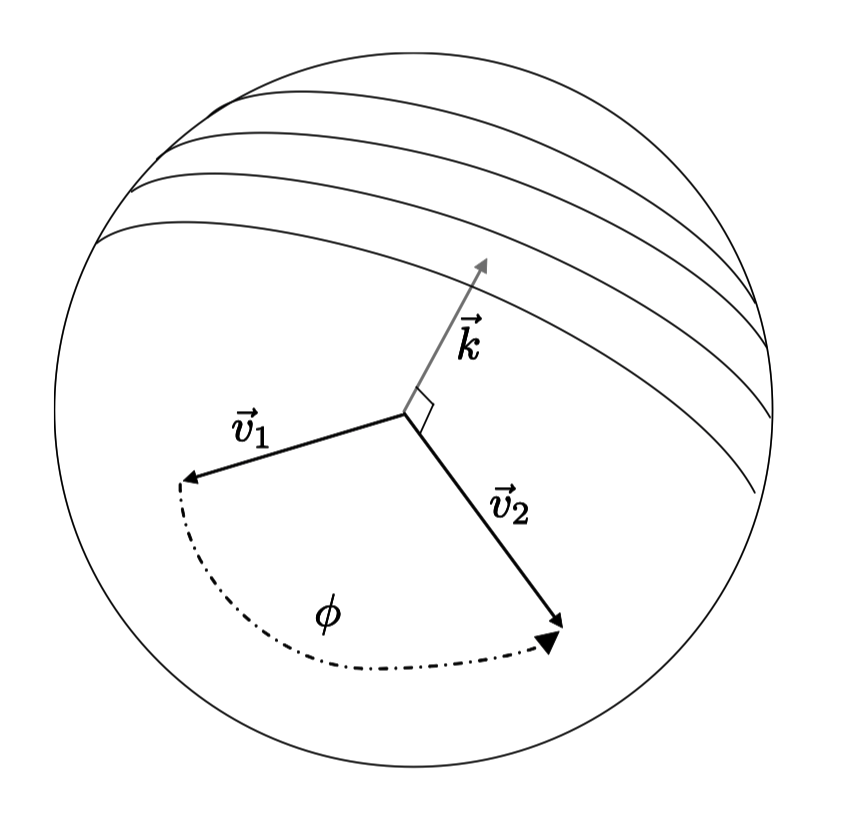

# Note
这是对**MIT Foundation of 3D Computer Graphics**第8章的翻译，本章讲解了借助arcball和trackball如何构建旋转变换以及其实现途径。本书内容仍在不断的学习中，因此本文内容会不断的改进。若有任何建议，请不吝赐教<ninetymiles@icloud.com>。 

> 注：文章中相关内容归原作者所有，翻译内容仅供学习参考。
> 另：Github项目[CGLearning](https://github.com/nintymiles/CGLearning)中拥有相关翻译的完整资料、内容整理、课程项目实现。

# 控制球：轨迹和弧形（Balls: Track and Arc）
在一个交互式的计算机图形程序中，我们经常追踪鼠标的运动并且借助这种数据指定物体运动。平移处理起来相当直接。在小节6.5中，当鼠标左键被摁下，我们解读左/右鼠标运动为x轴方向平移，上/下鼠标运动为y轴方向平移（全部都关联于眼睛帧）。当鼠标右键被摁下，我们解读上/下运动为z轴方向平移。

旋转运动的指定就有一点儿不直观了；存在很多方式将鼠标运动关联解读为旋转变换，对于用户来说，这其中的每一种都让人有稍微不同的感觉。之前，在小节6.5中，我们描述了将鼠标位移解读为围绕x轴和y轴的某种特定旋转序列。本节中，我们会描述两种更加成熟的接口：弧形球（arcball）和轨迹球（trackball）。轨迹球的主要优势在于其让人感觉在空中移动一个真实的球体。弧形球的主要优点在于，如果用户在一个点开始移动鼠标，然后在另一个点结束，最终的旋转变换不依赖于在这两点之间鼠标所采用的路径。

让我们假设我们正在关联于帧$\vec{\mathbf{a}}^t=\vec{\mathbf{w}}^t(O)_T(E)_R$移动物体，就如我们在小节5.2.1中所做的。用户点击在屏幕上并且拖动鼠标。我们希望去解读这种用户运动为某种旋转Q，这种旋转会被关联于$\vec{\mathbf{a}}^t$被应用。本章中，为了计算变换Q的值，我们将描述两种不同的方法，轨迹球和弧形球。

## 8.1 接口定义（The Interfaces）
我们假设拥有某种选定半径的球体，其中心在$\tilde{o}$，$\vec{\mathbf{o}}^t$的原点。通常，在实际中围绕对象用线框图绘制球体是很有用的，用户可以更好的感知发生了什么。假设用户在屏幕上点击图像中球体上的像素$s_1$，我们可以解读这个动作为用户在球体上选定了某个3D点$\tilde{p}_1$。假设用户随后又移动到在球体上的另一个像素$s_2$，这个点我们解读为球体上的第二个对应点$\tilde{p}_2$。

给出这两个点，定义出两个矢量$\vec{v}_1,\vec{v}_2$，且都为单位矢量（unit vectors），它们分别位于矢量$\tilde{p}_1 - \tilde{o}$和$\tilde{p}_2-\tilde{o}$的方向上。定义角度$\phi = \arccos(\vec{v}_1.\vec{v}_2)$和轴$\vec{k}=normalize(\vec{v}_1 \times \vec{v}_2)$。（参考图示$\text{Figure 8.1}$。）

在轨迹球接口中，我们定义Q为围绕轴$\vec{k}$旋转$\phi$角度的变换。而在弧形球中，我们定义Q为围绕轴$\vec{k}$旋转$2\phi$角度的变换。

**Figure 8.1:** 轨迹球和弧形球的设置。一个球体表面上的两个被选定点给出了两个矢量。这些矢量依次又给出了一个角度和轴。 

## 8.2 属性（Properties）
轨迹球接口是十分自然的；感觉就像用户抓住了一个球体的真实点然后来回拖动。但是也存在一个无法预料的后果，如果用户在屏幕上从$s_1$移动到$s_2$，然后又从$s_2$移动到$s_3$，合成的轨迹球旋转将不同于直接从$s_1$移动到$s_3$的旋转！在两种情形中，点$\tilde{p}_1$都会被旋转到$\tilde{p}_3$，但是两种结果可通过某种围绕轴$\tilde{o}-\tilde{p}_3$的“扭转”区分。这种路径依赖也存在于小节6.5中的简单旋转接口中。

弧形球接口拥有某种程度上互相对立的属性。一方面，物体看起来以预期两倍快的速度旋转，另一方面，弧形球接口确实是路径独立的。我们可以轻易地借助四元数（quaternion）操作来明白这点。围绕轴$\vec{k}$进行$2\phi$角度的旋转可以用四元数表达为
$$
 \begin{bmatrix}cos(\phi) \\ sin(\phi)\vec{k}\end{bmatrix} =  \begin{bmatrix}\hat{V}_1.\hat{V}_2 \\ \hat{V}_1 \times \hat{V}_2\end{bmatrix} = \begin{bmatrix} 0 \\ \hat{V}_2 \end{bmatrix} \begin{bmatrix} 0 \\ -\hat{V}_1 \end{bmatrix}  \tag{8.1} 
$$
其中$\vec{k},\hat{V}_1,\hat{V}_2$为3部件坐标矢量（coordinate 3-vectors）表达关联于帧$\vec{\mathbf{a}}^t$的矢量$\vec{k},\vec{v}_1,\vec{v}_2$。

如果我们合成两个弧形球旋转，对应于从$\tilde{p}_1$到$\tilde{p}_2$，同时跟着从$\tilde{p}_2$到$\tilde{p}_3$的运动，我们有如下表达
$$
\begin{bmatrix}\hat{V}_2.\hat{V}_3 \\ \hat{V}_2 \times\hat{V}_3\end{bmatrix} \begin{bmatrix}\hat{V}_1.\hat{V}_2 \\ \hat{V}_1 \times\hat{V}_2\end{bmatrix}
$$

这是因为两个旋转都关联于帧$\vec{\mathbf{a}}^t$被应用，事实上所得到的旋转没有变化。借助方程（8.1）的分解，我们看到上面这个表达式等价于：
$$
\begin{bmatrix} 0 \\ \hat{V}_3 \end{bmatrix} \begin{bmatrix} 0 \\ -\hat{V}_2 \end{bmatrix} \begin{bmatrix} 0 \\ \hat{V}_2 \end{bmatrix} \begin{bmatrix} 0 \\ -\hat{V}_1 \end{bmatrix} = 
\begin{bmatrix} 0 \\ \hat{V}_3 \end{bmatrix} \begin{bmatrix} 0 \\ -\hat{V}_1 \end{bmatrix} = 
\begin{bmatrix}\hat{V}_1.\hat{V}_3 \\ \hat{V}_1 \times \hat{V}_3\end{bmatrix}
$$

这个结果刚好就是我们直接从$\tilde{p}_1$移动到$\tilde{p}_3$所得到的旋转。

## 8.3 实现（Implementation）
轨迹球和弧形球既可以用$4 \times 4$矩阵，也可以借助四元数（quaternions）实现来表达变换Q。

因为所有操作都只依赖于矢量而不是点，坐标系的原点就是不重要的，我们可以在共享$\vec{\mathbf{a}}^t$轴的任何坐标系中执行，实际中，我们使用眼睛坐标。

根据一个选定的像素计算球体上点的坐标是稍微有点难的部分（这本质是光线追踪（ray-tracing），在第20章会讲到）。一种近似获得正确行为的简单方式是在“窗口坐标”中进行计算。这种情形中，我门想象一个3D空间，其$x$轴是屏幕的水平轴，$y$轴是屏幕的垂直轴，$z$轴从屏幕中出来。我们认为球体中心完全位于屏幕上。假设用户所点击的点的窗口坐标为$(x,y)$，借助球体方程式：$(x−c_x)^2+(y−c_y)^2+(z−0)^2−r^2=0$,我们可以轻松在球体上找到这个点的$z$坐标，这里$[c_x,c_y,0]^t$是球体中心的窗口坐标。

借助这种方式，我们仍然需要计算以窗口坐标表达的球体中心，同时还有球体在屏幕上的投射半径。这就需要相机投射矩阵的理解（这个主题会在第10章中讲到）。为了完整性，我们在本书的网站上给出了这个程序的源码。

