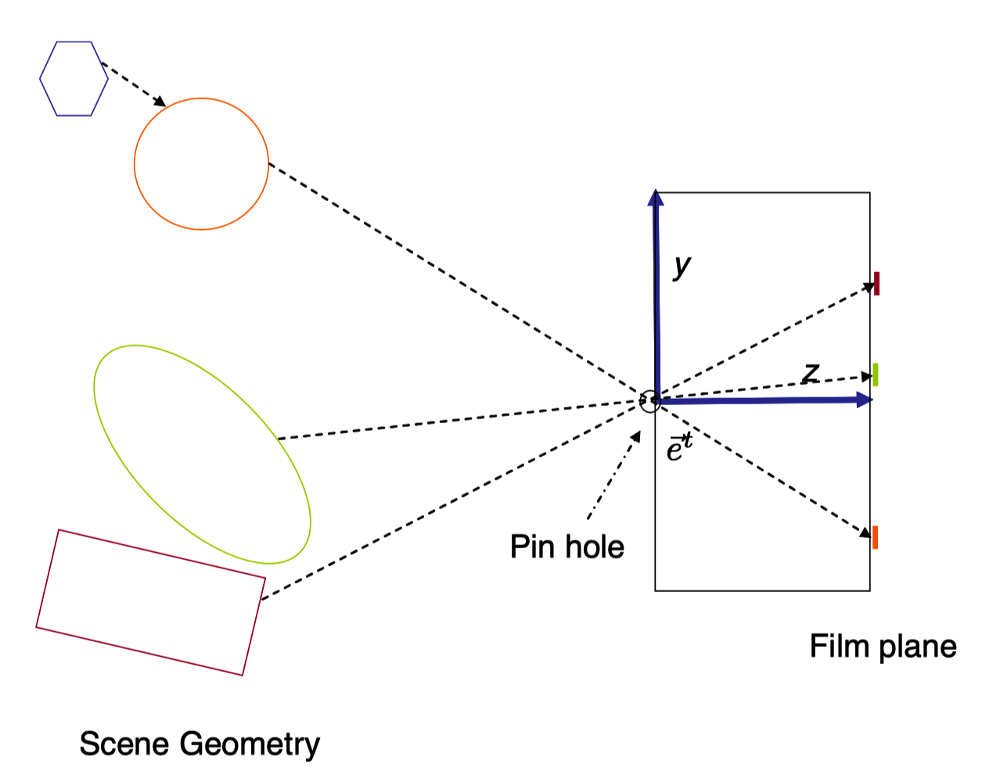
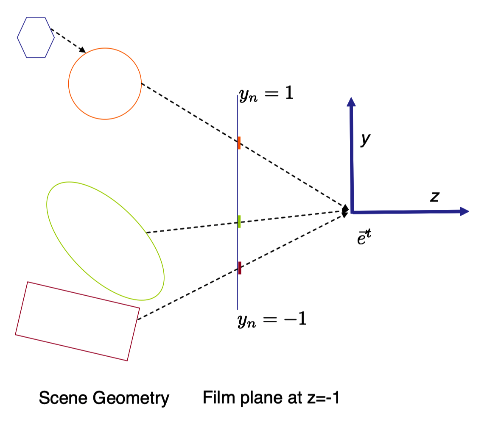
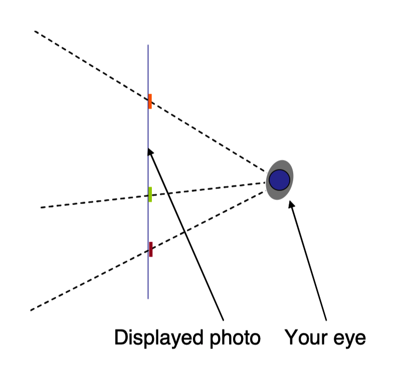
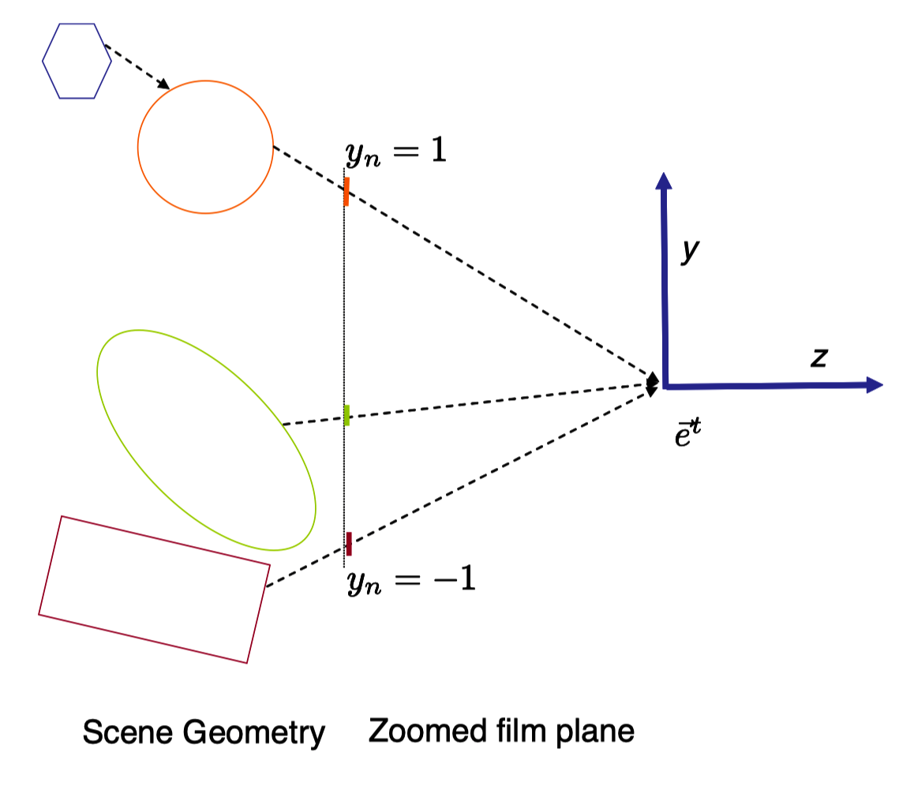
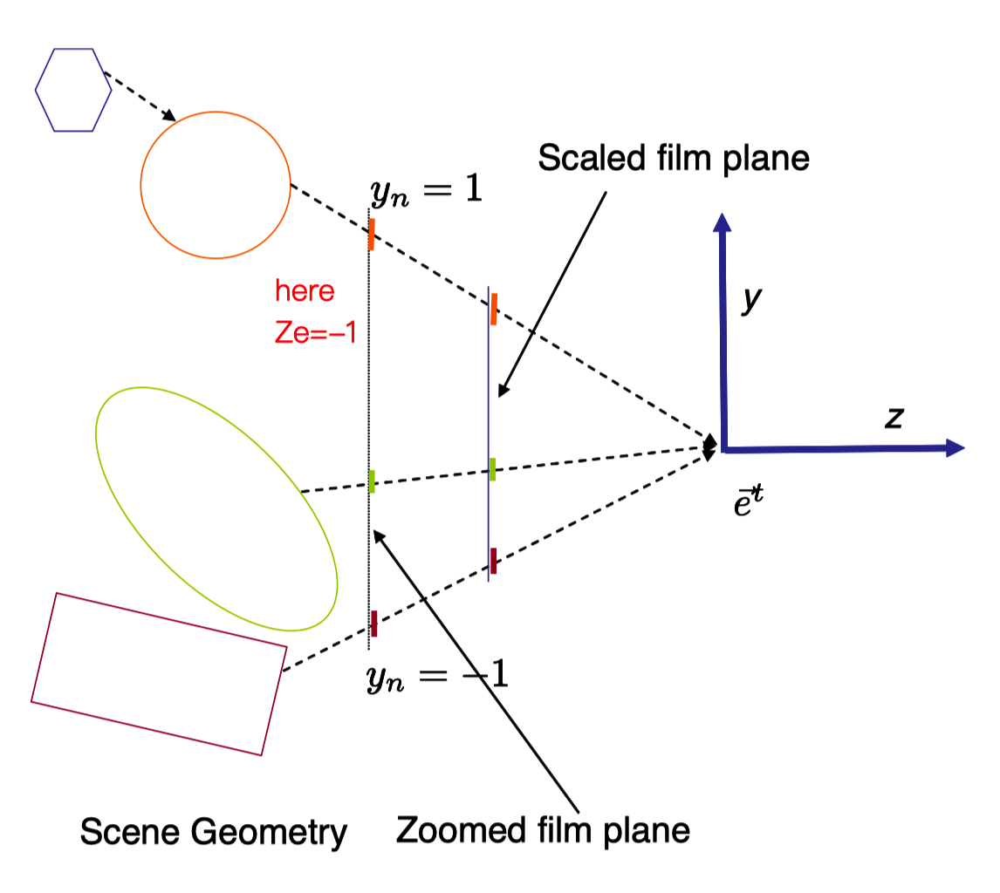
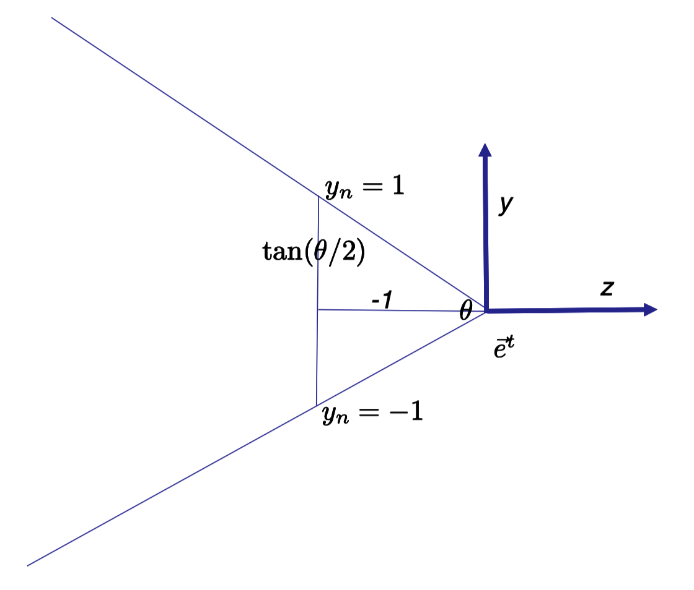
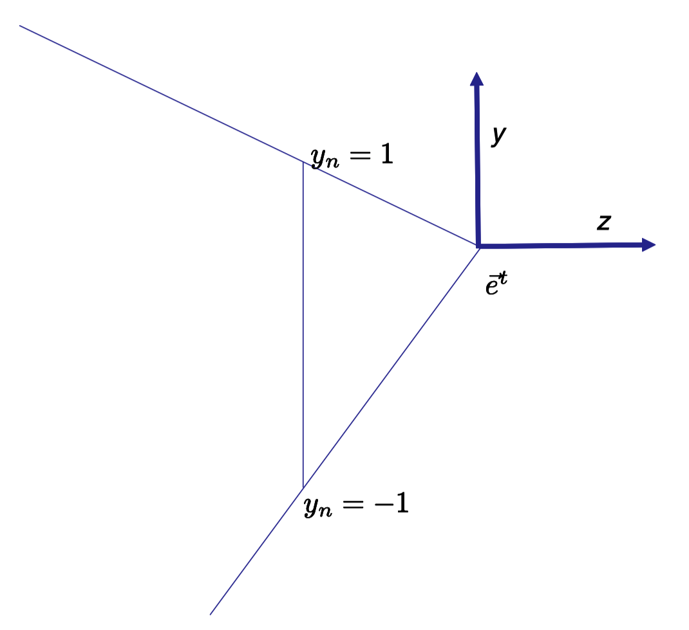
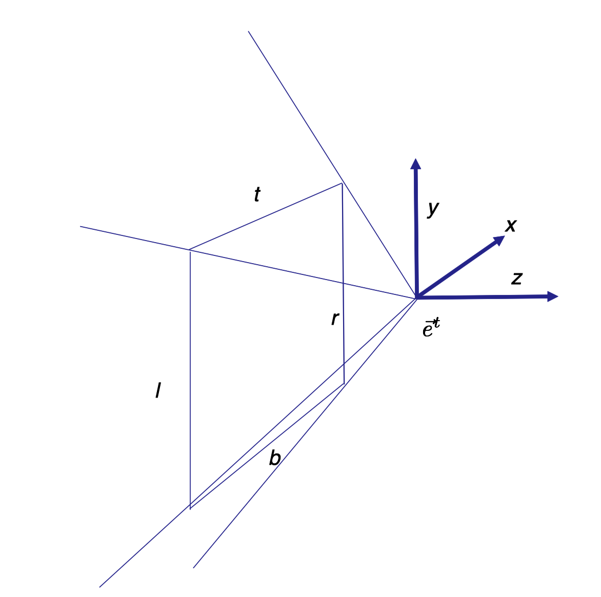

# Note
这是对**MIT Foundation of 3D Computer Graphics**第10章的翻译，本章讲解了2D透视投射矩阵，从针孔相机建模，到初始投射矩阵，再到各种变体，对透视投射的讲解十分透彻。本书内容仍在不断的学习中，因此本文内容会不断的改进。若有任何建议，请不吝赐教ninetymiles@icloud.com 

> 注：文章中相关内容归原作者所有，翻译内容仅供学习参考。
> 另：Github项目[CGLearning](https://github.com/nintymiles/CGLearning)中拥有相关翻译的完整资料、内容整理、课程项目实现。

# 投射（Projection）
目前为止，我们已经在3维空间中描述了物体和眼睛。我们下一步是了解怎样将其转化为2D图像，就像眼睛中所看到的情形。要做到如此，我们将需要建模一个简单相机。整体上，我们会假设相机被放置在眼睛帧$\vec{\mathbf{e}}^t$的原点,并且它会看向眼睛的负z轴。我们会使用标记$[x_e,y_e,z_e,1]^t$表示一个点的眼睛坐标。

# 10.1 针孔相机（Pinhole Camera） 
最简单可行的相机是针孔相机（参考图示$\text{Figure 10.1}$）。当光朝向成像面行进时，大部分被放置在$z_e=0$平面的不透明表面所阻隔。但是我们在这个表面的中心开一个非常小的洞，在拥有坐标$[0,0,0,1]^t$的这个点上。只要通过这个点的光线到达成像面并且将它们的强度记录在胶片上。被记录在成像面的图像被放置在$z_e=1$位置处的平面上。

在物理世界中，任何真正的相机都需要一个有限尺寸的光圈，以便于可测数量的光线可以到达成像面。并且一旦光圈是有限尺寸的，镜头组就被需要，以更好的“组织”和聚焦入射光线。但是这些问题现在不需要引起我们的关注，因为我们没有在构建物理相机。更多相关内容请参考第21章。

在我们的针孔相机中，为了获得要求的相片，成像面上的数据需要随后被翻转。数学方式中，如果我们让成像面位于针孔相机之前，比如说，放在$z_e=-1$平面上，就可以避免这个步骤（参考图示$\text{Figure 10.2}$）。在物理世界中，这不会有任何意义，但是作为针孔相机的数学模型，它工作得很好。

一旦相片被生成，如果我们在$z_e=-1$平面上持有这张相片，并让我们的眼睛位于原点来观察它（参考图示$\text{Figure 10.3}$），对于我们它就像是原来场景所应有的样子。就像我们站在那里并观察这个场景，我们确切重现了那些会到达我们眼睛的数据。如果我们在空间中移动图片，比方说离眼睛更远或者更近，我们将不再确切地重现原始的场景刺激，但是它仍然看起来就像原始场景的合理有效的可视化表达。

> 注：pinhole camera也可以称作小孔相机

**Figure 10.1:** 一个2D针孔相机。从场景几何形状表面出发的光线（顺着虚线）通过针孔，同时让其色彩被记录在$z_e=1$处的成像面上。几个被上色的像素在图中被展示。蓝色六边形被遮挡从而不会显示在图像中。

**Figure 10.2:** 基本针孔相机可以以成像面位于原点之前（$z_e=-1$）的方式被建模。成像面最上部的点拥有值为1的$y_n$标准化设备坐标。任何顺着虚线的点会被映射到图像中的相同像素上。

**Figure 10.3:** 如果成像面被照片替换，同时你的眼睛位于原点，那么到达图像的数据将和来自原始场景的数据无法区分。

## 10.2 基本数学模型（Basic Mathematical Model）
针孔相机很容易以数学方式建模。让我们用坐标$[x_n,y_n]^t$指定在成像面上的点。现在，我们选择一个位于我们成像面上的2D坐标系，以便这些坐标刚好匹配眼睛坐标，也就是说，$x_n=x_e$和$y_n=y_e$，但是很快我们会放松这个规格。

用眼睛坐标$[x_e,y_e,z_e,1]^t$给出场景中的一个点$\tilde{p}$，很容易看出（比方说借助相似三角形参数）来自$\tilde{p}$点到原点的射线照射到成像面在
$$
x_n = -\frac{x_e}{z_e} \tag{10.1}
$$
$$
y_n = -\frac{y_e}{z_e} \tag{10.2}
$$

我们可以将这个表达式建模为矩阵操作如下
$$
\begin{bmatrix} 1 & 0 & 0 & 0 \\ 0 & 1 & 0 & 0 \\ - & - & - & - \\ 0 & 0 & -1 & 0 \end{bmatrix}\begin{bmatrix} x_e \\ y_e \\ z_e \\ 1 \end{bmatrix} = \begin{bmatrix} x_c \\ y_c \\ - \\ w_c \end{bmatrix} = \begin{bmatrix} x_nw_n \\ y_nw_n \\ - \\ w_n \end{bmatrix} \tag{10.4}
$$

此处短横线(-)意指“（还）不需关注”。我们称这种矩阵为投射矩阵。矩阵乘法的原始输出，$[x_c,y_c,-,w_c]^t$，被称为$\tilde{p}$的裁切坐标（clip coordinates）。（它们之所以被如此命名就因为数据随后在裁切阶段被使用，在小节12.1中讲述。）$w_n=w_c$为新变量，被称为w-坐标。在这种裁切坐标中，4部件坐标矢量的第4元素不必须是0或者1.

我们说$x_nw_n=x_c$和$y_nw_n=y_c$。如果我们要独立提取$x_n$，必须执行除法$x_n=\frac{x_nw_n}{w_n}$(用同样方式获得$y_n$)。当我们这样做时，我们准确地复原了方程(10.1)的计算，这个方程式就是我们的简单相机模型。

我们的输出坐标，带有下标"n"，被称为标准化设备坐标，因为它们以抽象单位定位了图像上的点，而没有特意引用像素数目。在计算机图形学中，我们将所有的图像数据保留在经典正方形（canonical square）中$-1 \le x_n \le +1,-1 \le y_n \le +1$，并且最终把这个数据映射到屏幕上的一个窗口中。正方形区域之外的数据没有被记录或展示。这确切就是在附录A中我们用于描述2D OpenGL绘制的模型。

**Figure 10.4:** 在本相机模型中，我们移动成像面到$z_e=n$平面。但同时保持拥有$-1<y_n=y_e<1$的成像面部分。这模拟了望远镜环境。

## 10.3 变体（Variations）
通过改变投射矩阵中的条目，我们可以适度改变相机变换的几何形状。

### 10.3.1 伸缩（Scales）
如果我们把成像面移动到$z_e=n$，这里n是某种负数（参考图示$\text{Figure 10.4}$），我们可以把这个相机建模为
$$
x_n = \frac{nx_e}{z_e} \\ y_n = \frac{ny_e}{z_e}
$$
这个表达式对应于在镜头上改变焦距。在矩阵形式中，这个表达式就变为
$$
\begin{bmatrix} x_nw_n \\ y_nw_n \\ - \\ w_n \end{bmatrix} = \begin{bmatrix} -n & 0 & 0 & 0 \\ 0 & -n & 0 & 0 \\ - & - & - & - \\ 0 & 0 & -1 & 0 \end{bmatrix}\begin{bmatrix} x_e \\ y_e \\ z_e \\ 1 \end{bmatrix}  
$$
事实上，这和在成像面$z_e=-1$处先使用我们的初始相机，然后用因子-n伸缩已经被记录的图像，最后只保留位于经典正方形（参考图示$\text{Figure 10.5}$）内的部分一样。如此，最好不再将标准设备坐标当作和成像面上的任何眼睛坐标一致了，而是只作为图像平面中的某种内生性的坐标。

控制伸缩因子的一种有效替代方式是通过以指定目标相机的垂直视域角度来确定-n。实际上，假设我们想让相机具有一个$\theta$度的视域。那么我们设置$-n=\frac{1}{tan(\theta/2)}$，（参考图示$\text{Figure 10.6}$），这就给出了如下的投射矩阵
$$
 \begin{bmatrix} \frac{1}{\tan(\theta/2)} & 0 & 0 & 0 \\ 0 & \frac{1}{\tan(\theta/2)} & 0 & 0 \\ - & - & - & - \\ 0 & 0 & -1 & 0 \end{bmatrix} \tag{10.5} 
$$

我们可以直接验证任何点，如果经过它的射线和负z轴组成了一个垂直角度$\theta$，那么这个点会被映射到图像平面上经典正方形的边缘上，从而可以确定相机的视域是$\theta$。例如，拥有眼睛坐标：$[0,tan(\theta/2),-1,0]^t$的点映射到了标准设备坐标$[0,1]^t$。

从更通用的角度，我们可以通过分别差异化水平和垂直因子$s_x$和$s_y$，来获得下列的相机模型
$$ \begin{array}{rl}
\begin{bmatrix} x_nw_n \\ y_nw_n \\ - \\ w_n \end{bmatrix} & = & \begin{bmatrix} s_x & 0 & 0 & 0 \\ 0 & s_y & 0 & 0 \\ 0 & 0 & 1 & 0 \\ 0 & 0 & 0 & 1 \end{bmatrix} \begin{bmatrix} 1 & 0 & 0 & 0 \\ 0 & 1 & 0 & 0 \\ - & - & - & - \\ 0 & 0 & -1 & 0 \end{bmatrix}\begin{bmatrix} x_e \\ y_e \\ z_e \\ 1 \end{bmatrix}  \\
& = & \begin{bmatrix} s_x & 0 & 0 & 0 \\ 0 & s_y & 0 & 0 \\ - & - & - & - \\ 0 & 0 & -1 & 0 \end{bmatrix}\begin{bmatrix} x_e \\ y_e \\ z_e \\ 1 \end{bmatrix}
\end{array}$$
在计算机图形中，当处理屏幕上的非正方形窗口时，这种不一致性就相当有用。假设窗口的宽度尺寸比高度更大。在我们的相机变换中，需要水平挤压内容以便更宽的水平视域可以填充到我们（特意）保留的经典正方形中。当数据随后被映射到窗口，其会被对应拉伸，从而不会看起来显得被扭曲了。

定义a，窗口的纵横比（aspect ratio），为其宽度除以其高度（比如说以像素为单位测量）。这时，我们可以设置我们的投射矩阵为
$$
 \begin{bmatrix} \frac{1}{a\tan(\theta/2)} & 0 & 0 & 0 \\ 0 & \frac{1}{\tan(\theta/2)} & 0 & 0 \\ - & - & - & - \\ 0 & 0 & -1 & 0 \end{bmatrix} \tag{10.6} 
$$
这个相机的垂直行为和方程式（10.5）相比没有变化，但是一个更合适的垂直视域被用于生成图像。

当窗口的高度尺寸大于其宽度时，$a<1$，我们仍然可以使用方程式（10.6）中的矩阵，但是我们可能不满意于最终的缩窄的水平视域。如果我们想让$\theta$（这里所指的是某个轴向的自然视域）为最小的垂直方向或水平方向视域，那么，只要$a<1$的时候，我们就需要使用下面的投射矩阵
$$
 \begin{bmatrix} \frac{1}{\tan(\theta/2)} & 0 & 0 & 0 \\ 0 & \frac{a}{\tan(\theta/2)} & 0 & 0 \\ - & - & - & - \\ 0 & 0 & -1 & 0 \end{bmatrix} 
$$
这些矩阵完全就是在小节6.2中，被我们所调用的程序`makeProjection`所产生的矩阵。

在计算机图形中选择使用一种视域时，经常会权衡。一方面，更宽的视域，比如说在一个游戏环境中，可以让观察者看到更多围绕着他们的东西。另一方面，在典型的观看环境中（除非能让他们的头正对着屏幕），屏幕只占据观察者四周很小的角度范围。在这种情形中，观看的几何形状不会匹配成像环境（正如图示$\text{Figure 10.3}$中所展示的），图像会呈现出被扭曲的外观（例如，球体可能不会显示为圆形）。

**Figure 10.5:** 被改变焦距的相机完全相同于后面这种相机，让其成像面位于$z_e=-1$位置，但是同时伸缩其图像坐标。$y_n = −ny_e$

**Figure 10.6:** 通过选定对应的垂直视域：$\theta$，相机的伸缩可以被方便地表达。这种情形中，我们可以将位于$z_e=-1$的成像面和范围$-\tan(\theta/2) < y_e < \tan(\theta/2) $，映射到标准化设备坐标$-1 < y_n < 1$。

### 10.3.2 移位（Shifts）
稍不平常一点，我们可能希望通过$[c_x,c_y]^t$平移2D标准设备坐标。这种情形可以在投射矩阵中被建模为
$$ \begin{array}{rl}
\begin{bmatrix} x_nw_n \\ y_nw_n \\ - \\ w_n \end{bmatrix} & = & \begin{bmatrix} 1 & 0 & 0 & c_x \\ 0 & 1 & 0 & c_y \\ 0 & 0 & 1 & 0 \\ 0 & 0 & 0 & 1 \end{bmatrix} \begin{bmatrix} 1 & 0 & 0 & 0 \\ 0 & 1 & 0 & 0 \\ - & - & - & - \\ 0 & 0 & -1 & 0 \end{bmatrix}\begin{bmatrix} x_e \\ y_e \\ z_e \\ 1 \end{bmatrix}  \\
& = & \begin{bmatrix} 1 & 0 & -c_x & 0 \\ 0 & 1 & -c_y & 0 \\ - & - & - & - \\ 0 & 0 & -1 & 0 \end{bmatrix}\begin{bmatrix} x_e \\ y_e \\ z_e \\ 1 \end{bmatrix}
\end{array}$$
这对应于成像面被移动了的相机（参考图示$\text{Figure 10.7}$）。这可能显得不平常，但实际上由于制造和光学方面的问题，大部分真实相机本身确实会有一些微小的移位。

在计算机图形中，移位相机的主要用处是平铺显示（tiled displays，参考图示$\text{Figure 10.8}$），这里我们互相挨着放置多个显示以生产一个更大的。这种情形中，这些子-图像中的每一个都被正确地建模为一个合适的移位相机（shifted camera）。另一种应用是生成在单一显示屏幕上立体显示（stereo viewing）的图像对。 

经常在计算机图形中，移位的（或者伸缩的）相机首先通过指定一个近平面（near plane）$z_e=n$。在这个平面上，矩型区域使用一个轴对齐的矩型的眼睛坐标被指定。（对于非扭曲的输出，这个矩型区域的纵横比应该匹配最终的窗口。）值$l,r$指定眼睛坐标中矩型的左边和右边，而值$t,b$则指定眼睛坐标中矩型的上边和下边。总体上，这就指定了空间中3D平截锥体（frustum）的形状。借助下面的投射矩阵，经过这个矩型区域并入射到原点的射线随后被映射到经典图像正方形中
$$
\begin{bmatrix} -\frac{2n}{r-l} & 0 & \frac{r+l}{r-l} & 0 \\ 0 & -\frac{2n}{t-b} & \frac{t+b}{t-b} & 0 \\ - & - & - & - \\ 0 & 0 & -1 & 0 \end{bmatrix}
$$
（参考图示$\text{Figure 10.9}$)。

**Figure 10.7:** 在移位相机中（shifted camera），我们平移标准化设备坐标同时保持$[-1..1]$区域对应于这些被移位的坐标。

**Figure 10.8:** 在这个环境中，生成整个图像的两个显示屏幕被呈现给了观察者。每个图像应该被建模为 一个移位相机（shifted camera）。

**Figure 10.9:** 3D平截锥体（frustum）通过在近平面上指定一个图像矩型区域被定义。

### 10.3.3 再提点儿其它（...And The Rest）
方程式（10.7）中矩阵的左上角$2\times2$块状区域中剩下的两个0通常在我们的相机模型中不被接触到。总而言之，它们表达了像素网格的旋转和切削（shearing）。切削通常不会出现在真正的相机中，在计算机图形中也很少是有用的。当然我们会围绕光学轴旋转整个相机，但是这可以通过在眼睛帧$\vec{\mathbf{e}}^t$的初始定义中作为一个合适的相机旋转变换来实现！

## 10.4 使用场合（Context）
我们讲过的投射操作是一种可以被应用到眼睛坐标中任何给定点上的变换，从而获得其标准化设备坐标。然而，在OpenGL中，这种映射仅仅被用在三角形的顶点上。一旦一个三角形的3个顶点的标准化设备坐标被获得，其内部点就会通过计算所有落入图像平面中这个三角形内部的像素的方式被填充进去。

