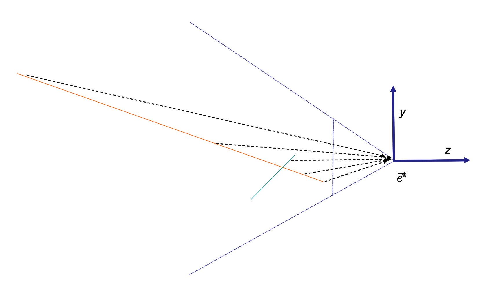
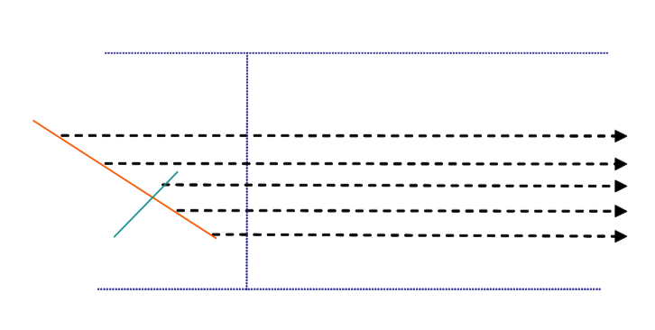
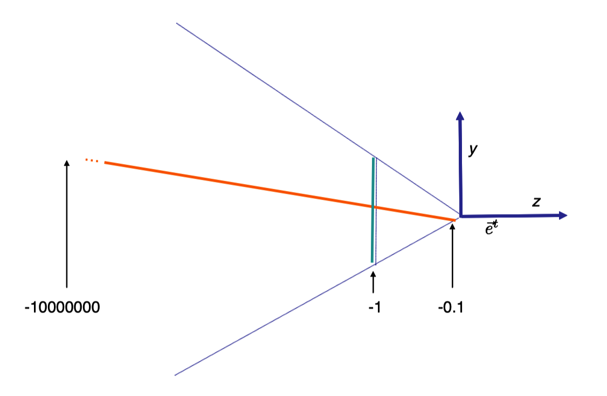
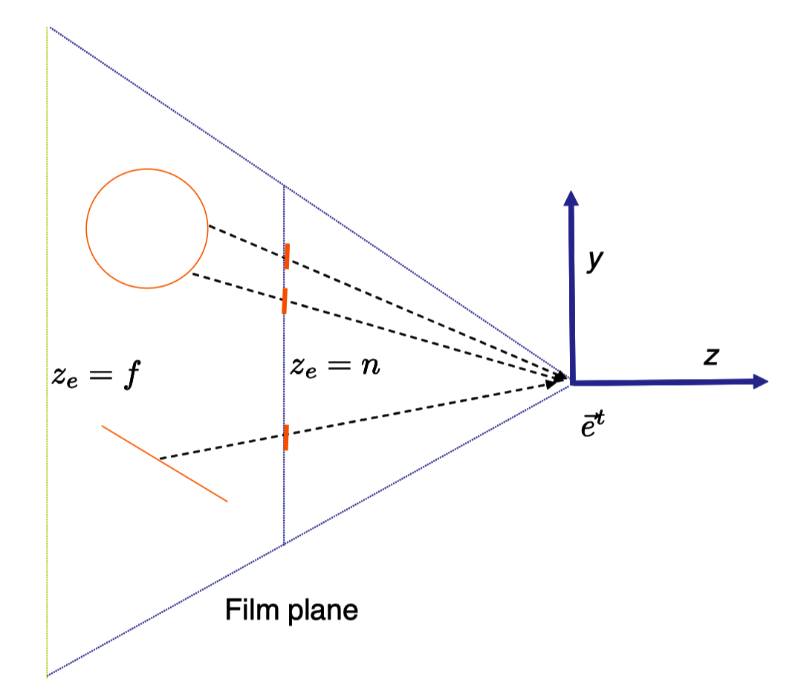
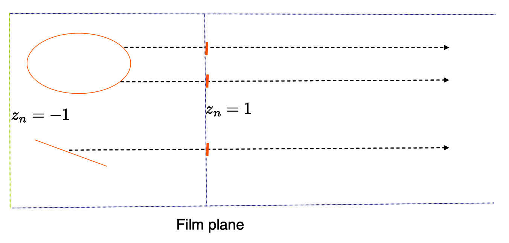

# Note
这是对**MIT.Foundation of 3D Computer Graphics**第11章的翻译，本章讲解了投射矩阵中深度比较的相关知识，重点讲解了3D投射矩阵的形成和应用。本书内容仍在不断的学习中，因此本文内容会不断的改进。若有任何建议，请不吝赐教<ninetymiles@icloud.com>。

> 注：文章中相关内容归原作者所有，翻译内容仅供学习参考。
> 另：Github项目[CGLearning](https://github.com/nintymiles/CGLearning)中拥有相关翻译的完整资料、内容整理、课程项目实现。

# 深度（Depth）

## 11.1 可视性（Visibility）
在真实物理世界中，如果物体A处于物体B的前方，那么来自物体B的光线会被物体A阻挡，从而无法到达相机（成像），因而它将不会显示在图像中（比如，图示$\text{Figure 10.2}$的蓝色六边形）。在计算机图形中，我们需要以可计算方式建模这种情形。

存在多种方式可以用来确保只有对相机可见的表面出现在图像中。一种思路是通过深度排序三角形，然后以从后到前的顺序绘制它们。这种思路的关键是，最前边的三角形将会在被遮挡的三角形之上重绘从而产生正确图像。这种所谓的画家方式存在好多个难题。例如，场景可能包含互相渗透的三角形。也可能包含非互相渗透三角形的可视循环情形，这种情形被展示在图示$\text{Figure 11.1}$。

另一种通用性非常好的情形，我们会在第20章中讨论，为光线投射方式（ray casting）。这种方式中，对于每个像素，顺着像素的视线，我们明确计算每个被看到的场景点。最近的相交点随后被用于给像素上色。

在一个类似OpenGL这样的光栅化渲染器中，我们借助某种被称作z-缓存（z-buffer）的机制来执行我们的可视性计算。这种方式中，可以以任何顺序绘制三角形。在帧缓存的每个像素上，我们不仅存储一个色彩值而且还有一个“当前深度”值。这个值表达了用于设置像素当前值的几何体的深度。当一个新三角形尝试设置一个像素的色彩时，我们首先将其深度和存储在z-缓存中的值进行比较。只有这个三角形中被观察到的点更接近（眼睛）时，我们才会覆写这个像素的色彩和深度值。因为这种动作完成在每像素的基础上，可以正确地处理互相渗透的三角形情形。

**Figure 11.1:** 组成一种可视循环的3个三角形。没有方式可以从后到前排列它们。

### 可视性计算的其它用法（Other Uses of Visibility Calculations）
可视性计算在计算一个被观察点的色彩时也可能是重要的。实际上，在决定是否被观察点可以直接看到某种“光源”或者是否在阴影中等方面也是重要的。在OpenGL中这可以借助阴影映射算法来完成，在小节15.5.2中。在光线追踪的环境中，我们只要使用射线相交代码就可以看到什么几何体和从始于被观察点到光源的射线相交。

可视性计算也可以被用于加速渲染处理。如果我们知道某个物体相对于相机被遮挡，那么我们首先就不必去渲染这个物体。这可能被用于室内场景的例子，其中我们通常不能看得太远以至于超出环绕的房间。在这种环境中，我们可以使用一种保守可视性检测；这种检测会快速告知我们是否某个物体可能或者明确不可见。如果物体可能可见，那么我们就继续使用z-缓存渲染。但是如果物体明显不可见，那么我们可以完全跳过这种绘制。

## 11.2 基础数学模型（Basic Mathematical Model）
在OpenGL中，我们借助z-缓存计算可视性。要使用z-缓存，除了一个点的$[x_n,y_n]^t$外，我们还需要一个深度值。要完成这个任务，针对每个用眼睛坐标描述的点，我们借助下列矩阵表达定义其$[x_n,y_n,z_n]^t$坐标。
$$ \begin{array}{c}
\begin{bmatrix} x_nw_n \\ y_nw_n \\ z_nw_n \\ w_n \end{bmatrix}  = \begin{bmatrix} x_c \\ y_c \\ z_c \\ w_c \end{bmatrix}  =  \begin{bmatrix} s_x & 0 & -c_x & 0 \\ 0 & s_y & -c_y & 0 \\ 0 & 0 & 0 & 1 \\ 0 & 0 & -1 & 0 \end{bmatrix} \begin{bmatrix} x_e \\ y_e \\ z_e \\ 1 \end{bmatrix}  \tag{11.1}
\end{array} $$
再次，原始的输出被称作裁切坐标，并且和以前一样，要获得$x_n$和$y_n$的值，我们需要除以$w_n$值。但是现在我们还得到了$z_n=\frac{-1}{z_e}$值。我们计划使用这个$z_n$在z-缓存中进行深度比较。

让我们首先验证从方程式（11.1）中获得的$z_n$值确实可以被用于做深度比较。假定两个点$\tilde{p}_1$和$\tilde{p}_2$，分别有眼睛坐标$[x_e^1,y_e^1,z_e^1,1]^t$和$[x_e^2,y_e^2,z_e^2,1]^t$。假设它们都位于眼前，也就是说$z_e^1<0$和$z_e^2<0$。同时假设$\tilde{p}_1$比$\tilde{p}_2$更靠近眼睛，也就是说$z_e^2<z_e^1$。因而$-\frac{1}{z_e^2}<-\frac{1}{z_e^1}$,这就意味着$z_n^2<z_n^1$。

总之，我们可以将从眼睛坐标给出的点转换为以标准化设备坐标所给出的点的处理当作是一种诚实的3D几何变换。这种变换即不是线性的也不是仿射的，但是在某种意义上被称为3D投射变换。

投射变换有一点儿可笑；例如，上面的情形中，任何具有$z_e=0$的点将会引起“被0除”的情形。在这个时点，关于投射变换（参数在下面给出）我们需要知道的最重要的事情为它们保留了点的同线性（co-linearity）和同平面性（co-planarity），参考图示$\text{Figure 11.2}$和图示$\text{Figure 11.3}$。同线性意味着如果3个或更多的点位于一条线上，被变换的点也会在某条线上。

作为这种同平面性保留的结果，我们知道针对一个固定三角形上的点，针对某种固定的a，b和c，我们会有这种表达$z_n=ax_n+by_n+c$。因而，对于一个点正确的$z_n$值，只要我们知道其在三角形中3个顶点的值，就可以借助在2D图像域上的线性插值来计算它（关于线性插值的更多内容，请参考附录B）。

然而，要注意，距离并没有被投射变换保留。再次观察$\text{Figure 11.2}$和$\text{Figure 11.3}$，我们看到在成像面上平均间隔的像素并没有对应于眼睛空间几何体上平均间隔的点。同时，这种平均间隔的像素确实对应于标准化设备坐标中平均间隔的点。

作为距离扭曲的结果，在屏幕上进行$z_e$值的线性插值会给出错误答案。考虑图示$\text{Figure 11.4}$中的2D绘制，对于互相渗透的线段，一个橙色的和一个蓝色的。顶点的$z_e$值被展示。两个线段右侧相交在图像平面的中点，所以在正确的图像中，上半部分应该是蓝色的而下半部分应该是橙色的。假设在图像空间中我们在每个线段上线性插值$z_e$值。所有蓝色像素会插值出值为-1的$z_e$值。而在橙色三角形上，从底部（$z_e=-1$）开始到顶部（大约$z_e=-1000000$），被插值的$z_e$值将会立即小于-1。因此，在z-缓存图像中，几乎整个图像都会是蓝色的！在第13章中，我们会看到如何正确地在屏幕上的一个三角形中插值出$z_e$值。

**Figure 11.2: ** 这里我们的几何体是两条线。成像面上平均分布的像素不均匀地映射到几何体上。

**Figure 11.3:** 来自图示Figure 11.2中的以标准化设备坐标表示的场景。通过投射变换，每个拥有坐标$[x_e,y_e]^t$的点被映射到标准化设备坐标$[x_n,y_n]^t$。$y_n$坐标给出其成像面上的图像地址，而$z_n$值被用于做深度比较。在眼睛坐标中通过原点的射线被映射为标准化设备坐标中的平行射线。同线性和平面性被这种映射保留。

**Figure 11.4:** 在屏幕上$z_e$值的线性插值给出了错误答案。

### 线性被投射变换保留（Lines are preserved by projective transforms (optional)）
这里我们只是勾勒出线性被投射变换保留所需要证明的步骤。

首先，让我们定义一个施加在3D仿射空间（3D affine space）的投射变换。固定我们的帧，每个点被$\mathbf{c}$所表达，其代表一个由1作为最后条目的4部件坐标矢量。我们随后通过一个被选定的$4\times4$矩阵$P$乘以这个矢量，以获得$\mathbf{b}=P\mathbf{c}$。在$P$的第四行上没有限制，但是我们会假设这个矩阵是可反转的（invertible）。最终，我们对于$\mathbf{d}$中的4个条目的每个除以其第四条目。这样就会给出我们结果$\mathbf{e}$，我们将其解读为我们的仿射空间（affine space）中的另一个点的坐标。（让我们忽略$\mathbf{d}$的第4条目碰巧为0的情况。）这样一种变换$\mathbf{c}\Rightarrow \mathbf{e}$。被称作一个投射变换。

要明白这种变换保留了同线性，让我们将$\mathbf{c}$当作4D线性空间$R^4$中的一个坐标矢量。如果我们开始于在我们的3D仿射空间中全部位于一条线上的点，那么所有关联的$\mathbf{c}$坐标一定也表达了在$R^4$中位于某个相应的2D子空间中的矢量。让我们将被$P$相乘仅当作施加在$R^4$中的线性变换。作为任意线性变换，这一定会映射2D子空间到2D子空间。因而所有最终的$\mathbf{d}$坐标一定位于$R^4$中某个固定的2D子空间。最后，当我们除以第4坐标，我们只是缩放每个最终的矢量让它们的最后坐标为1，以便它们也位于$R^4$中的3D超平面（hyperplane）上。任何这种$\mathbf{e}$坐标一定位于3D超平面中的1D线上。这个超平面是我们的3D仿射空间的同型体（isomorphic），因而投射变换的最终点一定是同线性的。

## 11.3 近值和远值（Near And Far）
当使用方程式（11.1）的投射矩阵时，在计算$z_n$值时可能存在多种数值计算上的困难。当$z_e$朝向0变化时，$z_n$值朝向无穷大偏离。反过来讲，远离眼睛的点会让$z_n$值非常接近于0。两个这种远离点的$z_n$值在以一种有限的精度表达的前提下可能无法区分，因此z-缓存在区分哪个点更靠近眼睛时将不会产生结果。

在计算机图形中，这种问题通常以替换方程式（11.1）中矩阵的第三行为更通用的行$[0,0,\alpha,\beta]$的方式解决。再次，很容易证明如果$\alpha$和$\beta$全都是正值，根据投射变换，那么点的z-排序(z-ordering)（假设它们都有负的$z_e$值）被保留。

要设置$\alpha$和$\beta$的值，首先我们选择被称为近值和远值的深度值n和f（两者都是负数），以便在场景中我们感兴趣的主区域被夹在$z_e=n$和$z_e=f$之间。给定这种选择，我们设置$\alpha=\frac{f+n}{f-n}$和$\beta=-\frac{2fn}{f-n}$。就可以验证任何拥有$z_e=f$的点映射到了$z_n=-1$的点，同时$z_e=n$的点被映射到了$z_n=1$的点（参考图示$\text{Figure 11.5}$和$\text{Figure 11.6}$）。任何不在这个区间$[near..far]$范围内的几何体会被OpenGL裁切掉或者忽略掉（裁切在小节12.1中会讲到）。

将这种情形和方程式（10.6）中的投射矩阵合并，我们获得下面矩阵
$$ \begin{bmatrix}
 \frac{1}{\alpha\tan(\frac{\theta}{2})} & 0 & 0 & 0 \\
 0 & \frac{1}{\tan(\frac{\theta}{2})} & 0 & 0 \\
 0 & 0 & \frac{f+n}{f-n} & -\frac{2fn}{f-n} \\
 0 & 0 & -1 & 0 
\end{bmatrix}$$

作为替代方式，把这种情形和方程式（10.7）中的投射矩阵合并，同时借助近平面使用标量l,r,t,b定义约束矩型（bounding rectangle），我们就会获得平截锥体投射矩阵（frustum projection matrix）
$$ \begin{bmatrix}
 \frac{1}{\alpha\tan(\frac{\theta}{2})} & 0 & \frac{r+l}{r-l} & 0 \\
 0 & \frac{1}{\tan(\frac{\theta}{2})} & \frac{t+b}{t-b} & 0 \\
 0 & 0 & \frac{f+n}{f-n} & -\frac{2fn}{f-n} \\
 0 & 0 & -1 & 0 
\end{bmatrix} \tag{11.2}$$
这种投射矩阵的效果会映射平截锥体到使用角落（corner）坐标$[-1,-1,-1]^t,[1,1,1]^t$的经典立方体中（canoncial cube）。

由于多种历史原因，在相关文献中或者OpenGL文档中存在几种这种矩阵的变体。例如，某些方式假设n为到近平面的距离，因而是正值。还有一个例子，某些方式翻转矩阵第三行条目的符号。在最终的（左手性的）标准化设备坐标，更近意味着更小的$z_n$值。因为我们不做这种翻转，所以我们必须明确告知OpenGL哪种符号会用于深度比较；我们使用调用`glDepthFunc(GL_GREATER)`来完成。

**Figure 11.5:** 在这个相机模型中，我们同时指定了近平面和远平面（绿色）。我们认为成像面位于近平面之上。

**Figure 11.6:** 在经历了方程式（11.2）中的投射变换后，在这里我们展示了图示Figure 11.5中的几何体。近平面映射到$z_n=1$，远平面映射到$z_n=-1$。

## 11.4 编码（Code）
在OpenGL中，z-缓存的使用通过调用`glEnable(GL_DEPTH_TEST)`来开启。我们也需要调用`glDepthFunc(GL_GREATER)`，因为我们在使用右手性的坐标系，其中“越负的数”表示“越远离眼睛”。

把所有的内容汇总在一起，所以我们真正需要做的是写出程序`Matrix4 makeProjection(double minfov, double aspectratio, double zNear, double zFar)`和`Matrix4 makeProjection(double top, double bottom, double left, double right, double zNear, double ZFar)`，它们会返回合适的矩阵。我们也需要程序`sendProjectionMatrix(projmat)`将投射矩阵发送到顶点着色器中恰当命名的变量之上。这些程序代码可以在我们的网站找到。实际使用投射矩阵的乘法是在顶点着色器中完成的，就如我们在小节6.3中所做的一样。

