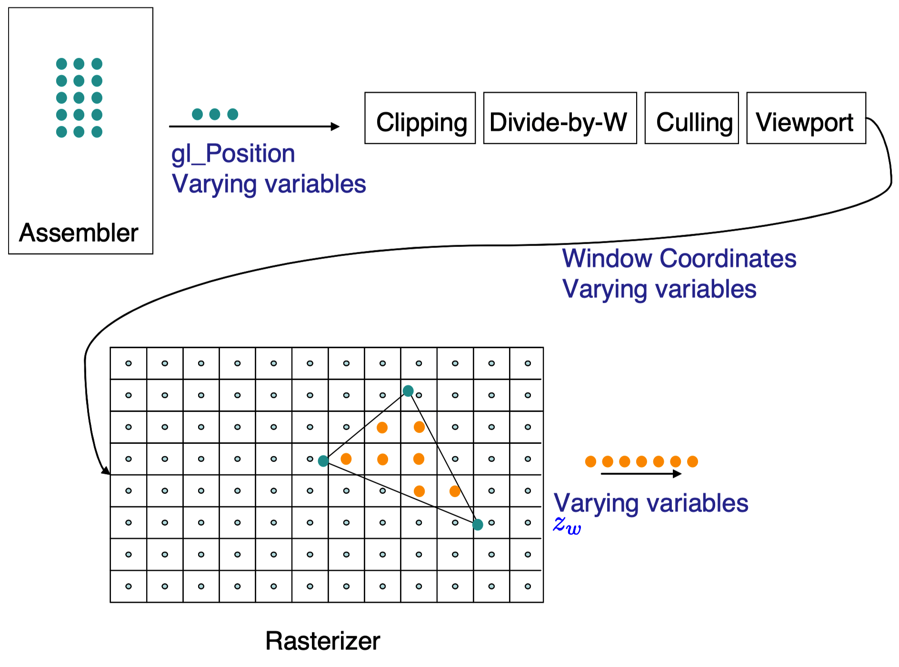
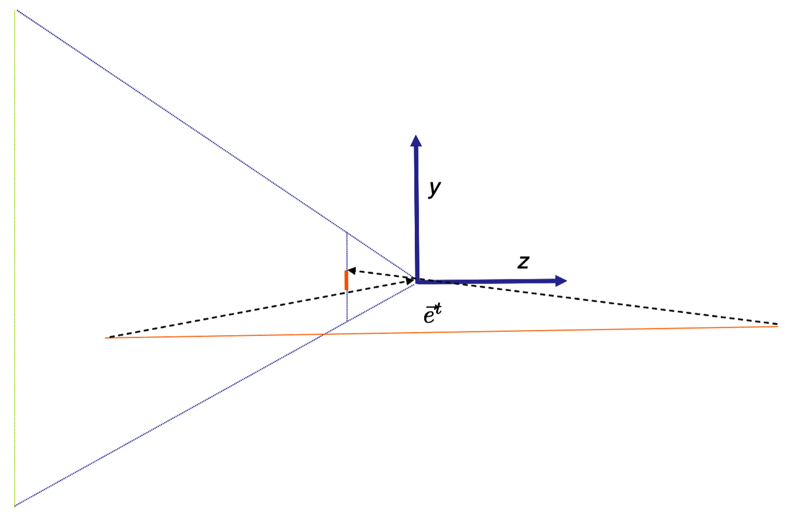

# 从顶点到像素的阶段（From Vertex to Pixel）
一旦用户指定了一个三角形的三个顶点，同时这些顶点已经经历了顶点着色器（vertex shader）阶段，这些数据现在会通过一系列固定组合（a fix set）的由OpenGL完成的处理步骤。这种处理决定了三角形应该被放置到屏幕上何处，那些像素应该位于三角形内，还有变异变量（varying variable）数据的恰当地被插值的数值是什么。这种数据随后被传递到碎片着色器（fragment shader）中作更多的处理以决定最终的色彩。本章中，我们探索三角形从顶点到像素的一些变换细节。我们不会详细叙述这些细节，但是尝试指出最有趣的部分。在图示$\text{Figure 12.1}$中，我们展示了在本章中讲述的这些步骤如何适应渲染管线（rendering pipeline）。在本章和下一章中，我们将依赖一些并行函数（affine functions）的基本事实（知识）。并行函数的材料在附录B中被讲解。

**Figure 12.1:** 此处我们展示了渲染管线（rendering pipline）的一些步骤，这些步骤在本章中会被讲述（比较图示$\text{Figure 1.3 }$）

## 12.1 裁切阶段（Clipping）
裁切阶段的工作是处理完全或局部位于查看平截锥体（viewing frustum）之外的三角形。一些处理被完成是由于一个直接的理由-那就是我们希望抛弃看不见的几何体以最小化计算。但是，更重要的理由是，除非裁切被完成，否则我们会在跨越$z_e=0$的平面的三角形上出现问题（也就是说，在眼睛前后都有延伸）。

考虑图示$\text{Figure 12.2}$中的几何体（这里我们压制x方向以简化绘制）。本场景中，我们拥有一条单一的几何线段（在3D中，这会是一个三角形），其中一个顶点在眼睛前方而另一个在眼睛后方。假设我们应用第10章中的投射相机变换。前方的顶点会投射到接近底部的图像点，而后方的顶点会投射到接近底部的图像点。

如果，在屏幕上，我们只是绘制位于这些被投射的顶点之间的像素，我们会绘制在完全错误的区域。正确的渲染应该绘制始于靠近底部的被投射顶点，并且向下绘制直到到达图像的底部。

在计算机图像学中，解决这个问题最容易的方式是首先改变场景的几何形状，替换这种眼睛跨越的三角形为更小的不会延伸到眼睛后方的三角形（参考图示$\text{Figure 12.4}$）。这种步骤被称之为裁切（clipping）。实际上，我们依据视图平截锥体（frustum）的六个面裁切每个三角形，这六个面被近平面（near plane），远平面（far plane），以及“左、右、上、下”图像边缘所隐含限定。

针对这个问题，存在避免做任何几何裁切的方式。感兴趣的读者可以进一步阅读参考数目[52]。

## 用于裁切的坐标类型（Which Coordinates To Use）
We could do clipping in eye coordinates, but this processing would also need to know about the parameters of the camera projection, which is inconvenient. Conversely, testing in normalized device coordinates would be quite canonical: ultimately we would be happy if our triangles never left the canonical cube 
我们可以在眼睛坐标中裁切，但是这种处理方式也需要知晓相机投射的参数，这一点是不方便的。反过来讲，在标准化设备坐标中验证裁切条件会非常经典：这种环境中，如果我们的三角形不离开经典矩型区域，我们近很乐见。

$$ \begin{matrix} −1 < x_n < 1 \qquad\qquad\qquad\qquad(12.1) \\ −1 < y_n < 1 \qquad\qquad\qquad\qquad(12.2) \\ −1 < z_n < 1 \qquad\qquad\qquad\qquad(12.3)\end{matrix} $$

不幸的是，在我们得到标准化设备坐标（normalized device coordinates）之时，引起麻烦的翻转问题已经发生。

计算机图形学中常见的解决方案是在所谓的裁切坐标（clip coordinates）空间中进行裁切，正如上面所描述。在这些裁切坐标中，方程式（12.1）中所列出的经典验证条件被平移改变为：

$$\begin{matrix}
    −w_c < x_c < w_c  \\ −w_c < y_c < w_c \\ −w_c < z_c < w_c
\end{matrix}$$

Since we have not done any divisions yet, no flip can have happened yet. Our triangles in 3D eye space have simply mapped to triangles in 4D clip space.
因为我们还没做除法，就没有翻转问题发生。在3D眼睛空间（3D eye space）中的三角形只是被映射为4D裁切空间（4D clip space）中的三角形。

**Figure 12.2:** 在这个场景中，橙色地面线段在眼睛前后延伸。其顶点以虚线展示的样子投射到图像平面。如果像素填充在被投射顶点之间，我们将得到错误的图像。

## 裁切过程相关变量的更新（Updating The Variables）
这里裁切步骤的实际编码超越本书的内容（兴趣）。感兴趣的读者可以查阅参考书目[5]。但是这个处理通常在三角形穿过视图平截锥体（frustum）的地方生成“新”顶点。这里我们会对和这些新顶点关联的变量（的获得方式）进行解读。

新顶点以裁切坐标的方式进行计算，从而用于自己的4个新关联的裁切坐标$[x_c,y_c,z_c,w_c]^t$。每个新顶点和旧顶点一样，关联了针对每个变异变量类型的一个集合的值。

全部变异变量（varying variables）都表达了在对象坐标$[x_o,y_o,z_o]^t$上的并行函数（affine functions），因此，借助B.5节中的推理，这些变量在$(x_c,y_c,z_c,w_c)$上也是并行函数。从而，如果新顶点位于两个三角形顶点的路径的某个分数比例-$\alpha$处，我们只需以“路径的$\alpha$比例”方式插值变异变量，同时借助这些新值设置这个顶点的变异变量。

