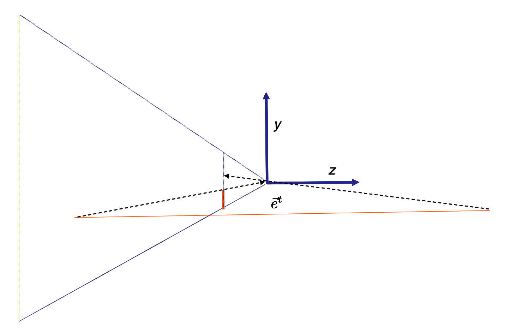
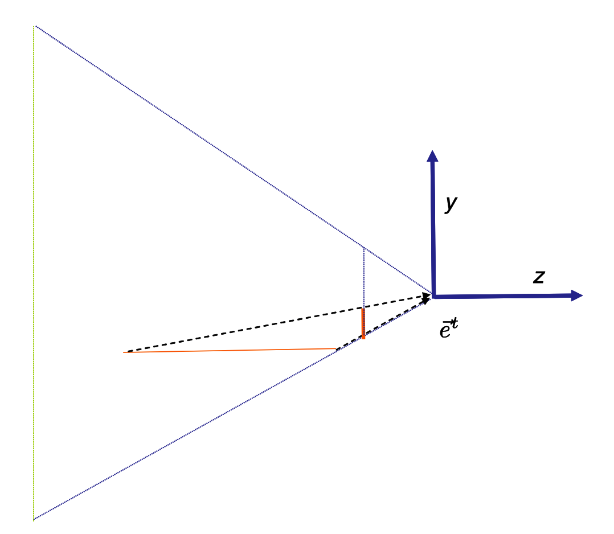
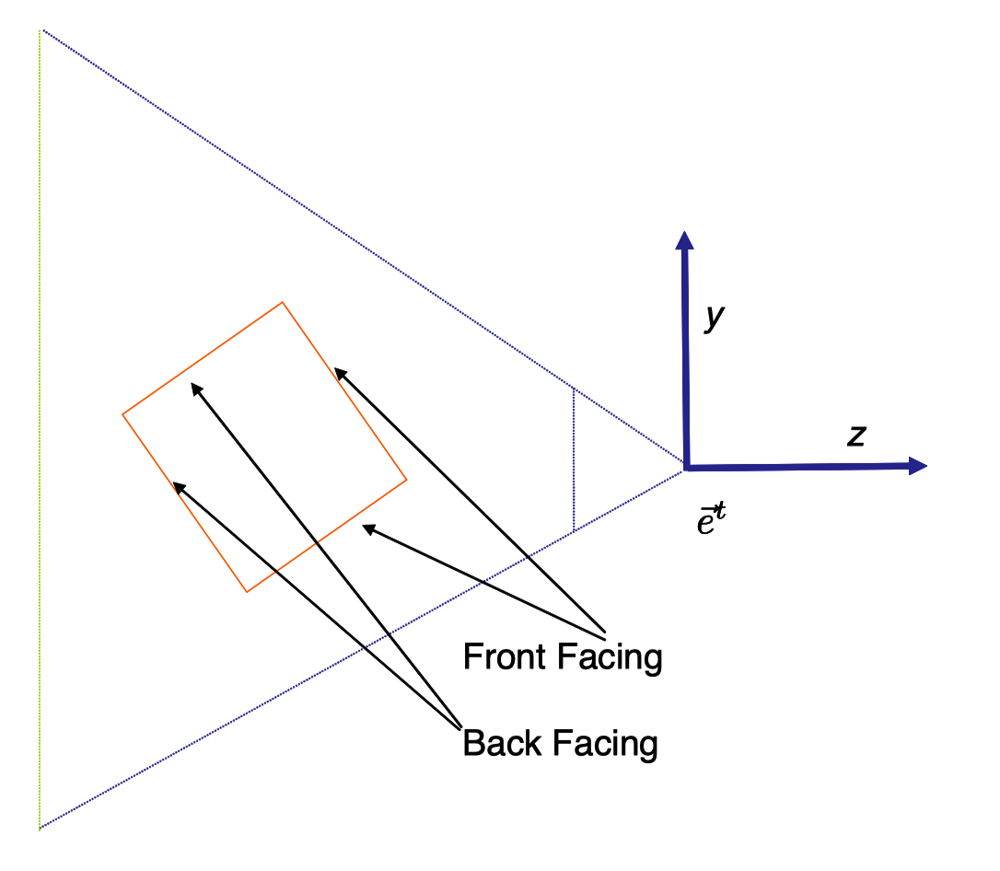
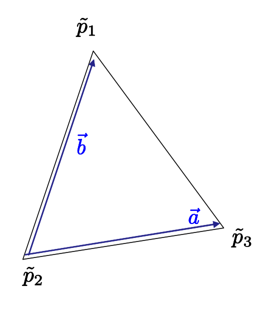
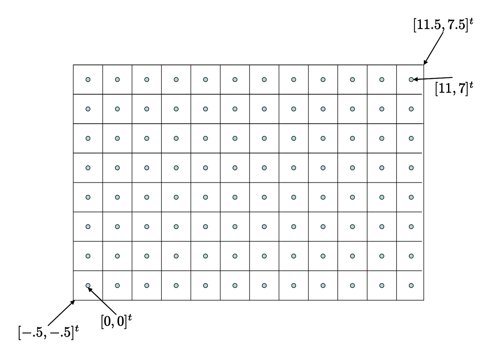
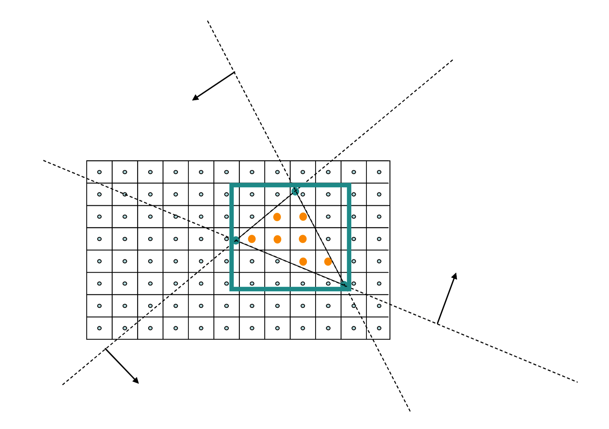

# Note
这是对**MIT Foundation of 3D Computer Graphics**第12章的翻译，本章讲解了（OpenGL）图形管线中三角形组装和光栅化过程阶段的一些实现原理。本书内容仍在不断的学习中，因此本文内容会不断的改进。若有任何建议，请不吝赐教ninetymiles@icloud.com 

> 注：文章中相关内容归原作者所有，翻译内容仅供学习参考。
> 另：Github项目[CGLearning](https://github.com/nintymiles/CGLearning)中拥有相关翻译的完整资料、内容整理、课程项目实现。

# 从顶点到像素的阶段（From Vertex to Pixel）
一旦用户指定了一个三角形的三个顶点，同时这些顶点已经经历了顶点着色器（vertex shader）阶段，这些数据现在会通过一系列固定功能组合（a fix set）组成的由OpenGL完成的处理步骤。这种处理决定了三角形应该被放置到屏幕上何处，哪些像素应该位于三角形内，还有变异变量（varying variable）数据被恰当地插值的数值是什么。这种数据随后被传递到碎片着色器（fragment shader）中作更多的处理以决定最终的色彩。本章中，我们探索三角形从顶点到像素的一些变换细节。我们不会详细叙述这些细节，但是尝试指出最有趣的部分。在图示$\text{Figure 12.1}$中，我们展示了在本章中讲述的这些步骤如何适应渲染管线（rendering pipeline）。在本章和下一章中，我们将依赖一些并行函数（affine functions）的基本事实（知识）。并行函数的材料在附录B中被讲解。

**Figure 12.1:** 此处我们展示了渲染管线（rendering pipline）的一些步骤，这些步骤在本章中会被讲述（比较图示$\text{Figure 1.3 }$）

## 12.1 裁切阶段（Clipping）
裁切阶段的工作是处理那些完全或局部位于查看平截锥体（viewing frustum）之外的三角形。一些处理被执行是由于一个直接的理由——那就是我们希望抛弃看不见的几何体以最小化计算。但是，更重要的理由是，除非裁切被完成，否则我们会在跨越$z_e=0$的平面的三角形上出现问题（也就是说，在眼睛前后都有延伸）。

考虑图示$\text{Figure 12.2}$中的几何体（这里我们压制x方向以简化绘制）。本场景中，我们拥有一条单一的几何线段（在3D中，这会是一个三角形），其中一个顶点在眼睛前方而另一个在眼睛后方。假设我们应用第10章中的投射相机变换。前方的顶点会投射到接近底部的图像点，而后方的顶点会投射到接近底部的图像点。

如果，在屏幕上，我们只是绘制这些位于被投射的顶点之间的像素，我们会绘制在完全错误的区域。正确的渲染应该绘制始于靠近底部被投射的顶点，并且向下绘制直到到达图像的底部，就如图示$\text{Figure 12.3}$ 所示。

在计算机图像学中，解决这个问题首先想到的最容易方式就是首先改变场景的几何形状，替换这种跨越眼睛的三角形为更小的不会延伸到眼睛后方的三角形（参考图示$\text{Figure 12.4}$）。这种步骤被称之为裁切（clipping）。实际上，我们依据视图平截锥体（frustum）的六个面裁切每个三角形，这六个面被近平面（near plane），远平面（far plane），以及“左、右、上、下”图像边缘所隐含限定。

针对这个问题，存在避免做任何几何裁切的方式。感兴趣的读者可以进一步阅读参考书目[52]。

**Figure 12.2:** 在这个场景中，橙色地面线段在眼睛前后延伸。其顶点以虚线展示的样子投射到图像平面。如果像素填充在被投射顶点之间，我们将得到错误的图像。

**Figure 12.3:** 正确的图像将绘制像素从地面显示在眼睛前面顶点的投射处开始一直到图像的底部。

**Figure 12.4:** 正确的绘制通过裁切地面几何体，将其替换为更小的不离开查看平截锥体（viewing frustum）的线段来完成。

## 用于裁切的坐标类型（Which Coordinates To Use）
我们可以在眼睛坐标中裁切，但是这种处理方式也需要知晓相机投射的参数，这一点是不方便的。反过来讲，在标准化设备坐标中验证裁切条件会非常经典：这种环境中，如果我们的三角形不离开经典立方体（canonical cube）区域，我们将很乐见这种情形。

$$ \begin{matrix} −1 < x_n < 1 \qquad\qquad\qquad\qquad(12.1) \\ −1 < y_n < 1 \qquad\qquad\qquad\qquad(12.2) \\ −1 < z_n < 1 \qquad\qquad\qquad\qquad(12.3)\end{matrix} $$

不幸的是，在我们得到标准化设备坐标（normalized device coordinates）之时，引起麻烦的翻转问题已经发生。

计算机图形学中常见的解决方案是在所谓的裁切坐标（clip coordinates）空间中进行裁切，正如上面所描述。在这些裁切坐标中，方程式（12.1）中所列出的经典验证条件被平移改变为：

$$\begin{matrix}
    −w_c < x_c < w_c  \\ −w_c < y_c < w_c \\ −w_c < z_c < w_c
\end{matrix}$$

因为我们还没做除法，就没有翻转问题发生。在3D眼睛空间（3D eye space）中的三角形只是被映射为4D裁切空间（4D clip space）中的三角形。

## 裁切过程相关变量的更新（Updating The Variables）
这里裁切步骤的实际编码超越本书的内容（兴趣）。感兴趣的读者可以查阅参考书目[5]。但是这个处理通常在三角形穿透视图平截锥体（frustum）的地方生成“新”顶点。这里我们会对和这些新顶点关联的变量（的获得方式）进行解读。

新顶点以裁切坐标的方式进行计算，从而其自身拥有4个新关联的裁切坐标为$[x_c,y_c,z_c,w_c]^t$。每个新顶点和旧顶点一样，关联了针对每个变异变量（varying variables）的一个值集合（a set of values）。

全部变异变量（varying variables）都表达了在对象坐标$[x_o,y_o,z_o]^t$上的并行函数（affine functions），因此，借助B.5节中的推理，这些变量在$(x_c,y_c,z_c,w_c)$上也是并行函数。从而，如果新顶点位于两个三角形顶点的路径的某个分数比例-$\alpha$处，我们只需以“路径的$\alpha$比例（$\alpha$ of the way）”方式插值变异变量，同时借助这些新值设置这个顶点的变异变量。

## 12.2 背向面剔除（Backface Culling）
假设我们正在借助三角形绘制一个封闭固态物体，比如一个立方体。让我们标记每个三角形的两面为“前面”和“背面”。不管我们如何转动立方体，我们将绝不会看到任何三角形的背面，因为它必然被某个我们正在观察的三角形的前面所阻挡。（参考图示$\text{Figure 12.5}$）。如此，我们也可以尽可能地剔除这些背后面向的多边形。并且完全不绘制他们。对于“非水密”（可透水）几何模型，我们可能希望看到一个三角形的两边；在这种情形中，背面剔除（backface culling）就会不合适。

在OpenGL中，背面剔除通过调用`glEnable(GL_CULL_FACE)`开启。对于每个面，我们需要以某种方式告知OpenGL哪个面是前面，哪个面是背面。要做到这样，我们借助排序3个顶点顺序的方式，这种方式保证当我们观看其前面时，顶点是反时针方向（counter clockwise CCW）。当绘制每个三角形时，我们在顶点缓存对象（vertex buffer object）中使用这种顶点排序。

借助顶点的标准化设备坐标（normalized device coordinates），现在OpenGL可以轻松地在当前图像中确定我们正在观察一个三角形的哪一面。这里展示了这是如何做到的（参考图示$\text{Figure 12.6}$）。让$\tilde{p_1},\tilde{p_2},\tilde{p_3}$为被投射到$(x_n,y_n,0)$平面上三角形的3个顶点。定义矢量$\vec{a}=\tilde{p_3}-\tilde{p_2}$和$\vec{b}=\tilde{p_1}-\tilde{p_2}$。接着计算向量积（cross product）$\vec{c}=\vec{a} \times \vec{b}$。如果3个顶点在平面上是反时针方向排序，那么$\vec{c}$将朝向$+z_n$方向。否则它将会朝向$-z_n$方向。总之，所有我们需要做的事情就是以标准化设备坐标（normalized device coordinates）计算向量积的z坐标。当所有尘埃落定，这个坐标为

$$\large{ (x_n^3 − x_n^2 )(y_n^1 − y_n^2 ) − (y_n^3 − y_ n^2 )(x_n^1 − x_n^2 ) \qquad\qquad (12.4) }$$

要验证是否3个顶点是反时针方向，我们只要计算方程（12.4）的值即可。如果值为正则当从相机视角观看时顶点为反时针方向。

**Figure 12.5:** 当绘制一个封闭物体，前面的背面绝不会被观察到。

**Figure 12.6:** 当从这个面观看时，顶点以反时针顺序被给出。向量积（cross product）$\vec{a} \times \vec{b}$ 指向离开页面的方向。

## 12.3 视口变换（Viewport）
当前，我们希望将我们的三角形定位在图像屏幕上并且决定哪些像素会位于三角形内。因此，我们希望从抽象设备坐标（normalized device coordinates）变换到所谓的窗口坐标（window coordinates），在其上每个像素中心拥有一个整型坐标（integer coordinate）。这会让随后的像素计算更加自然。

回忆一下，在标准化设备坐标（normalized deviec coordinates）中，我们图像的范围是经典正方形（canonical square），拥有左下角坐标$[-1,-1]^t$,右上角坐标$[1,1]^t$。现在让我们假设我们的窗口为W像素宽和H像素高。我们想让左下角像素中心拥有一个值为$[0,0]^t$的2D窗口坐标,右上角像素中心拥有$[W-1,H-1]^t$坐标。我们认为每个像素拥有范围为正负0.5像素单位长度的，在水平和垂直方向延伸的不动产建筑（real estate）。因此，在这个模型中，我们认为每个像素为一个1像素乘1像素的单位正方型（unit square），其中心为整型坐标（integer coordinates）。如此被所有像素组合在一起所覆盖的2D窗口矩型就是从从左下角$[-0.5,-0.5]^t$到右上角$[W-0.5,H-0.5]^t$的窗口坐标。参考图示${\text{Figure 12.7}}$。

现在所有我们需要做的就是执行合适的水平和垂直伸缩及平移合成变换，以便于它将经典正方形映射为窗口矩型。我们可以验证下面的矩阵提供了（唯一）方案：

$$ \Large{ \begin{bmatrix} x_w \\ y_w \\ z_w \\ 1  \end{bmatrix} = 
\begin{bmatrix} W/2 & 0 & 0 & (W-1)/2 \\ 0 & H/2 & 0 & (H-1)/2 \\ 0 & 0 & 1/2 & 1/2 \\ 0 & 0 & 0 & 1  \end{bmatrix} 
\begin{bmatrix} x_n \\ y_n \\ z_n \\ 1  \end{bmatrix} }  \large{  \qquad\qquad (12.5)}
$$

此矩阵被称为视口矩阵（viewport matrix），并且它实现了视口变换（viewport transformation
）。在OpenGL中，我们借助API调用`glViewport(0,0,W,H)`设置视口矩阵。

（还有一个我们不会使用的功能性等价模型，但是经常用于OpenGL文档中，定义窗口x,y坐标范围为从$[0,0]^t$到$[W,H]^t$，同时认为每个像素中心拥有半整型坐标（half-integer coordinates）。在这种模型中，我们使用一个不同的矩阵，同时我们也借助了不同的坐标用于定位像素。）

这个矩阵的第三行被用于映射$z_n$值原本的$[-1..1]$范围到更方便的$[0..1]$范围。因此在我们的习惯中，$z_w = 0$为远值，$z_w = 1$为近值。从而当清理z-buffer时，我们也必须告诉OpenGL这种情形，我们应该将其设置为0；通过API调用`glClearDepth(0.0)`来实现。

**Figure 12.7:** 一种12像素宽8像素高的图片的窗口坐标（window coordinates）的几何形状。

### 12.3.1 纹理视口变换（Texture Viewport）
由于某种（可能不太好的）原因，纹理的抽象域不是经典正方形（canonical square），而是单位正方形（unit square），以$[x^t,y^t]^t$纹理坐标表示。其左下角为$[0,0]^t$,右上角为$[1,1]^t$。再次假设纹理图像为W像素宽乘H像素高，在这种情形中，坐标变换矩阵为
$$ \Large{ \begin{bmatrix} x_w \\ y_w \\ - \\ 1  \end{bmatrix} = 
\begin{bmatrix} W & 0 & 0 & -1/2 \\ 0 & H & 0 & -1/2 \\ - & - & - & - \\ 0 & 0 & 0 & 1  \end{bmatrix} 
\begin{bmatrix} x_t \\ y_t \\ - \\ 1  \end{bmatrix} }  \large{  \qquad\qquad (12.6)}
$$

这些带有多个“1/2”字样的细节可能看起来有点吹毛求疵，但是如果你想要确切知道你的图像中像素在哪里，那么理解它们就是关键的。

## 12.4 光栅化（Rasterization）
光栅化是一种接受三角形的顶点同时填充进像素的处理。始于三角形3个顶点的窗口坐标，光栅化器（rasterizer）需要指出哪些像素中心（pixel-centers）位于三角形内。（随后在小节16.3中，我们将探索借助一个像素正方形区域内多个空间样本以确定其色彩的可能性）。

存在很多光栅化方式，在这些方式中光栅化既可以用硬件也可以用软件来实现。举个例子，这里是一种简单暴力方式（simple brute force approach）。参考图示$\text{Figure 12.8}$。每个屏幕上的三角形可以被定义为3个半屏面（half-planes）。每个这样的半平面被一条线定义，其重合于三角形的一条边，并且可以借助如下的“边缘函数（edge function）“被验证 

$$\Large{ edge = ax_w + by_w + c }$$

这里(a,b,c)是依赖于边缘（函数）几何形状的常量。在一个拥有坐标$[x_w,y_w]^t$的像素上的这种函数的一个正值意味着这个函数位于指定的半空间（halfspace）之内。如果所有三个检测都通过，那么这个像素位于三角形内。

这种暴力方式可以以多种方式被加速。举个例子，我们可以借助3个顶点坐标$(x_w,y_w)$的最小和最大值确定一个三角形的约束盒子（bounding box）。只有位于这个约束盒子内的像素才需要被检测。

另外，要减少“像素在三角形内（pixel-in-triangle）”检测的次数，存在多种方式去设计一种简单保守检测（simple conservative test），用以确定是否一整块像素完全位于或者超出一个三角形。只有当这种检测不确定时，单独的像素才需要被检测。作为另一种优化，我们注意到一旦我们在一个像素上评估了这样一个线性函数（linear function），我们就可以在临近像素上以渐增的方式进行评估。举个例子，当我们水平地移动一个像素，我们只需要给被评估的边缘函数增加一个a值的数量。

作为光栅化的输入，每个顶点同时拥有和其关联的辅助数据（auxiliary data）。这个数据包含一个$z_w$值，同时还有被关联的其它值，但是不同于变异变量（varying variables），参考第13章。线性插值（linearly interpolate）这种数据也是三角形上光栅化器（rasterizer）的工作。

每个被线性插值（linearly interpolated）的这样的值v，都可以被表达为如下形式的在屏幕空间上的并行函数

$$\Large{ v = ax_w + by_w + c   \qquad\qquad } \large{(12.7) }$$

(a, b, c) 常量可以借助附录B种方程式（B.2）被确定。并行函数可以轻松地在每个像素上被光栅化器评估。确实，和刚才所说的边缘检测函数的评估没有区别。

在光栅化过程中，仔细对待边缘情形（boundary cases）是重要的。实际上，假设沿着同一个边缘的一个网格（mesh）上的两个三角形，其投射刚好落在一个像素上。如果这个像素不被绘制，那么一个缝隙就会出现在被投射的网格上。如果这个像素被绘制两次，在我们借助alpha混合（belnding）建模透明（transparency）时就可能引起问题（参考小节16.4）。边缘规则（boundary rules）必须仔细地被实现，以确保这样一个像素仅被这对三角形绘制一次。

三角形光栅化的相关主题为线/曲线（line/curve）光栅化。在这种情形中，我们不会寻找这种类似的位于一个三角形形状”之内“的像素，而是寻找“接近（near）”一个1D形状的像素。因此即便定义这种问题都有一点更难以理解（trickier），所有此处我们不会深入进去。有兴趣的读者可以参考[5]。

**Figure 12.8:** 我们可以将一个三角形看作由3个半平面（half-planes）相交而成（虚线表达），每个半平面被一个线性函数（linear function）定义。我们依靠这3个函数检测每个像素。我们仅需针对三角形的轴对齐的约束盒子（bounding box）内的像素进行检测。

