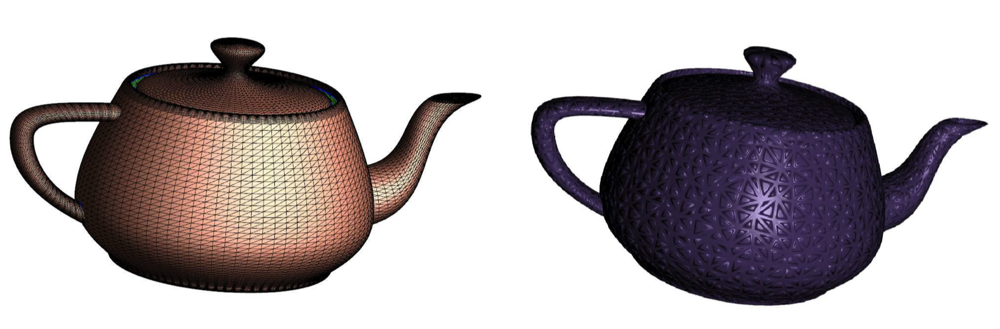
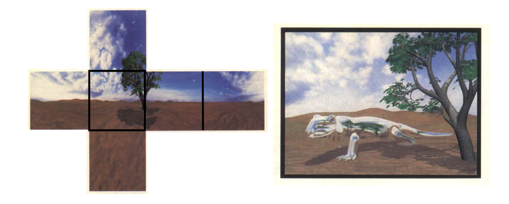
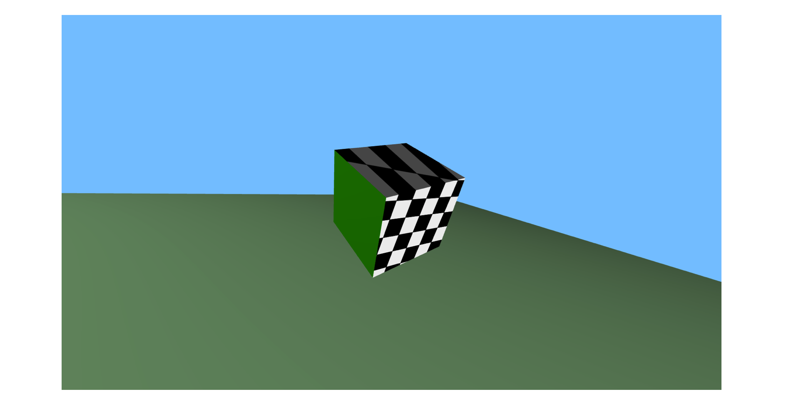
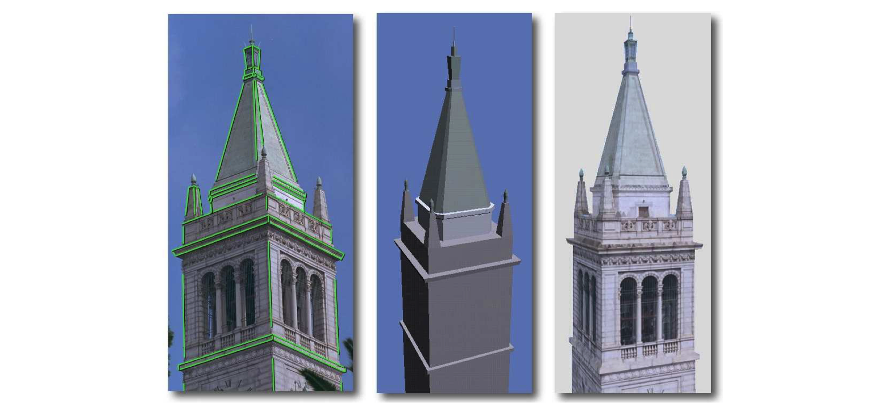
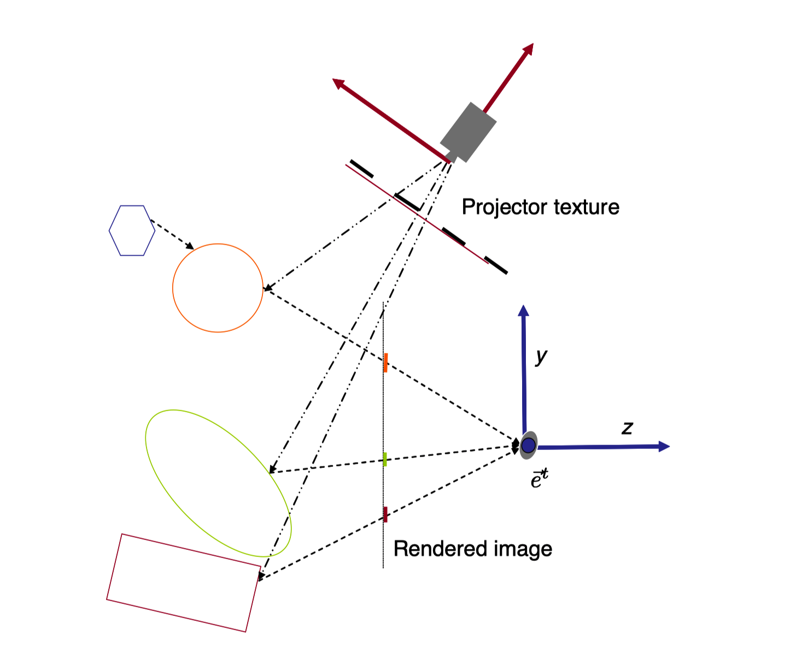
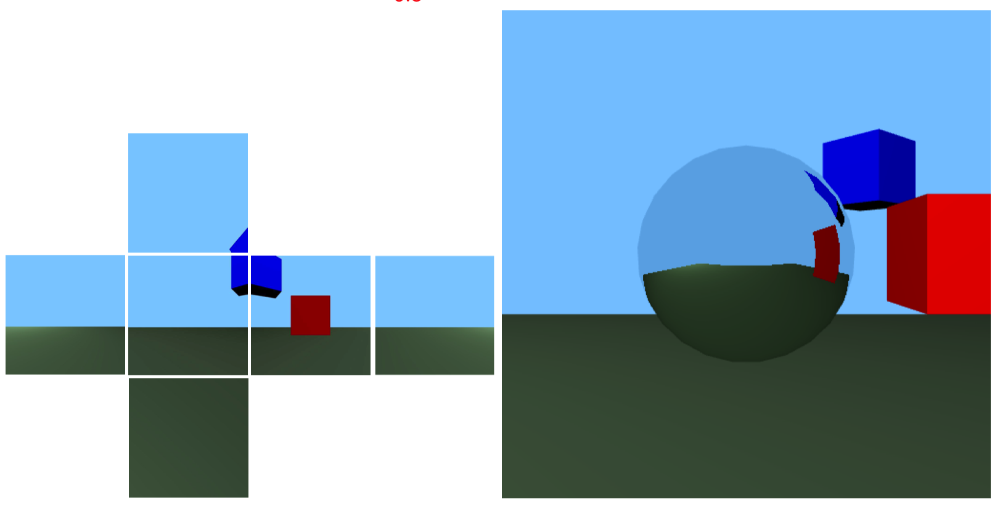
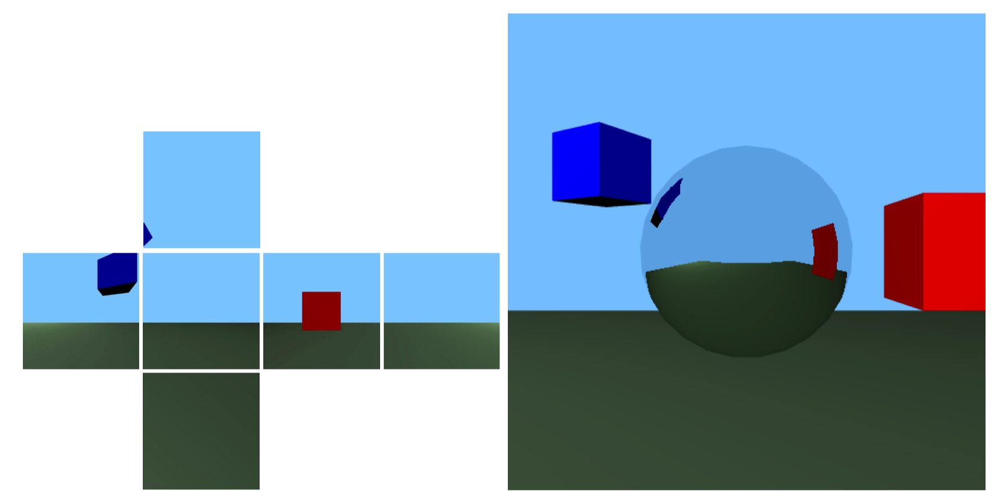
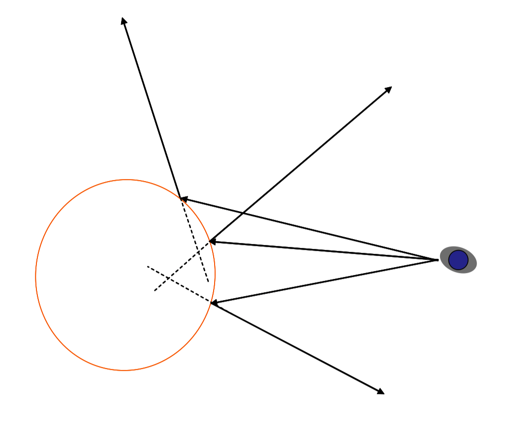
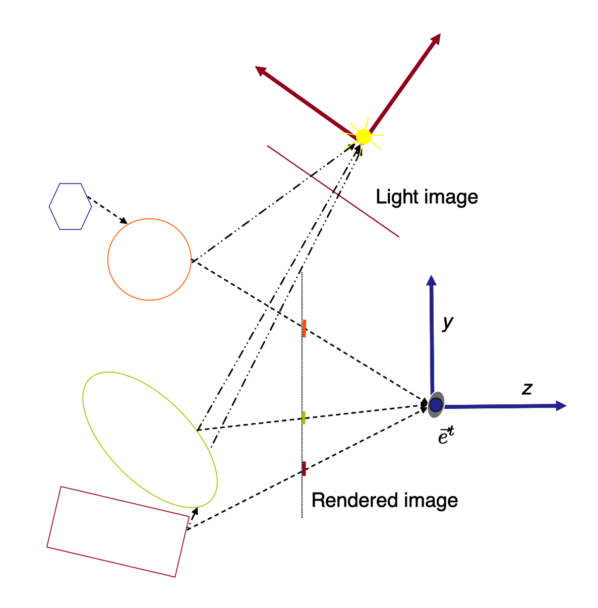
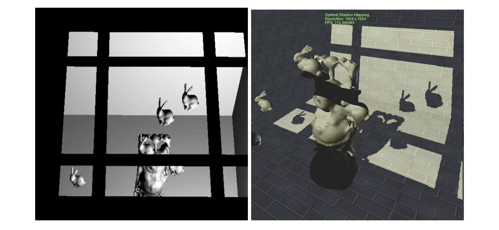

# Note
这是对**MIT Foundation of 3D Computer Graphics**第15章的翻译，本章讲解了纹理映射的基本概念以及多种纹理映射技术的基础。本书内容仍在不断的学习中，因此本文内容会不断的改进。若有任何建议，请不吝赐教ninetymiles@icloud.com 

> 注：文章中相关内容归原作者所有，翻译内容仅供学习参考。
> 另：Github项目[CGLearning](https://github.com/nintymiles/CGLearning)中拥有相关翻译的完整资料、内容整理、课程项目实现。

# 纹理映射（Texture Mapping）
在第14章中，我们看到了在光和材料之间的一个简单交互模型是如何被用来计算一个像素的色彩。在碎片着色器（fragment shader）中还有一种常常被用来计算一个像素色彩的重要工具，就是从一个被称作纹理的辅助图像中提取数据。在本章中我们会探索基本纹理映射行为（basic texture mapping），同时还会包含它的多个变体。这样的技术正是让我们的渲染显得细致和内容丰富的主要工具。

图示$\text{Figure 15.1}$展示了一个纹理映射的简单例子。在其左侧，我们看到了一个用几十个三角形构成的简单模型。其中一个三角形被高亮为红色。我们给每个三角形的每个顶点关联一个纹理坐标$x_t,y_t$（参考图示上部）。这些坐标“映射”每个顶点到纹理中的某个位置。纹理坐标随后在三角形范围内被插值（参考图示底部），如此就针对每个像素给出了纹理坐标。碎片着色器（fragment shader）随后抓取被纹理坐标所指向的纹理色彩，并且将其发送到帧缓存（framebuffer）。最终被渲染的图像展示在图示的右侧。

## 15.1 基础纹理映射 （Basic Texturing）
基础纹理映射中，我们只是“粘贴”一个图像的局部到一个三角形上，这个动作通过在三角形的三个顶点上指定纹理坐标的方式完成。在这个模型中，我们假设每个变量$x_t$和$y_t$都是一个三角形上的函数，而这些函数在对象坐标上具有并行的特点。这种情形允许我们在粘合过程中平移、选择（甚至缩放和切削）纹理图片。

用于加载一个纹理的代码在附录小节A.4中已经被描述。正如在那里所讲的，一个uniform变量被用于指向想要的纹理单位，这个纹理单位对于在这个绘制调用中的所有像素都是相同的。变异变量（varying variables）被用于在顶点上存储纹理坐标，这些纹理坐标指向纹理中某个特定2D地址。

下面，我们描述相关的用于基础纹理映射所需的着色器（shaders）。在这个基础的纹理映射例子里，顶点着色器（vertex shader）只是将纹理坐标作为变异变量传递到碎片着色器（fragment shader）中。

```glsl
#version 330
uniform mat4 uProjMatrix; 
uniform mat4 uModelViewMatrix;

in vec2 aTexCoord; 
in vec4 aVertex;

out vec2

vTexCoord;
void main(){ 
	vTexCoord = aTexCoord; 
	gl_Position = uProjMatrix * uModelViewMatrix * aVertex; 
}
```

下面列出的碎片着色器（fragment shader）接着使用这些被插值的纹理坐标来从纹理中寻找想要的色彩数据，并且将其设置到帧缓存（framebuffer）中。

```glsl
#version 330
uniform sampler2D uTexUnit0;

in vec2 vTexCoord; 

out fragColor

void main(){ 
	vec4 texColor0 = texture2D(uTexUnit0, vTexCoord); 
	fragColor = texColor0; 
}
```

数据类型sampler2D是一种特殊的GLSL数据类型，用于指向一个OpenGL纹理单位（texture unit）。对texture2D的调用会获取来自纹理单位的一个色彩值。

在这种最简单的理想化情形中，我们只是从纹理中获取r、g、b的数值并且直接发送它们到帧缓存（framebuffer）中。可选地，纹理数据可以被解释为，比方说，不同的表面点的材料色，这然后会跟着被在14.2节中所描述的漫射表面计算所使用。


**Figure 15.1:** 顶部：一个三角形的每个顶点都被给出x，y纹理坐标。这些坐标指向纹理图像中。底部：这些坐标在像素解析时作为变异变量（varying variables）被插值。在碎片着色器（fragment shader）中，我们通过这些纹理坐标抓取其所指向的色彩，同时在渲染中使用这个色彩（右侧）。参考[65],ACM。

## 15.2 法线映射（Normal Mapping）
来自一个纹理的数据也可以更有趣的方式被解读。在法线映射中，来自一个纹理的r、g、b数值被解读为当前点的法线的3个坐标。这种法线数据随后会被用作某种材料模拟计算的一部分，就如在14章中所描述的。参看这种情形的实例图示$\text{Figure 15.2}$

法线数据有3种坐标值，每个都位于范围$[-1..1]$,而RGB纹理存储的3个数值，每个都处于范围$[0..1]$。因此，法线数据在被存储为纹理之前需要被转换为这种格式，就如在代码`r = normal_x/2. +.5;`中的转换。反之，你的碎片着色器（fragment shader）就需要恢复这种转换，就如在代码`normal_x = 2r-1;`中的转换。


**Figure 15.2:** 在左侧，我们展示了一个茶壶模型的渲染。茶壶被使用平滑插值的法线着色，同时三角形边缘被展示。(©️Hugues Hoppe)。在右侧，我们展示了相同的表面，但是现在茶壶却是被来自高解析度纹理中所提取的法线域所渲染。这些法线被使用在光照计算中。并且给出了高解析度几何细节效果。参考[54],©️ACM。

## 15.3 环境立方体映射（Environment Cube Maps）
纹理也可以在围绕被渲染物体的距离上建模环境。在这种情形中，我们通常使用6个正方形纹理表达一个环绕场景的大立方体的面。每个纹理像素表达顺着环境中一个方向看过去的色彩。这就被称为立方体映射。GLSL提供了一个专门用于立方体纹理（cube-texture）目的的数据类型-samplerCube。在一个点的着色过程中，我们将那个点的材料处理为一个完美镜面并且从合适的入射方向获取环境数据。一个例子被展示在图示$\text{Figure 15.3}$中。

要实现这个思路，我们采用方程（14.1）来计算被反射的查看矢量$B(\vec{v})$。这个反射矢量会指向环境方向，这个方向会在镜面化的表面被观察到。通过借助这个方向查找立方体纹理映射，我们给予了这个表面一个镜子的外观。

```
#version 330 

uniform samplerCube texUnit0;

in vec3 vNormal; 
in vec4 vPosition;

out fragColor;
vec3 reflect(vec3 w, vec3 n){
	return - w + n * (dot(w, n) * 2.0); 
}

void main(void){
	vec3 normal = normalize(vNormal); 
	vec3 reflected = reflect(normalize(vec3(-vPosition)), normal); 
	vec4 texColor0 = textureCube(texUnit0,reflected);

	fragColor = vec4(texColor0.r, texColor0.g, texColor0.b, 1.0);
}
```
在眼睛坐标中，眼睛的位置和原点重合，因此`-vPostion`表达了查看矢量$\vec{v}$。textureCube为一个特殊的GLSL函数，这个函数接收一个方向矢量同时返回立方体纹理映射中在这个方向上所存储的色彩。

这段代码中，我们的所有矢量被以眼睛坐标的方式表达，同时我们也假设立方体纹理以眼睛坐标方式表达环境数据。比方说，如果我们的环境纹理正在用世界坐标表达方向，那么被渲染点的恰当坐标需要被传递到碎片着色器（fragment shader）。

这种完全相同的思路，除了代替镜面反射建模折射外，已经被用于生成图示$\text{Figure 22.4}$中的喷泉图像。


**Figure 15.3:** 在左侧，环境被存储为一个立方体纹理（cube texture）。其被用来渲染一个镜面化的蜥蜴。参考[25],©️IEEE。

## 15.4 投影仪纹理映射（Projector Texture Mapping）
经常我们会想以投影仪模型去粘贴我们的纹理到三角形上，而不是采用在15.1节中所述的并行粘贴模型。例如，我们可能希望模拟滑动投影仪照亮空间中的某些三角形。（参考图示$\text{Figure 15.4}$）。这种行为并不像其刚出现时那样不正常。例如，假设我们已经拍摄了一张建筑的正面照片，随后希望恰当地将其粘贴到建筑的电子3D模型之上。要完成这种粘合动作，我们应反转相机成像处理的几何过程-通过在相对于建筑的相同位置将相机替换为虚拟滑动投影仪的方式。

在滑动投影仪映射中，滑动投影仪被借助$4\times 4$模型试图（modelview）矩阵-$M_s$和投射（projection）矩阵-$P_s$建模。确定了如下关系：

$$\large{ 
	\begin{bmatrix} x_tw_t \\ y_tw_t \\ z_tw_t \\ w_t \end{bmatrix} 
	=
	P_sM_s \begin{bmatrix} x_o \\ y_o \\ z_o \\ 1 \end{bmatrix} 
	\qquad (15.1) 
}$$

那么让投影仪映射的纹理坐标（texture coordinates）被定义为$x_t = x_tw_t/w_t,y_t = y_tw_t/w_t$。要为使用对象坐标$[x_o,y_o,z_o,1]^t$表达的一个三角形上的点着色，我们就获取存储在地址$[x_t,y_t]^t$处的纹理数据。参考图示$\text{Figure 15.6}$

由于除以$w_t$的除法，$x_t$和$y_t$值不是$(x_o,y_o,z_o)$上的并行函数（affine functions），因此如果直接借助变异变量（varying variable）实现将不会被正确恰当地插值。但是，根据小节B.5，我们知道，确实，这3个量$x_tw_t,y_tw_t$和$z_tw_t$全都是$(x_o,y_o,z_o)$上的并行函数（affine fuctions）。如此当被实现为变异变量时（varying variables）这些数量将被正确地插值。在碎片着色器（fragment shader）中，我们需要除以$w_t$以获得真实的纹理坐标。

当进行投影仪纹理映射时，我们不需要传递任何纹理坐标为属性变量到顶点着色器（vertex shader）中。我们只是使用对我们来说已经可用的对象坐标（object coordinates）。但是我们确实需要传入-借助uniform变量-必需的投影仪矩阵。我们的顶点着色器（vertex shader）代码的相关部分列出在下面。

```
#version 330 
uniform mat4 uModelViewMatrix; 
uniform mat4 uProjMatrix;
uniform mat4 uSProjMatrix; 
uniform mat4 uSModelViewMatrix;

in vec4 aVertex; out vec4 avTexCoord;

void main(){ 
	vTexCoord= uSProjMatrix * uSModelViewMatrix * aVertex; 
	gl_Position = uProjMatrix * uModelViewMatrix * aVertex; 
}
```

同时还有碎片着色器的代码也被列于这里。

```
#version 330
uniform sampler2D vTexUnit0;

in vec4 vTexCoord; 
out fragColor

void main(void){ 
	vec2 tex2; 
	tex2.x = vTexCoord.x/vTexCoord.w; 
	tex2.y = vTexCoord.y/vTexCoord.w; 
	vec4 texColor0 = texture2D(vTexUnit0, tex2); 
	fragColor= texColor0; 
}
```

> 全解密：要产生图示$\text{Figure 15.4}$的图像，在顶点着色器（vertex shader）中，我们还要计算在投影仪的“眼睛”坐标中位于其每个顶点上的法线。一个漫射光照方程式随后被加入我们的碎片着色器（fragment shader）以调和纹理色。最终，图像中顶面比最右侧面要模糊一点。

OpenGL体贴地给了我们一个专有的调用`texture2DProj(vTexUnit0, pTexCoord)`，这个调用实际上替我们实现了（透视）除法。当我们设计滑动投影仪矩阵`uSProjMatrix`时，不方便的是，我们不得不处理这个事实（就如在小节12.3.1中所描述）- OpenGL中的经典纹理图像域为单位方形域（unit square）其左下和右上角分别拥有坐标$[0,0]^t$和$[1,1]^t$,而不是经典方形域（canonical square）其坐标范围为用于显示窗口的$[-1,-1]^t$和$[1,1]^t$。因此被传递给顶点着色器（vertex shader）的恰当的投影仪矩阵会是这种形式`makeTranslation(Cvec3(0.5,0.5,0.5)) * makeScale(Cvec3(0.5,0.5,1)) * makeProjection(...)`。


**Figure 15.4:** 棋盘图像被滑动投射到立方体的前脸和顶面。


**Figure 15.5:** 左侧：实际相片。中间：渲染的几何模型。右侧：用投影仪纹理映射渲染的图像。来自参考书目[15]，©️ACM。


**Figure 15.6:** 在投影仪纹理映射中，要确定一个在“眼睛”相机中观察到的点的色彩，我们将这个点映射到“投影仪图片（projectors image）”中的一个对应点。来自这个纹理的色彩被用于给这个点着色。

## 15.5 多通道（Multipass）
更多有趣的渲染效果可以在场景几何体之上借助多渲染通道方式获得。在这种方式中，所有通道除了最后通道（final pass）外都被离线存储且不被绘制到屏幕之上。要实现这种方式，数据会被渲染到被称作frameBufferObject（帧缓存对象）-也称为FBO-的某种数据结构中。渲染之后，FBO数据随后被加载为一个纹理（texture），因此可以作为下一个渲染通道（rendering pass）的输入数据。关于FBOs的编码细节，可以从查阅参考书目[53]开始。

### 15.5.1 反射映射（Reflection Mapping）
反射映射是多通道渲染的简单例子。这种情形中，我们想让一个被渲染对象（物体）被镜面化并且反射出场景的其余（物体）。要完成这种渲染，我们首先渲染场景的其余部分-这个场景就如被从被镜面化对象的中心所观看的样子。因为场景是360度的，我们需要从被选择的这个视点渲染6个图像，分别看向右、左、前、后、上、下。这六个图像每个都有90度的垂直和水平视域（field of view）。

这种数据随后被转移到一个立方体映射（cube map）中。被镜面化的对象现在可以借助小节15.3中的立方体映射着色器（cube map shader）被渲染。参考图示$\text{Figure 15.7}$和图示$\text{Figure 15.8}$作为例子。这种计算并非完全正确的，因为环境映射存储场景的视图为仅从一个点所观看的角度。而同时，真正的反射现象需要从物体的每个点（参考图示$\text{Figure 15.9}$）观察合适的反射射线。然而，出于临时使用的目的，反射映射可能相当有效。


**Figure 15.7:** 在反射映射中，场景（地面和立方体）首先被渲染进一个立方体纹理中。这个纹理又被用作环境映射渲染出被镜面化球体。


**Figure 15.8:** 蓝色立方体被移动。立方体映射纹理被重新生成同时图像被重绘。


**Figure 15.9:** 要正确渲染一个被镜面化的球体，我们需要根据一系列不完全相交于一个点的反射线进行渲染。

### 15.5.2 阴影映射（Shadow Mapping）
在14章我们的简单材料计算中，一个点上的色彩计算不依赖场景中剩余的任何几何体。当然，在真实世界中，如果某种遮挡性的物体位于一个表面点和光源之间，这个点就处于阴影中因而会显得更暗。这种效果可以借助一种称作阴影映射（shadow mapping）的多通道技术被模拟。实现思路是首先从光的视角生成并存储一个z-buffer化的图像，随后比较我们从自己的视角所看到的和光在其视角所看到的。参考图示$\text{Figure 15.10}$。如果一个被眼睛看到的点没有被光看到，那么其中一定存在着某种遮挡性的物体，我们应该绘制那个点就如其处于阴影中。

在第一个通道中，我们将场景渲染到一个FBO中，这个场景就像从某个原点（origin）和点光源（point light source）位置重合的相机所观察到的一样。让我们用合适的矩阵，$P_s$和$M_s$建模这个相机变换为：

$$\large{ 
	\begin{bmatrix} x_tw_t \\ y_tw_t \\ z_tw_t \\ w_t \end{bmatrix} 
	=
	P_sM_s \begin{bmatrix} x_o \\ y_o \\ z_o \\ 1 \end{bmatrix} 
	\qquad (15.1) 
}$$

在第一个通道期间，我们借助模型视图矩阵（$M_s$）和投射矩阵（$P_s$）将场景渲染到一个FBO中。在这个FBO中，我们不存储点的色彩，而是存储其$z_t$值。由于z-buffer动作，存储在FBO中的一个像素上的数据表达沿着相关视线距离光源最近的几何体的$z_t$值。这个FBO随后被转移到一个纹理。

在第二个渲染通道期间，我们从眼睛视野渲染想要的图像，但是针对每个像素，我们查看是否我们正在观察的点也被光观察到，或是它是否在光视野中被某个更近的东西所阻挡。要做到这样，我们使用和在投影仪映射中相同的计算（在15.4节中）。以这样方式来做，在碎片着色器（fragment shader）中，我们能获得关联于$[x_o,y_o,z_o,1]^t$的变异变量（varying variables）$x_t,y_t$和$z_t$。随后我们比较这个$z_t$值和在纹理中存储在$[x_t,y_t]^t$中的$z_t$值。如果这些值一致（在一个小的精度容忍范围内），那么我们在观察一个同时被光源看到的点；这样一个点没有处于阴影中，应该被按照对应情形着色。反过来说，如果这些值不一致，那么我们观察的这个点在光图像中被阻挡，就位于阴影中，应该按照这种情形着色。参考样例图示$\text{Figure 15.11}$。


**Figure 15.10:** 在阴影映射中，我们首先从光视角渲染一个（FBO）图像。只有深度值被存储在这个图像中。在第二个通道，我们从我们眼睛的视野渲染场景。借助来自于投影仪纹理化动作，对于被眼睛观察到每个点，我们能够将与存储在光图像中的深度与当前点的光深度（light-depth）比较。如果这些值一致（橙色和绿色点），点就能被光看到，同时我们合适地为其上色。如果这些值不一致（紫色），那么这个点就被阻隔于光源，位于阴影中，那么我们就以不同方式为其上色。


**Figure 15.11:** 在阴影映射中，场景首先被从光源的视野（在左侧被可视化）被渲染。深度值被存储在一个纹理中。在第二个通道中，光纹理数据被用于确定是否表面点直接被光源观察到。这就给出了我们最终的位于右侧的渲染图像。©️Hamilton c Chong。


