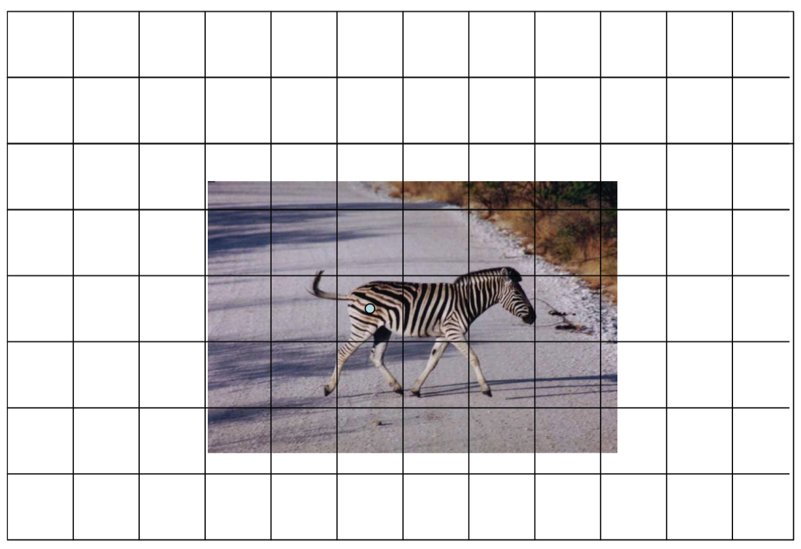
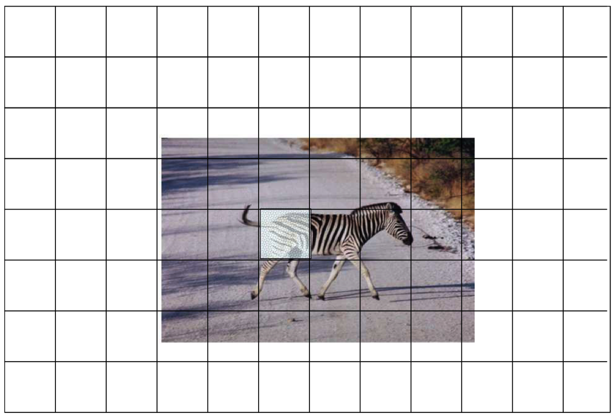
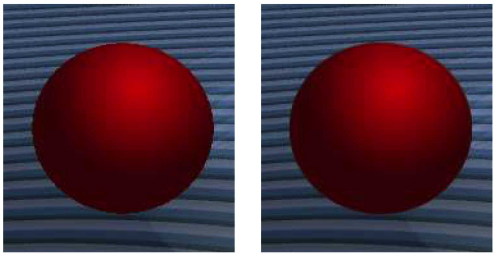
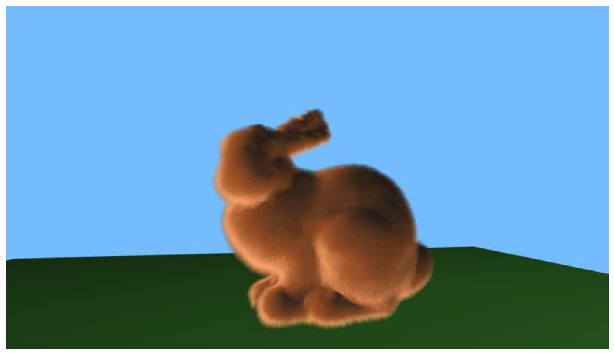
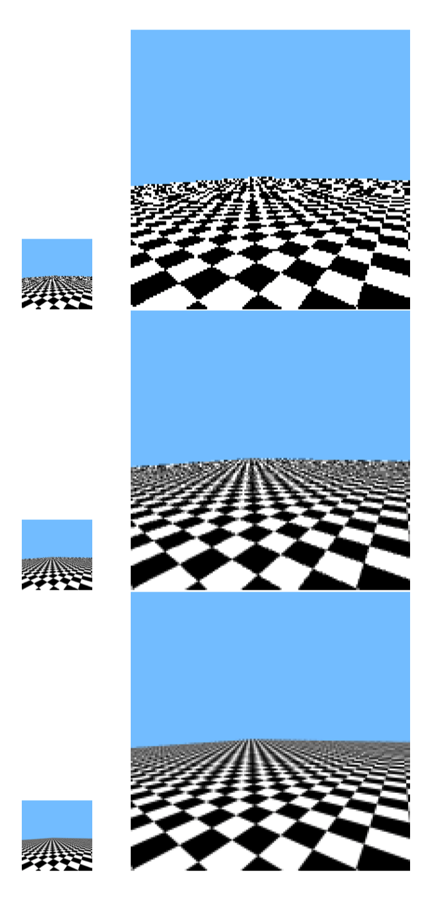

# Note
这是对**MIT Foundation of 3D Computer Graphics**第16章的翻译，本章讲解了图像的两种概念表达以及各种失真产生的原因、场合及基于采样的解决方案，同时也包含alpha混合的基本概念及应用。本书内容仍在不断的学习中，因此本文内容会不断的改进。若有任何建议，请不吝赐教<nintymiles@icloud.com>。 

> 注：文章中相关内容归原作者所有，翻译内容仅供学习参考。
> 另：Github项目[CGLearning](https://github.com/nintymiles/CGLearning)中拥有相关翻译的完整资料、内容整理、课程项目实现。 
 
# 采样（Sampling）
现在是时候让我们更多聚焦在我们对待图形的方式上。目前为止，存在两种我们已经隐含使用的图像概念，具体（也称作，数码）图像和连续图像。在后面的章节中，我们会更靠近地调查这种对立性，同时讨论在具体和连续模型之间来回切换的合适方式。

本章中，我们会聚焦在多种计算机图形中生成电子图像时可能出现的视觉失真。这些失真包括在三角形边缘令人烦恼的锯齿形失真，并且可经由其名称:锯齿状失真（aliasing artifacts）来判断。在某种意义上，锯齿状失真可能发生在大量视觉复杂性填充在一个单一像素中时。在这种情形中，当我们仅仅尝试通过观察图像域中单一点的地址来决定像素的色彩值时，我们可能会得到一个不是最优的结果。就如我们会看到的，这些失真可以通过将像素正方形区域多个采样地址的色彩平均在一起来减轻。这种处理被称作抗锯齿。

## 16.1 两种模型（Two Models）
连续图像，$I(x_w,y_w)$，为双变量函数。正如在小节12.3中所讨论的，函数的域，$\Omega = [-.5..W-.5] \times [-.5..H-.5]$，为实数值化的2D窗口坐标$[x_w,y_w]^t$。（在本章剩下的内容和下一章中，除非有需要，否则我们去掉"$_w$"下标。）函数的范围是一个色彩空间，我们使用一种RGB(线性）色彩空间。

具体图像$I[i][j]$是色彩值的两维数组。每个这样的数组条目被称为一个像素。数组的尺寸为宽$W$乘以高$H$，因而$i$是一个整数，区间为$[0..W-1]$，$j$也是一个整数，区间为$[0..H-1]$。我们为每对连续图像坐标$x_w=i$和$y_w=j$关联一对整数$i,j$，也就是说，碰巧为整数值的实数坐标。每个色彩值为色彩空间中表达一个色彩的标量三元组。再次，我们借助一个RGB（线性）色彩空间。最终，每个R，G，B坐标被表达为某种数值格式。

在OpenGL中，我们借助3D中被着色的三角形描述一个场景。根据投射，这些映射到连续2D图像域中被上色的三角形，因此就定义了一个连续图像。最终我们希望把这个图像显示到一台监视器上，或者把它保存到一个图像文件中。如此，我们需要知道如何把连续图像转换为具体图像。

## 16.2 问题（The Problem）
从连续图像到具体图像转换的最简单和最直观的方式为借助点采样，也就是说，要获得像素$i,j$的值，我们采样位于整数值化的域地址处的连续图像函数：
$$\large{ I[i][j] \leftarrow I(i, j)  }$$

可以证实存在很多点采样导致的不想看到的失真情形。例如，考虑一个由黑和白三角形组成的场景。当点采样图像时，在接近黑白三角形边缘的地方，图像会显示出某种阶梯状的图案；这种失真被称为“锯齿”。（参考图示$\text{Figure 16.6}$）。在动画过程中，某些像素值会突然从黑变到白，同时锯齿状的边缘图案会显示为爬行的样子。这被称作“爬行的锯齿（the crawing jaggies）”。

当处理非常小的三角形时，我们还会得到另外的糟糕失真情形。假如我们正在渲染一张由一群斑马组成的图片（或者是一张正在远离观察者的棋盘上的小的黑白正方形）。假设一只斑马在背景中远离，很远以至于其只覆盖一个单一像素。那个像素的色彩会是什么？如果这种点采样碰巧落在一个黑色三角形上，那么像素会是黑的，如果碰巧落在一个白色三角形上，那么像素会是白的。（参考图示$\text{Figure 16.1}$。）如果我们运气不好，最终的像素色彩会组成某种令人烦恼的“云纹（moire）”图案，就如图示$\text{Figure 16.6}$中所示。在动画过程中，如果斑马移动，这些像素将会呈现黑白变换的模式。这种失真被称为“闪烁（flickering）”。假如一个细节高度清晰的纹理被应用在某个屏幕上的小区域，那么在纹理映射中也会出现这种失真。（参考图示$\text{Figure 18.3}$）。

**Figure 16.1:**  当连续图像拥有大量高分辨率细节（比如一只斑马），并且单一样本（浅蓝色）被用于决定这个像素值时，我们得到一个无用的值。©️Stuart c Maxwell。

当在一个小区域连续图像有很多细节，那么这些类型的错误就会出现。在斑马例子中，连续图像在几个像素的空间中就包含了整群斑马（的细节）。对于锯齿三角形例子，连续图像具有可以立即过渡的精确锋利的边缘，而不是渐变的边缘。出于技术原因，这些种类的问题被统称为锯齿（aliasing）。

## 16.3 解决方案（The Solution）
当在小区域存在大量细节，我们能够在具体（图像）表达中维护所有信息是不可能的。但是仅通过采纳单一样本来决定我们正在生成的像素的色彩会让事情变得更糟，很可能只是拿到了一个没有意义的值。有意义的行为是我们最好借助在某种合适的区域中的平均值设置这个像素的值。在斑马例子中，可能我们最好只是设置这个像素为灰色。

存在很多方法以数学方式建模这种问题并寻求最优解。例如，采用“傅立叶分析”，你可以观察哪些“频率”使用一定数目的像素能够表达，以及处理不可表达频率的最好方式。针对这样的讨论，参考课后书目[6]。从一个最优化的观点，你可以尝试最小化原始连续图像和最终在屏幕上显示的光图像之间的差异。（在屏幕上，每个像素被绘制在有限范围内，因此我们可以将光图像当作屏幕上的合成连续图像。）

根据这些不同的观点，对这些观点我们这里不追求细节，证实了最好借助下面这种形式的表达来设置像素值：
$$ \large{
I[i][j] \leftarrow \iint_\Omega dx\,dy\,I(x,y)F_{i,j}(x,y) \tag{16.1}
}$$
此处$F_{i,j}(x,y)$为某种函数，其告知我们$[x,y]^t$的图像值应该多么强烈影响$i,j$处的像素值。在这种设置中，函数$F_{i,j}(x,y)$被称作过滤器（filter）。

换句话说，最佳像素值通过在临近的像素地址执行某种连续加权平均。实际上，这就像在点采样前模糊连续图像以获得具体图像。使用方程（16.1）生成一个具体图像的方式被称为抗锯齿（anti-aliasing）。
 
$F_{i,j}$的最优选择被证实依赖于建模这个问题的实际数学方式。理论上，这种最优$F_{i,j}$可能具备广泛的支持，并且甚至呈现负值。实际上，我们不要求完全的优化，并且我们经常选择过滤器$F_{i,j}(x,y)$为某种容易计算的形式。最简单的这种选择为盒式过滤器（box filter），此处$F_{i,j}$除了中心位于$x=i,y=j$的$1\times1$正方形区域外其余处处为0。这种正方形被称作$\Omega_{i,j}$，我们得到
$$ \large{
I[i][j] \leftarrow \iint_\Omega dx\,dy\,I(x,y) \tag{16.2}
}$$

在这种情形中，想要的像素值只是像素正方形区域上的连续图像的平均。（参考图示$\text{Figure 16.2}$。）

**Figure 16.2:** 如果我们使用像素正方形域中的积分来代替点采样，我们会获得一个更好的结果。©️Stuart c Maxwell。

在计算机图形中，甚至方程式（16.2）中的积分也难于确切计算。相反，它可以通过下列形式的某种和被近似出来：
$$ \large{
I[i][j] \leftarrow \sum_{k=1}^nI(x_k,y_k) \tag{16.3}
}$$
此处$k$索引了某种地址集合$(x_k,y_k)$,被称作样本地址。我们称这种为过采样（oversampling）。（参考图示$\text{Figure 16.3}$。）

**Figure 16.3:** 我们可以使用一些具体样本集合来近似实际的积分（这个例子中为6个样本）。©️Stuart c Maxwell。

要完成过采样，渲染器首先生成一个“高分辨率”色彩和z缓存“图像”，此处我们会使用术语样本表示每个这种高分辨率像素。随后，一旦光栅化完成，这些样本的分组被聚在一起平均，借助方程（16.3），生成最终的，低分辨率图像。

如果针对高分辨率图像的样本地址组成了一个规则的，高分辨率的网格，那么这被称作超级采样（super sampling）。参考图示$\text{Figure 16.6}$（底部），可以看到一个使用了非常高的过采样率的超级采样的效果。

针对高分辨率“图像”，我们也能够选择其它采样模式，就像在$\text{Figure 16.3}$中所形象展示的。当使用方程（16.3）近似方程（16.2）时，这种较不规则的图像有助于避免系统错误。关于这种不规则图案的一些益处的更详细讨论，参考课后书目[12,49]。.

在OpenGL中，采样图案的细节是硬件依赖的。它们能够被API调用所改变，或者更容易地，通过在一个交互式控制面板中更改硬件驱动的设置。

在OpenGL中，我们也可以选择进行多采样（multisampling）。在这种情形，就如过采样中，OpenGL绘制到一个“高分辨率”的色彩和z-缓存。在每个三角形的光栅化过程中，“覆盖率（coverage）”和z-值（z-values）在这个样本级别被计算。但是为了效率，碎片着色器根据最终的解析像素仅仅被调用一次。在一个单一的（最终解析）像素中，这个色彩在被三角形命中的所有样本之间共享。正如上面，一旦光栅化完成，这些高分辨率的分组被放在一起平均，借助方程（16.3）来生成**最终的低分辨率**图像。多采样可以作为一种有效的抗锯齿方法，因为，不使用纹理映射时，色彩在每个三角形上的变化趋势相当缓慢，因而它们不需要在高空间分辨率上被计算。参考图示$\text{Figure 16.6}$（中部）观看在不使用纹理映射渲染一个场景时使用多采样的效果。

要处理在纹理映射期间出现的锯齿失真，我们拥有在渲染处理外围随时支配纹理图像的便利。这导致了在小节18.3中所描述的渐进式纹理映射（mip mapping）这类专有的技术。我们推迟纹理抗锯齿和渐进式纹理映射的讨论，直到我们已经在第17章中讲解了图像重建（reconstruction）的主题。

### 16.3.1 题外话（In the Wild）
数码相机中，抗锯齿通过在每个像素传感器范围上出现的空间整合来完成，同时也借助由镜头所产生的光学模糊。一些相机还包含专门的额外光学元件用于在传感器采样前模糊连续图像。抗锯齿在一些包含某种规则图案场景的数码图像中有时可以被看到，比如哪些穿着花呢夹克的图像。

在人类视觉中，抗锯齿效果通常不会被遭遇到。大多数抗锯齿，至少在人眼视觉的中央凹区域（foveal central region），是由于应用到光上的光学模糊，这会很好地发生在光线照射到感知细胞之前，参考课后书目[78]。视网膜上感知细胞的不规则空间布局也有助于高效提供空间位置的（随机性地）剧烈变化，而这会将明显可注意到的锯齿变为不显眼的噪点。

### 16.3.2 抗锯齿线条（Antialiased Lines）
理想情况下，线条是一维的，并且对于绘制一条正确过滤的线条意味着什么的概念是一个更复杂的问题。平滑线条绘制在OpenGL中是可用的，但是这超越了我们的范围。有兴趣的读者可以参考课后书目[48]并且从那里进行查阅。

## 16.4 Alpha
假设我们有两个具体图像，一个前景图，$I^f$，和一个后景图，$I^b$，我们想要合并它们为一个图像$I^c$。比如，我们可能想要叠加一个天气预报员的前景图片在天气地图的后景图像之上。最直观的方案是从其图像中抠出天气预报员像素。在合成图像中，我们只要用提取的预报员像素替换哪些对应的天气地图像素即可。

不幸地是，这会为我们在天气预报员/地图过渡区域中呈现一种锯齿状的边缘（参考图示$\text{Figure 16.4}$，左侧）。在一个真实的相片或者借用方程（16.2）渲染的图像中，在预报员/地图边缘的像素色彩会借用某种预报员和地图色彩的平均。问题是在我们的具体图层中，我们针对每个像素仅仅保存了一个色彩值，并且这是不如此（在一个像素拥有多个色彩值）就不能计算出正确的合成像素色彩。

**Figure 16.4:** 一个圆球的图像在一个纹理背景上被合成。仔细观察这个圆球的边缘。在左侧，进行整体合成（或者说没有合成）。在右侧，alpha值被用于混合。©️Hamilton c Chong。

对于这个问题，一个合理的方案可以借助一个称为alpha混合的技术来获得。基础思路是在每个图层中为每个像素关联一个值，$\alpha[i][j]$，其描述了那个像素上图层整体的不透明度和覆盖率。一个值为1的alpha值表达了一个完全不透明/被占据的像素，而一个为0的值表达了完全透明/未被占据的像素。一个小数值表示了部分透明的（部分占据的）像素。例如，在天气预报员图像中，我们会预期每个完全被预报员所覆盖的像素拥有值为1的alpha值，同时那些位于其轮廓上的像素会拥有小数值，因为那些像素仅被预报员部分占据。

然后，要合成两个图层，在每个像素上，我们借用这些alpha值来决定怎样去合成前景色和背景色。

更明确地，让$I(x,y)$为一个连续图像，同时让$C(x,y)$为连续$(x,y)$域上的一个二进制值化的覆盖函数，在任何点上其值为1代表在这个地方图像被”占据“，而0代表没被占据。让我们在我们的具体图像上存储这个值为
$$
 \large{ \begin{array}{rcl}
	I[i][j] & \leftarrow & \iint_{\Omega_{i,j}}dx\,dy\,I(x,y)\,C(x,y) \\
	\alpha[i][j] & \leftarrow & \iint_{\Omega_{i,j}}dx\,dy\,C(x,y)\end{array} }
$$
在这种格式中的色彩经常被称作预乘（pre-multiplied）版本（查看下面小节16.4.2中的非预乘版本）。

给定这些值，当我们想要在$I^b[i][j]$之上合成$I^f[i][j]$，我们借助下面的公式计算合成的图像色彩，$I^c[i][j]$：
$$ \large{
I^c[i][j] \leftarrow I^f[i][j] + I^b[i][j](1-\alpha^f[i][j]) \tag{16.4}
}$$
也就是说，在一个像素上被观察到的背景色的数量成比例于那个像素前景图层的透明度。

同样地，对于复合图像的alpha值可以被计算为
$$ \large{
\alpha^c[i][j] \leftarrow \alpha^f[i][j] + \alpha^b[i][j](1-\alpha^f[i][j]) \tag{16.5}
}$$

经常，背景图层在所有像素上是完全不透明的，在这种情形中，合成图像也是如此。但是这个公式足够通用可以建模两个局部不透明的图像，这种情形可以生成一个拥有小数alpha值的合成图像；当处理两个以上的图层时，这个可以用作一个中间结果。

图示$\text{Figure 16.4}$展示了在一个纹理背景图像上合成一个球体的前景图像。前景图像中，圆球（右侧）边缘的像素具有小数alpha值。最终的合成图像中，球体边缘展示了前景色彩和背景色彩的混合。

方程（16.4）和方程（16.5）的操作被称作具体二进制over操作。你可以轻松验证over操作是可组合的但不是可交换的。也就是，
$$\large{
I_a\,over\,(I_b\,over\,I_c ) = (I_a\,over\,I_b )\,over\,I_c
}$$
但是
$$\large{
I_a\,over\,I_b \neq I_b\,over\,I_a
}$$

### 16.4.1 对比连续合成（Comparison to Continuous Composition）（选学）
Alpha混合基于将像素看作半透明物体的概念。让我们看一下具体alpha混合的结果如何与一个正确抗锯齿，并连续合成的图像进行比较。

让$C^f$为前景连续图像$I^f$的二（进制）值化的覆盖函数（binary valued coverage function）。同时让$C^b$为背景连续图像$I^b$的二（进制）值化的覆盖函数。（从通用性角度，在某些时刻我们允许背景图像为未占据的）。我们假设，在任意点$(x,y)$，如果$C^f(x,y)$为1，我们观察前景色彩，并且如果$C^f(x,y)$为0，我们观察背景色彩。那么，在像素$i,j$处盒式过滤的（box-filtered）抗锯齿具体图像应该为
$$  \large{ \begin{array}{rcl}
	I^c[i][j] & \leftarrow & \iint_{\Omega_{i,j}}dx\,dy\,(I^f(x,y)\,C^f(x,y) + I^b(x,y)\,C^b(x,y) \\
		& & - I^f(x,y)\,C^b(x,y)\,C^f(x,y)) \\
	 & = & \iint_{\Omega_{i,j}}dx\,dy\,I^f(x,y)\,C^f(x,y) + \iint_{\Omega_{i,j}}dx\,dy\,I^b(x,y)\,C^b(x,y)  \\
	 & & - \iint_{\Omega_{i,j}}dx\,dy\,I^b(x,y)\,C^b(x,y)\,C^f(x,y)
\end{array} } $$
让我们把这个公式和alpha混合的结果比较
$$ \large{ \begin{array}{rcl}
	I^c[i][j] & \leftarrow &  I^f[i][j] + I^b[i][j](1-\alpha^f[i][j]) \\
	 & = & \iint_{\Omega_{i,j}}dx\,dy\,I^f(x,y)\,C^f(x,y) \\
	 & & + (\iint_{\Omega_{i,j}}dx\,dy\,I^b(x,y)\,C^b(x,y))(1 - \iint_{\Omega_{i,j}}dx\,dy\,C^f(x,y) \\
	 & = & \iint_{\Omega_{i,j}}dx\,dy\,I^f(x,y)\,C^f(x,y) + \iint_{\Omega_{i,j}}dx\,dy\,I^b(x,y)\,C^b(x,y) \\
	 & &  - \iint_{\Omega_{i,j}}dx\,dy\,I^b(x,y)\,C^b(x,y).\iint_{\Omega_{i,j}}dx\,dy\,C^f(x,y)
\end{array} }$$

两种结果的差异为
$$ \large{
\iint_{\Omega_{i,j}}dx\,dy\,I^b(x,y)\,C^b(x,y) - \iint_{\Omega_{i,j}}dx\,dy\,I^b(x,y)\,C^b(x,y).\iint_{\Omega_{i,j}}dx\,dy\,C^f(x,y)
}$$
这种误差就是一个乘积的积分和一个积分的乘积之间的差异。如此，我们将这种误差当作表达了两个方面的“相互关联关系”的数量，其中一方面为在某个像素上前景覆盖率的分布，以及另一方面为在那个像素内的背景数据的分布。如果我们假设前景覆盖率是均匀的并且随机的，那么我们可以安全地忽略这种误差。

### 16.4.2 非预乘版本（Non Premultiplied）
在alpha的某些用法中，代替存储$I$和$\alpha$，我们和$\alpha$一起存储$I'=I/\alpha$。这被称作"非预乘"版本。这提升了数据精度；当一个像素拥有小的覆盖率（coverage）数值，那么$I$会是一个小的数字并且在固定点表示中只会利用几个低位数位。在非预乘格式中，你能够在存储文件格式中使用所有的数位，从而独立于覆盖率描述色彩。在非预乘格式中，over操作变得更加复杂：
$$ \large{ \begin{array}{rcl}
   \alpha^c[i][j] & \leftarrow &  \alpha^f[i][j]+\alpha^b[i][j](1-\alpha^f[i][j])    	\\
	 I^{'c}[i][j] & \leftarrow & \frac{1}{\alpha^c[i][j]}(\alpha^f[i][j]I^{'f}[i][j] +(\alpha^b[i][j]I^{'b}[i][j])(1-\alpha^f[i][j]))
\end{array} }$$

虽然在背景中当所有像素都让其alpha值为1，这会变为
$$ \large{ \begin{array}{rcl}
   \alpha^c[i][j] & \leftarrow &  1	\\
	 I^{'c}[i][j] & \leftarrow & \alpha^f[i][j]I^{'f}[i][j] +I^{'b}[i][j](1-\alpha^f[i][j])
\end{array} }$$
这是一种你有时候会碰到的表达。

预乘格式的一个有利方面是如果我们想要在每个方向使用一个值为2的因子缩小图像，（这种情形会被需要，比如，对于渐进式映射，在后面小节18.3中被描述），我们只要将4个合适的$I^f$值在一起平均。然而在非预乘格式，这种计算会变得丑陋。

### 16.4.3 抽取时模糊（Pulling Mattes）
给出一些真实相片，不容易正确抽取出场景中被观察物体的图层。即便你让天气预报员站在一个蓝色屏幕的前面，可能会容易在一个蓝色调的不透明前景像素和一个半透明的灰色像素间产生迷惑。这是一个当前研究的领域。对于这个主题的更多信息，参考课后书目[43]。

### 16.4.4 实践（In Practice）
OpenGL中，alpha不只是用于图像合成，而是以更通用意义方式作为建模透明性和混合色彩值的工具。我们能够赋值一个alpha值作为碎片着色器中`fragColor`的第四部件，并且这被用于把`fragColor`和当前位于帧缓存中的任意当前存在色彩合并在一起。例如，alpha可以被用作建模（单色）透明的方式。混合（blending）通过调用`glEnable(GL_BLEND)`来启用，并且将要被使用的混合计算通过在`glBlendFunc`的调用中来指定参数。

例如，图示$\text{Figure 16.5}$中的毛绒兔子在OpenGL中借助alpha混合被绘制。毛绒兔子被绘制为一系列“壳”，每个壳使用一个表达一个皮毛切片的图像被纹理化。这些纹理包含alpha 值，所以皮毛之间的空间是半透明的。这种技术被描述在参考书目[42]。

在图像中使用alpha的主要困难为，对于不可交换的混合操作（比如over操作符），物体图层必须以特定顺序被绘制（比方说从后到前）。如果我们被以乱序顺序给予图层，并且按照给出的顺序合并它们，将没有方法可以得到想要的结果。这使得透明某种程度上难以在一个基于光栅化的上下文中处理。这刚好和z-缓存的通常用法形成对立，z-缓存中不透明物体可以以任何顺序绘制。

**Figure 16.5:** 毛绒兔子被作为一系列越来越大的同心兔子方式来绘制。每个（兔子）都是部分透明的。很神奇地，这看起来像毛绒绒的皮毛。

**Figure 16.6:** 顶部行：一个棋盘图案被绘制为小的黑白正方形。（这里没有使用纹理映射）。图像在右侧被放大以更清晰地展示像素值。在正方形的边缘，锯齿被看到。在远方区域，云纹图案被看到。中间行：图像在OpenGL中借助多采样方式被生成。这会提显著升图像的质量。底部行：图像借助非常高的超级采样比率被离线生成。这是我们理想中想让我们的渲染所看起来的样子。

