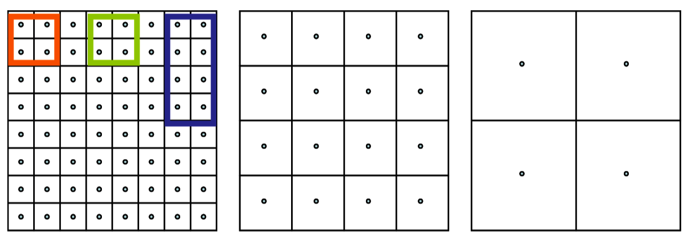
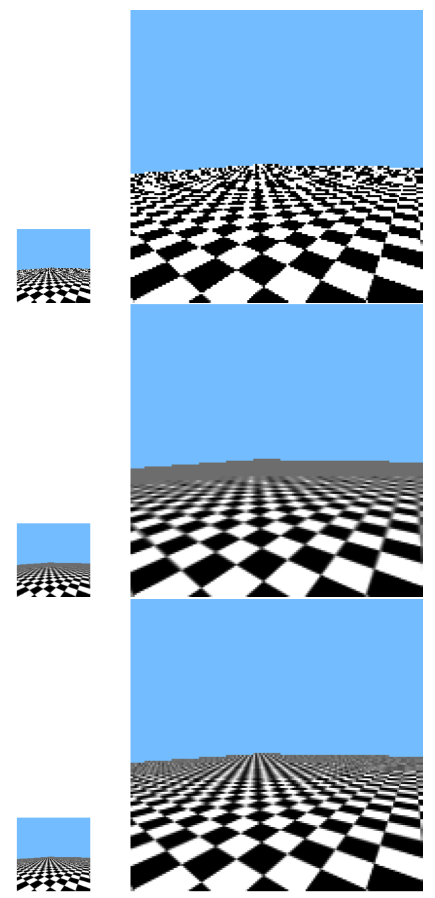

# Note
这是对**MIT Foundation of 3D Computer Graphics**第18章的翻译，本章讲解了重采样和以其为基础的渐进式纹理映射（mip mapping）的基础知识。本书内容仍在不断的学习中，因此本文内容会不断的改进。若有任何建议，请不吝赐教<ninetymiles@icloud.com>。 

> 注：文章中相关内容归原作者所有，翻译内容仅供学习参考。
> 另：Github项目[CGLearning](https://github.com/nintymiles/CGLearning)中拥有相关翻译的完整资料、内容整理、课程项目实现。
 
# 重采样（Resampling）
现在，图像采样和图像重建的基础我们都已然讨论过了，我们可以回顾纹理映射的处理过程。我们会看到，在这种情形中，我们始于一个具体图像然后终于一个具体图像。总之，这种映射技术性地涉及了重建和采样两个阶段。以此为上下文，我们将解释用于反锯齿纹理映射中的渐进式纹理映射（mip mapping）。

## 18.1 理想重采样（Ideal Resampling）
假设我们开始于一个具体图像或者纹理$T[k][l]$并且对这种图像应用某种2D扭曲以获得一个输出图像$I[k][l]$。我们应该怎么设置每个输出像素？实际上，在纹理映射中，三角形和相机几何过程实际上把一个纹理图像扭曲到了窗口中被渲染图像的某部分之上。

理想情况下我们应该遵从下列步骤集合

- 借助基函数$B_{k,l}(x_t,y_t)$集合重建一个连续纹理$T(x_t,y_t)$，就如在第17章中那样。
- 针对连续图像应用几何扭曲。
- 针对过滤器$F_{i,j}(x_w,y_w)$集合获得具体输出图像，就如在第16章中那样。

让几何变换通过一个映射$M(x_w,y_w)$被描述，这个映射从连续窗口到纹理坐标。那么，把这3个步骤放在一起，我们得到
$$\large{ \begin{array}{rcl}
I(i,j) & \leftarrow & \iint_{\Omega} dx_w\,dy_w\,F_{i,j}(x_w,y_w)\,\sum_{k,l} B_{k,l}(M(x_w,y_w))\,T[k][l] \\
& = &  \sum_{k,l} T[k][l]\,\iint_{\Omega} dx_w\,dy_w\,F_{i,j}(x_w,y_w)\,B_{k,l}(M(x_w,y_w))
\end{array} }$$
这个表达式告诉我们每个输出像素如何能够作为输入纹理像素的线性组合方式被获得。有时候更容易在纹理域上可视化这种积分，而不是在窗口域中。借助反转映射$N=M^{-1}$,这可以被表达为
$$\large{ \begin{array}{rcl}
I(i,j) & \leftarrow & \iint_{M_{\Omega}} dx_t\,dy_t\,|det(D_N)| \, F_{i,j}(N(x_t,y_t)) \sum_{k,l} B_{k,l}(x_t,y_t)\,T[k][l] \\
& = &  \iint_{M_{\Omega}} dx_t\,dy_t\,|det(D_N)| \, F'_{i,j}(x_t,y_t)\,\sum_{k,l} B_{k,l}(x_t,y_t)\,T[k][l]
\end{array} }$$
此处$D_N$为$N$的雅可比行列式（Jacobian）并且$F'=F \circ N$。当$F$为一个盒式过滤器，这个公式变为
$$\large{
I(i,j)  \leftarrow  \iint_{M_{\Omega}} dx_t\,dy_t\,|det(D_N)| \, \sum_{k,l} B_{k,l}(x_t,y_t)\,T[k][l]  \tag{18.1}
}$$
那就是说，我们需要在纹理域中的区域$M(\Omega_{i,j})$上积分，并且把那些数据混合在一起。

当我们的变换$M$实际上缩小了纹理，那么$M(\Omega_{i,j})$拥有$T(x_t,y_t)$上的大脚印。（参考图示$\text{Figure 18.1}$）。如果$M$正在放大纹理，那么$M(\Omega_{i,j})$在$T(x_t,y_t)$上拥有一个非常窄小的脚印。在纹理映射过程中，$M$可以实现一些搞笑滑稽的内容，比如仅在一个方向上收缩。

**Figure 18.1:** 作为一个大的几何正方形绘制的棋盘，被使用展示在右侧的棋盘图像纹理所映射。在右侧，根据映射$M(\Omega_{i,j})$，我们在纹理中可视化它们的脚印。橙色脚印非常小，并且过滤是不需要的。黄色脚印区域覆盖了很大的纹理像素集合，从而过滤是需要的用来避免失真。

## 18.2 放大（Blow up）
虽然方程式（18.1）既包含了一个重建（$\sum$)组件，也包含了一个过滤（$\int$)组件，在我们放大纹理的情形中，过滤组件在输出结果上有最小的影响。实际上，$M(\Omega_{i,j})$的脚印在纹理空间中可能小于一个像素，从而没有很多细节需要模糊/平均。如此，积分步骤可以被去掉，并且重采样可以被实现为
$$\large{
I(i,j)  \leftarrow   \sum_{k,l} B_{k,l}(x_t,y_t) T[k][l]  \tag{18.2}
}$$
此处$(x_t , y_t ) = M(i, j)$。换句话说，我们只是点采样被重建和变换的纹理。例如，这就是我们在第17章中所提议的。

双线性重建最常见被应用在这种情形中。我们借用API调用`glTexParameteri(GL_TEXTURE_2D, GL_TEXTURE_MAG_FILTER, GL_LINEAR)`告知OpenGL做这件事情。对于碎片着色器中的单一纹理查找，硬件需要获取4个纹理像素并且恰当地混合它们。比如说，对于图示$\text{Figure 18.1}$中拥有橙色脚印的像素这种方式会运行良好。

## 18.3 渐进式映射（Mip Map）
在一个纹理被缩小的情形中，那么，要避免锯齿化，方程（18.1）中的过滤组件不应该被忽略。不幸的是，可能存在大量的纹理像素具备$M(\Omega_{i,j})$的脚印（footprint），并且我们可能不能以常量时间进行纹理查找。例如观察图示$\text{Figure 18.1}$中的黄色脚印。

OpenGL中的标准方案是使用渐进式映射。参考图示$\text{Figure 18.3}$。在渐进式映射中，你开始于一个初始纹理$T^0$，然后生成一系列越来越低分辨率（更模糊的）纹理$T^i$。每个后继的纹理为前一个的两倍模糊。并且因为它们具有连续变得更少的细节，它们可以在水平和垂直方向都使用1/2数目的像素被表达。这种集合，称为一个渐进式映射，其在任何三角形渲染被完成之前被构建。因而，最简单的构建一个渐进式映射的方式是平均$2\times2$像素块从而产生低分辨率图像中的每个像素；更成熟的图像缩小技术也可以被使用。

渐进式映射可以使用你自己的代码构建，然后使用`glTexImage2D`传递到OpenGL。可替换地，它们可以使用`gluBuild2DMipmaps`调用被构建和自动加载（并且不需要随后对`glTexImage2D`的调用）。因为这些不同的纹理每个都有不同的分辨率，每个都拥有自己的视口变换（viewport transform）执行从经典纹理坐标变换到就如小节12.3.1和练习35中的基于像素的情形。

在纹理映射过程中，针对每个纹理坐标$(x_t,y_t)$，硬件评估正在进行多大程度的缩小。这种缩小因子然后被用于从渐进式映射中选择一个合适分辨率的纹理$T^i$。因为我们挑选了一个合适的低分辨率纹理，额外的过滤不再需要，并且再一次，我们可以使用方程式（18.2），这个方程式可以在常量时间被完成。

要避免空间和时间的不连续性，在这里或当这个时候纹理渐进式映射在不同级别切换，我们可以使用所谓的三线性过滤（trilinear interpolation）。我们使用双线性插值从$T^i$重建一个色彩同时还从$T^{i+1}$重建另一个色彩。这两个色彩随后被线性插值。这第三个插值因子基于我们以何种接近的程度选择级别$i$或者$i+1$。使用三线性插值的渐进式映射通过调用`glTexParameteri(GL_TEXTURE_2D, GL_TEXTURE_MIN_FILTER, GL_LINEAR_MIPMAP_LINEAR)`来指定。三线性插值要求OpenGL获取8个纹理像素并且针对每个被请求的纹理访问恰当地混合它们。

很容易看到渐进式映射没有进行完全正确的计算。首先，每个渐进式映射中的更低分辨率的图像以同向缩小的方式获得，在每个方向都一样。但是，在纹理映射中，纹理空间的一些区域可能只在一个方向缩小（参考图示$\text{Figure 18.2}$）。其次，即便是同向缩小，低分辨率图像中的数据仅仅表达了来源于原始图像的一个非常专有的，二价的像素图案。当一个纹理像素被获取时，这些特定的平均随后被放在一起混合。

要在覆盖纹理上的$M(\Omega_{i,j})$区域的范围近似，通过付出在渐进式映射多个级别上多次获取数据的代价，方程（18.1）可以以更好效果被近似。这种方式经常被称作各向异性过滤，并且可以在API或者使用驱动控制面板被开启。参考图示$\text{Figure 18.3}$。

**Figure 18.2:** 渐进式映射中的三个分辨率级别。每个分别具有一半的水平和垂直纹理分辨率。3种潜在的脚印被展示为红色、绿色和蓝色。在红色脚印上的积分在中间纹理中被良好表达。蓝色脚印形成于各向异性缩小并且在任何级别渐进式纹理图像中都没有被良好表达。绿色脚印形成于各向同性缩小，而且由于其落入2价图案区域，故而在任何级别渐进式纹理图像中也没有被良好表达。

**Figure 18.3:** 顶部行：作为单一的大几何正方形被绘制的棋盘，使用一张棋盘图像进行纹理映射。这个图示看起来和Figure 16.6相似，但是在那个图示中，每个正方形借助于小尺寸的四边形被绘制。顶部行：没有渐进式映射被使用。中间行：渐进式映射被使用。这移除了大部分锯齿但是过于模糊了纹理。底部行：使用了各向异性采样的渐进式映射。注意在几何体的后部边缘仍然保留了一些锯齿。这种情形不能被渐进式映射所处理。

