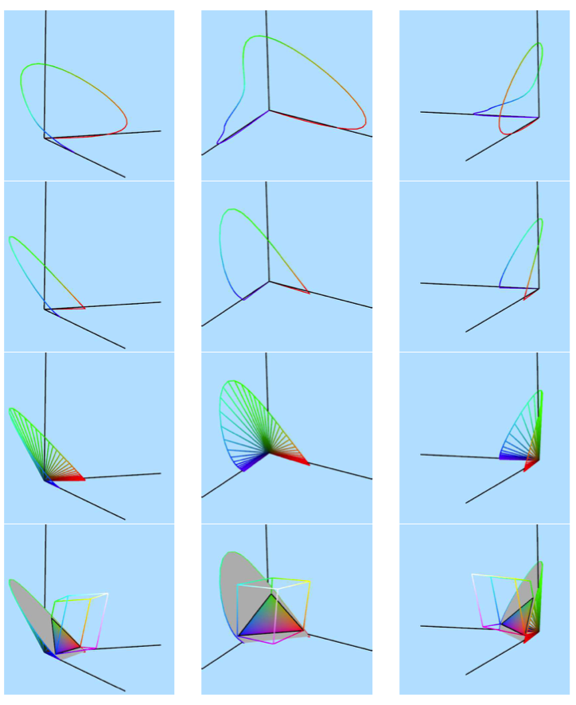
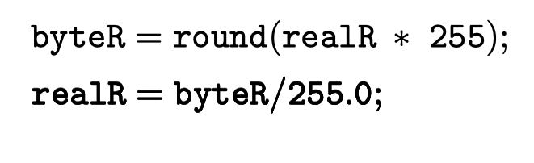

# Color
In this section, we will explore the basic concept of color. We will talk about what color is, and various ways to represent it. This is a rich topic of study, and many mysteries about human color perception remain unanswered. We will spend extra time on this subject, as we find it very interesting, and due to its importance not just to computer graphics but to digital imaging as well.

本节，我们将探索颜色的基本概念。还将讨论颜色（色彩）是什么，以及多种表达色彩的方式。色彩在研究领域有丰富的主题，并且在人类色彩感知领域尚有很多未解之谜。我们会在这个主题上专门投入时间，因为我们发现这个主题非常有趣，同时还因为其重要性不仅涉及计算机成像方面同时还关联到电子设备成像领域。

Color is, in fact, an overloaded term meaning many different things. When a light beam hits the retina, there is some initial neural response by the cone-cells that occurs independently at each cell. We can refer to this as retinal color. Retinal color is then processed in an integrated fashion over the entire field of view resulting in the perceived color that we actually experience and base judgments upon. The perceived color is often associated with the object we are observing, which we might call the object color.

事实上，色彩是一个被重载过的术语，色彩意味着很多东西。当光束照射在视网膜上，存在某种由锥体细胞（cone-cells）所感受的最初的神经反射（反应），这种反应独立地出现在每个锥体细胞上。我们称呼这种反应为视网膜色彩（retinal color）。视网膜色彩随后被以一种整体风格在真个视觉域上被处理，而正是这种处理导致了我们可以实际感受到并且在其之上进行判断的感知色彩（perceived color）。感知色彩经常又被关联到我们正在看的物体（object）上，这又被称为物体色彩（object color 对象色彩？）。

At all of these stages, the simplest thing we can say about two particular colors is simply whether they are the same or different. This is something that we can often record and quantify, and it is the main way we will deal with color in this chapter. At the perceptual color level, there is clearly a conscious experience of color which is much harder to deal with experimentally or formally.

在所有这些色彩阶段，对于两种实际的色彩我们可以判别的最简单的内容就是他们相同还是不同。而这种判别正是我们经常记录和量化的东西，且是我们在本章处理色彩的主要方式。然而在感知色彩级别，很明显存在色彩的意识体验，这点要以实验和正规（式）方式来处理就要难得多。

Finally, there are further issues in how we typically organize our color perceptions into named colors, using words like red and green.

最后，在我们如何将色彩感知组织为命名色彩方面（比如像红色和绿色这样的词汇）有更多待解问题。

In this chapter, we will mostly focus on retinal color (and will drop the term retinal). Retinal color theory is relatively well understood, and is the first step in understanding other notions of color. We will first describe retinal color from its, now, well established bio-physical basis. Then, we will re-derive the same model directly from perceptual experiments. We will then discuss some of the most common color representations in computer graphics.

在本章中，我们将主要聚焦在视网膜色彩（正常会丢掉（抛弃）视网膜这个术语）。视网膜色彩相对容易被理解，为理解其它色彩概念的第一步。现在，我们首先将从被量好证实的生化基础上描述视网膜色彩。之后，我们将直接从感知实验中重新推导出相同的色彩模型。我们还将讨论计算机图形中的一些最常见的色彩表达。

##19.1 简单生理模型（Bio-Physical Model）
Visible light is electromagnetic radiation that falls roughly in the wavelengths 380 < λ < 770, measured in nanometers. (You can just think of each wavelength as a different “physical flavor” of light). We will talk about two kinds of beams of lights. A pure beam l λ has one “unit” of light (measured in units of irradiance) of a specific wavelength λ. A mixed beam l(λ) has different amounts of various wavelengths. These amounts are determined by the function l(·) : R → R + , and are in units of spectral irradiance. The value is always non-negative since there is no “negative light”.

可见光是波长大略落入$380 < \lambda < 770$区间的电磁辐射，以纳米计量。（可以将每种波长当作光的一种不同的“物理口味”）。我们将讨论两种光束。纯光束$𝑙_\lambda$拥有一个“单位”的特定（指定？）波长为λ的光（以辐照度单位来计量）。混合光束$𝑙(\lambda)$拥有不同数量的多种波长。这些数量通过函数$𝑙(^.):R \to R+$,同时以频谱辐照度单位来计量。光的数值总是非负因为不存在“负光”。

The human eye has various kinds of light-sensitive cells on the retina. The cone cells give us the sensation of color. (Non color-blind) humans have three different kind of cones, which we will call short, medium and long (after the wavelengths of light they are most sensitive to). Associated with these three types of cones are three sensitivity functions k s (λ), k m (λ) and k l (λ). A response function describes how strongly one type of cone “responds” to pure beams of light of different wavelengths. For example, k s (λ) tells us how much a short-wavelength sensitive cone will respond to the pure beam l λ . (See the upper left of Figure 19.1).

人眼在视网膜上有多种光敏感细胞。锥体细胞给了我们色彩的感知。（非色盲）人类拥有3中不同的锥体细胞，我们称它们为短（锥体？），中（锥体？）和长（锥体？）（依据它们最敏感的光的波长命名）。为这三类锥体细胞关联3种感光函数$k_𝒔(\lambda),k_𝑚(\lambda),K_l(\lambda )$。响应函数描述了一种锥体“响应”不同波长的纯光束有多强烈。例如，$k_𝒔(\lambda )$告诉我们短波敏感锥体会在多大程度上响应纯光束$𝑙_\lambda$。（参看图示19.1左上角）。

Since each pure beam of light results in three response values on the retina, one for each type of cone, we can visualize this response as a single point in a 3D space. Let us define a 3D linear space, with coordinates labeled [S, M, L] t . Then for a fixed λ, we can draw the retinal response as a single vector with coordinates [k s (λ), k m (λ), k l (λ)] t . As we let λ vary, such vectors will trace out a lasso curve in space (see the top row of Figure 19.7). The lasso curve is parametrized by λ. The lasso curve lies completely in the positive octant since all responses are positive. The curve both starts and ends at the origin since these extreme wavelengths are at the boundaries of the visible region, beyond which the responses are zero. The curve spends a short time on the L axis (shown with blue tinted points) and finally comes close to the S axis (shown in red). The curve never comes close to the M axis, as there is no light that stimulates these cones alone.

因为每种纯光束导致视网膜上的3种响应值，针对每一种类型的锥体，我们可以可视化这种响应为一个3D空间中的点。我们来定义一个3D线形空间，使用坐标$[S,M,L]^t$。那么针对一个固定波长,我们可以绘制视网膜反应为一个拥有坐标$[k_𝒔(\lambda),k_𝑚(\lambda),K_l(\lambda )]^t$的矢量。当我们让λ变化，这种矢量会勾勒（描摹）出一个Lasso curve - 拉索曲线（参看图示Figure 19.7的最顶部行）。Lasso curve被λ参数化。Lasso curve完全位于正（值）象限，因为所有的响应值是正的。曲线开始和结束都在原点，因为这些极端（极限）的波长位于可视区域的边缘，超越边缘的响应值就是0。曲线短暂停留于S轴（以红色表示）。曲线绝不会靠近M轴，因为没有光（包括混合光束）可以独立刺激这种锥体（细胞）。

In this simple model, we think of the [S, M, L] t coordinates of the light beam as describing the (retinal) color sensation produced by the light beam. We use the symbol ⃗c to represent a color itself, which we equate, for now, with an actual retinal event. Soon we will define color more rigorously. Thus, in Figure 19.7, we can think of each 3D vector as potentially representing some color. Vectors on the lasso curve are the actual colors of pure beams.

在这种简单模型中，我们把由光束所产生的$[S,M,L]^t$坐标认为是在描述由其所引起的（视网膜）色彩感光反应。我们使用符号c⃗去表示一个色彩自身，现在，对于色彩我们将其和一个视网膜事件对等。马上我们也将严格的定义色彩。因此，在图示Figure19.7，我们能够把每个3D矢量潜在地当作是表示某种色彩。那么在Lasso cuve上的矢量就是各种纯光束的实际色彩。

Within some ranges of intensity, the cones respond linearly to the light shining on them. Thus, for a mixed beam of light l(λ), the three responses [S, M, L] t are 

在某种强度范围内，（相关对应的）锥体（细胞）线形响应照耀在它们之上的光。如此，对于混合光束𝑙(λ)，3个响应坐标值$[S,M,L]^t$可用如下公式计算：

此处$\Omega = [380..770]$。

As we look at all possible mixed beams l(λ), the resulting [S, M, L] t coordinates sweep out some set of vectors in 3D space. Since l can be any positive function, the swept set is comprised of all positive linear combinations of vectors on the lasso curve. Thus, the swept set is the convex cone over the lasso curve, which we call the color cone. Vectors inside the cone represent actual achievable color sensations. Vectors outside the cone, such as the vertical axis do not arise as the sensation from any actual light beam, whether pure or composite.

当我们考察所有可能的混合光束𝑙(λ)，它们形成的$[S,M,L]^t$色彩坐标形成了（搜寻出了）3D空间中的某种矢量集合。因为𝑙可能为任意正值函数，搜索的集合由Lasso cuve上的一些适量的所有正值线性组合构成。因此，搜索出的集合是Lasso curve上的凸状锥体，我们称它为色彩锥体（color cone）。锥体内的矢量表示了实际可获取的色彩感知。锥体外的矢量，诸如垂直轴（M轴）不能成呈现为任何实际光束的感知，无论是纯光束还是混合光束。

To help visualize the cone, we have broken down its drawing in Figure 19.7 into a series of steps. In the second row, we have normalized the lasso curve, scaling each vector so S + M + L = K, for some constant K. Such a scaled lasso curve is called a horseshoe curve. We also add tails joining this horseshoe curve to the origin. In the third row, we add lines from the origin to the horseshoe curve. This is to try to give you a better feel for the shape of the color cone. Finally, in the fourth row, we place an opaque plane showing one slice of the color cone. On this plane, we also draw the actual colors that are on this slice and that are producible by linear combinations of R, G and B: red, green, and blue monitor elements. (This RGB space will be discussed in detail below). To draw the brightest colors, subject to these constraints, we have chosen the value of K in S + M + L = K such that the slice includes the color with RGB coordinates [1, 0, 0] t . In wireframe, we show the RGB-cube, the set of colors thatcan be achieved by combinations of red green and blue with coefficients in [0..1].

为了帮助可视化色彩锥体（color cone），我们已将图示Figure 19.7的绘制分开（展开？）为一系列步骤。在第二行，我们已标准化Lasso curve - 标准化是通过缩放每个矢量以便S+M+L=K，针对某种常量K。这样一个被缩放过的lasso curve被称为马靴曲线（horseshoe curve）。我们还添加尾状线（射线）连接这个马靴曲线到原点。第三行中，我们增加了从原点到马靴曲线的线条。为了尝试给出针对色彩锥体（color cone）形状的更佳感觉。最后，在第四行中，我们放置一个不透明平面，用以展示色彩锥体的切片。在这个平面上，我们还绘制了位于这个切片上的真实色彩，这些色彩由R，G，B（红、绿、蓝监视器元素）的线形组合产生。（这种RGB色彩空间随后会讨论）。要绘制出最亮的色彩，受制于这种要求的限制，我们选择了在S+M+L=K中的K值，以便色彩切片包含由RGB坐标$[1,0,0]^t$表示的色彩。在线框图（wireframe）中，我们展示了RGB-立方体（RGB-cube），它由可以通过红绿蓝的组合（系数在[0..1]范围）获得的色彩集合组成。 

There are an infinite number of vectors making up the lasso curve, certainly more than three! Thus, for vectors strictly inside the color cone, there are many ways to generate some fixed [S, M, L] t coordinates using positive linear combinations of vectors on the lasso curve. Each of these is equivalent to some light beam that produces this fixed response. Thus, there must be many physically distinct beams of light, with different amounts of each wavelengths, that generate the same color sensation. We call any two such beams metamers.

Lasso curve由无数的矢量（纯光束响应值）构成，当然会超过3个！因此，对于严格位于色彩锥体之内的矢量，借助Lasso curve上一些矢量的正值线形组合，会存在生成某种固定$[S,M,L]^t$色彩坐标的很多方式。每一个都等价于产生这种固定响应的某种光束。如此，一定有很多真实可区分的光束，它们拥有不同数量的波长，产生相同的色彩感知。我们称任何两种这样的光束为条件等色。

Here, we summarize the distinct data types we have just seen, as well some that we will soon see below

此处，我们总结我们已经看到的一些有区别的数据类型，同时也有几个我们随后将会见到

• A pure beam of light is denoted l λ . A mixed beam of light is denoted l(λ).

• 一束纯光束被表示为$𝑙_\lambda$。一束混合光束被表示为𝑙(λ)。

• A sensitivity function is denoted as $k(\lambda)$. We will later also call these matching functions.

• 光敏感（光感知）函数被表示为$k(\lambda)$。我们随后也称之为匹配函数。

• A retinal sensation of color is denoted by ⃗c. Below, we will use three such colors to make a basis for color space.

• 颜色的视网膜感知被表示为c⃗。之后，我们会使用三个这样的色彩去构成一个颜色空间的基（basis）。

• A color is represented by three coordinates, such as [S, M, L] t . The coordinates of the observed color of a beam are calculated using the matching functions as in Equation (19.1).

• 色彩被表示为3个坐标值，诸如$[S,M,L]^t$。一束光被看到的色彩坐标借助方程式（19.1）中的匹配函数来计算。

• Below, we will also see a reflection function r(λ) that describes the fraction of each wavelength that is reflected by some physical material.

• 随后，我们会看到反射函数r(λ)，它描述了出现在某种真实材料上的每个波长的反射部分。

###19.1.1 颜色空间的映射
At this point, we already have enough information to roughly map out the color cone.

当前的这个时点（或到当前时刻），我们已经有足够信息来大略映射出颜色锥体（color cone ？颜色锥体的形状）。

Scales of vectors in the cone correspond to brightness changes in our perceived color sensation, and thus are not very interesting. (Though, when we dim an orange light, we actually perceive the color brown.) Thus it is convenient to normalize our color diagram by scale, obtaining a 2D drawing (see Figure 19.2). In this diagram, we have started with the slice of the cone from Figure 19.7. All displayed colors have then been scaled so that one of R, G, or B is at full strength. We cannot display colors outside of the drawn triangle using positive combinations of the R G and B display elements of a monitor. We say that such colors lay outside of the gamut of our display.

颜色锥体（color cone）中矢量（vectors）的缩放对应于我们可察觉到的颜色感知中的亮度变化，那么从而这种行为就不是很有趣。（虽然，在我们将一束橙色的光模糊后，我们实际会感知到棕色。）因而通过缩放（scale？）来标准化色彩图是方便的，借助这种方式从而获得一个2D图示（2D drawing）（如图19.2）。在本图示中，我们以图19.7中的颜色锥体的切片为初始起点。切片中所有被展示的颜色被缩放以便R，G或者B中的一个坐标值在完全的强度（处于最大值1）上。凭借显示器R、G和B显示元件（phosphor）的正线性组合方式，我们无法展示出图示中被绘制的三角形范围之外的色彩。我们就说这样的色彩位于显示器展示范围（Gamut）之外。

**Figure 19.2:** 两维色彩图示。三角形范围外的色彩超越了计算机显示器的显示范围。

Colors along the boundary of the cone are vivid and are perceived as “saturated”. Starting from the L axis, and moving along the curved portion, we move along the rainbow colors from red to green to violet. These colors can only be achieved by pure beams. Additionally the color cone’s boundary has a planar wedge (a line segment in the 2D figure). The colors on this wedge are the pinks and purples. They do not appear in the rainbow and can only be achieved by appropriately combining beams of red and violet. As as we circle around the boundary, we move through the different “hues” of color.

沿着颜色锥体（color cone 色锥？）边缘的色彩是生动鲜明的（vivid？）且被感知为“饱和的”。始于L轴，同时沿着曲线部分移动，我们顺着彩虹的色彩从红到绿再到紫罗兰色。这些色彩仅能通过纯光束被获得。另外，颜色锥体的边缘有一个平面的楔形（在2D图示中以一条线段表示）。位于这个楔形上的色彩是紫色和粉色系。这些色彩不会显示在彩虹中，并且只能通过合适地组合红色和紫罗兰（violent）色光束来获得。当我们围绕锥体边缘转圈，我们会经过不同的色调（hues）。

As we move in from the boundary towards the central region of the cone, the colors, while maintaining their hue, desaturate, becoming pastel and eventually grayish or whitish. (Though in our treatment we will not need to have a specific color formally selected as white).

当我们从边缘向颜色锥体的中央区域移动进去，那些色彩，同时保持他们的色调，饱和度不断减小，色彩变浅并且最终发灰或发白。（但是在我们的处理中我们将不需要专门正式地选定一个颜色作为白色）

This general description can be numerically formulated in the so called hue saturation value system of describing color.

这种通用描述可以被数字化准确表达在所谓的明确色彩的色调饱和度评估系统

##19.2 数学模型（Mathematical Model）
刚刚在19.1节描述的模型实际上在19世纪已经被推导出来，仅仅借助了几个感知实验。他们当时无法使用研究眼睛细胞所需的技术。所以这是一个很神奇的伟业。此处，我们跟从这个原始的推理线索并且解释我们的颜色模型如何可以从头开始被推导出来，仅借助正确种类的感知实验。这会让我们更仔细深入的理解如何定义色彩，并且这也让我们可以使用所有线性代数的工具处理色彩空间，并无需借助任何种类的神经反应。

我们从来自物理学的基础知识作为起始点，也即是说光束可以被描述为波长分布𝑙(λ)，同时借助一种大略的观察-这种观察可以区分出光分布对于人类观察者有时候无法区分。为了仔细研究这种条件等色现象，同时特意去避免任何可能出现在人观察复杂场景时的效应，我们设计了一个实验设备，就如在图示Figure 19.3中所示。这允许我们为一个观察者呈现两束拥有已知波长分布的光束。我们随后就可以询问观察者是否这些光束看起来完全相同还是不同。

Figure 19.3: 基本颜色匹配实验装置。光投影仪使用多种可变光分布，将光束聚焦在一块大的单色屏幕上，借助特定方式形成两种色块，这种方式让每个光束都由受控制的波长分布构成。多个投影仪被放置在右边，以方便我们也能够检测到当多种光分布被汇总在一起会发生什么。人类观察者会被问两个色块能否通过色彩来区分或者不能。

就是在第一个实验中，我们验证了条件等色关系是可传递的（此处我们忽略刚刚可注意到的差异问题，以及阈值效应）。实际上，我们发现如果$𝑙_1(\lambda)$对于$𝑙_1'(\lambda)$不可区分，同时$𝑙_1'(\lambda)$对于$𝑙_1''(\lambda)$不可区分，那么$𝑙_1(\lambda)$也总是对于$𝑙_1''(\lambda)$不可区分。

由于这种传递性，我们实际上定义c⃗($𝑙_1(\lambda)$)，“光束$𝑙_1(\lambda)$的色彩”为对于人类观察者无法从$𝑙_1(\lambda)$区分的光束的集合。所以在我们的案例中，我们会有$\vec{c}(𝑙_1(\lambda)) = \vec{c}(𝑙_1'(\lambda)) = \vec{c}(𝑙_1''(\lambda))$。因此在我们的数学模型中，一种（视网膜）色彩就是一种类等效（一整类具有相同效果的）的光束（也就是说具有相同效果的每个光束都是同一种色彩）。

最终，我们想要可以（意欲能够）将色彩空间处理为一个线性矢量空间。例如，这会允许我们轻松借助坐标矢量（coordinate vectors)就可以表示色彩，同时也会告诉我们怎样通过将几种“主色彩”混合在一起以产生要求的色彩。

然后，我们的下一步是指出怎样将两种色彩加在一起。我们从物理学中得知当两个光束，$𝑙_1(\lambda)$和$𝑙_2(\lambda)$被加在一起，它们只是以光分布$𝑙_1(\lambda)+𝑙_2(\lambda)$的特征组成了一个合并光束。如此，我们尝试定义两个色彩的加法，其结果为两个光束的加法（和）所对应的色彩。

$\vec{c}(𝑙_1(\lambda))+\vec{c}(𝑙_2(\lambda) := \vec{c}(𝑙_1(\lambda)+𝑙_2(\lambda))$

要让这个公式被正确定义，必须以实验方式验证我们选择哪个光束作为每个色彩的代表并没有不同。实际上，如果c⃗($𝑙_1(\lambda)$)=c⃗($𝑙_1'(\lambda)$)，那么我们必须验证（再次借助图示Figure19.3的装置）：对于所有的$𝑙_2(\lambda)$，我们具有如下关系c⃗($𝑙_1(\lambda)$)+c⃗($𝑙_2(\lambda)$) := c⃗($𝑙_1'(\lambda)$)+c⃗($𝑙_2(\lambda)$),也即，我们必须验证光束$𝑙_1(\lambda)$+$𝑙_2(\lambda)$对于$𝑙_1'(\lambda)$+$𝑙_2(\lambda)$是不可区分。这个属性确实可被实验证实。

我们的下一步是尝试定义用非负实数α乘以一个色彩坐标意味着什么。再次，因为我们可以用一个正数（scalar）乘以一个光束，尝试如下定义：

αc⃗($𝑙_1(\lambda)$) := c⃗(α$𝑙_1(\lambda)$ (19.4) 

再一次，我们需要验证这个操作的行为不依赖我们对光束的选择。因此当c⃗($𝑙_1(\lambda)$)= c⃗($𝑙_1'(\lambda)$)，我们必须验证对于所有的α值我们也具有c⃗(α$𝑙_1(\lambda)$)= c⃗(α$𝑙_1'(\lambda)$)，也即是说，我们必须验证光束α$𝑙_1(\lambda)$对于α$𝑙_1'(\lambda)$是无法区分的。这个属性也可以通过实验证实。

##19.3 色彩匹配（Color Matching）
色彩匹配实验的目标是要证实色彩空间的维度是3维。另外，它会给出我们一个计算方式（形式？）（相似于方程式（19.1）），专门针对映射光束到其相关于一个特定基basis的色彩坐标。

使用图示Figure 19.3的装置，观察者看到两个屏幕。在屏幕的左侧会给他们展示一个纯的测试光束$𝑙_\lambda$，拥有某种固定波长。在屏幕的右侧，他们会观察到一束光，由3个纯匹配光束的正值线形组合构成，波长分别为435，545和625纳米。观察者的目标是调整右侧的3个旋钮，控制匹配光束的强度，以便加权过的（权衡过的）3种匹配光束对于测试光束是不可区分的。针对固定的波长λ，同时将旋钮设置值看可作$k_{435}(\lambda)$,$k_{545}(\lambda)$和$k_{625}(\lambda)$,目标便是设置这些旋钮以便光束$k_{435}(\lambda)𝑙_{435}$+$k_{545}(\lambda)𝑙_{545}$+$k_{625}(\lambda)𝑙_{625}$为$𝑙_\lambda$的条件等色。如果用户不能成功，那么他们被允许从右侧移动一个或者多个匹配光束到左侧，同时将他们合并到测试光束并代替测试光束。在扩展色彩空间的数学里，这同于允许某个数量值$k(\lambda)$便为负值。

这个处理在可见光范围内针对所有的波长λ被重复。当匹配实验被执行，我们发现用户确实可以成功获得针对所有可见光波长的匹配。

更进一步，实验给出了我们3个所谓的匹配函数$k_{435}(\lambda)$,$k_{545}(\lambda)$和$k_{625}(\lambda)$，这些函数被图形化展示在图示Figure 19.1。注意，在3个波长435, 545, and 625的每一个之上，若其匹配函数被设置为1，那么其余两个会被设置为0。

我们将实验的结果提炼（总结）为下面公式：

$\vec{c}(l_\lambda ) = [\vec{c}(𝑙_{435}) \  \vec{c}(𝑙_{545}) \ \vec{c}(𝑙_{625})] \begin{bmatrix} k_{435}(\lambda) \\ k_{5455}(\lambda) \\ k_{625}(\lambda) \end{bmatrix}$

根据关于线性映射$\vec{c}$的某种合理连续性假设,我们可以升级这个方程式，且应用到所有的混合光束。这么做之后，我们获得下面公式：

$\vec{c}(l_\lambda ) = [\vec{c}(𝑙_{435}) \  \vec{c}(𝑙_{545}) \ \vec{c}(𝑙_{625})] \begin{bmatrix} \int_\Omega d\lambda \ l(\lambda) \ k_{435}(\lambda) \\ \int_\Omega d\lambda \ l(\lambda) \  k_{545}(\lambda) \\ \int_\Omega d\lambda \ l(\lambda) \  k_{625}(\lambda) \end{bmatrix}  \ (19.5)$ 

非正式地说，这个方程式对应了一种思路，就是每种混合光束实际只是一种（不可计数的-数不清的？）纯光束的线性组合。

根据前面内容我们汇总如下：
• 色彩空间是3维的。
• $[\vec{c}(𝑙_{435}) \  \vec{c}(𝑙_{545}) \ \vec{c}(𝑙_{625})]$构成了一个色彩空间的基basis。
• 匹配函数可以被用于相关于这个基basis给出我们任何光分布的坐标。

正如我们对LMS线性空间所做的，我们可以在图示Figure 19.8中可视化这种线性空间。注意，这种情形中，Lasso curve依次经过了（基basis上的）每个轴，因为我们的basis（坐标对应的）色彩是单色的（纯色的）。仍然要注意，在这种基basis中，Lasso curve确实离开了第一象限。

##19.4 各种色彩空间基(Bases）
正如各种矢量空间，色彩空间可以借助很多不同的基（bases）被描述。以方程（19.5）为基础，我们可以插入任何（非奇点）$3\times3$ 矩阵M和它的反转矩阵以获得如下的表达：

$ \vec{c}(l_\lambda ) = ([\vec{c}(𝑙_{435}) \  \vec{c}(𝑙_{545}) \ \vec{c}(𝑙_{625})] M^{-1}) \left(  M \begin{bmatrix} \int_\Omega d\lambda \ l(\lambda) \ k_{435}(\lambda) \\ \int_\Omega d\lambda \ l(\lambda) \  k_{545}(\lambda) \\ \int_\Omega d\lambda \ l(\lambda) \  k_{625}(\lambda) \end{bmatrix}  \right)  $ 
$= [\vec{c}_1 \  \vec{c}_2 \ \vec{c}_3)] \begin{bmatrix} \int_\Omega d\lambda \ l(\lambda) \ k_1(\lambda) \\ \int_\Omega d\lambda \ l(\lambda) \  k_2(\lambda) \\ \int_\Omega d\lambda \ l(\lambda) \  k_3(\lambda) \end{bmatrix}  \ (19.6)$ 

此处$\vec{c}_i$描述了一个新的色彩基，定义如下：

$ [\vec{c}_1 \  \vec{c}_2 \ \vec{c}_3] = [\vec{c}(𝑙_{435}) \  \vec{c}(𝑙_{545}) \ \vec{c}(𝑙_{625})]M^{-1}  $ 

还有$k(\lambda)$函数可以组成新的关联匹配函数，定义如下：

$\begin{bmatrix} k_1(\lambda) \\ k_2(\lambda) \\ k_3(\lambda) \end{bmatrix} = M \begin{bmatrix} k_{435}(\lambda) \\ k_{5455}(\lambda) \\ k_{625}(\lambda) \end{bmatrix}  (19.7)$

Thus, there are three main conceptual ways to specify a basis for color space:
以此类推，可知存在3中主要的概念方式，可凭借其来制定一个色彩空间基（basis）：

* 以用于任何固定（特定）色彩空间的基（basis）为初始，比如$[\vec{c}(𝑙_{435}) \  \vec{c}(𝑙_{545}) \ \vec{c}(𝑙_{625})]$,我们就可以关联这个固定基（basis），通过制定一个翻转的3x3矩阵$M$来描述一个新基（basis）。
* 我们可以指定3光（非同平面）实际色彩$\vec{c}_i$。每个这样的$\vec{c}_i$可以通过某种光束$l_i(\lambda)$所生成（指定）。（然后我们能插入每个这样的$l_i(\lambda)$到方程（19.5）的右边，来获得关联于$[\vec{c}(𝑙_{435}) \  \vec{c}(𝑙_{545}) \ \vec{c}(𝑙_{625})]$基的色彩坐标。这种方式完全确定了基变换矩阵M。
* 我们可以直接指定3个新匹配函数。要称为有效匹配函数，这些函数必须从一个类似方程（19.6）的基变换公式中产生，就如方程（19.7），就是说每个匹配函数必须是$k_{435}(\lambda)$,$k_{545}(\lambda)$,$k_{625}(\lambda)$函数的线性组合。若我们尝试使用不是这种形式的匹配函数，（它们-这些方程）就不能保留条件等色关系；对于人类不可区分的光束可能被映射到不同的坐标矢量，同样反之亦然。理想地，数码相机色彩传感器也应遵从这种形式，使得相机可以真正地捕获色彩，也就是说，是条件等色相关的。另外，被造出的相机的感知函数一定也是完全（处处）非负的。

在$[\vec{c}(𝑙_{435}) \  \vec{c}(𝑙_{545}) \ \vec{c}(𝑙_{625})]$之外，我们已经看到另一种用于色彩空间的基（basis）。实际上，方程（19.1）中的匹配函数也描述了一种色彩空间基（basis），这里色彩的坐标被称为$[S,M,L]^t$。实际基由3种色彩构成，我们称之为$[\vec{c}_s,\vec{c}_m,\vec{c}_l ]$。色彩$\vec{c}_m$事实上是一种想象色，因为在LMS色彩坐标中，不存在真实的光束其坐标为$[0,1,0]^t$

###19.4.1 Gamut
假设我们想让一种基，其上所有的实际色彩都有非负坐标，如此则其上Lasso curve决不会离开第一象限。那么我们发现（找寻到）定义这个象限的至少一个基矢量（basis vectors）一定位于实际色彩锥体的外部。这样一个基矢量一定是一种想象色。这种现象仅是由于Lasso curve本身的形状所导致；我们不能找到3个矢量，它们即都触碰（碰撞）到Lasso curve同时还在它们的正数区间（象限）中包含整个Lasso curve。

反之，如果所有我们的基矢量都是实际（真实）色彩，如此在色彩锥体内，一定存在某种实际的色彩不能用这种基的非负坐标记录。我们就说这些色彩位于这个色彩空间的显示范围（gamut）之外。

###19.4.2 特定的色彩基 （Specific Bases）
The central standard basis used for color space is the called the XYZ basis. It is specified by the three matching functions called k x (λ), k y (λ) and k z (λ), shown in the bottom left of Figure 19.1. The coordinates for some color with respect to this basis is given by a coordinate vector that we call [X, Y, Z] t . This 3D color basis is shown in Figure 19.9. The bottom row shows the X + Y + Z = K plane of the color cone. This is the typical 2D figure used to visualize color space.
用于色彩空间的中央标准基（central standard basis）被称作$XYZ$基。这个基被3个匹配函数$k_x(\lambda),k_y(\lambda),k_z(\lambda)$所指定，被图示在Figure 19.1中左下角。对于关联于这个基的某种色彩的坐标通过一个被称作$[X,Y,Z]^t$形式的坐标矢量被给出。这种3D色彩基被展示在图示Figure 19.9。其中最下边一行展示了色彩锥体的$X + Y + Z = K$平面。这个平面是用于可视化色彩空间的典型的2D图示。

These particular matching functions were chosen such that they are always positive, and so that the Y-coordinate of a color represents its overall perceived “luminance”. Thus, Y is often used as a black and white representation of the color. The associated basis [⃗c x ,⃗c y ,⃗c z ] is made up of three imaginary colors; the axes in Figure 19.9 are outside of the color cone.
3种实际匹配函数被选择使得它们总是正值，同时以便色彩的Y-坐标表达色彩的整体被感知“亮度”。如此，Y总是被用作色彩的黑色或白色表达。关联的基$[c_x^\to,c_y^\to,c_z^\to]^t$由3种想象色构成；这些轴在图示Figure 19.9种位于色彩锥体的外部。

Throughout this book, we have been using RGB coordinates to describe colors. In fact, there are a variety of different color spaces that use this name. The specific RGB color space currently in use is the Rec. 709 RGB space. (see Figure 19.10).
整本书中，我们都在使用RGB坐标来描述色彩。事实上，存在多种不同的色彩空间都使用了这个名称。当前正在使用的被指定的RGB色彩空间为Rec.709 RGB色彩空间。（参考图示Figure 19.10）。

In this case the basis [⃗c r ,⃗c g ,⃗c b ] is made up of three actual colors intended to match the colors of the three phosphors of an ideal monitor/tv display. Colors with nonnegative RGB coordinates can be produced on a monitor and are said to lie inside the gamut of the color space. These colors are in the first octant of the Figure. But similar to the case of [⃗c(l 435 ) ⃗c(l 545 ) ⃗c(l 645 )], there exist actual colors with some negative RGB coordinates. Such colors cannot be produced on a monitor. Additionally, on a monitor, each phosphor maxes out at “1”, which also limits the achievable outputs.
这种情形中基$[c_r^\to,c_g^\to,c_b^\to]^t$由3种意图匹配理想监视器/电视的3种Phsphors的实际色彩构成。拥有非负RGB坐标的色彩可以在一台监视器上被产生，同时可被说成是位于这个色彩空间的范围之内。这些色彩实际位于图示的第一象限之内。但是类似于基$[c^\to(l_{435} c^\to(l_{545} c^\to(l_{625}]$，存在有用某种负RGB坐标表示的实际色彩。这样的色彩不能在监视器上被产生。另外，在一台监视器上，每个phosphor（磷光子）的最大值为“1”，这也限制了可获取的色彩输出。

An image that has colors outside of the gamut must somehow be mapped into the gamut for display. The simplest solution for this is to simply clamp all negative values at 0. There are also more sophisticated methods for gamut mapping that will be beyond our scope.
一个具有显示器显示范围之外色彩的图像一定要某种程度（意义）上被映射到显示范围之内。对于这种情形最简单的方案只是将所有的负值限制到（固定到）0。也存在用于显示范围映射更成熟的方法，只不过那超过了我们的学习范围。

In Section 19.7.2, we will describe another commonly encountered color space called sRGB. As we will see, this is not a linear color space.
在小节19.7.2中，我们会描述另一种常常碰到的色彩空间，被称作$sRGB$。正如我们会看到的，其不是线性色彩空间。

###19.5 反射建模（Reflection Modeling）
When a beam of light i(λ) from an illumination source hits a surface, some of that light is absorbed and some reflected. The fraction of reflected light depends on the physical properties of the surface’s material. Let us specify how much of each wavelength is reflected using a reflectance function r(λ). In this case, we can model the light beam reflecting off the surface using per-wavelength multiplication
当来自一个光源的一束光$i(\lambda)$照射到一个表面上，那个光的一些被吸收，还有一些被反射。被反射的光的部分依赖于表面材料的物理属性。让我们借助一个反射函数$r(\lambda)$指定每个波长有多少被反射.在这种情形中，我们可以用每波长乘法建模从表面反射出来的光束

$l(\lambda) = i(\lambda)r(\lambda)$

(Note: this does not model all types of interactions between a light and a surface, for example florescence. Additionally, in this discussion, we are not concerning ourselves with the dependence of r(λ) on the angles of entering or exiting light, as will be done in Chapter 21.) This multiplication happens on a per-wavelength basis, and cannot be simulated exactly in a 3D color space. Indeed, two materials may reflect metameric beams under one illuminant, but may produce distinguishable beams under a second illuminant:
（注意：这种方式没有建模光和表面之间的所有类型的交互，例如光闪耀（florescence）。另外，这个讨论中，我们没有让我们注意$r(\lambda)$的对于光进入和逃离（出射）角度的依赖，这点将会在第21章完成。）这种乘法发生在每波长的基础上，同时在3D线性空间中不能被精确模拟。确实，两种可能在一种光源下反射出条件等色光束的材料，但是在另一种光源下却可能产生两种有区别的光束。

$c^\to(i_1(\lambda)r_a(\lambda)) = c^\to(i_1(\lambda)r_b(\lambda))$
$<\neq>$
$c^\to(i_2(\lambda)r_a(\lambda)) = c^\to(i_2(\lambda)r_b(\lambda))$

As such, in some rendering situations, it is important to model this spectral dependence in reflection. More typically, we ignore this issue, and model the illuminant by three, say RGB, color coordinates (throwing away the spectral information about i(λ)), and likewise use three reflectance “coefficients” to model the surface’s reflectance property.
因此，在某些渲染情形中，在反射中建模光谱以来就是重要的因数。但是更典型的，我们会忽略这个问题，而是通过比方说3个RGB色彩坐标（抛掉关于$i(\lambda)$的频谱信息），同样再借助3个反射“因子”来建模表面的反射属性（大部分关于光的渲染模型都是基于这个假设，比如Gauraud的Phone Shading）。

###19.5.1 白平衡
Given a fixed scene, if we alter the illuminants, then the colors in an image will change as well. For example, if we switch from a fluorescent to an incandescent bulb, the colors observed by a camera will all move towards yellow. Often, we wish to adjust the image colors in order to approximate the image that would have been taken under a chosen “canonical illuminant” (say daylight). This process is called white balancing. It is not a basis change, but an actual transformation performed on all of the colors. The simplest such kind of transform allows the user to independently scale the R,G and B coordinates with three gain factors.

假定在一个固定场景中，如果我们改变光源（照明物），那么一个图像中的色彩将会同时改变。例如，如果我们从荧光灯切换到白织灯，相机（或观察者）所观察的色彩会整体移向黄色端。经常地，我们希望调整图像色彩以便于近似到同样的图像，而这个图像是在”特定的“经典光源下（比方说白天）拍摄。这个处理被称为“白平衡化“。这不是一个基（basis）变化，而是应用在所有色彩上的变换（transformation）。最简单的这种变换允许用户使用3个增益因子（gain factor）独立的缩放（scale）调整R，G，B坐标。

As just described, we cannot hope to always succeed in producing the true picture of the scene under the canonical illuminant, since we have already lost the spectral information when creating the initial image. Indeed, some objects that should appear different under the canonical illuminant may be metameric under the current illuminant, and have the exact same color coordinates in the current image. No amount of simple white balancing can undo this.

就如刚才描述的，我们不能期望总是可以成功产生场景在经典光源下的真实图片，因为当我们生成最初的图像时就已经丢失了频谱信息。确实，有些在经典光源下呈现出不同外观的对象（物体）在当前光源下可能是条件等色，从而在当前图像中拥有完全相同的颜色坐标。没有确切量级的简单白平衡化操作可以复原这种情形。

##19.6 感官适应性（adaption）
The color data from the retina undergoes significant processing in the visual system, and humans by no means directly perceive the raw retinal color coordinates of an observed light beam. This processing results in a great deal of normalization; adapting to global and local trends across the field of view.

来自视网膜的颜色数据在视觉系统中经历了明显（显著）的处理，同时人类没有途径可以直接感知一个被观察光束最原始的视网膜颜色坐标。这个处理导致了大量的标准化（流程）；可以适应于横跨整个视域的全局和本地变化趋势。

When the illuminant changes, say from sunlight to overcast sky, each of the directly observed color coordinates on the retina may undergo drastic changes. But these drastic changes are not ultimately perceived, and the colors for each object remain significantly “constant”. For example, a scary tiger will be perceived as yellow under a surprisingly wide array of illuminants (impelling us to run). This phenomenon is called color constancy. As per our discussion of white balance, no such color constancy mechanism can be expected to be perfect, as too much spectral information has been thrown away by the process that converts incoming spectral beams into triplets of cone responses in the retina. But this process works to a great degree, which allows us to think about a material (tiger’s fur) as actually possessing a color (scary orange).

当光源变化时，比方说从阳光普照到漫天乌云，视网膜上每个直接被观察到的颜色坐标可能经理剧烈的变化。但是这些剧烈的变化最终没有被人类感知到，同时针对每个目标（对象）的颜色很大程度上保持“恒定”。例如，一个令人恐惧的老虎会在极为广大范围的光源下被感知为黄色（激励人类逃跑）。这个现象被称为颜色恒定（性 clor constancy）。根据我们对白平衡的讨论，不能期望这种颜色稳定（恒定）机制是完美的，因为太多的频谱信息在从输入光谱光束到视网膜中锥体细胞响应的3元响应数值的处理中被丢失。但是在很多程度上，人类视觉系统的这个处理可以正常工作，因而允许我们将一个材料（老虎皮毛）当作实际处理一种颜色（惊慌桔色）。

Even when only a local region of the field of view undergoes an illumination change (say some part goes into shadow) our visual processing may adapt differently in this region, again keeping the end perceived colors closely tied with the actual materials observed. (See for example Figure 19.4). This process is not yet fully understood.

甚至当一个视域中的局部区域经历了一个亮度改变（比如说某部分进入阴影中），我们的视觉处理过程可能在这个区域也会有不同程度的适应，再一次保持最终被感知的颜色紧密的贴近实际观察的材料。（看例子图示19.4）。这个处理（机制）仍未被我们完全理解。

When we take a picture under some illuminant, but later view the picture under a different ambient illuminant, the viewer’s adaptation state is affected by both the light coming from the image, as well as the light from the surrounding room. Due to the effect of the room’s light, the colors in the picture can ultimately “look wrong”. This is, in part, why we need to do the white balancing described above.

当我们在某个光源下拍摄一张照片，但是随后观看这张照片在一个不同的环绕光源下，观看者的适应状态既会被来自图片的光线也会被来自周围屋子的光线所影响。由于房间光线的效应，照片中的色彩可能最终“看起来是错的”。这也是部分原因（部分理由？）为什么我们需要做上面所讲述的白平衡化。

##19.7 非线性颜色（non linear color）
We have seen that retinal color can be modeled as a three dimensional linear space. In this section, we will see that there are also reasons to use a different set of retinal color representations that are not related linearly to our previous color coordinates.

我们已见到过（已经知道）视网膜颜色能够被建模为一个三维的线性空间。在本部分，我们会看到也（还）存在使用一个不同的视网膜颜色表达集合的很多理由，这些表达被非线形关联到（之前的）颜色（线形）坐标。

###19.7.1 可感知的（颜色）距离 （Perceptual Distance）
The Euclidean distance between two colors in any linear color space is not a good predictor as to how “different” they will appear to a human observer. For example, humans are much more sensitive to changes in dark colors than they are to bright ones. Various color representations have been designed that offer a better match to perceived color distances in humans. The mappings from a linear color space to such a color representation is non-linear. Even so, we will still refer to such representations as “color coordinates”.

任何线形颜色（色彩）空间中，根据对一个人类观察者两个颜色会显得多大程度上“不同”，两个颜色值的这种欧几里得距离不是一个准确的预估参考（predictor）。比如，人类对暗色变化的感知相比于亮色变化要敏感得多。已经被设计的多种颜色表达就提供了一个针对人的可感知颜色距离的更好匹配。从一个线形颜色空间到这种颜色表达的映射是非线性的。即便如此，我们仍会称呼这种表达为“颜色坐标”。

例如，一个这种坐标集合被称为$L^∗ab$坐标（CIELAB）。$L^∗$ 坐标被称为“亮度”同时被按照如下公式计算（除去非常小的值）：

此处Y是XYZ基中第二个坐标，同时$Y_n$为某种标准化因子。我们不会研究（讨论）这种坐标中 a 和 b 坐标的计算。

There are many uses for such a space. In particular, if we are using a fixed point representation with 8 or fewer bits per coordinate, we are better off storing our data in a perceptually uniform space. When a continuum of Y values is bucketed into 256 evenly spaced bins, there will be significant visual gaps between dark colors. In L ∗ coordinates, tighter bins are used in the dark region, solving this problem. There will be correspondingly fewer bins for the brighter colors, but these gaps are not perceivable.

这个颜色空间有很多用处。实际上，如果我们在使用每坐标8位或者更少位数固定点表达（fix point representation），我们最好存储我们的数据在一个可感知的平均（一致）空间。当一个Y值的连续集合（continuum）被装进256个平均间隔的桶中，在暗色区间会有显著的视觉缝隙（visual gap，指颜色的过渡不平滑）。在$L^∗ab$ 坐标中，为了解决这个问题，更紧密（数量多）的桶会被用于暗色区域。对应的在亮色区域需要较少的桶，但是亮色间的这种缝隙却不会被（人类视觉系统）感知到。

###19.7.2 Gamma修正（Gamma Correction）
Gamma correction involves a transformation that looks similar to the power operator of Equation (19.8). It was used originally to account for non-linearities in CRT devices, but remains in use, in part due to its better usage of fixed point representations.

Gama修正涉及一个类似于方程（19.8）中的幂运算符的变换。最初被用于在CRT设备中解决非线性问题，但是一直沿用至今，其中有部分理由是因为在固定点表达（fixed point representation）中比较好用（可更好地被使用？）。

Origins of Gamma: In days of yore, computer imagery was displayed on cathode ray tubes (CRTs). Each pixel on such a display was driven by three voltages, say (R ′ , G ′ , B ′ ). Letting the outgoing light from this pixel have a color with coordinates [R, G, B] t , these outgoing coordinates were roughly

**Gamma的本意**：在以前的时日，计算机图像显示在阴极射线管（cathode ray tubes - CRTs）。这种显示设备上每个像素被三个电压值所驱动，比方说（R'，G'，B'）。要让从这个像素中输出的光拥有色彩坐标[R,G,B]t,这些输出的色彩的坐标与电压大约有如下的关系：

Thus, if we wanted to obtain some specific [R, G, B] t output from a pixel, we needed to drive it with voltages:

如此，如果我们想从一个像素获得某种特定[R,G,B]t色彩坐标输出，我们需要用下面的电压值来驱动：

Such [R ′ , G ′ , B ′ ] t values are called the Gamma Corrected RGB coordinates of a color. The (’) notates that these are nonlinear color coordinates.

这种[R',G',B']t坐标值被称为一个色彩的Gamma修正的RGB坐标。标记（‘）表示这些是非线性色彩坐标。

Current use of Gamma: Similar to L ∗ ab color coordinates, gamma corrected colors have better perceptual uniformity than linear color coordinates, and thus are very useful for digital color representation (see Figure 19.5). In particular, popular image compression techniques, such as JPEG, start with colors represented in [R ′ , G ′ , B ′ ]ᵗ , and then apply a linear transform to obtain yet a new kind of coordinates called [Y ′ , C B ′ , C R ′ ]ᵗ . (Note that this Y ′ is not related to Y through a simple power equation).

**Gamma坐标的当前用法**：类似于$L^∗ab$ ab色彩坐标，Gamma修正的色彩坐标相比线形色彩坐标具有更佳的感知一致性，因而对于电子色彩表达非常有用（见图示19.5）。实际中，流行的图像压缩技术，就像JPEG，就是始于[R',G',B']ᵗ(Gamma修正的色彩坐标），随后应用一个线形变换以获得一个新种类的色彩坐标称之为[Y',Cʙ',Cʀ']ᵗ。（注意此处Y'不是通过一个简单幂等式被关联到Y）。

A related but slightly more involved non-linear transform can be applied to [R, G, B] t , instead of Equation (19.9), to obtain sRGB coordinates, called [Rsrgb′ , Gsrgb′ , Bsrgb′ ]ᵗ . Modern LCD displays are programmed to assume input in these coordinates.

对于$[R,G,B]^t$坐标还可以应用一种相关的但更复杂的非线性变换，替换通过方程（19.9），以获得sRGB色彩坐标，被称为[Rsrgb′ , Gsrgb′ , Bsrgb′ ]ᵗ。现代LCD显示器设备被预设接受以这种坐标表示的输入。

**Figure19\.5：**The data in the top image is a linear ramp of colors, thus displaying (on a monitor) equally spaced bins in [R ′ , G ′ , B ′ ] t coordinates. In the lower image, a linear ramp has been gamma corrected before being stored. Thus, displaying (on a monitor) equally spaced bins in [R, G, B] t coordinates. This should appear to move quickly out of the dark regime, and spend more buckets on bright values.

**Figure19.5：**上部图片中的数据为一个线形坡度表示的色彩变化，以这种方式在一台监视器上展示了在[R',G',B']ᵗ上等分间隔的坐标数值桶（bit bucket）。下部图片中，在存储前色彩的线形坡度已经被Gamma修正。如此，在一台监视器上显示了等分间隔的$[R,G,B]^t$坐标。这个图片中的色彩看起来快速离开黑色区域的控制，同时占用（耗费）了更多的坐标数值桶在亮色区域色彩值上。

###19.7.3 数值近似（Quantization）
The sRGB coordinates in the real range [0..1] must be represented numerically. This is often done (say in a framebuffer or file format) in a fixed point representation with values [0..255]. In C, this is done using an unsigned char. We can specify the relationship between such quantized values and real color coordinates (for say the red coordinate) by

数值位于实数[0..1]范围的sRGB色彩坐标必须以数值方式表达。（比如说在一个framebuffer或者文件格式中）这种表达经常用数值范围[0..255]的固定点表达来实现。在C中，这可以用一个unsinged char类型来实现。我们能够指定这种数值近似的值和实数色彩坐标数值（比方说红色的坐标）之间的转换关系通过如下公式：
byteR = round(realR ∗ 255);
realR = byteR/255.0;

Note that, for any setting of byteR, if we transform to the real representation and then back to the byte representation, we get back the value we started with. An alternative relationship satisfying this property can be imposed using the expressions:

注意，对于任意byteR的设置，如果我们变换到实数表达并且随后在变换到字节（固定点）表达，我们可以取回我们最开始的值。一个同样满足这种属性的替换性的转换关系可以使用下面公式来应用：
byteR = round(f >= 1.0 ? 255 : (realR ∗ 256) − .5); 
realR = (byteR + .5)/ 256.0;

In this representation, and unlike the one above, the real bins quantized to byte values are all the same size. But the byte values of 0 and 255 do not map respectively to 0 and 1. (See Figure 19.6).

在此种表示中，和上面的表示不同，真实的被近似到字节（固定点）数值的数位桶（bit bucket）都是相同尺寸的。但是数值为0和255的字节值不能被对应的映射到0和1。（参考图示19.6）。

**Figure 19.6:** 在实数值和字节值这两种不同的映射中。从实数值变化到字节值，我们数量近似每个实数范围到被展示出来的整数值。从字节值到实数值我们使用青色的小箭头图示。

###19.7.4 Gamma和图形（处理）（Gamma and Graphics）
一方面，图像通常被存储在Gamma修正的坐标中，而监视器预期以Gamma修正的坐标来展示色彩。另一方面，计算机图形技术模拟线形相关于光束的处理。如此，多数计算机图形计算应该一线性色彩表达的方式（被）完成。例如$[R,G,B]^t$空间。举个例子，我们可以在$[R,G,B]^t$空间近似地建模反射。其它渲染不走，比如建模透明度，同时还有用于反锯齿目的的色彩值的混合，还有建模在光束中线性的处理，因此应该用线性色彩坐标被完成。在电子设备成像中，白平衡典型情况下在线性色彩空间执行。这种不一致性多年来已经成为困扰和乏味的根源。

这种情形最近已经得到改善。OpenGL的当前版本中，借助`glEnable(GL FRAMEBUFFER SRGB)`我们可以请求sRGB framebuffer。然后我们就能从fragment shader中传出$[R,G,B]^t$坐标值，随后在发送到屏幕之前，他们会被在sRGB格式中被Gamma修正。

另外，对于纹理映射，我们可以指定作为输入的图像为一个sRGB格式的纹理。借助调用`glTexImage2D(GL TEXTURE 2D, 0, GL SRGB, twidth, theight, 0, GL RGB, GL UNSIGNED BYTE, pixdata)`来完成。不论何时这个纹理在fragment shader中被访问，数据被shader使用前会首先被转化为线性$[R,G,B]^t$坐标值。

