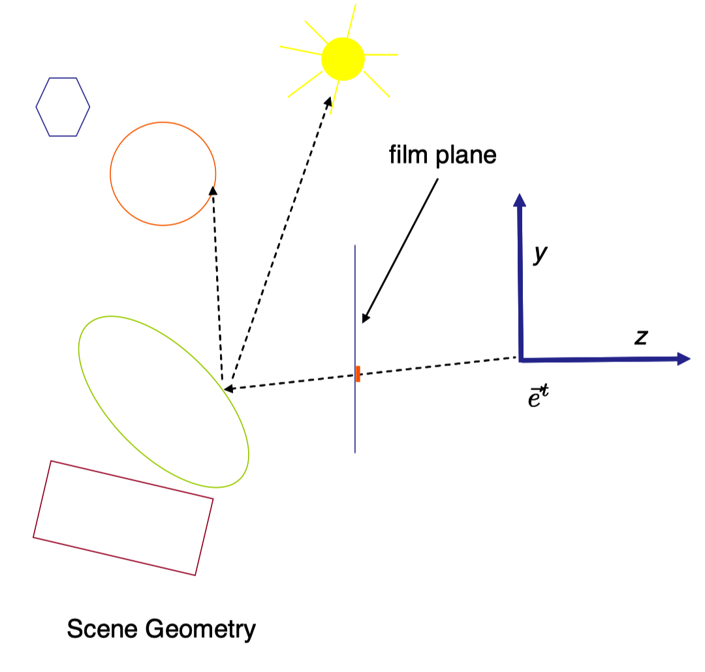

# Note
这是对**MIT Foundation of 3D Computer Graphics**第20章的翻译，本章讲解了光线追踪（ray tracing）技术的基础知识。本书内容仍在不断的学习中，因此本文内容会不断的改进。若有任何建议，请不吝赐教<ninetymiles@icloud.com> 

> 注：文章中相关内容归原作者所有，翻译内容仅供学习参考。
> 另：Github项目[CGLearning](https://github.com/nintymiles/CGLearning)中拥有相关翻译的完整资料、内容整理、课程项目实现。
 

# 什么是光线追踪（What is Ray Tracing）
光线追踪表达了一种不同标准OpenGL管线的渲染方式。这种技术的原理大部分超越了本书的范围，但是我们会给出基础概念的概要。关于这个主题在本书中要参考更多，请查看本书课后练习[23]或[56]。

## 20.1 Loop Ordering
从最基本的视角，我们可以将OpenGL基于光栅化的渲染看作下面的算法形式

```psuedo code
initialize z-buffer  //启动z-buffer
for all triangles    //遍历所有三角形
	for all pixels covered by the triangle  //遍历三角形所覆盖的像素
		compute color and z    //计算像素的色彩和z值
			if z is closer than what is already in the z-buffer  //如果z比z-buffer中所见的更接近
				update the color and z of the pixel //更新这个像素的色彩和z值
```
这种算法具有场景中每个三角形仅被触碰一次的良好特性，并且以一种可预测的顺序。例如，正是这个原因，甚至离线的皮克斯（Pixar）的RenderMan软件也使用了这种基本算法。另一种好的特性是，在三角形处理期间，设置计算仅被完成一次并且可以在其中所有像素上平摊。正如我们已经看到的，基于光栅化的渲染可以使用迷人的着色计算甚至使用多通道算法来增强。也存在诸如遮挡剔除（参考课后例子[11]）等高级算法，这些算法尝试避免渲染那些在场景中我们知道其会被其它物体所遮挡的三角形。

在基本的光线追踪中，我们反转循环循序以获得如下的算法

```psuedo code
for all pixels on the screen
	for all objects seen in this pixel  //对于在这个像素被看到的所有物体
		if this is the closest object seen at the pixel  //如果其是在像素上被看到的最近的物体
			compute color and z  //计算色彩和z值
			set the color of the pixel //设置这个像素的色彩

```
在第二行中，我们需要计算沿着一个像素的视线（参考图示$\text{Figure 20.1}$）哪些物体被看到。这个步骤要求对一条射线和这个场景相交的情形进行计算。这里列出了光线追踪的几个优势。

- 借助关系追踪，我们绝不会浪费计算被正物体的计算。
- 因为我们拥有顺着光线的有序列表，（非折射）透明就容易建模。这是因为我们拥有拥有顺着光线的有序列表，这个列表允许我们应用来自方程（16.4）中的over操作符。
- 借助光线追踪，我们可以直接渲染平滑物体，不是必须首先把它们切成三角形。
- 易于渲染借助容积集合操作描述的固态物体，就如多个物体的联合或者相交操作。（参考练习54）。

更重要的是，一旦光线相交代码就位，我们可以使用这种基础设施进行各种涉及跟踪几何光线通过场景的计算。例如，使用光线追踪，很容易建模完美的镜面反射和计算阴影。


**Figure 20.1:** 要为成像面上的一个像素上色，一条射线被发出进入场景。我们确定出被这条射线相交的第一个物体。更进一步，在相交点，我们可以向光源投射出阴影射线以考量是否我们在阴影中。如果物体像镜面一样，我们可以投射出一条反射射线。

## 20.2 相交（Intersection）
光线追踪中所需要的主体计算为计算场景中几何射线$(\tilde{p},\vec{d})$和物体的相交（intersection）。这里$\tilde{p}$为射线的起点，其以方向$\vec{d}$行进。

### 20.2.1 平面（Plane）
假设我们希望计算$(\tilde{p},\vec{d})$的相交，其中平面使用方程式$Ax + By + Cz + D = 0$描述。我们开始于使用一个参数$\lambda$沿着射线表达每个点
$$ \large{
\begin{bmatrix} x \\ y \\ z \end{bmatrix} = 
\begin{bmatrix} p_x \\ p_y \\ p_z \end{bmatrix} +
\lambda\begin{bmatrix} d_x \\ d_y \\ d_z \end{bmatrix} \tag{20.1}
}$$
把这个插入平面方程式，我们得到
$$ \large{
\begin{array}{rcl} 
0 & = & A(p_x + λd_x ) + B(p_y + λd_y ) + C(p_z + λd_z ) + D \\
  & = & \lambda(Ad_x + Bd_y + Cd_z ) + Ap_x + Bp_y + Cp_z + D \end{array} 
}$$
因此我们看到
$$ \large{
\lambda = \frac{−Ap_x − Bp_y − Cp_z − D}{Ad_x + Bd_y + Cd_z}
}$$
在这种解法中，$\lambda$告知我们沿着射线相交点在哪里（负值化的$\lambda$表示沿着射线后退）。在$\lambda$值之间的比较可以被用于决定在平面集合中沿着射线哪个平面首先被相交。

### 20.2.2 三角形（Triangle）
如果我们想要让一条射线相交于一个三角形，我们可以把这个问题分解为两个步骤。在第一步中，我们计算支撑这个三角形的平面的$A,B,C,D$值，并且像上面一样计算射线-平面相交。接下来，我们需要检测来决定相交点是在三角形内还是在三角形外。我们可以借助方程12.4中的“反时针”计算构建这样一种检测如下。假设我们希望检测一个点$\tilde{p}$是位于2D中的三角形$\triangle(\tilde{p}_1\tilde{p}_2\tilde{p}_3)$之内还是在外（参考图示$\text(Figure 20.2)$和$\text(Figure 20.3)$）。考虑三个“子”三角形$\triangle(\tilde{p}_1\tilde{p}_2\tilde{q})$，$\triangle(\tilde{p}_1\tilde{q}\tilde{p}_3)$和$\triangle(\tilde{q}\tilde{p}_2\tilde{p}_3)$。当$\tilde{q}$位于$\triangle(\tilde{p}_1\tilde{p}_2\tilde{p}_3)$，那么所有3个子-三角形将在时针方向上一致。当$\tilde{q}$在外部时，它们将会不一致。

### 20.2.3 球体（Sphere）
射线-平面相交的背后思路也可以改造为计算射线-球体相交。在这种情形中，拥有半径$R$和中心$c$的球体被建模为点$[x,y,z]^t$点集合，其满足方程$(x − c_x )^2 + (y − c_y )^2 + (z − c_z )^2 − r^2 = 0$。把这个插入方程（20.1），我们得到
$$ \large{
\begin{array}{rcl} 
0 & = & (p_x+\lambda d_x−c_x)^2+(p_y+\lambda d_y−c_y)^2+(p_z+\lambda d_z−c_z)^2 − r^2 \\
  & = & (d_x^2+d_y^2+d_z^2)\lambda^2+(2d_x(p_x−c_x)+2d_y(p_y−c_y)+2d_z(p_z−c_z))\lambda  \\
  & & +(p_x−c_x)^2+(p_y−c_y)^2+(p_z−c_z)^2−r^2 \end{array} 
}$$
我们然后使用2次方公式找出这个方程式真正的根$\lambda$。如果存在两个实数根（real roots），这些根表示两次相交，就如射线进入并且从球体离开。如果存在一个（二重）实数根，那么相交是沿着正切线的。如果不存在实数根，那么射线不能击中球体。就如上面所讲过的，任何这种相交可以是沿着射线后退的。

在相交处，$[x,y,z]^t$处球体的法线处于方向$[x-c_x,y−c_y,z−c_z]^t$之上。这实际上对于着色计算是有用的。

### 20.2.4 早期剔除（Early Rejection）
当计算射线和场景之间的相交时，代替验证每个场景物体和射线相交，我们可以使用辅助数据结构快速确定某个物体集合完全不能被射线命中。比如，你能够使用一个简单的形状（比方说一个大球体或盒子）其围住了某个物体集合。给出一个射线，你首先计算是否射线和这个容积相交。如果不相交，那么就很明显这个射线不能命中这个被围住集合中的任何物体。因而射线相交检测不再需要。这种思路可以使用层次体系和空间数据结构被更进一步开发。参考例子[73]及其相关文献。

## 20.3 次生光线（Secondary Rays）
一旦我们让射线相交基础设施就位，模拟很多光学现象就变得容易。例如，我们可以计算由点光源产生的阴影。要决定是否一个场景点位于阴影中，你沿着一条“阴影射线（shadow ray）”从被观察点向光源前进，观察是否存在任何在遮挡的几何体。(参考图示$\text{Figure 20.1}$。）

还有一种可以轻松完成的计算是镜面反射（还有相似的折射）。在这种情形中，你使用方程（14.1）计算反射方向并且在那个方向发出“反射射线（bounce ray）”（参考图示$\text{Figure 20.1}$）。被射线命中的这个点的色彩随后被计算并且被用于决定镜子上最初点的色彩。这个思路可以递归应用多次来模拟多个镜面（或者折射）反射。参考图示$\text{Figure 20.4}$。

### 20.3.1 更多光线（Even More rays）
就如在后面第21章中以更详细地方式所描述的，更加真实的光学模拟要求积分的计算，并且这些积分可以经常借助沿着样本集合绘制其作用的方式被近似。针对这些样本计算这些值经常涉及跟踪穿过场景的光线。

例如，我们可能想要模拟被有限区域中的大光源照明的场景。除了别的效果之外，这会导致软阴影边界（soft shadow boundaries）（参考后面图示$\text{Figure 21.8}$）。由于这种区域光源，通过向区域光源发出多条阴影射线并且确定出那些射线有多少命中光源，可以近似出这种光。其它相似的效果诸如相机镜头的聚焦效果和互相反射效果在第21章中会被讨论。这些也可以通过追踪很多通过场景的光线被计算。

