# Note
这是对**MIT Foundation of 3D Computer Graphics**第21章的翻译，本章讲解了光的精确模拟算法的基础知识，包含辐射率,辐射照度,辐射通量,反射,BRDF,光模拟,直接光,区域光,两次反射,传感器,积分算法等算法。本书内容仍在不断的学习中，因此本文内容会不断的改进。若有任何建议，请不吝赐教<nintymiles@icloud.com>。 

> 注：文章中相关内容归原作者所有，翻译内容仅供学习参考。
> 另：Github项目[CGLearning](https://github.com/nintymiles/CGLearning)中拥有相关翻译的完整资料、内容整理、课程项目实现。

 
# 光（技术角度）
本章中，我们会更详细地描述光和反射是如何被正确测量和表达的。这些概念对于非正式的（要求不高的）计算机图形可能不是必须的，但是要进行高质量的渲染，它们可能就会变得重要起来。这种高质量渲染经常借助独立软件来完成并且不会使用和OpenGL相同的渲染管线。我们讲到一些这样的材料，因为它可能是高级计算机图形中最有发展前景的部分。本章将会比本书的其余章节在更高层级（难度）讲解材料。对于这种材料更详细的处理，参考Jim Arvo的博士论文[3]和Eric Veach的博士论文[71]。

要理解高质量光模拟需要两个步骤。首先，你需要懂得测量光和反射所需要的正确单位。这种理解直接导致在场景中建模光如何表现的方程式。其次，针对这些方程式，你需要计算近似的解法。这些算法重度使用在第20章中所描述过的光线追踪基础设施。本章中我们聚焦在推导正确方程式所需的更基础性的概念上，并且仅仅只是提及随后的算法问题。对于这些问题要参考更多资料，感兴趣的读者应该阅读[71,30]。

我们关于光的基本思考模型（mental model）为相关于“几何光学”的。我们把光当作飞过空中的一个光子场(field of light)。在自由空间中，每个光子不受干扰地以直线飞行，并且每个都以相同的速度移动。当光子撞击一个表面，它们从那个点以多个方向散射。我们也假设这个场处于均衡状态。

## 21.1 多种光单位（Units）
如果我们要仔细模拟真实的图像，我们首先需要懂得用于测量光的单位。我们将借助一些简单的光子测量来完成这种讨论。这会引导我们到一个被称作辐射率（radiance）的非常有用的单位。

### 21.1.1 辐射通量（Radiant Flux）
我们把光当作一束从多个方向飞过空中的光子。想象出一个位于空中的“传感器”$(W,X)$，此处$W$是一个平整的成象(imaginary)参考表面并且$W$为一个由方向构成的楔形。在这个传感器中，我们计算在楔形$W$中从任何方向进入并且通过表面$X$的光子的数量。在我们的场景中可能存在和$X$重合的一个真实的物理表面，或者想象的传感器可能正位于自由空间中。参考图示$\text{Figure 21.1}$。 

**Figure 21.1:** 传感器统计了从$W$楔形中的入射方向通过$X$表面的光子。这会给出我们$\Phi(W,X)$，一种被称为辐射通量的测量。

这种传感器随后计数了每秒所接收的光子的数量。每个光子携带了以焦耳为计量单位的能量。通过用时间（以秒为单位测量）除能量，我们获得一种称作辐射通量的测量方法，以瓦特(watts)为作为计量单位。我们使用符号$\Phi(W,X)$表达这样一种测量。

接下来，我们假设（或通过实验验证）当我们连续改变传感器的几何特征（平移，旋转，或改变尺寸），$\Phi(W,X)$会连续变化。给出这种假设，我们现在已经准备好，可以去定义许多有用的辐射测量方式。

### 21.1.2 辐射照度（Irradiance）
首先，我们要定义出光的测量方式，比方说在一个非常小的拥有法线$\vec{n}$的平面传感器$X$，这种方式不依赖传感器$X$的实际尺寸。我们可以简单把测量的辐射通量除以传感器的面积（以平方米为单位测量）。执行这个步骤，我们获得一个测量（数据）
$$
E(W,X) :=\frac{\Phi(W,X)}{\|X\|}
$$
我们可以针对越来越小的$X$围绕单点$\tilde{x}$测量$E(W,X)$。根据关于$\Phi$合理的连续性假设，这个比率（几乎处处）汇合到一个值，我们称为一个（入射）辐射照度测量，并且记作$E_{\vec{n}}(W,\tilde{x})$。参考图示$\text{Figure 21.2}$。为了指定在这种测量序列中越来越小的传感器方位，我们需要持续保留$\vec{n}$参数。如果我们已经考虑了在空间中具有一个不同法线$\vec{n}'$的不同表面$X'$上相同的点$\tilde{x}$，我们会获得一个不同的数量$E_{\vec{n}'}(W,\tilde{x})$。（并且，由于楔形$W$是有限大小的，不存在轻松的方式将$E_{\vec{n}}(W,\tilde{x})$关联到$E_{\vec{n}'}(W,\tilde{x})$。在后面，当我们定义了称为辐射率的数量，我们会缩小$W$为一个矢量。在那种情形中，简单的cosine因子将可以把测量和不同的法线关联起来。）

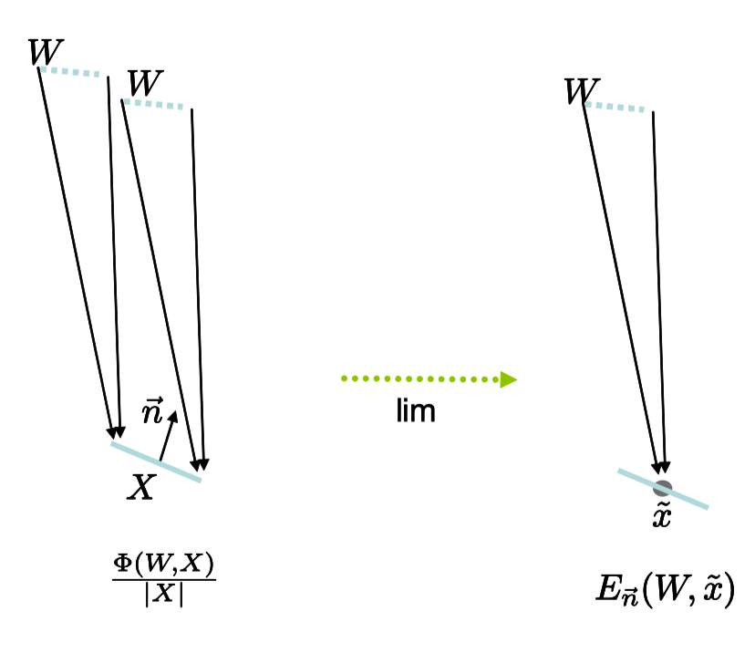
**Figure 21.2:** 我们可以把辐射通量除以$|X|$。在极限情形中，这就变为逐点的入射辐射率测量$E_{\vec{n}}(W,\tilde{x})$。

经常，在文献中，针对$E$的第一个参数会从标记方式中去除，并且从公式和上下文中以某种方式被推断。例如，在某些上下文中，可能$W$为当前点上整个上半球体是明确的。相似地，法线参数经常从标记中去除而且从上下文推断出来。

假设有限大小的传感器表面$X$被分成许多更小的表面，$X_i$。那么我们可以在整个传感器之上计算辐射通量为下面的求和公式
$$\large{
\Phi(W, X) = \sum_i\Phi(W, X_i) = \sum_i|X_i|\,E(W, X_i)
}$$

同样地，根据关于$\Phi$的合理连续性假设，我们可以计算逐点的辐射照度为
$$\large{
\Phi(W, X) = \int_X dA\,E_{\vec{n}(\tilde{x})}\Phi(W, \tilde{x})
}$$
此处$\int_X$为表面$X$上的积分，而$dA$为这个位置上的面积测量。

### 21.1.3 辐射率（Radiance）
我们接着要定义一种不依赖$W$楔形尺寸的测量，并且我们要约除掉$|W|$，$W$的纯角度测量。来自于原点的楔形中的纯角度只是被定义为单位球体上被楔形所覆盖的区域。这些单位被称作球面度，此处所有方向的楔形覆盖了$4\pi$的球面度。

现在我们通过将辐射照度除以球面度来定义一种新的辐射测量
$$\large{
L_{\vec{n}}(W,\tilde{x}) = \frac{E_{\vec{n}}(W,\tilde{x})}{|W|}
}$$

我们可以围绕一个指向点$\tilde{x}$的矢量$\vec{w}$借助越来越小的楔形来测量这种数据。再次，根据围绕$\Phi$合理连续性假设,这会汇聚到一种我们称为$L_{\vec{n}}(\vec{w},\tilde{x})$的测量，此处$\vec{w}$现在为单一方向矢量，并且不是楔形。参考图示$\text{Figure 21.3}$。

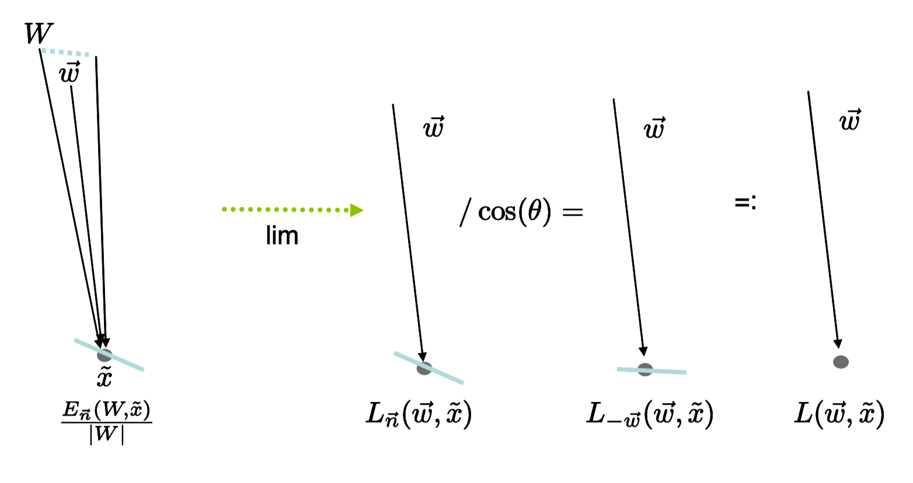
**Figure 21.3:** 我们可以通过$|W|$除以一个被测量的辐射照度来获得测量$L_{\vec{n}}(W,\tilde{x})=\frac{E_{\vec{n}}(W,\tilde{x})}{|W|}$。这会聚合于$L_{\vec{n}}(W,\tilde{x})$，去掉上标，给出我们用于光线的辐射率测量$L(\vec{w},\tilde{x})$。

我们现在通过转化对$L_{\vec{n}}(\vec{w},\tilde{x})$的测量为$L_{-\vec{w}}(\vec{w},\tilde{x})$，从而去掉对$\vec{n}$的依赖。换句话说，测量会有的情形是让$X$平面正交于入射光束。要实现这种测量，我们必须考虑到它们被平铺于上的传感器表面面积之间的比率。这可以被计算为
$$\large{
L(\vec{w},\tilde{x}) := L_{-\vec{w}}(\vec{w},\tilde{x}) = \frac{L_{\vec{n}}(\vec{w},\tilde{x})}{\cos(\theta)}
}$$
此处$\theta$为$\vec{n}$和$-\vec{w}$之间的角度。我们现在去掉法线参数，将这个简单地记作$L(\vec{w},\tilde{x})$而不是$L_{-\vec{w}}(\vec{w},\tilde{x})$。我们把这个称作入射辐射率（incoming radiance）测量。参考图示$\text{Figure 21.3}$。汇总为
$$\large{
L(\vec{w},\tilde{x}) := \frac{1}{\cos(\theta)} \lim_{W\rightarrow\vec{w}}\frac{1}{|W|} \left(\lim_{X\rightarrow\vec{x}}\frac{\Phi(W,X)}{|X|} \right) \tag{21.1}
}$$

还有一种方式（going the other way)，给出一个空间的和角度的变化$L(\vec{w},\tilde{x})$，我们可以计算大传感器$(W,X)$之上的辐射通量为
$$\large{
\Phi(W,X)=\int_XdA\,\int_Wdw\,L(\vec{w},\tilde{x})\cos(\theta)
}$$
此处$dw$为球面度的微分测量。辐射率测量允许我们测量一个点的光和方向，而不用保持跟踪测量设备的尺寸和方向。并且，虽然我们的辐射率标记包含一个3D点$\tilde{x}$作为它的一个变量，事实上（参考下面寻求一个论据），辐射率在自由空间沿着一条射线保持为常量。也就是
$$\large{
L(\vec{w},\tilde{x}) = L(\vec{w},\tilde{x}+\vec{w})
}$$

针对一个表面上的点，从点$\tilde{x}$以方向$\vec{w}$对向外发出的辐射率$L(\tilde{x},\vec{w})$进行测量也是有用的（我们反转对于$L$参数的顺序以将入射辐射率和外出辐射率区分）。我们可以把这个定义为
$$\large{
L(\tilde{x},\vec{w}):=\frac{1}{\cos(\theta)}\lim_{W\rightarrow\vec{w}}\frac{1}{|W|} \left( \lim_{X\rightarrow\vec{x}}\frac{\Phi(X,W)}{|X|} \right)
}$$

此处$\Phi(X,W)$为离开一个有限大小的表面$X$并且沿着楔形$W$中的矢量离开的光子的辐射通量（再一次，要注意参数的顺序）。

在自由空间中，很明显$L(\vec{w},\tilde{x})=L(\tilde{x},\vec{w})$。

辐射率是计算光模拟所需的最有用的数量。确实，我们能返回第14章和20章并且使用这些单位解释那些方法。例如，当我们在OpenGL碎片着色器中计算某个3D点$\tilde{x}$的色彩时，我们把这个解读为计算发出的辐射率$L(\tilde{x},\vec{v})$，此处$\vec{v}$是“查看矢量（view vector）”。这种发出的辐射率值也是处于图像平面上对应的样本地址处射入的辐射率值，并且被用于给像素上色。同样地，在光线跟踪中，当我们沿着射线$(\tilde{x},\vec{d}$追踪一条光线，我们可以把这个解读为计算入射的辐射率值，$L(-\vec{d},\tilde{x})$。

### 沿着光线的辐射率的恒定性（选学）（Constancy of Radiance Along a Ray (optional)）
在自由空间中，假设我们沿着矢量$\vec{w}$滑动传感器$(W,X)$以获得移位的传感器$(W,\tilde{X}')$，此处$\tilde{X}'=X+\vec{w}$（参考图示$\text{Figure 21.4}$）。在这种情形中，我们测量的通量将不会一致$\Phi(W,X)\neq \Phi(W,\tilde{X}')$。但是如果我们计算辐射率，在极限情况下，我们会得到一致性。实际上

$$ \begin{array}{lrl}   
L(\vec{w},\tilde{x})  &:=&  \frac{1}{\cos(\theta)} \lim_{W\rightarrow\vec{w}} \frac{1}{|W|} \left(\lim_{X\rightarrow\tilde{x}}\frac{\Phi(W,X)}{|X|} \right)  
 \\
& = & \frac{1}{\cos(\theta)}\left(\lim_{X\rightarrow\tilde{x}} \frac{1}{|X|}\lim_{W\rightarrow\tilde{w}}\frac{\Phi(W,X)}{|X|}\right) \\
& = & \frac{1}{\cos(\theta)}\left(\lim_{X\rightarrow\tilde{x}} \frac{1}{|X|}\lim_{W\rightarrow\tilde{w}}\frac{\Phi(W,X+\vec{w})}{|X|}\right) \\
& = & \frac{1}{\cos(\theta)}\left(\lim_{X'\rightarrow\tilde{x}+\vec{w}} \frac{1}{|X'|}\lim_{W\rightarrow\tilde{w}}\frac{\Phi(W,X')}{|X|}\right) \\
& = & \frac{1}{\cos(\theta)} \lim_{W\rightarrow\vec{w}} \frac{1}{|W|} \left(\lim_{X'\rightarrow\tilde{x}+\vec{w}}\frac{\Phi(W,X')}{|X'|} \right)   
= L(\vec{w},\tilde{x}+\vec{w})
\end{array}$$

在第三行，针对非常小的楔形，我们使用极限情况下的事实，就是我们的传感器和移位的传感器会测量相同集合的光子，从而
$$\large{
\lim_{W\rightarrow\vec{w}} \frac{\Phi(W,X')}{\Phi(W,X)} = 1
}$$
作为这种公式的结果，我们说辐射率沿着光线为常量。

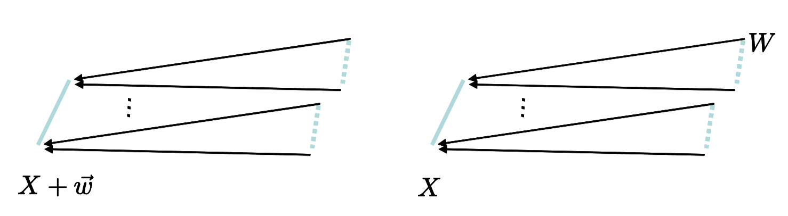
**Figure 21.4:** 我们可以沿着中央方向$\vec{w}$移动一个传感器。针对小楔形的极限情形，它们将主要测量相同光子。从这种角度我们可以总结沿着光线的辐射率是常量。

根本上，我们可以把这种常量认为是形成于两种事实的组合。第一个，我们的物理假设暗示，在自由空间，被测量的通量，$\Phi$，只依赖于被测量的直接光线的集合，而不是被测量的地方。其次，针对任何光线集合，比方说被称作$S$，如果我们通过方向$\vec{w}$参数化光线，借助这些方向它们命中某些平面$X$，然后*光线测量*：$\int_S dw \;dA_X\;\cos(\theta)$事实上不会依赖平面$X$的选择。借助这种术语，辐射率只是光线测量上辐射通量的强度，并且$\tilde{x}$的选择是不相关的。

## 21.2 反射（Reflection）
当光线从$W$ - 楔子中围绕矢量$\vec{w}$的入射方向 - 进入并且照射到物理表面上的点$\tilde{x}$，然后那个光的一些可以从表面被反射。我们做出简化的近似或假设，所有的反射都是逐点的，也就是说，照射到一个点的光只从那个点反射出去。让我们测量沿着$V$被反射的光，围绕发出方向矢量$\vec{v}$的某个楔形。反射的详细状况通过材料的物理属性所控制。我们希望使用某种描述入射相对于出射光比率的函数$f$表示这种反射的行为。对于这种比率我们应该使用什么种类的单位？当我们使用越来越小的入射和出射楔形时，我们的指导原则是我们想要一种趋于一致的比率。这暗示了我们的第二原则（其以自身或关于自身的方式是值得拥有的）：我们想要一种实际上不依赖楔形（针对足够小的楔形）尺寸的比率。

在这个部分中，我们会推导描述反射的主要方式，被称为BRDF。针对特殊的材料，比如纯粹镜面和折射媒介，我们会使用稍微不同的表达。

### 21.2.1 BRDF（双向反射分布函数）
我们可以以实验方式证实大多数材料（排除纯镜面或镜头，参考下面）具有下列漫射行为。针对任何固定的入射光模式，当我们旋转这个楔形时，沿着任何出射楔形方向被测量的出射光连续改变。因此如果我们加倍一个小的出射测量的楔形$V$的尺寸，我们会看到大约两倍的出射辐射通量。所以，要以一种不依赖$V$的尺寸的方式设置比率$f$的分子，我们应该使用辐射率的单位。让我们称这种出射测量：$L^1(\tilde{x},\vec{v})$。我们在$L^1$上放置一个上标在这里用以澄清我们正在指（refer to）反射光子的测量。

同样地，（但可能令人吃惊地）我们可以验证，对于大多数材料（再次提醒镜面和镜头被排除），如果所有光线来自于一个小的楔形$W$，并且我们加倍这个入射方向楔形的宽度，沿着固定出射方向楔形的辐射通量的数量，也大约会加倍。因而，要获得一个不依赖$W$尺寸的比率，在这种情形中我们需要分母去加倍。我们通过以辐射照度衡量的方式测量入射光来完成这种测量。

把这个汇总，我们看到我们应该测量反射为
$$\large{ \begin{array}{rcl}
f_{\tilde{x},\vec{n}}(W,\vec{v}) & = & \frac{L^1(\tilde{x},\vec{n})}{E_{\vec{n}}^e(W,\tilde{x})} \\
& = & \frac{L^1(\tilde{x},\vec{n})}{L_{\vec{n}}^e(W,\tilde{x})|W|}
\end{array} }$$

此处我们使用上标$L^e$用来指已经被某种光源发射但还没被反弹的光子。再一次，通过让围绕固定的$\vec{w}$的入射楔形越来越小，这个数量被汇聚到一种被表示为$f_{\tilde{x},\vec{n}}(W,\vec{v})$的测量。这种函数，$f$，被称为双向反射分布函数，或称BRDF。它是一种在入射和出射方向都变化的函数。参考图示$\text{Figure 21.5}$。

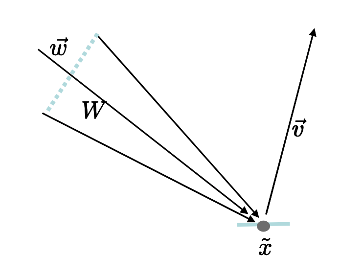
**Figure 21.5:** BRDF测量入射辐射率相对于出射辐射率的比率。

最简单的BRDF为常量BRDF $f_{\tilde{x},\vec{n}}(W,\vec{v})=1$。这表达了漫射材料的行为。在这种情形中，一个点的出射辐射率完全不依赖$\vec{v}$。（微妙之处：这不意味着入射光子没有在所有出射方向被均等散射。事实上，在一个漫射表面上更多的光子在表面法线的方向上被散射，并且被散射的光子数量通过一个cosine因子在掠过的角度减弱为0。相对比地，出射辐射率不依赖出射角度，因为辐射率的定义包含它自身的cosine因子，所以它取消了这种“减弱”因子。直观地讲，当从掠过角度观察一个漫射表面，每单位表面面积上更少的光子朝向你而来，但是通过传感器你也看到更多的表面面积。）

更复杂的BRDF可以从多种方法中被推导。

- 我们完全能处理（应付）某种让我们的材料在图像中显得更好看的函数。这本质上是我们在14小节中所做的。
- 我们借助多种物理假设和统计分析推导BRDF函数。这涉及光和材料的更深入理解。
- 我们可以构建实际测量真实材料BRDF的设备。这可以被存储为一个大的表格形式，或者借助某种函数形式被近似。参考图示$\text{Figure 21.6}$。

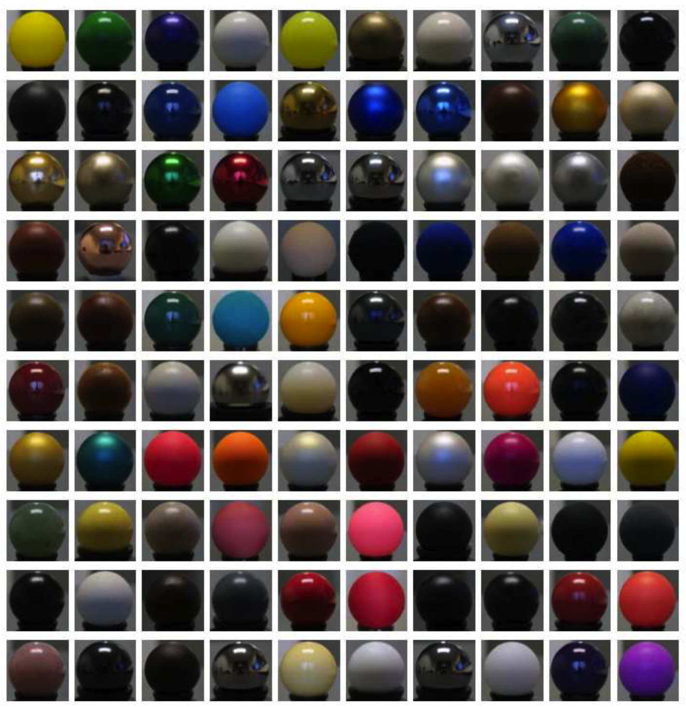
**Figure 21.6:** 通过测量设备捕获的一系列BRDF。来自于参考书吗[47]，©️ACM。

假设我们想计算拥有法线$\vec{n}$的表面上一个点的出射光$L^1(\tilde{x},\vec{v})$，由于光从点$\tilde{x}$上的半球体$H$射入。并且假设$H$被分解为有限大小的楔形$W_i$集合。那么我们借助求和公式计算反射光
$$\large{
L^1(\tilde{x},\vec{v}) = \sum_i|W_i|f_{\tilde{x},\vec{n}}(W_i,\vec{v})L_{\vec{n}}^e(W_i,\tilde{x})
}$$

同样地，借助积分$f_{\tilde{x},\vec{n}}(\vec{w},\vec{v})$和$L^e(\vec{w},\tilde{x})$，我们使用积分计算反射光：
$$\large{ \begin{array}{rcl} L^1(\tilde{x},\vec{v}) & = & \int_H dw \,f_{\tilde{x},\vec{n}}(\vec{w},\vec{v})L_{\vec{n}}^e(\vec{w},\tilde{x})  \quad\qquad\qquad \  \text{(21.2)}  \\    & = & \int_H dw \,f_{\tilde{x},\vec{n}}(\vec{w},\vec{v})L^e(\vec{w},\tilde{x}) \cos(\theta)  \qquad\; \text{(21.3)} \end{array} }$$
这被称为反射方程式，并且对于我们的大部分模型，这是用于光模拟的基础。参考图示$\text{Figure 21.7}$。

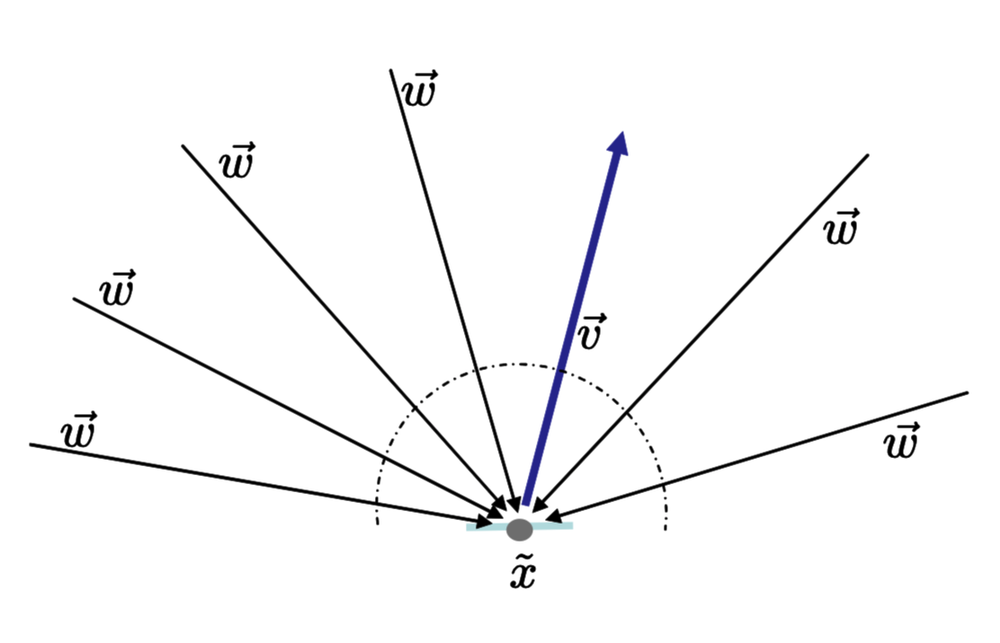
**Figure 21.7:** 要计算出射反射辐射率，$L^1(\tilde{x},\vec{v})$，反射方程式计算了所有朝向$\tilde{x}$而来的入射光线$\vec{w}$的积分。

### 21.2.2 镜面和折射（Mirrors and Refraction）
纯粹镜面反射和折射不易于使用BRDF表达被建模。在镜面的表达中，$L^1(\tilde{x},\vec{v})$，沿着光线反射的辐射率，**仅仅**依靠$L^e(-B(\vec{v},\tilde{x}))$，沿着一条光线的入射辐射率。这里$B$为方程14.1的反射操作符。

加倍包含$-B(\vec{v})$的入射楔形的尺寸在$L^1(\tilde{x},\vec{n})$上没效果。因而，对于镜面材料，我们表达反射行为为
$$\large{
k_{\tilde{x},\vec{n}}(\vec{v})=\frac{L^1(\tilde{x},\vec{v})}{L^e(-B(\vec{v}),\tilde{x})} \tag{21.4}
 }$$
此处$k_{\tilde{x},\vec{n}}(\vec{v})$为某种材料系数。我们替换反射方程式为
$$
L^1(\tilde{x},\vec{v}) = k_{\tilde{x},\vec{n}}(\vec{v})L^e(-B(\vec{v}),\tilde{x})
$$
在这种情形中积分不再需要。因为这个原因，镜面反射易于以算法方式计算，并且易于在光线追踪程序中完成。

当光使用不同的折射指数在媒介之间通过，例如当光进入或者离开玻璃，借助恰当的几何规则，光线发生弯曲。就如镜面反射，在材料接口上，沿着每个出射光线的辐射率被入射光线的辐射率所影响。再一次，在这里使用“辐射率的比率”单位是最容易的，就像在方程（21.4）中。

## 21.3 光模拟（Light Simulation）
反射方程式可以被用于嵌入风格来描述光如何围绕一个环境多次反射。这样的描述通常导致需要被计算的有限积分。实际上，这种计算在积分域上通过某种具体的采样动作来完成。

在这个部分，我们会开始于来自14章的着色模型的简单光模拟，然后逐步扩大为更复杂的模型。

我们使用不带参数的符号$L$表达由某种光子几何而导致的场景中辐射率测量的完整分布。这样一种$L$
包含场景中任何地方的所有入射和出射测量。我们使用$L^e$表达未反射（散射的）光子。并且用$L^i$表达已经确切反弹$i$次的光子的辐射率。

### 21.3.1 直接点光（Direct Point Lights）
在我们的基本OpenGL渲染模型中，我们的光不是来自于区域光，而是来自于点光。这样的点光确实符合我们的连续假设并且不是那么易于使用我们的单位表达。实际上，对于点光我们只要替换反射方程式为
$$\large{
L^1(\tilde{x},\vec{n})=f_{\tilde{x},\vec{n}}(-\vec{l},\vec{v})\;E_{\vec{n}}^e(H,\tilde{x})
}$$
由于点光源和$l$为从点$\tilde{x}$指向光的“光矢量”的缘故，此处$E^e$为进入照射到$\tilde{x}$的未反射的辐射照度。我们可以随意以我们想要的方式计算$E^e$。例如，在真实世界中，对于一个非常小的球体光源，在一个点$\tilde{x}$上的辐射照度成比例于$\frac{\cos(\theta)}{d^2}$，此处$d$为光和表面之间的距离。这是因为小光源的纯粹角度减弱为$\frac{1}{d^2}$。（另一方面，这种距离减弱项倾向于使得图像过于暗，所以不经常被使用）。也要注意到，在小节14的语言中，我们让$\cos(\theta)=\vec{n}.\vec{l}$。

### 21.3.2 直接区域光（Direct Area Lights）
假设我们的光源拥有有限大小的面积，然后我们真正需要反射方程的积分。在这种情形中，方程（21.2）中在H上的被积分函数（integrand）对于"看得到"光的入射方向$\vec{w}$仅为非零值。

如果我们使用某中有限数目的入射方向$\vec{w}_i$近似积分,我们可以使用光线追踪方式计算这些$L^e(\vec{w},\tilde{x})$值。当随机被用于选择这些方向，这种方式被称为分布式光线追踪（distribution ray tracing）[13]。因为光线相交是一种昂贵操作，这些积分要精确计算可能非常昂贵。

当光源部分被其它几何体遮挡，这种积分会产生拥有某种软边界的阴影。这会发生是因为在一个光-接收表面上临近的点上可能看见不同数量的光源面积。参考图示$\text{Figure 21.8}$。

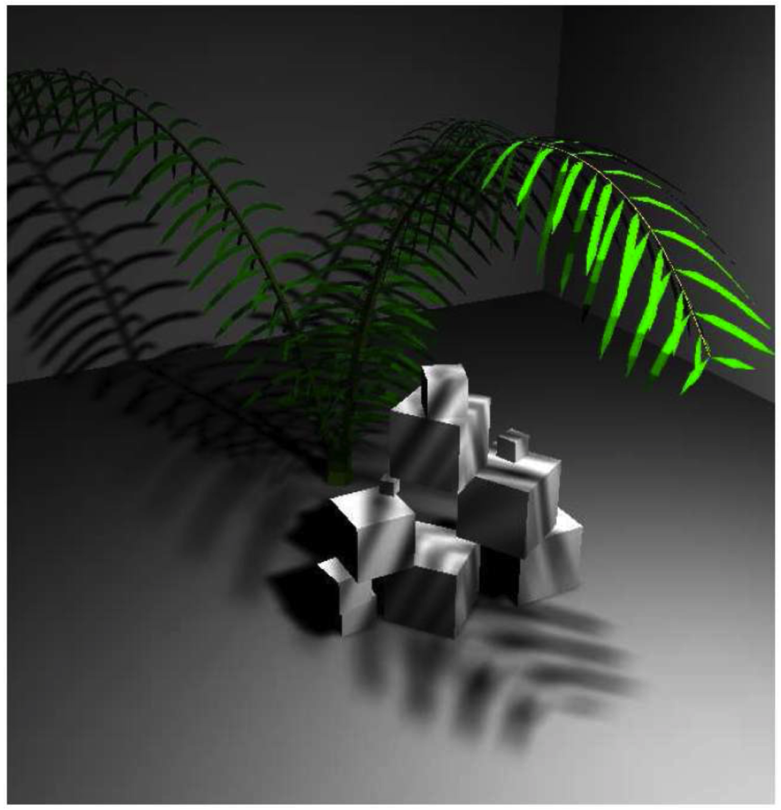
**Figure 21.8:** 区域光之上的积分引起了软阴影（soft shadows）。来自于数目[69]，©️ACM。

### 21.3.3 两次反弹（Two Bounces）
我们可以计算$L^2$，第二次被反弹光子的光分布，通过使用反射方程式，但是用$L^1$替换“输入”$L^e$。
$$\large{ \begin{array}{rcl}
L^2(\tilde{x},\vec{v}) & = & \int_H dw\;f_{\tilde{x},\vec{n}}(\vec{w},\vec{v}) \, \cos(\theta) \, L^1(\vec{w},\tilde{x}) \\
& = & \int_H dw\;f_{\tilde{x},\vec{n}}(\vec{w},\vec{v}) \, \cos(\theta) \, \int_{H'} dw'\;f_{\tilde{x}',\vec{n}'}(\vec{w}',\vec{w}) \, \cos(\theta') \, L^e(\vec{w}',\tilde{x}') \\
& = & \int_H dw \int_{H'} dw' f_{\tilde{x},\vec{n}}(\vec{w},\vec{v}) \, \cos(\theta) \, f_{\tilde{x}',\vec{n}'}(\vec{w}',\vec{w}) \, \cos(\theta') \, L^e(\vec{w}',\tilde{x}')
\end{array} }$$
在这种表达式中，$\tilde{x}'$是沿着射线$(\tilde{x},-\vec{w})$首先被击中的点。在相交点，$\vec{n}'$是法线，$H'$是上半球体，而$\vec{w}'$是输入方向，其和$\vec{n}'$构成一个角度$\theta'$。参考图示$\text{Figure 21.9}$。

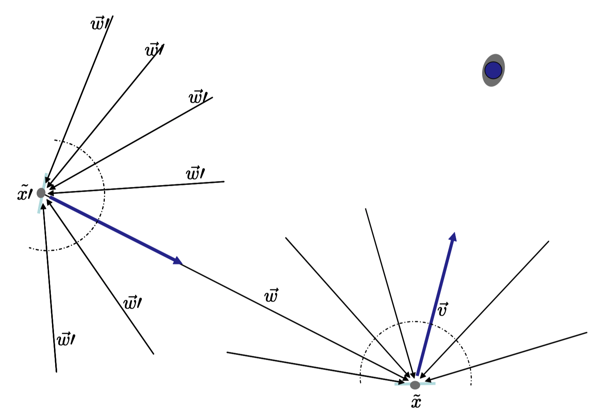
**Figure 21.9:** 要计算$L^2$，我们需要两种嵌入的积分。针对每个朝向$\tilde{x}$的方向$\vec{w}$，在那里我们会找到被展示的射线所命中的点$\tilde{x}'$。我们随后需要求得在$\tilde{x}'$之上的半球体的积分。

一旦被计算，我们可以加总到一起$L^e(\tilde{x},\vec{v}) + L^1(\tilde{x},\vec{v})+L^2(\tilde{x},\vec{v})$，并且在图像平面上把这个作为点的被观察色彩。

就如在上面方程中第二行中所暗示的，一种计算$L^2$的方式是借助分布光线追踪通过迭代评估这些嵌入的积分。也就是说，一个外部循环积分求得点$\tilde{x}$上的半球体的积分。针对每个采样方向$\vec{w}$，我们命中某个点，$\tilde{x}'$。我们然后使用一个递归的分布光线追踪调用以求得其上半球体的积分。参考图示$\text{Figure 21.9}$。

可选择地，就如在上面公式第三行所暗示的，也存在其它方式组织这种积分。让我们通过$\tilde{x}'$表示沿着光线$(\tilde{x}',-\vec{w}')$首先被命中的这个点。随后，在积分中，每个变量$(\vec{w},\tilde{w}')$的设置对应于长度为2的几何路径：$(\tilde{x},\tilde{x}',\tilde{x}'')$。我们可以把这个被积分函数当作计算在点$\tilde{x}''$发射的光，在点$\tilde{x}'$被反射，并且随后在点$\tilde{x}$朝向$\vec{v}$方向被反射。如此，把这个不当做两个
半球体上的嵌入式积分，而是在合适路径空间上的积分。这形成了被称作路径追踪[71]的积分算法。

这种二次反射光$L^2$比直接光稍不重要一些，但是需要正确模拟周围环境的模糊反射。参考图示$\text{Figure 21.11}$。它也会产生被称作色彩混合的可视性稍差的效果（再次参考图示$\text{Figure 21.11}$）。焦散效果（caustic effects）也是由于$L^2$被观察到。在这种情形中，光从镜面的和折射物体反射，并且在漫射表面生成亮点。这种光然后朝向眼睛反射。参考图示$\text{Figure 21.12}$。

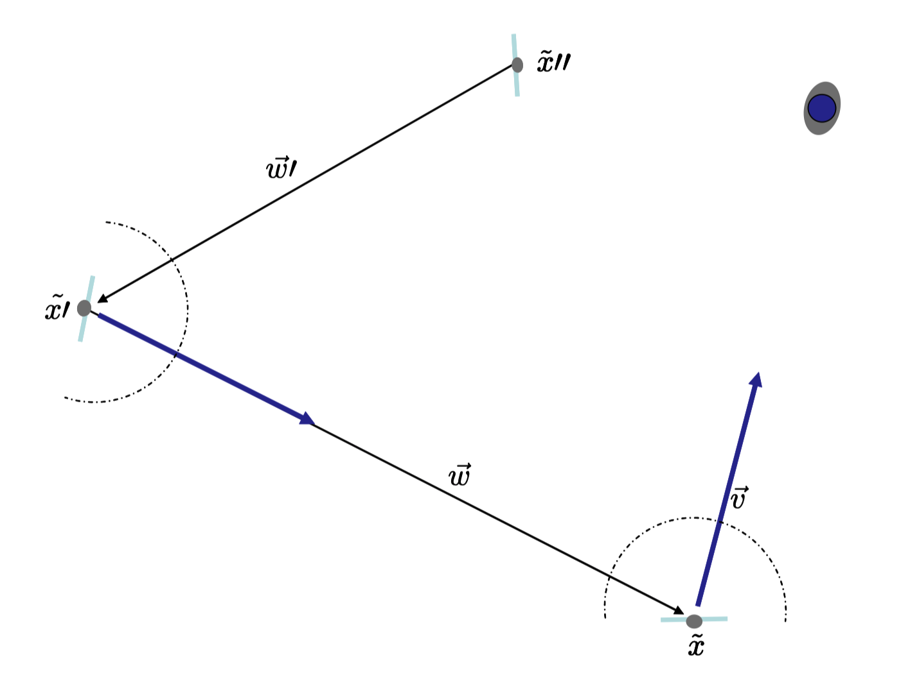
**Figure 21.10:** 计算$L^2$的积分可以被当作长度为2的路径上的求和。

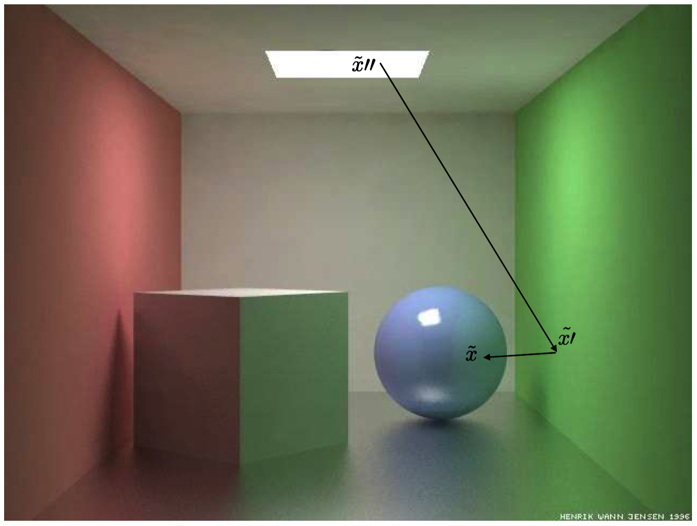
**Figure 21.11:** 二次反射光$L^2$说明了在球体所在光亮地面的模糊反射，同时还有来自天花板墙壁的滲色。一个长度为2的$c$路径被展示。来自于[29]，©️Springer。

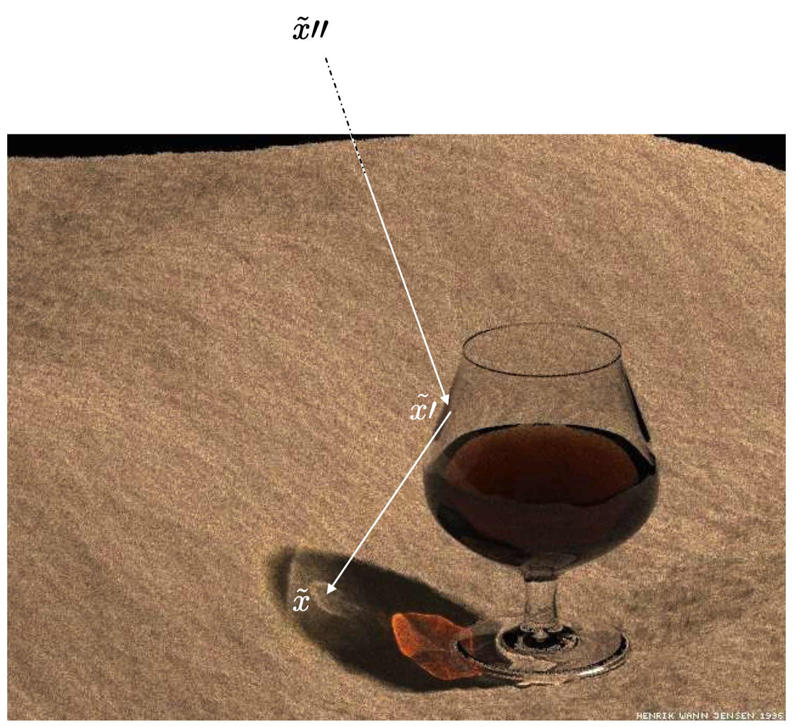
**Figure 21.12:** 二次反射光也能生成在地面$c$上的焦散效果（caustic effects）。一个长度为2的路径被展示。来自于[29]，©️Springer。

### 21.3.4 类似情形（And So On）
在真实世界，光围绕环境反射很多很多次。因而，整体被观察的光$L^t$为来自于发射体的光之和，并且反弹很多次。
$$
L^t = L^e + L^1 + L^2 + L^3 + .....
$$

一些光在每个反射时被吸收，让更高等的反射项变小，并且和是收敛的。

更高等的反射说明了环境中明亮和黑暗的整体分布。参考图示$\text{Figure 22.13}$。在大多数情形中，这可以用低精度方式完成并且在一个低空间解析度之上。

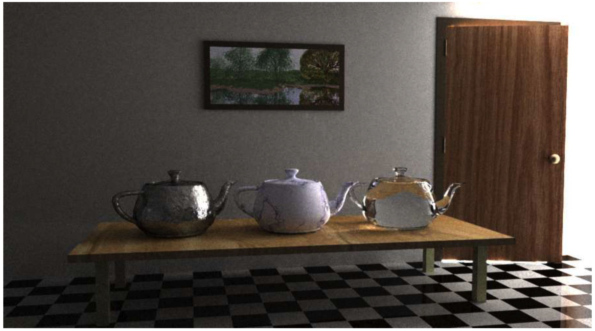
**Figure 21.13:** 通过计算多次反射，我们能计算一个环境的正确的亮和暗的$c$分布。来自于[72]，©️ACM。

在软件渲染中，这种积分可以采用采样和求和被完成。这里效果好的方法包含分布光线追踪[13]，路径追踪[71]，“辐射率”算法[75]和光子映射[30]。

在OpenGL中，大多数这种效果只是借助多通道渲染和预计算纹理的组合。一种流行的这种技术被称作“环绕吸收（ambient occlusion）” [39]。

### 21.3.5 渲染方程式（The Rendering Equation (optional)）
除了把$L^t$当作$L^i$的无限之和，我们也能把$L^t$当作针对所谓渲染方程式的求解方法。视点可以最终导致其它理解和对于光模拟的算法方式。这里我们包含它，因为它自身很有趣。

让我们通过以简写记录方程式为
$$\large{
L^1 = \beta L^e
}$$
此处$\beta$为反射操作符，其映射光分布到光分布。更一般地，我们可以使用反射方程式和反射操作符记录$L^{i+1}=\beta L^i$。

把这个汇总到一起，我们可以记录
$$\large{ \begin{array}{rcl}
L^t & = & L^e + L^1 + L^2 + L^3 + .....  \\
& = & L^e + \beta(L^1 + L^2 + L^3 + .....)  \\
& = & L^e + \beta L^t
\end{array} }$$
这表达了必须针对整体均衡分布$L^t$必须持有的方程式。

在一个表面点，这可以被扩展出来为
$$\large{
L^t(\tilde{x},\vec{v}) = L^e(\tilde{x},\vec{v}) + \int_H dw f_{\tilde{x},\vec{n}}(\vec{w},\vec{v})L^t(\vec{w},\tilde{x})\cos(\theta)
}$$
这种最后的形式被称为渲染方程式。注意$L^t$出现在方程式的两边，所有它不只是有限积分，而且是积分方程式。

## 21.4 传感器（Sensors）
当我们在场景中放置一台（虚拟）相机，图像被俘获于光分布$L^t$，场景中光的整体均衡分布。对于针孔相机，我们只是沿着光线从像素朝向针孔捕获每个像素/样本地址的入射辐射率。在真实相机（或其模拟），为了捕获传感器屏幕中有限数量光子，我们需要有限大小的光圈或有限时间的快门。参考图示$\text{Figure 21.14}$。给出这样一种相机，我们可以建模像素$(i,j)$处的光子统计为
$$\large{
\int_T dt \int_{\Omega_{i,j}}dA \int_W F_{i,j}(\tilde{x})L^t(\vec{w},\tilde{x})\cos(\theta)
}$$
此处$T$为快门的间隔，$\Omega_{i,j}$为像素$(i,j)$处的传感器的空间支持，并且$F_{i,j}$为点$\tilde{x}$处像素$(i,j)$的空间感知函数，而$W$为始于光圈朝向成像点的矢量楔形。

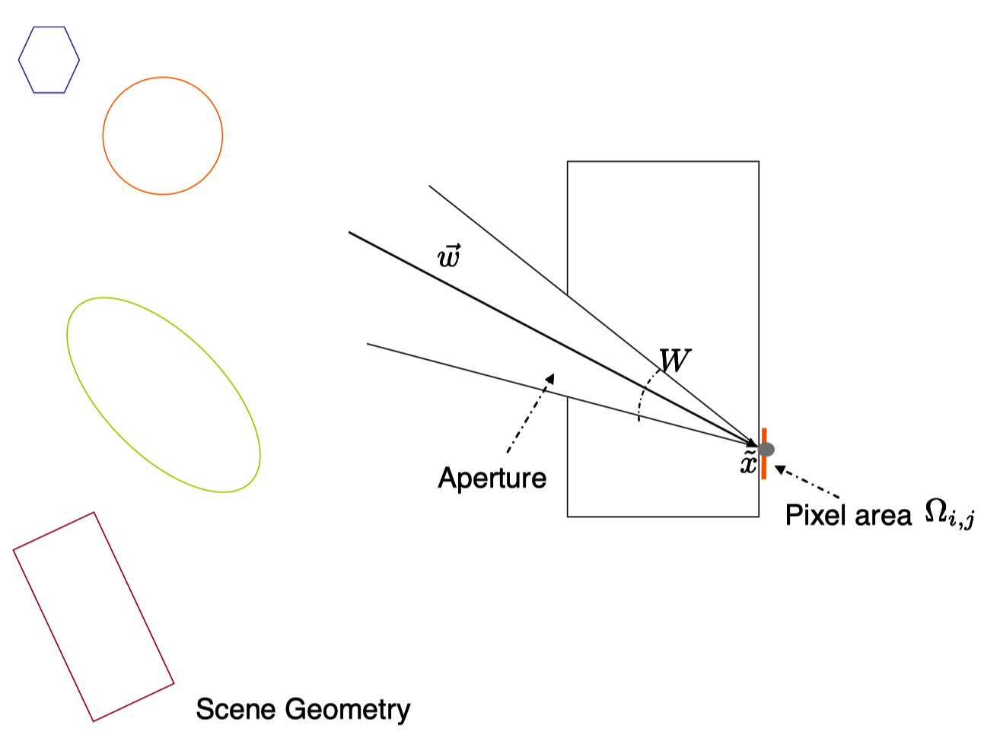
**Figure 21.14:** 在一个相机中，我们必须在光圈和像素脚印上积分。

要组织光，镜头被放置在光圈之前。最简单的镜头模型被称作薄镜头模型（thin lens model）。它的几何体在图示$\text{Figure 21.15}$被可视展示。镜头的效果是保持物体在特定的深度平面聚焦。由于$\int_W$操作的影响，位于其它深度的物体看起来会模糊掉。

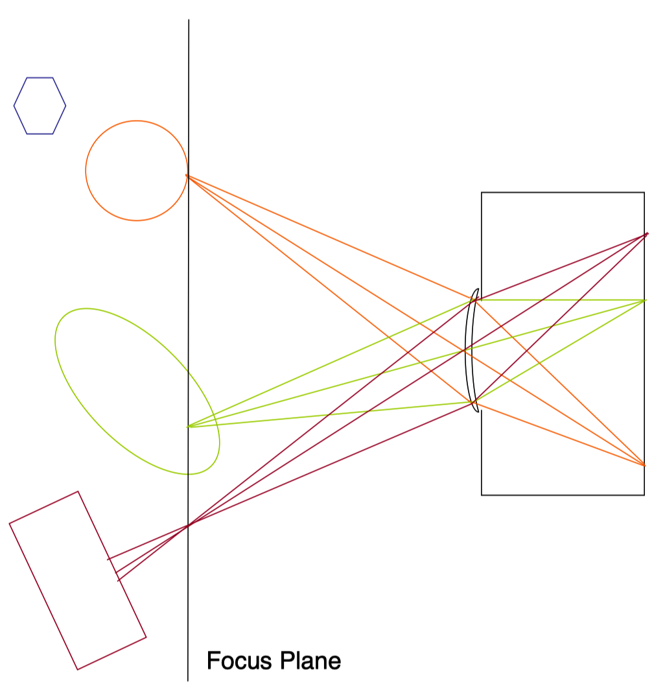
**Figure 21.15:** 这里我们展示放置一个薄镜头在光圈前的效果。它拥有在一个设定的深度平面上聚集光线的效果。物体在这个平面之前，或者之后都位于焦距之外并且被模糊。

我们已经看到（小节16.3）像素面积域上的积分产生了抗锯齿效果。快门期间的积分产生了运动模糊效果。参考图示$\text{Figure 21.16}$。光圈上的积分产生了聚焦和模糊效果，也称为景深效果（depth of field effects）。参考图示$\text{Figure 21.17}$。

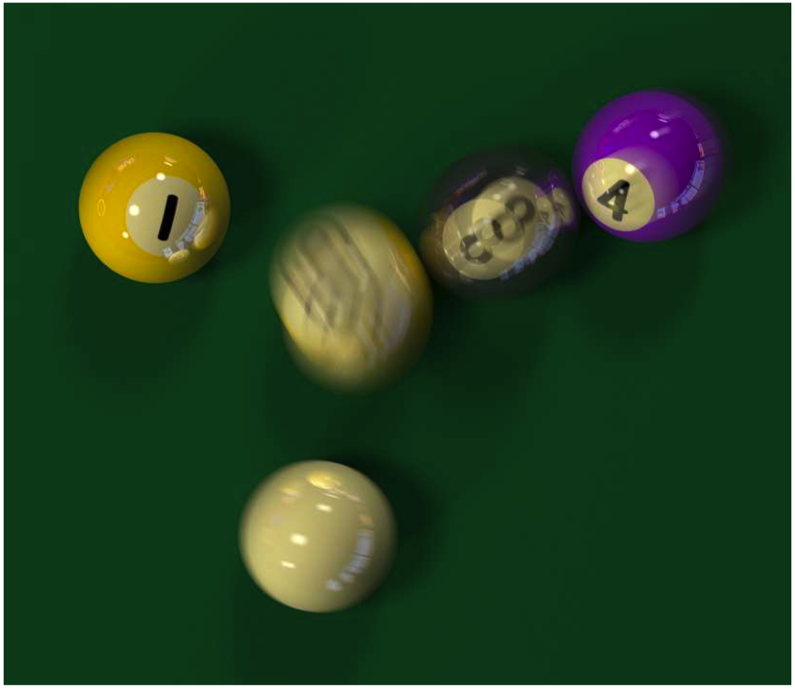
**Figure 21.16:** 一张首先发布的使用每像素很多像素渲染的图像。来自于参考书目[13]，©️Pixar。

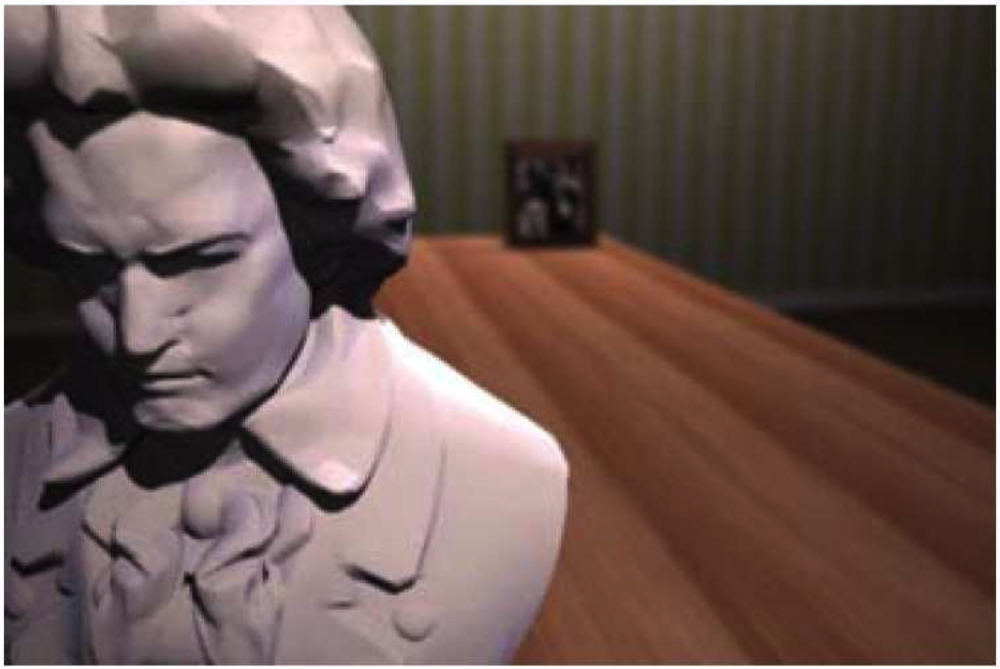
**Figure 21.17:** 镜头上的积分产生了聚焦效果。来自于课后书目[38]，©️ACM。

## 21.5 积分算法（Integration Algorithms）
正如我们看到的，始于$L^e$，其作为场景定义部分，反射光的计算，$L^1$，尤其是整体均衡分布，$L^t$，要求（嵌入）有限积分的计算。并且，在我们传感器上每个像素值的计算也要求自身的积分。积分计算通常通过在被积函数（integrand）的某个样本集合上将其转化为求和来近似。

在相片级真实的渲染域中大多数工作完全相关于近似这些积分的最佳方式。有效计算这些方式的关键思路包含：

- 使用随机数选择样本[13]。这会避免显著的近似过程中错误模式。借用随机数，我们也使用预期参数来主张方法的正确性。
- 重用如[75,20]中的大多数计算。如果我们知道一个点的辐射照度，可能我们可以和临近点共享这个数据。
- 做更多的在输出上有更多效果的工作。例如，跟踪没有携带很多辐射率的光线可能是不值得的[71]。

可能最重要的要记于心中的教训是这里在其运行中存在某种双重性：一方面更多的积分意味着更多的工作。但是另一方面，每个积分通常为某种模糊操作。因此，更多积分意味着需要更少的精确度。为了效率起见，我们不应该花费太多努力计算那些会模糊掉或者绝不会影响最终图像的细节。例如，我们通常应该在计算直接照明上花费更多时间，而在不直接光照上花费更少时间。

## 21.6 更通用的效果（More General Effects）
在我们的简单光和反射模型中，存在我们没有捕获到的其它光学效果。当光穿过雾的时候，大气容器散射会发生。当表面吸收光并且随后再发射出这种能量（经常位于不同的波长之上）。偏振（polarization）和衍射（diffraction）效果偶然也可以被观察到。

一个证实为稍微重要的效果为表面散射。这种情形中，光在一个点进入一种材料，围绕这个表面内反射，并且在围绕进入点有限大小的区域上散射出来。这给出了一种整体柔和效果（softening effect）并且对于正确建模诸如皮肤和宝石之类的表面可能是重要的。参考图示$\text{Figure 21.18}$。

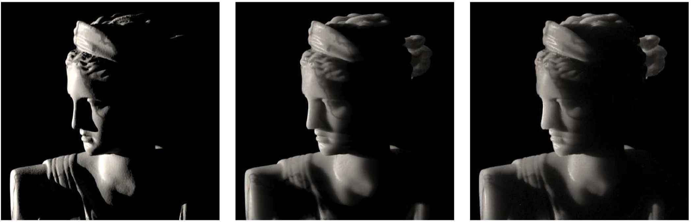
**Figure 21.18:** 从左到右越来越多的子表面散射被应用。这可以给出尺寸线索（scale cues），使得最右侧图看起来最小。来自于[31]，©️ACM。

