# Note
这是对**MIT Foundation of 3D Computer Graphics**第22章的翻译，本章讲解了几何建模的基础算法知识。本书内容仍在不断的学习中，因此本文内容会不断的改进。若有任何建议，请不吝赐教<ninetymiles@icloud.com>。 

> 注：文章中相关内容归原作者所有，翻译内容仅供学习参考。
> 另：Github项目[CGLearning](https://github.com/nintymiles/CGLearning)中拥有相关翻译的完整资料、内容整理、课程项目实现。
 

# 几何建模：基础介绍（Geometric Modeling: Basic Intro）
在计算机图形中，我们需要具体方式表达形状。几何建模就是关于怎样表达、生成和修改这些形状的主题。几何建模是一个大型主题，其本身值得拥有（并且已经有了）自己相关的书籍（例如参考书目[21,76,7]）。为了给你一点相关概念，这里我们将简单概括一下这个主题。我们会多花费一点时间在细分表面的表达上，因为这些正在变成流行的表达方式。

## 22.1 Triangle Soup（三角形乱序集合）
对于在OpenGL中的渲染，最直观的表达是triangle soup；三角形集合，每个通过3个顶点被描述。（参考图示$\text{Figure 22.1}$作为样例。）这种数据经常能够被更好组织以减少冗余。例如，在很多情形中，尤其当它被很多三角形共享时，每个顶点仅存储一次就有意义。另外，连接信息可以借助诸如“三角形扇(triangle fans)”和“三角形带(triangle strips)”被更紧凑地被表达。参考课后书目[79]

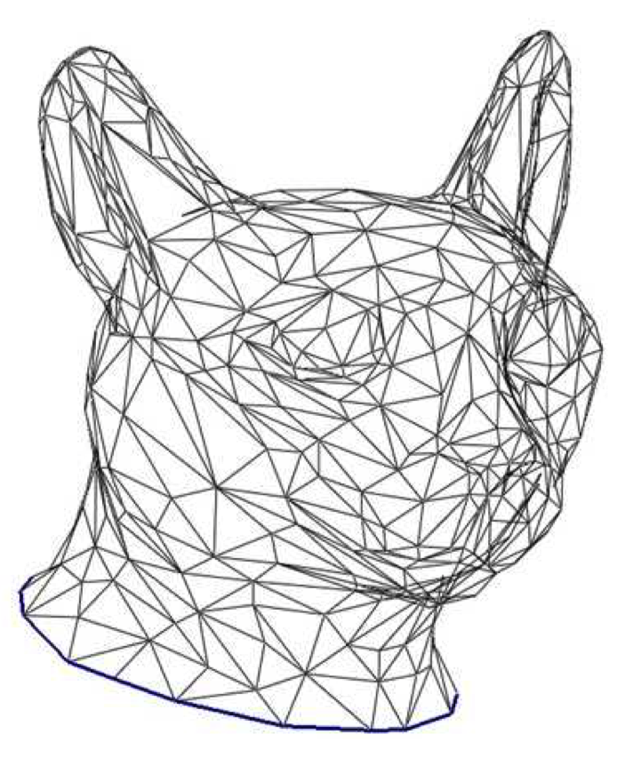
**Figure 22.1:** 猫的头部被无序的三角形集合（triangle soup）所描述。 来自于参考书目[64]，©️Eurographics c and Blackwell Publishing Ltd。

相关的表达包含quad soup（使用四条边的多边形）和polygon soup（针对任意数目边的多边形）。针对硬件渲染，这种多边形首先需要切分为三角形，并且随后能够借助通用三角形渲染管线被绘制。

基于三角形的几何体存在很多种可能被生成的方式。实际上，三角形几何体可以借助一个几何建模工具被从头开始生成，可以通过镶嵌平滑表面表达来获得（参考下面），或者通过直接扫描一个实际物体来获得（参考图示$\text{Figure 22.2}$）。

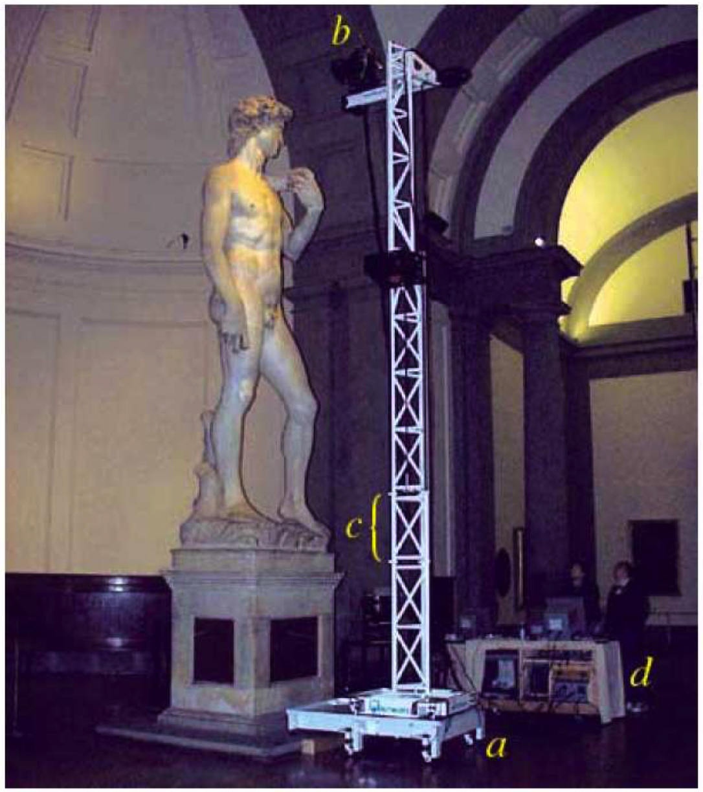
**Figure 22.2:** 精密扫描仪能够被用于将真实的事物电子化。来自于参考书目[44]，©️ACM。

## 22.2 网格（Meshes）
在无序集合的soup表达中，没有方式“遍历”几何体。你不能轻松（以常量时间）指出哪些三角形和一条边缘相遇，或者哪些三角形环绕一个顶点。遍历网格可能有实际用处，例如，如果你尝试平滑化几何体，或者你希望模拟在几何体上的某种物理处理。

网格数据结构为组织顶点、边缘、和面数据使得相关查询可以轻松完成的表达。（参考图示$\text{Figure 22.3}$作为例子。）存在很多不同的网格数据结构并且它们可能难于实现。关于网格数据结构的优质参考，请查看课后书目[63]。

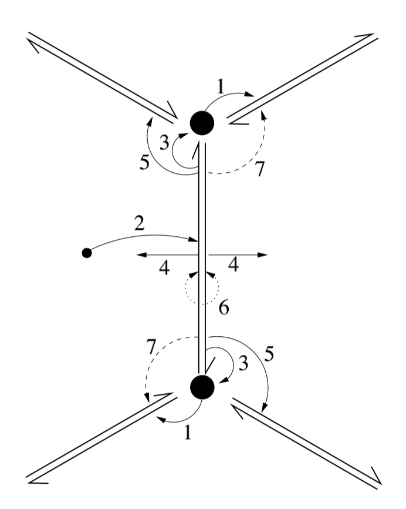
**Figure 22.3:** 网格数据结构，在这里被可视化，跟踪多种顶点，边缘，和面如何一起组成几何体。来自于参考书目[8]。

## 22.3 隐式表面（Implicit Surfaces）
一种表达平滑表面的方式是作为在某种给定三变量函数$f(x,y,z)$中评估为0的点集合。这被称作隐式表达。例如，简单形状，就像球体和椭球体，可以被表达为二次方的三变量函数的零值集合。另外，我们可以定义一个隐式函数为更简单的基本隐式函数之和：$f(x,y,z)=\sum_if_i(x,y,z)$。比方说，以球体函数集合使用这种方式，生成一个平滑混合的独立球体的联合（参考图示$\text{Figure 22.4}$）。这种技术被称作斑点形状建模，并且对于建模诸如海狮这种有机体形状是理想的。

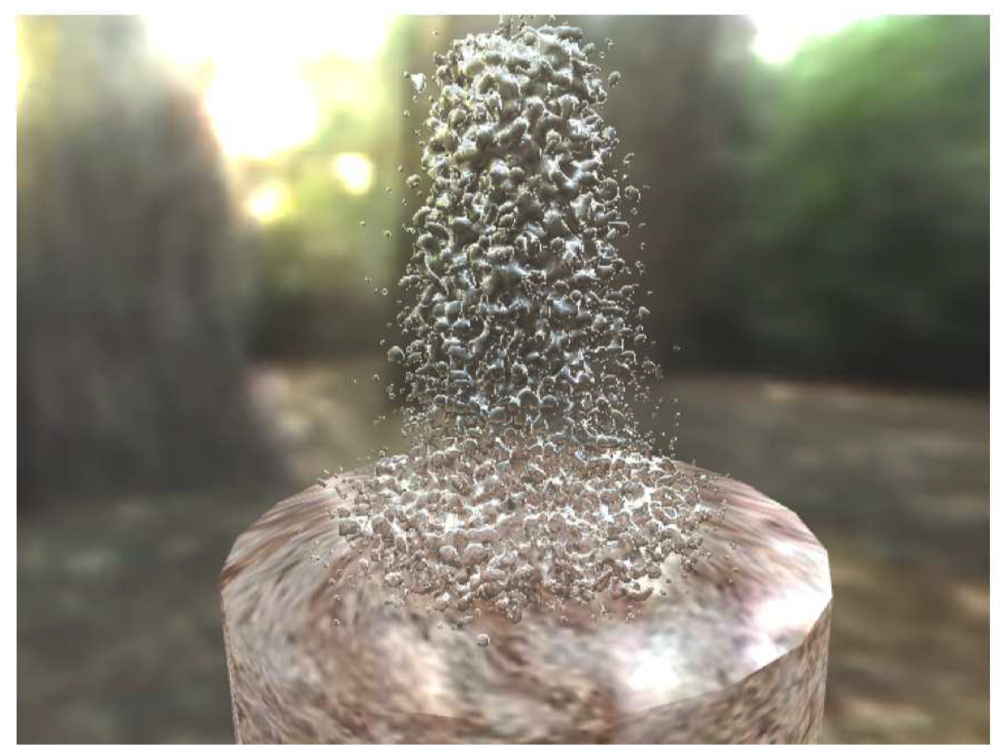
**Figure 22.4:** 隐式函数表达非常擅长于表达斑点形状，比如这个电子喷泉。来自于参考书目[34]，©️John c Wiley and Sons。

隐式表面拥有一些好的特性。如果我们定义一个表面为$f$的0值集合，那么我们可以将函数$f$被评估为正值的点当作位于表面的容积之内。如此，应用容积集合操作就变得容易，例如针对这些内部容积的并集（union），交集（intersection），补集（negation）和差集（difference）操作。例如，被函数$f_1$和$f_2$所确定容积的交集可以被定义为新函数$f(x,y,z)=min(f_1(x,y,z),f_2(x,y,z))$。（参考图示$\text{Figure 22.5}$作为实例。）

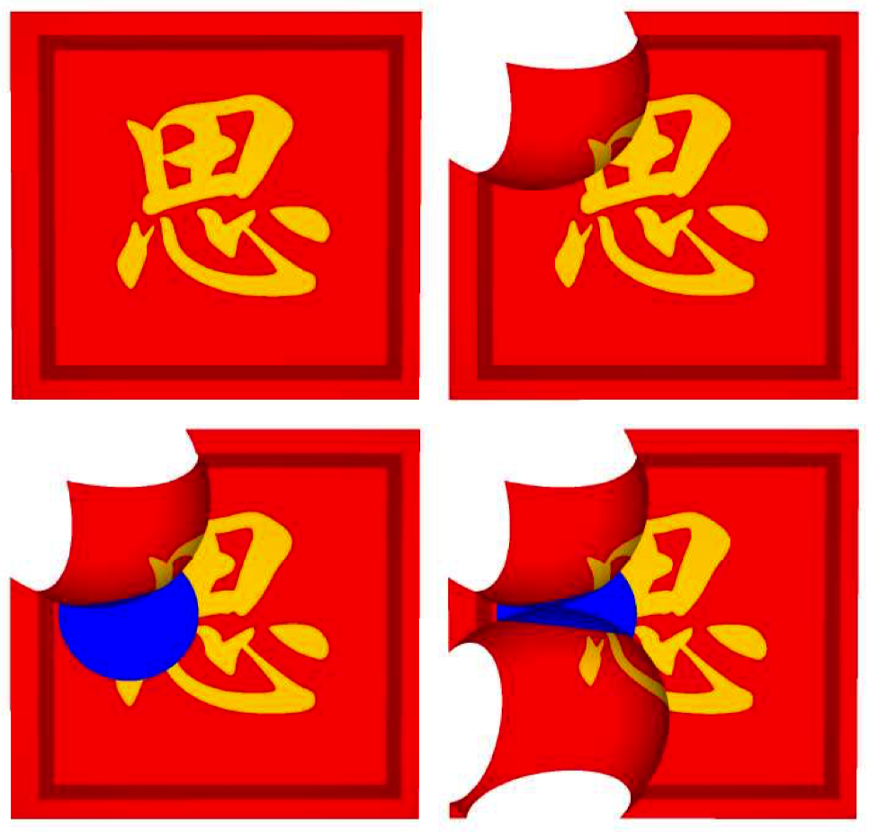
**Figure 22.5:** 这种表面借助双康托(dual-contouring)方法从容积数据表达中提取。容积相交操作被用来扣出被展示的形状。来自于参考书目[32]，©️ACM。

为了在OpenGL中渲染一个隐式表面，我们需要生成一系列近似这种隐式表面的三角形集合。这是一种不繁琐（相对轻松）的任务。

## 22.4 容积（Volume）
容积表达为一种特殊的隐式表达，其借助3D中规则的被称作voxels（容积像素）的具体值的网格。在每个网格元素上使用3线性操作，这些voxels定义了一个3D上的连续函数。从而这个函数的零值集合可以被当作一个隐式表面。

容积数据经常作为容积扫描处理的输出被获取，就如MRI（核磁共振成像）。我们也能采用一些通用隐式函数表达然后再沿着一个规则3D网格采样以获得一个基于voxel的近似。

在OpenGL中要渲染一个基于容积表达的零值集合，你需要提取出近似这个零值集合的三角形集合。由于数据的规则图样，这能够相比通用隐式函数以更轻松一点的方式被完成。标准技术被称为行进立方体方法（marching cube method）[45]，但是存在可以给出更好结果的诸如双等高线（dual contouring）[32](图示$\text{Figure 22.5}$）等更新式的方法。

## 22.5 参数补丁（Parametric Patches）
参数补丁使用3个坐标函数$x(s,t),y(s,t),z(s,t)$表达了被称作补丁（patch）的一部分表面。这些函数在$(s,t)$平面的某个正方形或者三角形部分上被定义。在大多数情形中，补丁上的每个坐标函数被表达为一个逐段的双变量多项式函数。（参考图示$\text{Figure 22.6}$作为例子。）

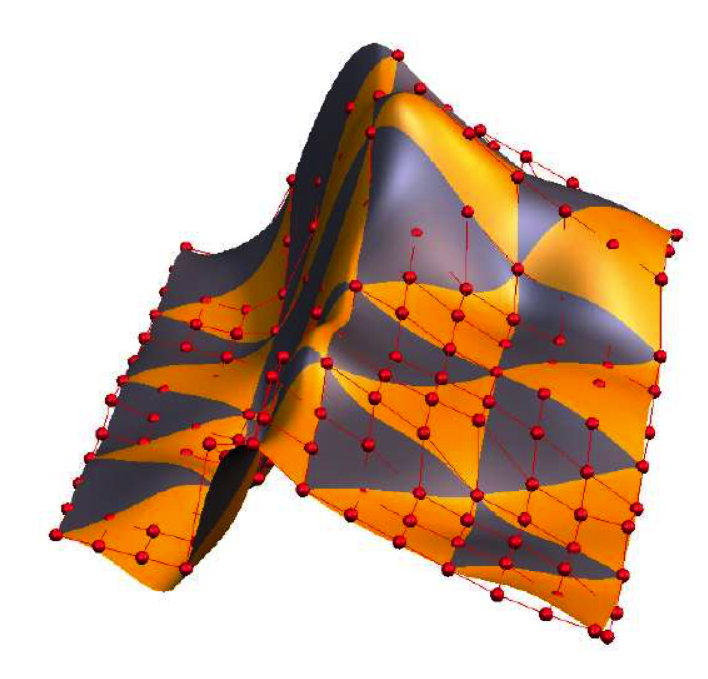
**Figure 22.6:** 这里我们展示了一个样条补丁，其由一个$m\times n$的直线状控制网格所控制。来自于参考书目[61]，©️IEEE。

最常见的参数表达是张量积（tensor-product）样条表面。回忆一下（小节9.5）一个样条曲线可以被用来表达在空间中的曲线。这样一个样条曲线在空间中通过一个连接一系列具体点的输入控制多边形来定义。这种样条曲线由一系列更小的块函数（piece）集合组成，比方说，每个都具有立方多项式样式的坐标函数。

对于一个张量积样条，这种构造从曲线被“升级”到表面。在这种情形中，控制多边形被$m \times n$直线状控制网格所替换，其使用3D中的顶点。通过恰当地在s和t变量上都应用样条定义，我们最终得到一个参数补丁。这样一个补丁由小的定义在$(s,t)$域上的小正方形区域上的块函数构成。每个这样块函数的坐标在s和t上是多项式。在我们从一个立方样条曲线构造升级的情形中，每个正方形块函数被$(s,t)$域上的双-立方多项式所定义（也就是说，拥有最高幂为$s^3t^3$的项）。

对于渲染，样条可以轻松通过四边形网格以多种方式被近似。例如，我们可以只是在$(s,t)$域上放置一个规整的样本点的网格并且评估样条函数以获得每个样本的$[x,y,z]^t$坐标。这些样本可以被用作一个规则四边形网格的顶点。另一个方法是应用一个递归的提炼处理(refinement process)，其接受一个控制网格并且输出一个表达相同表面的更密集的控制网格。经历几个步骤的细分之后，四边形本身组成了一个密集控制网格，其构成了对底层样条表面的良好近似。

你通常能够在集合建模包中借助样条设计表面。样条表面在计算机辅助设计社区中非常流行。实际上，由于它们的显式参数化多项式表达，很容易对这些形状应用多种计算。

用样条建模也会有不少难题。要建模一个闭合的（比如说球状的）表面，我们必须缝合一些补丁。这种情形下以平滑方式进行缝合是有点困难的。另外，如果我们想要沿着特定的褶皱表面打补丁以满足平滑性，我们需要显式地对每个补丁执行一些“整修剪切”的工作。关于样条表达的一本有趣的书籍是[59]。

## 22.6 细分表面（Subdivision Surfaces）
细分表面可以解决和参数补丁相关的诸多难题的一种简单表达。基本思路开始于一个简单控制网格。这个网格不需要是成直线状的；它可以表达闭合表面并且可以拥有任意价(valence)的顶点。我们随后使用一个规则集合去提炼网格，形成一个更高分辨率的控制网格。通过递归地应用这种处理一些次数，我们获得一个非常高的分辨率网格，其可以直接被渲染为一个平滑表面的近似表达。（参考例子图示$\text{Figure 22.7}$和$\text{Figure 22.8}$。）细分表面不要求任何打补丁的步骤。另外，特定的规则可以沿着控制网格的某些部分被应用以获得在所需要处表面的褶皱。

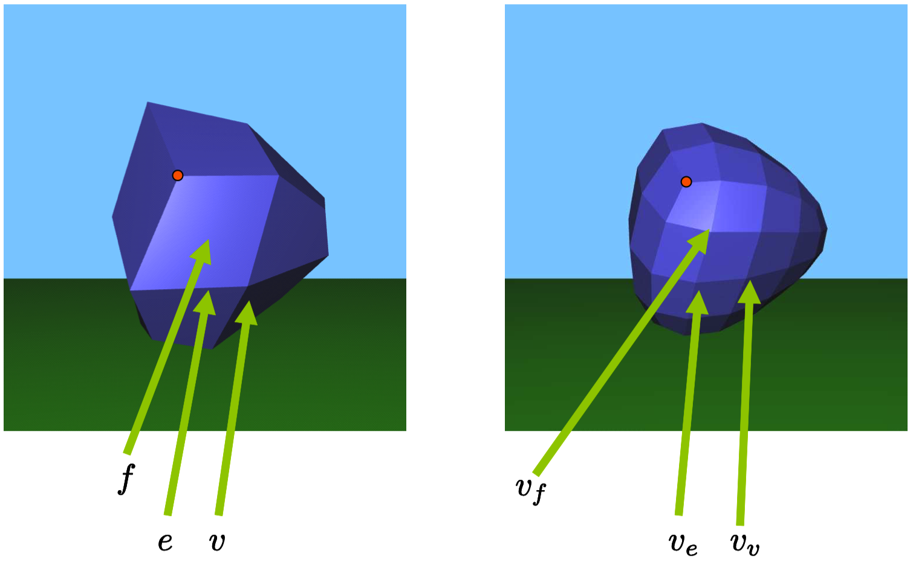
**Figure 22.7:** 左侧，我们展示了一个低分辨率网格。右侧，我们展示了一级的细分。左侧的顶点$v$导致了右侧顶点$v_v$的产生。左侧的边缘$e$导致了右侧的顶点$v_e$的产生。左侧的面$f$引起了右侧顶点$v_f$的产生。异常顶点以红色展示。这些异常顶点数目在细分过程中保持不变。

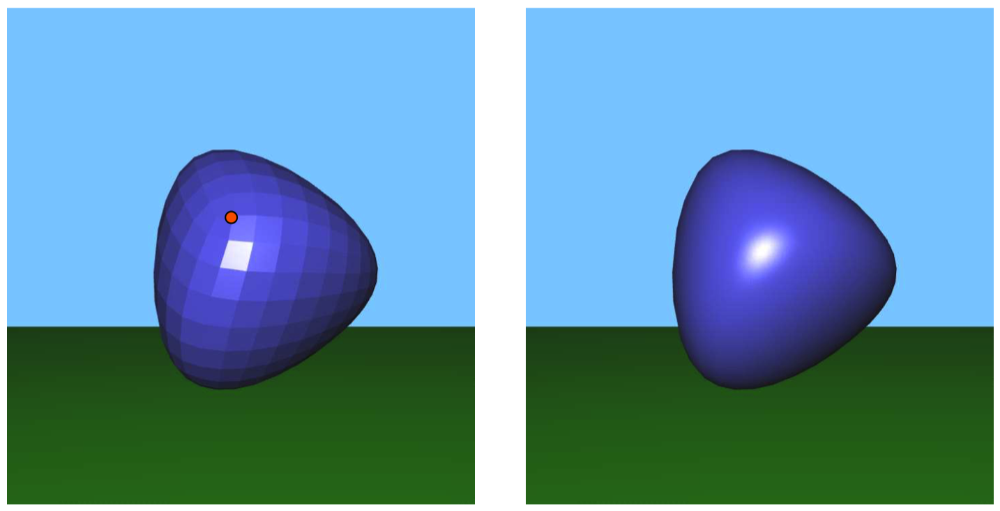
**Figure 22.8:** 左侧，我们展示了多级的细分级别。右侧，相同的网格被平滑着色。

细分规则被定义以便在越来越多级别的细分汇聚到一个平滑的有限表面（$\mathbb{R}^3$空间中的一个$C^1$沉浸的次要部分）后会形成一些网格。在很多情形中，比如在网格成直线状的区域中，细分步骤匹配那些被用于提炼出一个张量积样条表面。

曲面细分表面的一个不足之处为表面表达通过程序定义，而不是通过公式。因而，这样的表面更难于以数学方式进行分析。另外，远离直线特征区域（在所谓的异常点）有限表面（limit surface）可能某种程度上表现糟糕（参考书目[55]）且难于控制。但是，出于临时使用的目的（电影和游戏），这些不是大问题，并且细分表面已经证明了其简单性，有效性和通用性。

### 22.6.1 Catmull-Clark
这里我们更详细地描述一种由Catmull和Clark所发现的特殊的细分表达方式。你开始于某种输入网格$M^0$（我们假设它是一种严丝合缝的“没有边缘的manifold”）。这种网格具有描述其顶点、边缘和面结构的连接信息，映射每个抽象顶点到3D中的一个点上。

现在我们应用连接更新的集合获得一个新的改进的网格$M^1$，拥有其自身的连接和几何体。$M^1$的连接被定义如下（并且被展示在图示$\text{Figure 22.7}$）。对于$M^0$中的每个顶点，我们在$M^1$中关联一个新的“vertex-vertex（顶点-顶点）” vv。针对$M^0$中的每条边缘（edge），我们在$M^1$中关联一个新的“edge-vertex（边缘-顶点）” ve。针对$M^0$中的每个面，我们在$M^1$中关联一个新的“face-vertex（面-顶点）” vf。这些新顶点被使用在图示$\text{Figure 22.7}$的新边缘和面连接在一起。我们可以轻松验证在$M^1$中，所有的面是四边形。在$M^1$中我们称任何价（valence）为4的顶点“正常的”，同时称任何价不为4的顶点为“异常的”。

我们递归应用这种细分处理。给出$M^1$，或者更通用地，针对任何$i \geq 1$，给出$M^i$，我们应用相同的细分规则获得一个更优的网格$M^{i+1}$。在新网格中，我们大约拥有4倍的顶点数目。但是重要地是，我们可以验证异常顶点的数目保持固定不变（参考图示$\text{Figure 22.7}$）！因此，在细分过程中，网格越来越多的部分本地看起来是沿直线分布的，让固定数量的异常点位于其间。

现在，所有我们需要的是确定针对在每次细分步骤中生成的新顶点的几何规则。首先，让$f$为$M^i$中被顶点$v_j$所围住的一个面（同时让$m_f$作为这些顶点的数量）。我们设置$M^{i+1}$中每个新face-vertex $v_f$的几何特征为
$$ \large{
v_f = \frac{1}{m_f}\sum_jv_j \tag{22.1}
}$$
(也就是说，$M^i$中顶点的质心明确了那个面）。（再次，针对任何细分级别$i \geq 1$，我们有$m_f=4$。）参考图示$\text{Figure 22.9}$。

接着，让$e$为$M^i$中的一条连接顶点$v_1$和$v_2$的边缘，并且分割面$f_1$和$f_2$。我们设置$M^{i+1}$新edge-vertex的几何特征为
$$ \large{
v_e = \frac{1}{4}(v_1+v_2+v_{f_1}+v_{f_2}) \tag{22.2}
}$$
参考图示$\text{Figure 22.10}$。

最后让$v$为$M^i$中被连接到$n_v$个$v_j$顶点的顶点，同时被$n_v$个面$f_j$所围绕。那么，我们设置在$M^{i+1}$中的新vertex-vertex的几何特征为
$$ \large{
v_v = \frac{n_v-2}{n_v}v + \frac{1}{n_v^2}\sum_jv_j + \frac{1}{n_v^2}\sum_jv_{f_j}  \tag{22.3}
}$$
对于正常顶点，其价$n_v=4$，这个公式变形为
$$ \large{
v_v = \frac{1}{2}v + \frac{1}{16}\sum_jv_j + \frac{1}{16}\sum_jv_{f_j}  \tag{22.4}
}$$
参考图示$\text{Figure 22.11}$。

在这种细分规则的发展中有很多研究已经在进行，并且正在理解它们的聚合特征。异常点的第一等级行为的首个完成分析可以在Reif的书[60]中找到。

实际上，你不需要知道任何这些内容；要使用细分表面，所有你需要做的是实现方程式(22.1)、(22.2)和(22.3)。最难的部分只是你要设置好一个网格数据结构以便可以实现这种计算。

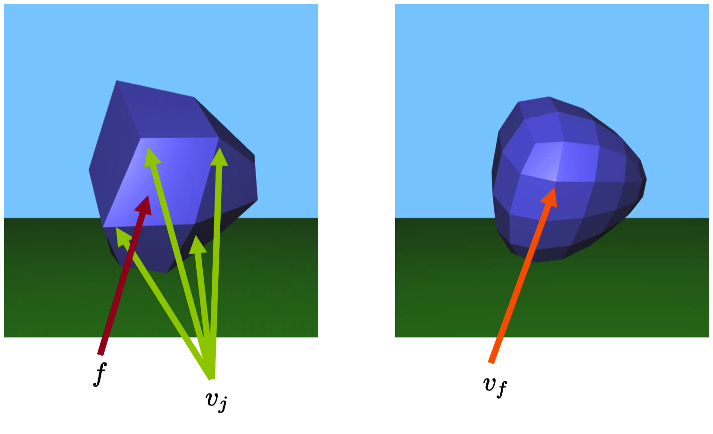
**Figure 22.9:** 左侧的面$f$导致了右侧顶点$v_f$的形成，$v_f$的几何特征通过左侧的$v_j$所决定。

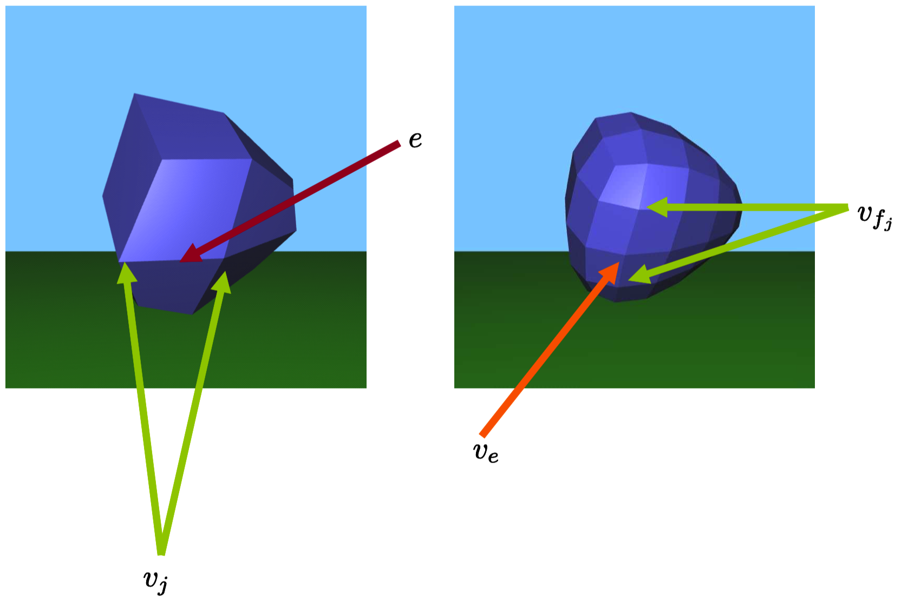
**Figure 22.10:** 左侧的边缘e导致了右侧产生了$v_e$。$v_e$的几何体通过左侧的$v_j$和右侧的$v_{f_j}$来确定。

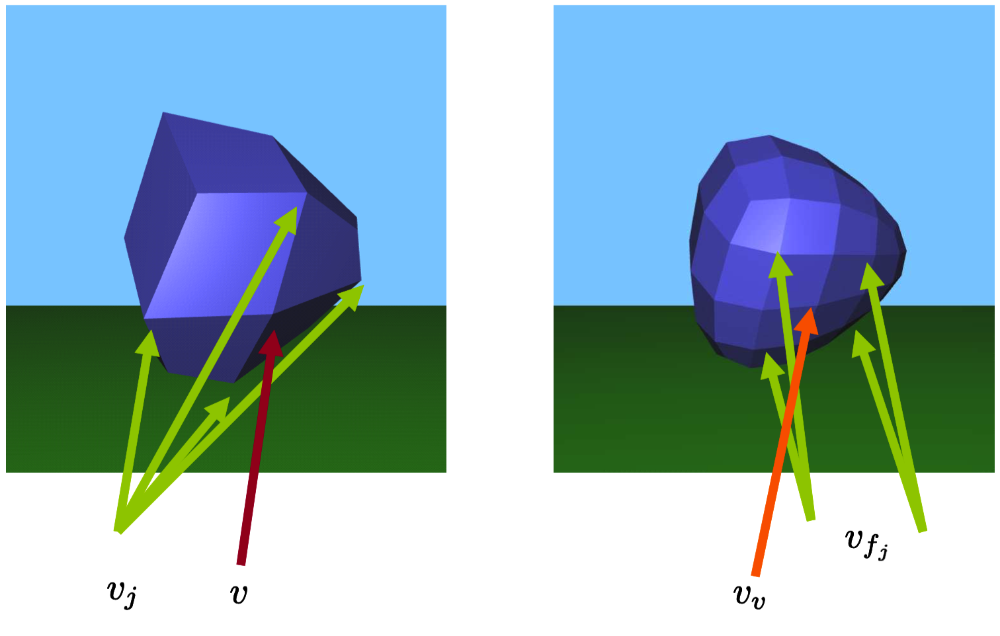
**Figure 22.11:** 左侧的顶点$v$在右侧导致了$v_v$的产生。$v_v$的几何形状被左侧的顶点$v_j$和右侧的顶点$v_{f_j}$所决定。

