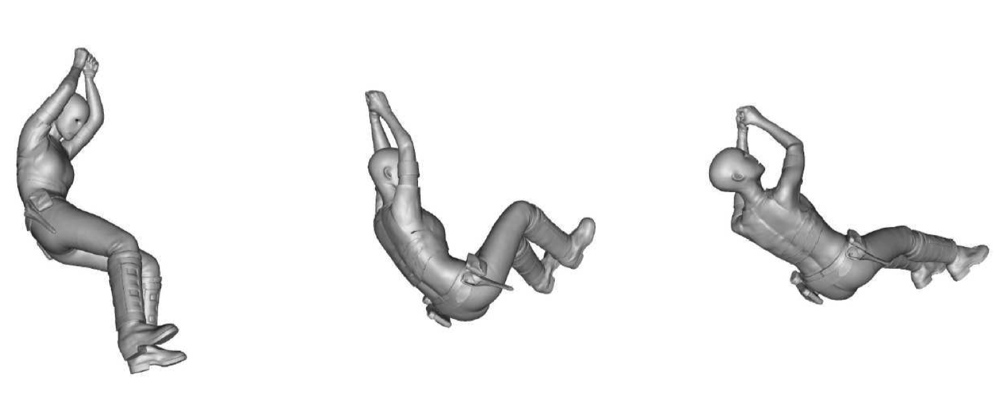
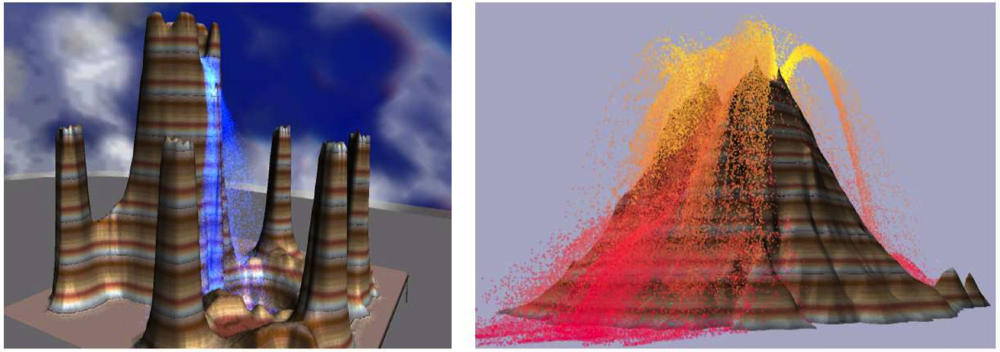
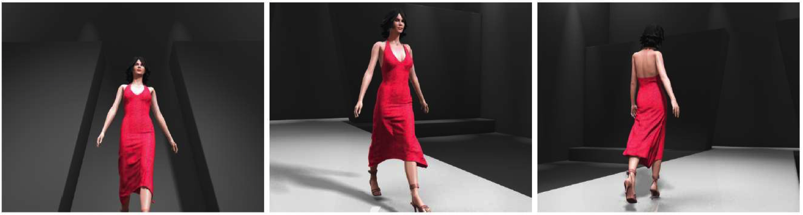
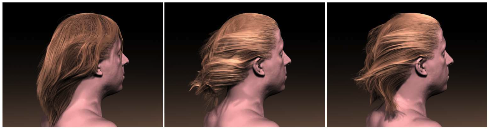
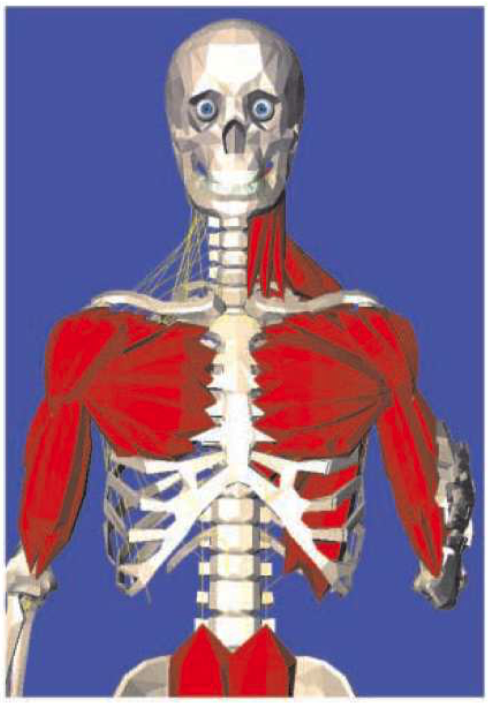
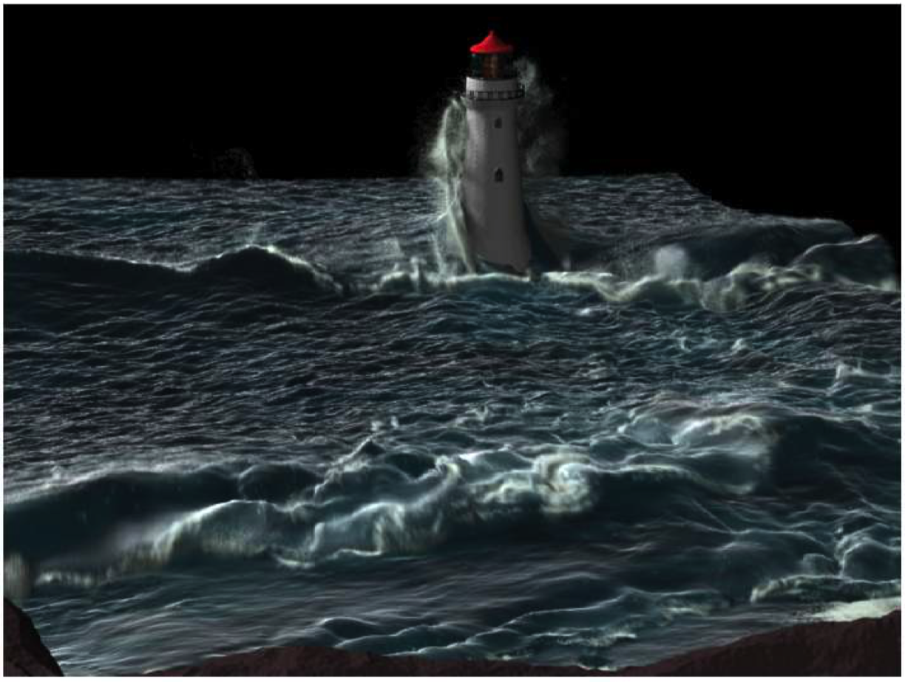
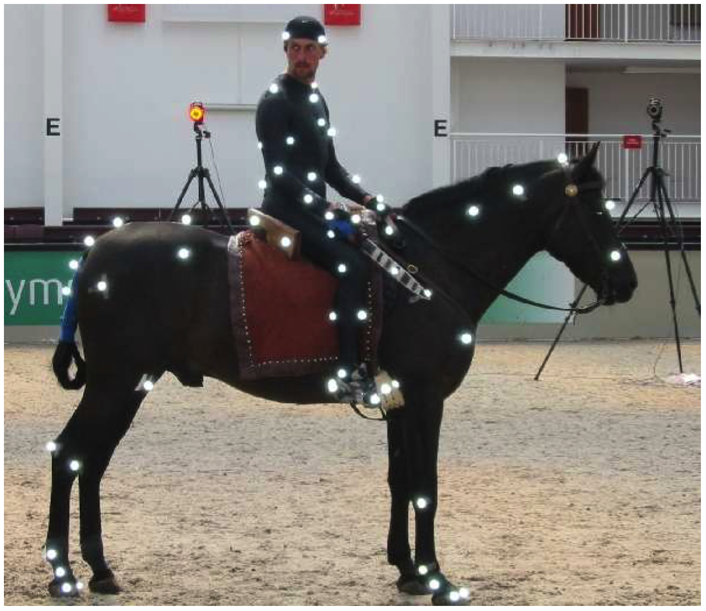

# Note
这是对**MIT Foundation of 3D Computer Graphics**第23章的翻译，本章讲解了动画基本算法知识。本书内容仍在不断的学习中，因此本文内容会不断的改进。若有任何建议，请不吝赐教<ninetymiles@icloud.com>。 

> 注：文章中相关内容归原作者所有，翻译内容仅供学习参考。
> 另：Github项目[CGLearning](https://github.com/nintymiles/CGLearning)中拥有相关翻译的完整资料、内容整理、课程项目实现。

# 动画：甚至都不是一个介绍（Animation: Not Even an Introduction）
在CG电影和视频游戏中，事物四处移动。这被称作动画。再一次，动画应该有相关自身的整本书来讲解，这个书我们没有资格写。本章中，我们会针对用于动画的一些技术给你一种概念（并且展示了很多图片）。感兴趣的读者可能希望在参考书目[4]中检出课程注释。计算机动画有争议地作为计算机图形中最多挑战性保留的子领域。即便今天这个领域中重要的改进仍在进行。

## 23.1 插值（Interpolation）
实现动画的最简单方式为让艺术家手工做大部分困难的工作。计算机可以被用于简化插值，或填充，多种需要的数据。

### 23.1.1 关键帧（Keyframing）
关键帧背后的思路让动画器在低解析（low-resolution）时间样本集合上勾勒出动画序列。在每个这样的时间样本上，艺术家描述场景的完整状态。计算机随后使用平滑插值方法生成艺术家指定的帧之间的帧。我们在第9章中讲解了这种技术。在关键帧中，困难的工作由艺术家完成；计算只是被用于卸去了一些更加单调和繁琐的工作。就如看起来一样枯燥，很多计算机动画以这种方式完成。它给予动画器在最终输出的外观和感知上的完全控制。

### 23.1.2 蒙皮（Skinning）
蒙皮是一种简单技术，用于在三角形网格中模拟身体部分的畸形（变形）。参考图示$\text{Figure 23.1}$。蒙皮易于在顶点着色器实现并且通常用于视频游戏中。

**Figure 23.1:** 通过靠近关节的模型视图矩阵，你可以轻松使用可变形关节产生物体动画。来自于参考书目[74]，©️Industrial Light & Magic。

让我们假设艺术家始于以描述自然“静止姿态”物体的输入性的三角形网格。在这种输入中，每个顶点使用物体坐标描述，也就是说，$\tilde{p}=\vec{o}^t\mathbf{c}$。接下来，在一个被称作索具（rigging）的处理中，艺术家设计了几何轮廓并且把它填充到网格中。这个轮廓可以被当作连接关节的骨骼集合。在当前时刻，让我们假设每个顶点被艺术家关联到一块骨骼上。

这种轮廓形状自然形成一种子-物体坐标系和子-物体矩阵体系，就如我们之前在小节5.4中所看到的（参考图示$\text{Figure 5.4}$）。这些子-物体矩阵表达了一个帧和其处于静止姿态的“父”帧的关系。回忆一下，例如，在小节5.4中，我们具有$\vec{\mathbf{d}}_r^t = \vec{\mathbf{o}}_r^tA_rB_rC_rD_r$，此处$\vec{\mathbf{d}}_r^t$曾为（正交标准化的）右下臂帧，并且矩阵$A_r,B_r,C_r,D_r$为刚体矩阵。我们已经增加“$r$”下标意指“静止姿态”。让我们针对这种骨骼定义渐增的累加矩阵，$N_r := A_rB_rC_rD_r$；这种矩阵表达了帧关系：$\vec{\mathbf{d}}_r^t=\vec{o}^tN_r$。让我们考虑某种顶点，使用输入物体-坐标 $c$，其已经被关联到下臂骨骼。我们可以记录这个点为
$$
\tilde{p}=\vec{\mathbf{o}}^t\mathbf{c}=\vec{\mathbf{d}}_r^tN_r^{-1}\mathbf{c}$$

这在小节5.4中被实现，在动画中，我们操纵骨骼，通过更新它的一些矩阵到新设置中，比如说$A_n,B_n,C_n$和$D_n$，此处下标意指“新”。让我们针对这种骨骼定义“新的”累加矩阵，$N_n := A_nB_nC_nD_n$，其表达了关系：$\vec{\mathbf{d}}_n^t=\vec{\mathbf{o}}^tN_n$。比方说，这种骨骼操纵移动了下臂帧：$\vec{\mathbf{d}}_r^t \Rightarrow \vec{\mathbf{d}}_n^t$。如果我们要顺着这种帧以刚体风格移动点$\tilde{p}$，那么我们需要以下面表达更新
$$\large{
\begin{array}{rcl}
\vec{\mathbf{d}}_r^tN_r^{-1}\mathbf{c} & \Rightarrow & \vec{\mathbf{d}}_n^tN_r^{-1}\mathbf{c} \\
& = & \vec{\mathbf{o}}^tN_nN_r^{-1}\mathbf{c}\end{array} 
}$$
这种情形中，被变换点的眼睛坐标为$E^{-1}ON_nN_r^{-1}\mathbf{c}$，并且我们看到针对这个顶点的模型试图矩阵应该为$E^{-1}ON_nN_r^{-1}$。

这种处理给了我们一种“坚硬的”蒙皮结果，此处每个顶点仅仅沿着一根骨骼移动。要获得靠近一个物体关节的**平滑蒙皮**，我们允许动画器要关联顶点到超过一个骨骼。**针对其每个骨骼**，我们随后混合结果到一起。

更专业一点，针对每个顶点，我们允许动画器设置一系列权重$w_i$，总数为1，这些权重指定每个骨骼的运动应该影响这个顶点多少。那么，在动画过程中，针对顶点我们计算为
$$\large{
\sum_iw_iE^{-1}O(N_n)_i(N_r)_i^{-1}\mathbf{c} \tag{23.1}
}$$ 
此处$(N)_i$为针对骨骼$i$的渐增矩阵。

蒙皮易于在顶点着色器中实现。代替传递单一模型视图矩阵到着色器，我们传递一系列模型视图矩阵为统一变量。针对每个顶点的权重被传递为属性变量，借助顶点缓存对象。方程(23.1)中的求和随后在顶点着色器代码中被计算。

## 23.2 模拟（Simulation）
物理给予我们随时间变化掌控物体的运动和进展的努力。始于初始条件的输入集合，这种方程可以以计算方式模拟，用以预测实际的物体在真实世界中如何运动。如果完成的好，这可以生成非常真实和令人信服的效果。物理模拟其基本形式为预测处理；你填入初始条件并且输出动画。如何控制这种动画很不明显。物理模拟的领域在过去十年已经看到很多进步，其在特效生成的计算机图形的成功方面是关键的。

### 23.2.1 粒子（Particles）
针对一个点的时间进化，运动物理学始于常微分方程（ODE）。
$$\large{
f = ma = m\dot{v} = m\ddot{x} \tag{23.2}
}$$
力为质量乘以加速度，此处加速度为速度的时间导数，而速度为位置的时间导数。力可以表达类似引力或风之类的事物。

始于初始条件，我们可以离散化这个常微分方程（ODE）并且在时间上使用所谓的*欧拉步骤*前进
$$\large{ \begin{array}{rcl}
x_{t+h} & = & x_t + v_th \\
v_{t+h} & = & v_t + a_th \\
a_{t+h} & = & f(x_{t+h},t+h)/m 
\end{array} }$$
这种处理被称为时间积分。当使用欧拉步骤，我们需要采取足够小的步骤以确保方法不会最终实现奇怪的内容。可选择地，存在更成熟方式的完整文献用以求解常微分方程（ODE）。针对更多细节，参考课后书目[4]中的注释。

在粒子系统动画中，我们把我们的场景建模为非交互点状粒子，根据方程（23.2）逐步发展，或者建模为空气中一缕烟雾粒子。参考图示$\text{Figure 23.2}$。通常每个粒子被渲染为半透明的小斑点（blob）或表面。

**Figure 23.2:** 模拟一群简单粒子可以被用于动画流动的水。来自于参考书目[37]，©️Eurographics and Blackwell Publishing Ltd。

### 23.2.2 刚体（Rigid Bodies）
要建模刚体随时间的发展（诸如骰子在桌上滚动），事情马上就变得复杂得多。首先，因为我们的物体不是点，我们需要处理旋转和角动量（angular momentum）。存在很多其它需要定位的困难问题。要参考更多细节，查看参考书目[4]中的注释。

在刚体模拟中，我们通常想建模彼此互相碰撞和反弹（回应）的躯干。计算碰撞要求我们不停跟踪所有成对的躯干并且决定它们何时相交。参考图示$\text{Figure 23.3}$。要有效地实现这种，我们通常使用一种动态进化，空间绑定的体系。另一个问题是一旦我们找到一个相交，这就意味着多个躯干已经互相渗透，这一定要被正确复原。另一种微妙之处在于真实的物体不是真正的刚体；它们实际上在接触时以非常轻微地畸形化行为反弹。因为我们不希望模拟这种行为，我么需要想出新的运动近似方程。

**Figure 23.3:** 要模拟刚性物体，我们必须计算碰撞并且同时处理动量、摩擦力和张力。来自于参考书目[27]，©️ACM。

另一个（惊人）困难的问题来自于正确建模摩擦力（friction）为接触力。当一个物体在地板上处于静止时，我们需要正确建模阻止物体滑过地板的物理学，或者无穷地反弹和来回颤动。

### 23.2.3 衣料（Cloth）
一种对于建模重要的现象是衣料。这种情形中，表面要不被建模为粒子网格，要不作为三角形元素的网格。在一个基于粒子的方式中，力被添加到这个系统中以避免拉伸，切削，和过分弯曲。阻尼也被假如建模内部摩擦力；这消除了震动。在一个基于三角形的方法中，由于拉伸、切削和弯曲，你写下了表达式$E$用于衣料状态的能量。力从而被解释为$f=\frac{\partial E}{\partial \tilde{x}}$。关于衣料效果要参考更多，参考课后书目[24]并且由此引用。要建模衣料，我们也需要计算衣料内以及衣料和其环境之间的碰撞。参考图示$\text{Figure 23.4}$。

**Figure 23.4:** 衣料可以使用多种算法被模拟。存在很多获得“刚好正确”行为的微妙之处。来自于参考书目[24]，©️ACM。

头发建模经常被相似地处理为质量-弹簧模型。关于头发要参考更多，请查看参考书目[67]并由此引用。参考图示$\text{Figure 23.5}$。

**Figure 23.5:** 头发可以作为质量-弹簧系统被动画化。来自于[67]，©️ACM。

### 23.2.4 可变形材料（Deformable Materials）
很多真实世界的物体很明显是可变形的。这可以被建模为合适的物理方程式，并且也在时间上积分。要建模可变形的物理学，我们需要建模物体的内部容积，经常作为具体的四面体网格。除了类似果冻凝胶之类的新奇条目，这对于产生人体真实模型也是重要的。参考图示$\text{Figure 23.6}$。 

**Figure 23.6:** 要建模可变形模型，我们需要在问题中表达容积。来自于[57]，©️Springer。

### 23.2.5 火和水（Fire and Water）
建模和动画类似水和火的物理现象也可能是重要的。参考图示$\text{Figure 23.7}$。这些经常即借助粒子同时也借助基于3D网格的技术被建模。在一个液体容积中扭曲和回旋的逐渐发展被纳维-斯托克斯偏微分方程（Navier-Stokes partial differential equation）所决定。它是要求自身数值方法的数值模拟，诸如非常流行的“稳定流体（stable fluids）”方法[70]。关于流体模拟的更多信息，参考最近Bridson所写的书[9]。

**Figure 23.7:** 一张令人震惊的模拟水的图像。来自于参考书目[46]，©️IEEE。

## 23.3 人类运动（Human Locomotion）
人类不是简单的被动物体，而且他们的计算机模拟已经证明比水和灰尘之类的被动物体要难得多。更进一步，在计算机动画中，我们显然想细致控制虚拟生物所执行的动作，而不只是模拟来自于初始条件集合所形成的结果。

存在一个时刻，当研究者寄希望于来自机器人、控制理论和优化的概念最终能够完全从头开始产生人类运动的真实样子。这个目标是难以实现的，并且当前有前景的技术极度依赖于运动捕捉的使用。在运动捕捉中，当从校准过的相机/传感器装置中查看时，真实的人会执行多种运动。被捕捉的目标经常穿着捕捉点以帮助捕获处理。参考图示$\text{Figure 23.8}$。这种数据随后可以被传输到虚拟角色。这种数据也可以在某种程度上被修改和控制。

**Figure 23.8:** 一个人和一匹马。来自于参考书目[41]，©️Sian Lawson。

