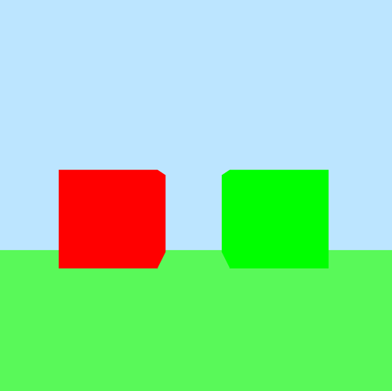
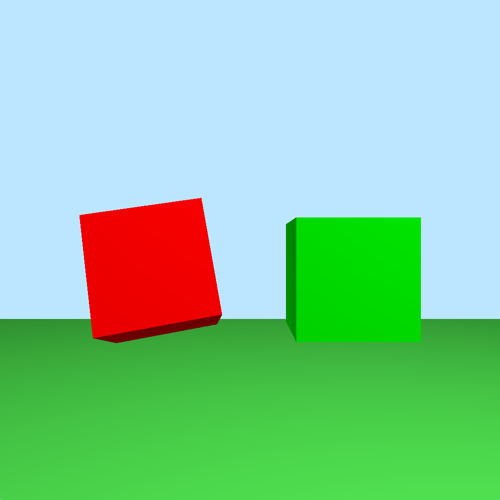
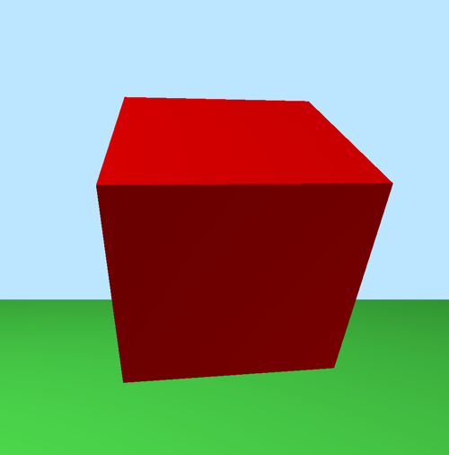
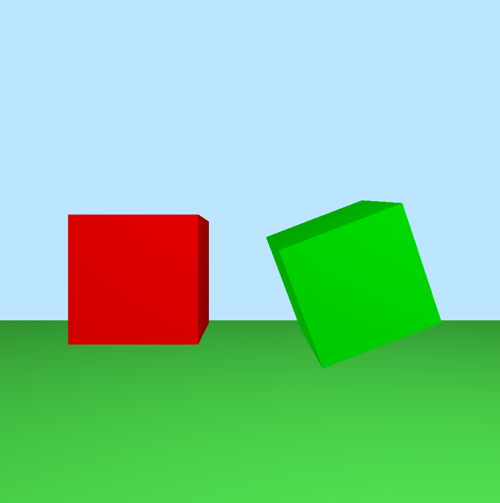
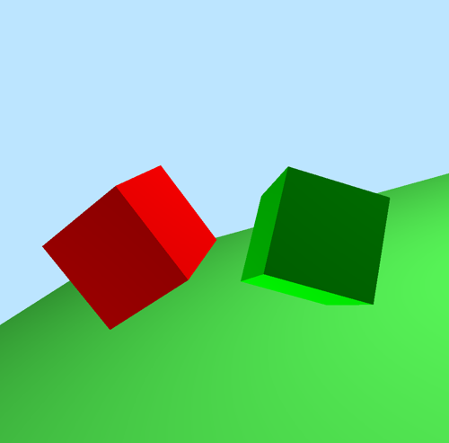
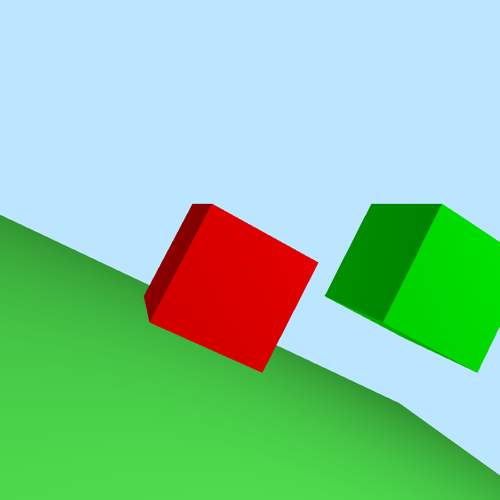

# Assignment2实现

## 实现的内容
基本思路，每个对象应该有一个矩阵用于存储自己的物体帧信息。

### 1.基本场景的绘制：包含地面和两个立方体，使用两种着色方式flat和smooth shading（使用“F”键切换）

### 2.矩阵的分解：实现函数将一个仿射矩阵分别分解为线性因子和平移因子矩阵

### 3.视点的切换（用“V”键切换）

当切换位立方体视角时，针对每个立方体中心视角，设置眼睛都朝向另一个立方体的中心（也就是说-z轴方向为眼睛所在点指向这个立方体的中心。实际中变换视角时，就是眼睛位置移动到对应立方体中心同时左转右者右转90度）

### 4.立方体和sky-camera相机的操纵（用“O”键切换）

