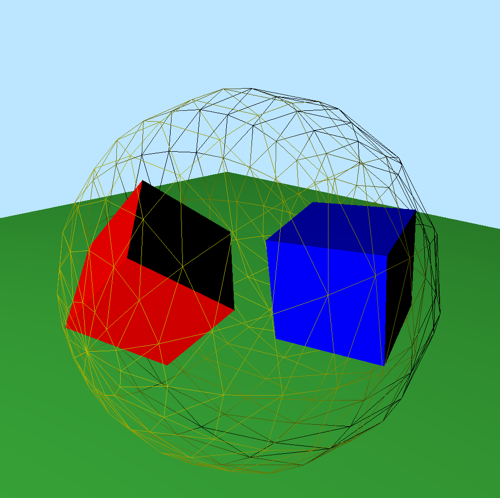
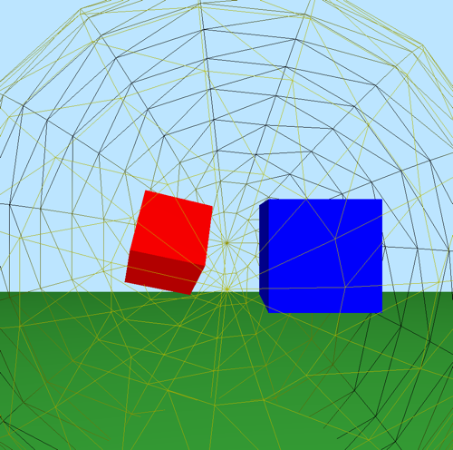

# Assignment3实现

## 实现的内容
使用平移坐标矢量和四元数表达刚体变换。
用四元数实现用于旋转变换的Arcball接口。

## 四元数Quat和刚体变换RigTForm数据类型的实现
Quat类封装了四元数的基础数据和操作。包含基础对象构造，四元数的点积、平方态、倒数、四元数坐标矢量乘法、两四元数乘法、三四元数乘法、幂操作、slerp/lerp操作、旋转四元数提取操作等。

RigTForm类封装了一个平移坐标矢量和一个四元数作为基础数据结构，同时还封装了刚体变换涉及的操作（对等矩阵变换操作的替换版本）。

## Arcball接口的实现
关键的计算有两个：
首先计算眼睛坐标中的点映射到屏幕上的坐标，用于确定球体中心在屏幕上的(x,y)屏幕坐标。
其次计算眼睛坐标到屏幕坐标的伸缩比例，用于确定球体在屏幕上的投射半径。

同时将运动控制中，关于立方体旋转的部分更换为经由arcball接口产生旋转变换；
而眼睛帧的运动，不论是ego motion还是围绕辅助帧使用鼠标位移的差值产生旋转变换。

## 关于线框球体更新的控制
实现arcball可视化线框球体的变化绘制。当摁下鼠标中键移远或者移近两个立方体时，线框球体会随着距离变大或者缩小，但释放摁键后会弹回原来的大小，用于提供深度变化的线索。

