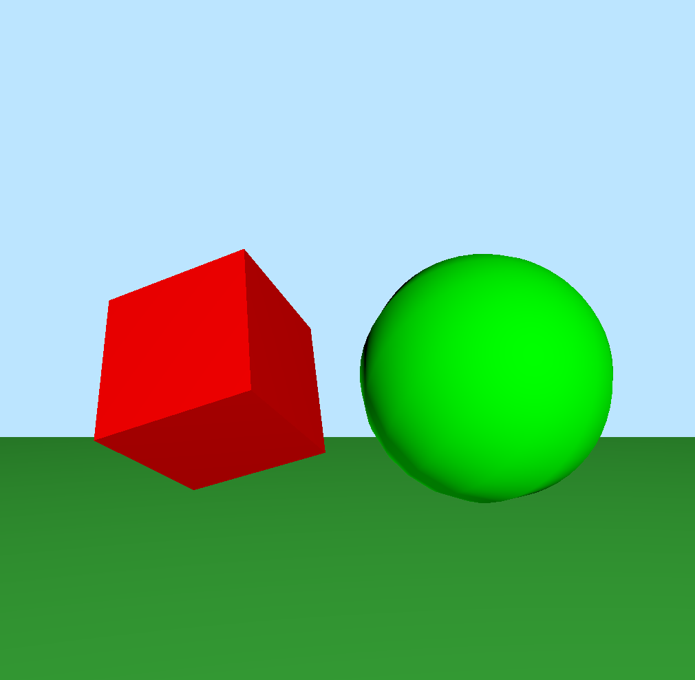
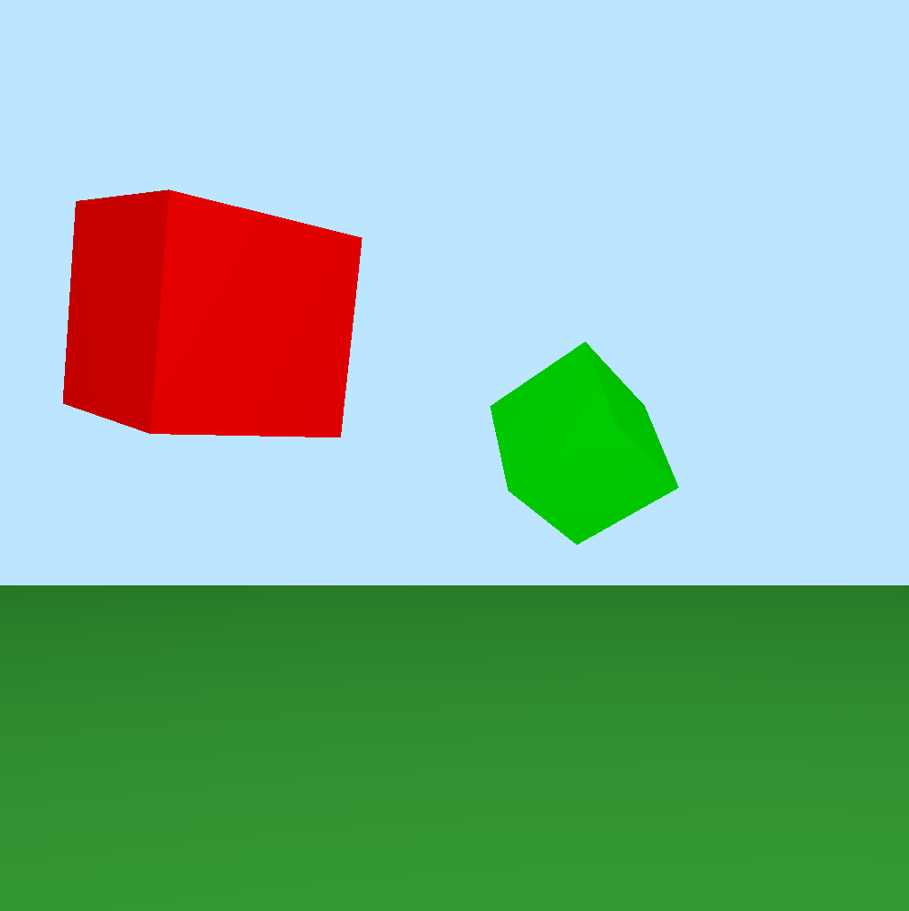

## Involved Problems
- Workaround for packaging files with command line application. Command line application wraps recources (shaders) by 'copy files' build configuration. (uncheck 'copy only when insalling' option to enable copying during debug phase).
- When you organize your desktop OpenGL application through command line approach, you can't package any of your resource file into a non bundle. So be careful of the shader files path,before start building,specify the right shader path. 
- Fail to add shader source string loading support using GLSL macro.

## To Do List
- Using arcball interface to manuplate cubes rotation around the mixed auxiliary frame. (Done 20190117)
- draw cubes and spheres using RigTForm and Quaternion style instead of the matrix4 style. (Done Ex.21 20190117)

- Done Ex.17 draw two tesellate spheres to replace cubes (20190114)

- Done Ex.16 of Foundation of 3D Computer Graphics (20190113)
Use 'O' key to toggle between two cubes.

- Done Ex.15 of Foundation of 3D Computer Graphics (20190113)
Implement moving two cubes around corresponding auxiliary frames respectively.

- Done making basic enviroment work and draw two cubes by using uniform coordinate offset variable (20190112) 

