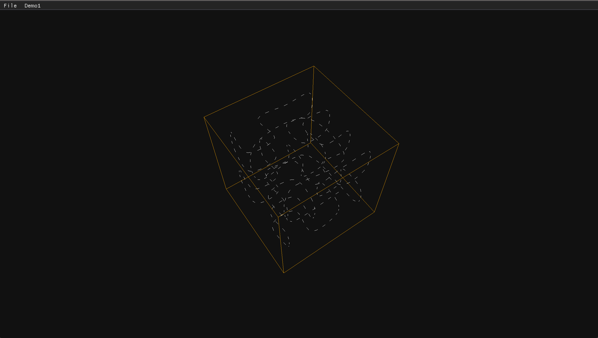
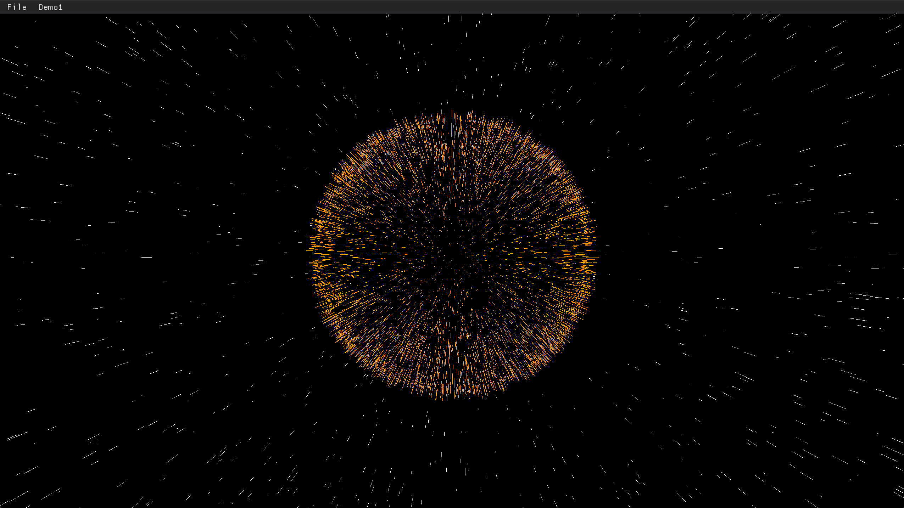
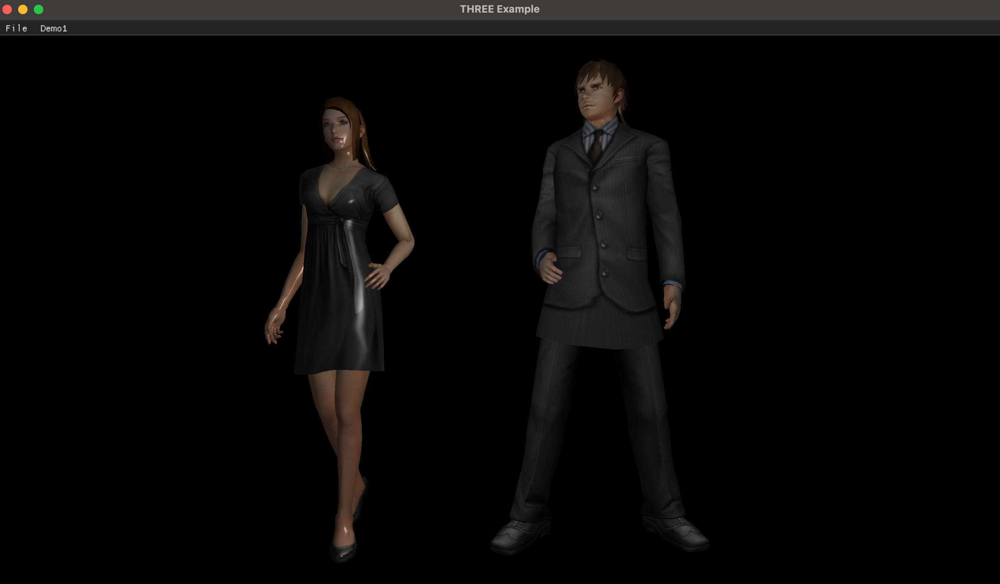
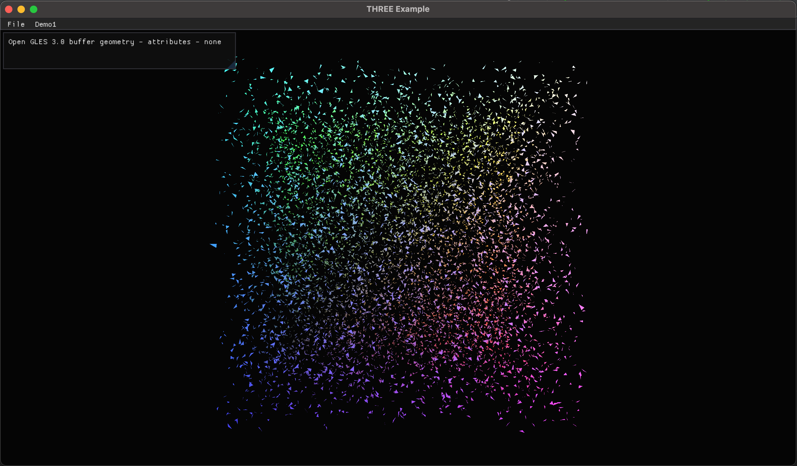
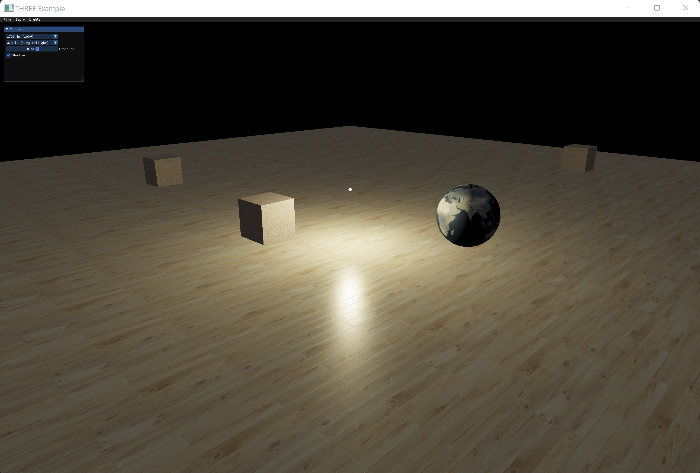
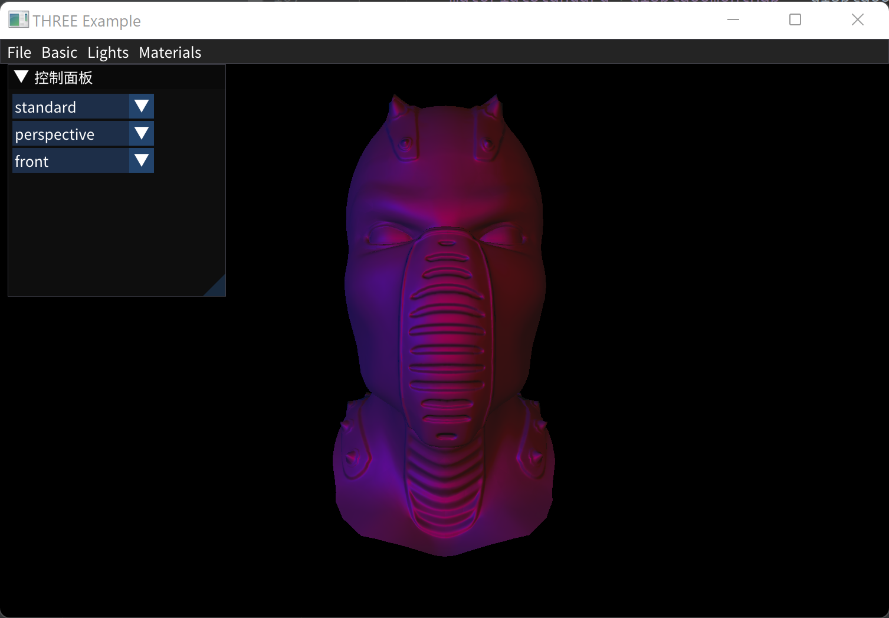
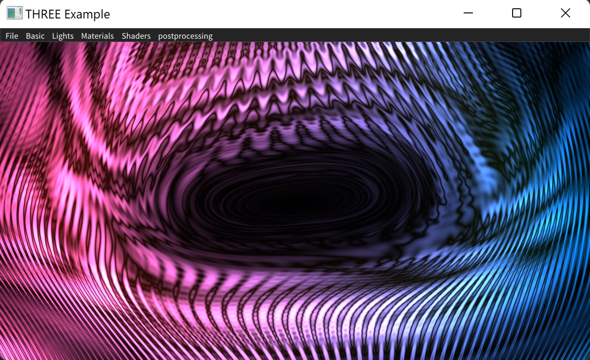
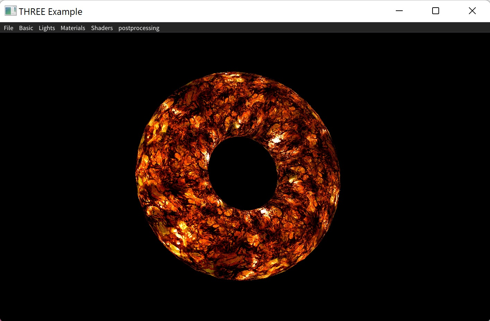
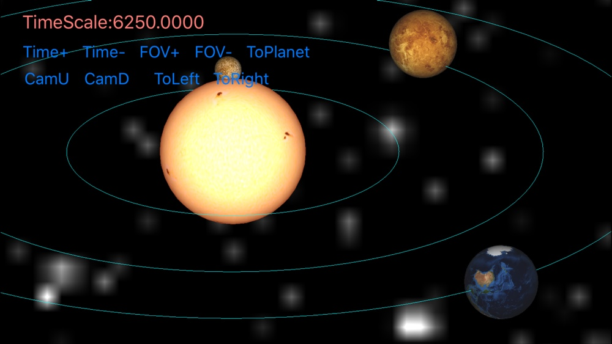
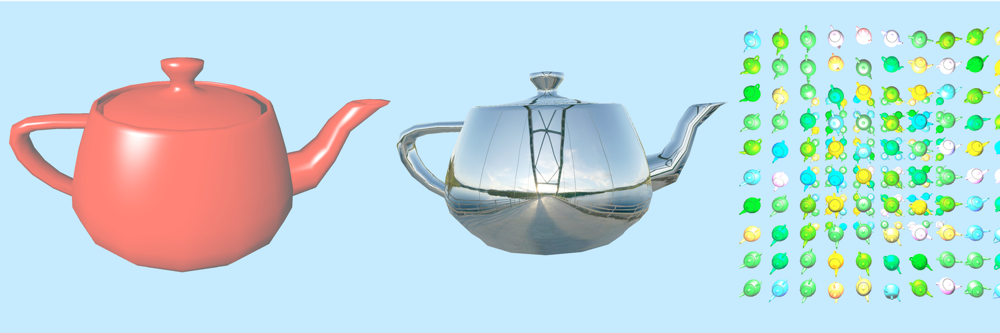

# CG Learning
首先从**Foundation of 3D Computer Graphics**开始学习Computer Graphics（CG）基础知识，这是是一本非常合适的Computer Graphics入门书籍，值得一遍又一遍的阅读。内容深浅适中，解读十分到位。

## Three.cpp基于three.js的cpp跨平台渲染框架
有感于three.js基于图形学的知识在web上几乎从头开始搭建了一个优秀的图形学框架，并且提供了无数的精彩例子。[three.cpp](https://github.com/nintymiles/three.cpp)，基于google angle实现，以three.js为蓝本，使用cpp语言学习实现跨平台的本地渲染框架，目前已经实现的功能：

- [x] 完成渲染引擎部分功能的移植
- [x] 基于MacOS Apple Silicon系统的运行
- [x] 基于win64 系统的运行 
- [x] 实现了2个线段绘制例子
- [x] 迁移了obj/mtl loader，实现了obj/mtl解析加载功能，并实现一个例子
- [x] 实现了一个buffer geometry，无顶点数据绘制例子
- [x] 实现基于光源的物理真实（PBR）渲染例子

|  |  |
| :----------------------------------------------------------- | :----------------------------------------------------------- |
|  |  |
|    |    | 
|    |    | 
                                

## Solar System Simulation Project
[太阳系3D模拟项目](https://github.com/nintymiles/SolarSystemSimulation)，目前已经实现的功能：

1. 根据真实的太阳系模型数据，使用OpenGL ES实现了太阳和各个行星的渲染(借助真实的纹理)。
2. 简化实现了行星的轨道（没有根据真实轨道模型）绘制。
3. 每个行星依据真实的自转和公转周期决定其运动行为。
4. 可以通过控制时间因子来加快各个行星的运动速度。
5. 初步实现了相机的控制，可以控制视角缩放，位置可以上下左右调整。
6. 使用raycast（射线投射与几何体相交方式）实现了picking功能。

## Utah Teapot Rendering
[Utah Teapot Rendering](https://github.com/nintymiles/CGLearning/tree/master/UtahTeapotRendering)，模仿安卓ndk中的OpenGL例子实现的utah teapot渲染。

## 作业项目（assignment project）
虽然这本教科书的实例代码和作业项目都是基于OpenGL，并且也是基于OpenGL管线进行了相关的原理讲解，但是这本教材中并没有任何OpenGL本身的学习内容。书中涉及的图形技术并没有使用OpenGL中的高级特征，只需要具备基本的现代可编程管线特征的版本即可。这意味着可以从一个精简版本的OpenGL着手（可以完全抛掉OpenGL中那些传统功能性编程的老古董），减少基于OpenGL学习CG技术的初始曲线的陡峭度，比如从OpenGL ES 3.0开始入手学习。本书中所有的实例几乎都可以无缝地移植到OpenGL ES3.0环境中。
### 一些问题

1. 由于OpenGL的进化，目前Picking已经无法通过在屏幕（默认帧缓存)中通过读取像素的方式实现（正在考虑使用射线相交的方式实现）。  
2. 目前所有的项目已经实现了Mac环境下的运行，部分实现了iOS版本，windows版本正在进行中...
3. 网站所给出的项目模版基于glut和较早期的OpenGL（4.0之前）版本，在实现课后项目时，我将其更换为GLFW版本，并对一些版本不兼容错误做出了改正（比如绘制时必须具备VAO对象）

### 项目情况
| Project | Description | Detail |
| --- | --- | --- | 
| Assignment2 Hello World 3D| 已完成 | [详情](OpenGL/FoundationOfCG/Assignment2/readme.md)  |
| Assignment3 Quaternion and Arcball| 已完成 |  [详情](OpenGL/FoundationOfCG/Assignment3/readme.md)   |
| Assignment4 Hierarchical Transformations and Pickin| 已完成，Picking部分采用raycast方式 |  |
| Assignment5 Keyframe Animation| 初步完成，不少地方需要改进 |   |
| Assignment6 Materials and Bump Mapping| 初步完成，Picking部分未完成 |    |
| Assignment7 Meshes and Subdivision Surfaces| 初步完成，Catmull-clark规则的实现需要改进 |    |
| Assignment8 Furry Animation| 初步完成，Furry效果需要改进 |   |

## 3D计算机图形学基础（**Foundation of 3D Computer Graphics**）翻译
完成的章节

- [第一章](FoundationOf3DComputerGraphics_Chinese_translation/PDF/Chapter01-Introduction.pdf)
- [第二章](FoundationOf3DComputerGraphics_Chinese_translation/PDF/Chapter02-Linear.pdf)
- [第三章](FoundationOf3DComputerGraphics_Chinese_translation/PDF/Chapter03-Affine.pdf)
- [第四章](FoundationOf3DComputerGraphics_Chinese_translation/PDF/Chapter04-Respect.pdf)
- [第五章](FoundationOf3DComputerGraphics_Chinese_translation/PDF/Chapter05-Frames-In-Graphics.pdf)
- [第六章](FoundationOf3DComputerGraphics_Chinese_translation/PDF/Chapter06-HelloWorld3D.pdf)
- [第七章](FoundationOf3DComputerGraphics_Chinese_translation/PDF/Chapter07-Quaternions.pdf)
- [第八章](FoundationOf3DComputerGraphics_Chinese_translation/PDF/Chapter08-BallsTrackAndArc.pdf)
- [第九章](FoundationOf3DComputerGraphics_Chinese_translation/PDF/Chapter09-Smooth-Interpolation.pdf)
- [第十章](FoundationOf3DComputerGraphics_Chinese_translation/PDF/Chapter10-Projection.pdf)
- [第十一章](FoundationOf3DComputerGraphics_Chinese_translation/PDF/Chapter11-Depth.pdf)
- [第十二章](FoundationOf3DComputerGraphics_Chinese_translation/PDF/Chapter12-From-Vertex-To-Pixel.pdf)
- [第十三章](FoundationOf3DComputerGraphics_Chinese_translation/PDF/Chapter13-Rational-Linear-Interpolation.pdf)
- [第十四章](FoundationOf3DComputerGraphics_Chinese_translation/PDF/Chapter14-Materials.pdf)
- [第十五章](FoundationOf3DComputerGraphics_Chinese_translation/PDF/Chapter15_texture_mapping.pdf)
- [第十六章](FoundationOf3DComputerGraphics_Chinese_translation/PDF/Chapter16-Sampling.pdf)
- [第十七章](FoundationOf3DComputerGraphics_Chinese_translation/PDF/Chapter17_Reconstruction.pdf)
- [第十八章](FoundationOf3DComputerGraphics_Chinese_translation/PDF/Chapter18_Resampling.pdf)
- [第十九章](FoundationOf3DComputerGraphics_Chinese_translation/PDF/Chapter19_Color.pdf)
- [第二十章](FoundationOf3DComputerGraphics_Chinese_translation/PDF/Chapter20-WhatIsRayTracing.pdf)
- [第二十一章](FoundationOf3DComputerGraphics_Chinese_translation/PDF/Chapter21-Light.pdf)
- [第二十二章](FoundationOf3DComputerGraphics_Chinese_translation/PDF/Chapter22-GeometricModelingBasicIntrodcution.pdf)
- [第二十三章](FoundationOf3DComputerGraphics_Chinese_translation/PDF/Chapter23-Animation.pdf)
- [附录B](FoundationOf3DComputerGraphics_Chinese_translation/PDF/Appendix-B.pdf)
- [PDF文件目录](FoundationOf3DComputerGraphics_Chinese_translation/PDF/)

## CS248图形学课程（Computer Graphics: Rendering, Geometry, and Image Manipulation Stanford CS248A, Winter 2023）翻译
已经完成的章节：
- [第一讲]()
- [第二讲]()
- [第三讲]()
- [x] [第四讲](CS248_LearningNotes/Course_CN_Translation/PDF/04_texture_cn.pdf)
- [x] [第五讲](CS248_LearningNotes/Course_CN_Translation/PDF/05_pipeline_cn.pdf)
- [x] [第六讲](CS248_LearningNotes/Course_CN_Translation/PDF/06_geometry_cn.pdf)

## 总结文字
### OpenGL

- [凹凸映射（bump mapping）中法线映射（normal map）纹理数据的解读和使用](DevelopingNotes/the-normal-map-of-bump-mapping-2019-12-19.md)
- [GLSL中，如何对matrix类型进行初始化](DevelopingNotes/Matrix-Initialization-In-GLSL-2019-12-20.md)
- [在OpenGL中用Projection Matrix 分别左乘和右乘均匀或不均匀Scale Matrix的效果](DevelopingNotes/About-ProjectionMatrix-Left-Right-Multiplied-By-Diff-Scale-Matrix.md)
- [OpenGL/OpenGLES中的调试问题](DevelopingNotes/opengl_debugging_notes.md)
- [在GLFW中实现定时器](DevelopingNotes/about_glfw_timer_and_vertice_animation.md)
- [关于在Windows上使用OpenGLES 3.0进行开发的环境设置](DevelopingNotes/OpenGLES_Development_Environment_Setting_Issues.md)

## Folder Structures

- BaseFramework为通用代码目录。
- 针对OpenGL ES和OpenGL平台的assignments项目代码分别位于FoundationOfCG-MIT和OpenGL目录
- 本书的中文翻译位于FoundationOf3DComputerGraphics_Chinese_translation目录
- 学习及开发过程中的记录文字位于DevelopingNotes目录

